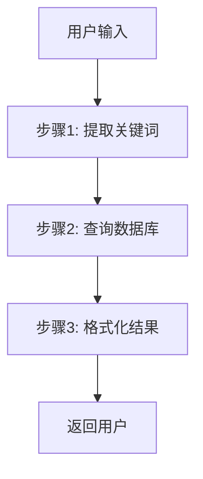
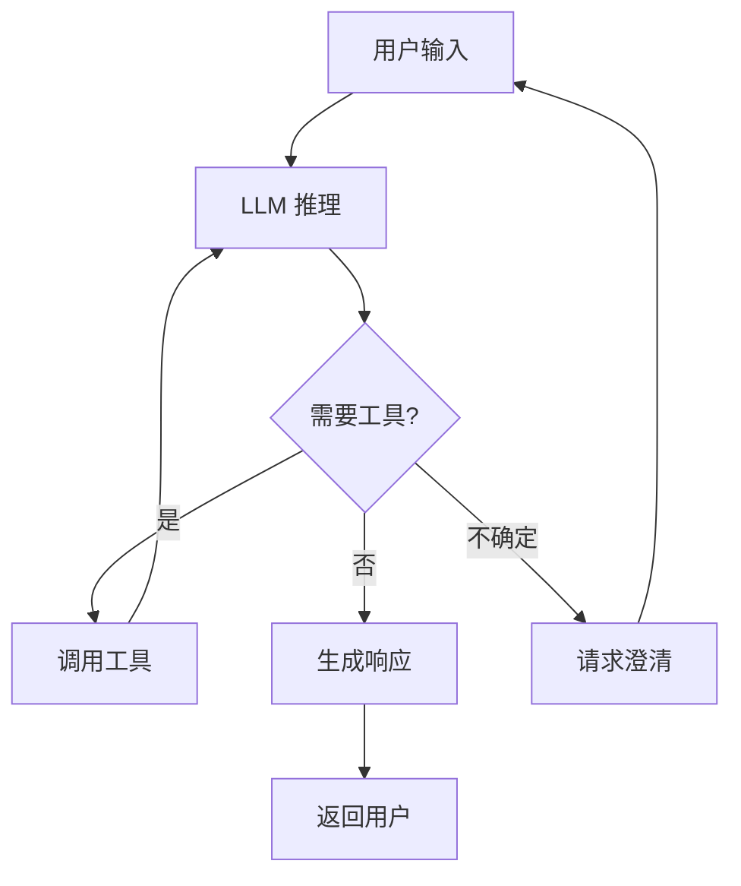
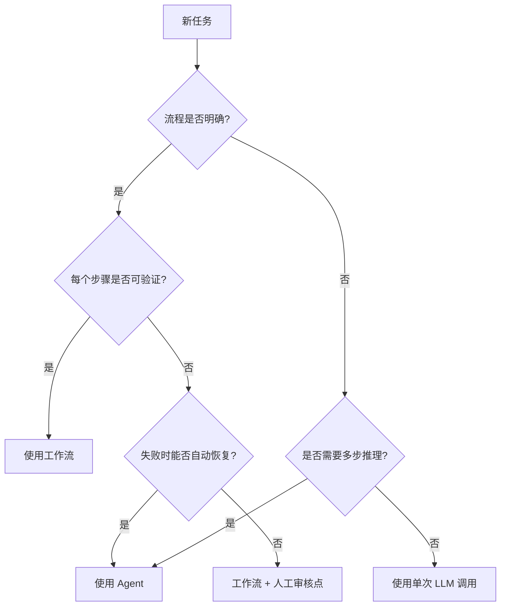
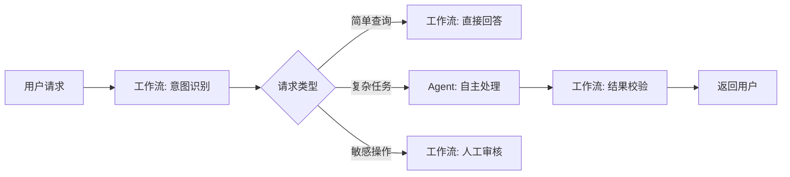

# Agent vs 工作流

## 核心区别

**工作流（Workflow）** 和 **Agent** 是构建 AI 系统的两种范式，核心差异在于"谁控制流程"。

| 维度 | 工作流（Workflow） | Agent |
|------|------------------|-------|
| **控制权** | 开发者预先定义执行路径 | LLM 动态决策执行路径 |
| **灵活性** | 低，仅在预设分支内运行 | 高，可应对未预见的场景 |
| **可预测性** | 高，输出可预测、可测试 | 中，存在一定不确定性 |
| **延迟** | 通常较低，路径固定 | 通常较高，需要多轮推理 |
| **成本** | 可控，调用次数固定 | 可能较高，取决于推理轮数 |
| **适用场景** | 流程明确、结果可验证的任务 | 开放性问题、需要灵活决策的任务 |

## 架构对比

### 工作流模式



工作流中，每个步骤由开发者硬编码，LLM 仅在特定节点被调用执行预定义任务。

### Agent 模式



Agent 中，LLM 是中心控制器，自主决定下一步行动。

## 选型决策树



## 混合模式

实际系统中，**工作流和 Agent 往往结合使用**：



### 混合模式示例

**客服系统**：
- **工作流部分**：身份验证、订单查询（流程固定，可验证）
- **Agent 部分**：投诉处理、个性化推荐（需要灵活推理）

## Anthropic 的建议

Anthropic 在《Building Effective Agents》中明确建议：

> **从工作流开始，仅在必要时升级为 Agent。**

原因：
1. 工作流更容易测试和调试
2. 工作流延迟更低、成本更可预测
3. 工作流在特定任务上往往比通用 Agent 更可靠

## 代码示例对比

### 工作流（LangChain）

```python
from langchain import hub
from langchain_core.runnables import RunnablePassthrough

# 固定执行链
chain = (
    {"context": retriever | format_docs, "question": RunnablePassthrough()}
    | prompt
    | llm
    | StrOutputParser()
)

result = chain.invoke("用户问题")
```

### Agent（LangChain）

```python
from langchain.agents import create_tool_calling_agent, AgentExecutor

# LLM 动态决策使用哪些工具
agent = create_tool_calling_agent(llm, tools, prompt)
agent_executor = AgentExecutor(agent=agent, tools=tools)

result = agent_executor.invoke({"input": "用户问题"})
```

## 最佳实践

1. **先尝试工作流**：如果任务可以被分解为明确的步骤，先用工作流实现
2. **关键路径用工作流**：支付、删除等敏感操作保留硬编码控制
3. **探索性任务用 Agent**：研究、创意生成等开放域任务适合 Agent
4. **设置预算上限**：Agent 运行设置最大步数/ token 限制，防止无限循环

## 延伸阅读

- [[什么是Agent]] — Agent 的定义与核心特征
- [[01-简单性原则]] — 为什么应该从简单开始
- [[00-模式总览]] — 各种架构模式的详细对比
