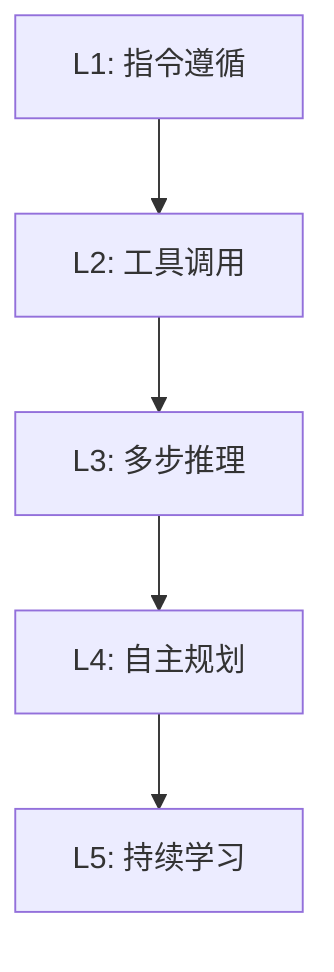
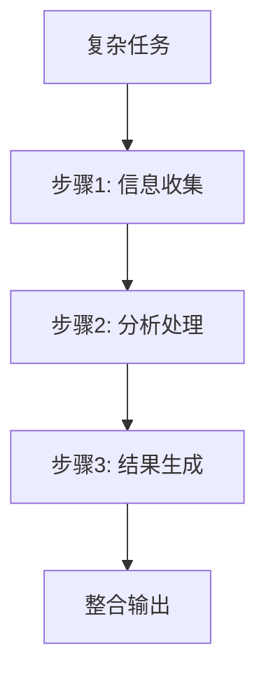

# Agent 能力模型

## 能力分层

Agent 的能力可以从低到高分为五个层级：



### L1: 指令遵循（Instruction Following）

**能力描述**：准确理解并执行用户给出的明确指令。

**关键特征**：
- 理解自然语言指令
- 按指定格式输出
- 遵循约束条件（如字数限制、输出格式）

**评估指标**：
- 指令遵循准确率
- 格式合规率

**代码示例**：

```python
response = llm.invoke(
    "将以下文本总结为3句话以内：\n\n"
    "[长文本内容...]"
)
```

### L2: 工具调用（Tool Use）

**能力描述**：根据任务需求，自主决定何时以及如何使用外部工具。

**关键特征**：
- 理解工具的功能和参数
- 在适当时机调用工具
- 处理工具返回结果

**评估指标**：
- 工具选择准确率
- 参数填充正确率
- 工具调用成功率

**代码示例**：

```python
# Agent 自主决定调用搜索工具
response = agent.invoke(
    "明天北京天气如何？"
    # Agent 内部决策：调用 weather_search(city="北京", date="明天")
)
```

### L3: 多步推理（Multi-step Reasoning）

**能力描述**：将复杂任务拆解为多个步骤，按序执行并整合结果。

**关键特征**：
- 任务分解（Task Decomposition）
- 中间结果管理
- 错误恢复与重试

**评估指标**：
- 任务完成率
- 步骤正确率
- 平均完成步数

**架构示意**：



### L4: 自主规划（Autonomous Planning）

**能力描述**：在没有明确步骤指导的情况下，自主制定执行计划并动态调整。

**关键特征**：
- 目标理解与子目标生成
- 动态计划调整
- 资源分配决策
- 自我纠错

**评估指标**：
- 计划合理性
- 目标达成率
- 计划调整次数

**典型模式**：[[07-Plan-and-Execute]]、[[08-自主Agent]]

### L5: 持续学习（Continuous Learning）

**能力描述**：从交互中学习，逐步提升性能和适应性。

**关键特征**：
- 从反馈中学习
- 经验积累与复用
- 策略优化

**评估指标**：
- 长期性能提升曲线
- 迁移学习能力

## 能力评估矩阵

| 能力层级 | 自主性 | 复杂度 | 延迟 | 成本 | 可靠性 |
|---------|--------|--------|------|------|--------|
| L1 | 低 | 低 | 低 | 低 | 高 |
| L2 | 中 | 中 | 中 | 中 | 中 |
| L3 | 中高 | 高 | 高 | 高 | 中 |
| L4 | 高 | 很高 | 很高 | 很高 | 中低 |
| L5 | 很高 | 极高 | 极高 | 极高 | 待定 |

## 选型建议

**原则**：为任务选择**最低足够**的能力层级。

| 任务类型 | 推荐层级 | 示例 |
|---------|---------|------|
| 文本转换/格式化 | L1 | 翻译、摘要、格式转换 |
| 信息查询 | L2 | 天气查询、股价查询 |
| 数据分析报告 | L3 | 多源数据整合分析 |
| 开放域问题求解 | L4 | 研究助理、代码生成 |
| 长期陪伴型应用 | L5 | 个人助手、教育辅导 |

## 最佳实践

1. **分层构建**：从 L1 开始，逐步添加更高层级的能力
2. **能力降级**：高阶 Agent 在简单任务上应能降级为低阶模式
3. **能力边界**：清晰定义每个 Agent 的能力边界，避免过度承诺
4. **评估先行**：在投入开发前，先评估任务所需的能力层级

## 延伸阅读

- [[什么是Agent]] — Agent 定义与核心特征
- [[00-模式总览]] — 各架构模式对应的能力层级
- [[05-性能评估]] — 如何系统评估 Agent 性能
