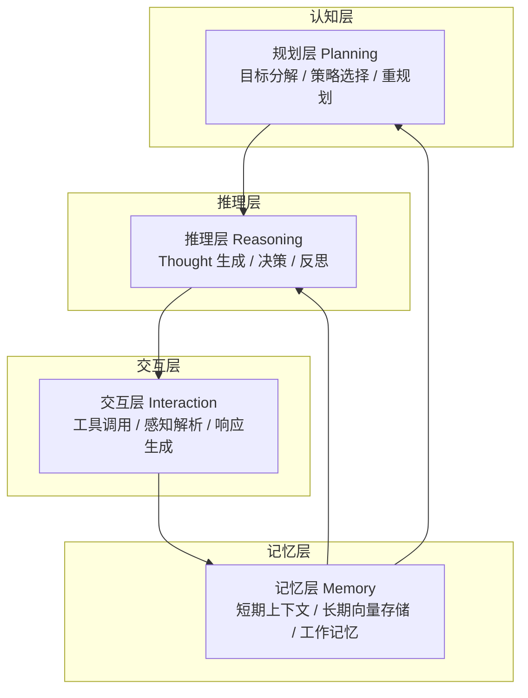
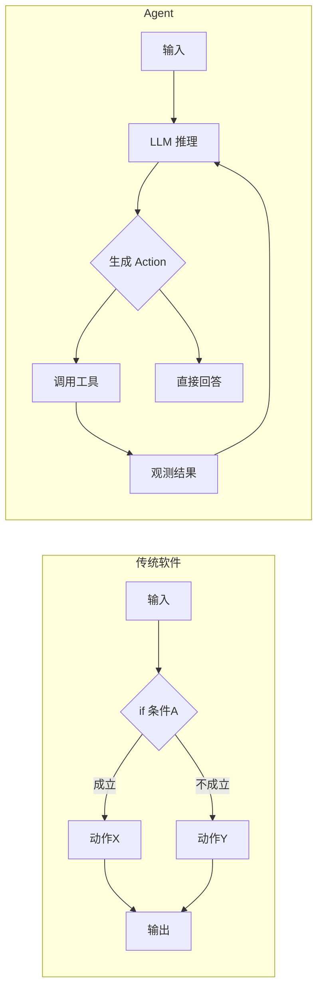
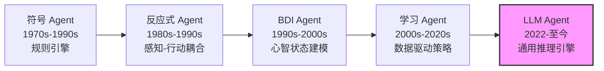

# 什么是Agent

AI Agent（智能体）是一种能够**在开放环境中感知状态、自主推理决策、调用工具行动，并通过反馈闭环持续修正行为**的软件系统。它区别于传统程序的根本特征在于：控制流由模型推理动态生成，而非由开发者预先硬编码。

> **核心公式**：Agent = LLM（推理引擎） + 记忆（状态持久化） + 工具（环境交互接口） + 规划（目标分解与调度） + 反馈闭环（自我修正）

这一定义来自 Yao et al. 在 ReAct 论文（arXiv:2210.03629）中的扩展框架，也是当前工业界实现 Agent 系统的共识基础。

## Agent 的认知架构分层

一个完整的 Agent 系统可按认知功能划分为四层，每层向上提供抽象，向下依赖基础设施：



| 层级 | 职责 | 关键问题 | 典型实现 |
|------|------|---------|---------|
| **规划层** | 将用户目标分解为可执行步骤，处理依赖关系和冲突 | "下一步该做什么？计划是否需要调整？" | ReAct、Plan-and-Solve、Tree of Thoughts |
| **推理层** | 基于当前状态和记忆生成推理链（Chain-of-Thought），做出离散决策 | "根据已有信息，最合理的判断是什么？" | CoT、Self-Consistency、反思（Reflection） |
| **交互层** | 将推理结果转化为具体的工具调用或用户响应，解析环境反馈 | "如何调用工具？如何理解返回的异常？" | Function Calling、Toolformer、API 封装 |
| **记忆层** | 持久化交互历史、知识片段和运行时状态，支持上下文检索 | "之前发生了什么？哪些信息与此刻相关？" | 滑动窗口、向量检索（RAG）、知识图谱 |

**为什么需要分层？** 分层不是架构炫技，而是工程现实的妥协：
- **解耦测试**：可独立测试工具调用逻辑，无需触发完整 LLM 推理
- **降级能力**：当规划层失效时，系统可退化为单步 ReAct 或纯 LLM 问答
- **成本分级**：规划可用轻量模型（如 GPT-3.5），推理可用强模型（如 GPT-4o）
- **可观测性**：每层可独立埋点，定位问题是"计划错误"还是"工具调用失败"

## Agent 与传统软件的本质区别

表层对比通常停留在"输入是结构化 vs 非结构化"，但本质差异在于**控制流的归属**。

### 控制流：硬编码 vs 涌现式

传统软件的控制流图（Control Flow Graph, CFG）在编译期即确定。开发者通过 `if/else`、`switch`、`while` 显式枚举所有分支。这意味着：
- 未预见的路径 = 未处理的异常
- 系统能力边界 = 开发者想象力的边界
- 正确性验证 = 穷举（或符号执行覆盖）所有 CFG 路径

Agent 的控制流是**运行时涌现**的。LLM 根据 Prompt 中的上下文、工具描述和当前观测，在每一步动态生成下一步动作。这意味着：
- 未预见的场景仍可能被模型泛化处理
- 系统能力边界模糊，随模型能力进化而扩展
- 正确性验证从"路径覆盖"转向"行为一致性"和"安全边界"



### 确定性与概率性的工程含义

| 维度 | 传统软件 | AI Agent |
|------|---------|----------|
| **正确性标准** | 逻辑正确性（给定输入必得预期输出） | 统计正确性（高概率产生合理结果） |
| **故障模式** | 崩溃、死锁、空指针（可定位） | 幻觉、循环、偏离目标（难复现） |
| **调试手段** | 断点、日志、单测覆盖 | Prompt 版本管理、对抗测试、人工评估 |
| **扩展方式** | 新增分支逻辑 | 扩展工具集、优化 Prompt、更换基座模型 |
| **延迟特性** | 接近常数（大 O 确定） | 与推理轮数正相关，且不可严格上限 |
| **成本模型** | 计算资源（CPU/内存） | Token 消耗 × 推理轮数 |

### 代码对比：同一任务的不同实现

**任务**：用户说"帮我查一下明天北京天气，如果下雨就提醒我带伞，顺便看看空气质量"

传统软件实现（伪代码）：

```python
def handle_weather_request(user_query: str) -> str:
    # 1. 硬编码解析意图 — 无法处理变体表达
    intent = parse_intent(user_query)  # 依赖规则匹配
    if intent != "weather_query":
        return "不支持该请求"
    
    # 2. 硬编码参数提取 — 城市、日期必须按预期格式
    city = extract_city(user_query)    # 正则或模板匹配
    date = extract_date(user_query)    # 仅限"明天""后天"等枚举
    
    # 3. 固定调用链
    weather = call_weather_api(city, date)
    aqi = call_aqi_api(city)
    
    # 4. 硬编码条件分支
    if weather.rain:
        reminder = "记得带伞"
    else:
        reminder = ""
    
    return format_response(weather, aqi, reminder)
```

Agent 实现（Python）：

```python
import json
from typing import Any
from openai import OpenAI

class WeatherAgent:
    """可处理天气查询、条件提醒、附加信息请求的 Agent"""
    
    def __init__(self, llm: OpenAI, tools: dict[str, callable]):
        self.llm = llm
        self.tools = tools
        self.max_steps = 10
    
    def run(self, user_input: str) -> str:
        messages = [
            {"role": "system", "content": self._system_prompt()},
            {"role": "user", "content": user_input},
        ]
        tool_schemas = self._tool_schemas()
        
        for step in range(self.max_steps):
            try:
                response = self.llm.chat.completions.create(
                    model="gpt-4o",
                    messages=messages,
                    tools=tool_schemas,
                    temperature=0.2,
                )
                msg = response.choices[0].message
                
                # 模型决定直接回答
                if not msg.tool_calls:
                    return msg.content or "无响应"
                
                # 模型决定调用工具
                messages.append(msg.model_dump())
                for tc in msg.tool_calls:
                    result = self._execute_tool(tc.function.name, 
                                                tc.function.arguments)
                    messages.append({
                        "role": "tool",
                        "tool_call_id": tc.id,
                        "content": json.dumps(result, ensure_ascii=False),
                    })
                    
            except Exception as e:
                # 错误回传：让模型自主决定下一步
                messages.append({
                    "role": "system",
                    "content": f"工具执行异常: {str(e)}。请尝试其他方式或向用户说明。"
                })
        
        return "已达到最大步数限制，未能完成任务。"
    
    def _execute_tool(self, name: str, args_json: str) -> dict[str, Any]:
        if name not in self.tools:
            return {"error": f"未知工具: {name}"}
        try:
            args = json.loads(args_json)
            return {"result": self.tools[name](**args)}
        except json.JSONDecodeError as e:
            return {"error": f"参数解析失败: {e}"}
        except Exception as e:
            return {"error": f"工具执行失败: {e}"}
    
    def _system_prompt(self) -> str:
        return (
            "你是一个智能助手，可以帮助用户查询天气、空气质量等信息。"
            "如果用户有附带条件（如下雨提醒带伞），请主动满足。"
            "如果工具调用失败，请尝试替代方案或诚实告知用户。"
        )
    
    def _tool_schemas(self) -> list[dict]:
        return [
            {
                "type": "function",
                "function": {
                    "name": "get_weather",
                    "description": "获取指定城市指定日期的天气预报",
                    "parameters": {
                        "type": "object",
                        "properties": {
                            "city": {"type": "string"},
                            "date": {"type": "string", "description": "如'2024-10-01'或'明天'"},
                        },
                        "required": ["city", "date"],
                    },
                },
            },
            {
                "type": "function",
                "function": {
                    "name": "get_aqi",
                    "description": "获取指定城市的实时空气质量指数",
                    "parameters": {
                        "type": "object",
                        "properties": {
                            "city": {"type": "string"},
                        },
                        "required": ["city"],
                    },
                },
            },
        ]
```

**关键差异总结**：
- 传统代码中，条件判断、工具调用顺序、参数提取全部由开发者编写；Agent 中这些由模型动态推理
- Agent 可以处理"顺便看看空气质量"这类附加需求，无需预先编码分支
- Agent 的故障处理（API 失败）是泛化的：将错误信息回传模型，由其决定重试、替代或告知用户

### Russell & Norvig 的形式化定义

在《Artificial Intelligence: A Modern Approach》中，Russell 和 Norvig 将 Agent 定义为：

$$\text{Agent} = f: \mathcal{P}^* \rightarrow \mathcal{A}$$

其中 $\mathcal{P}^*$ 是感知历史序列（percept sequence），$\mathcal{A}$ 是行动集合。Agent 的本质是一个**从感知序列到行动的映射函数**。这个函数可以由任何机制实现——查表、规则引擎、神经网络、LLM。

这一形式化的重要性在于：**Agent 不是某种特定技术，而是一种系统设计范式**。同一套分层架构，内部既可以填充符号规则（1990s 的专家系统），也可以填充神经网络（2020s 的 LLM）。判断一个系统是否是 Agent，应看其是否符合这一定义的结构，而非使用了何种实现技术。

## Agent 在软件工程中的演进史

### 第一代：符号 Agent / 专家系统（1970s–1990s）

早期的 Agent 映射函数 $f$ 由人工编码的符号规则构成。MYCIN（医疗诊断）、DENDRAL（化学分析）等系统基于产生式规则（if-then）和知识库进行推理。

- **特征**：可解释性强，推理过程可追溯；知识由领域专家人工录入
- **局限**：知识获取瓶颈（knowledge acquisition bottleneck）、脆弱性（brittleness）——超出规则覆盖范围即失效
- **遗产**：规则引擎（Drools、CLIPS）至今仍在金融风控、合规检查等场景使用

### 第二代：反应式 Agent（1980s–1990s）

Rodney Brooks 在 MIT 提出的 subsumption architecture 反对"先建完整世界模型再行动"的思路，主张感知-行动的直接耦合。

- **特征**：行为分层（behavior layers），无中心世界模型，强调涌现（emergence）
- **代表**：Brooks 的机器人 Genghis、Seymour
- **局限**：难以处理需要长期规划的任务，缺乏显式目标表示
- **遗产**：即时响应层的设计思想影响了现代 Agent 的"快速路径"（fast path）与"深度路径"（slow path）分离

### 第三代：BDI Agent（1990s–2000s）

Belief-Desire-Intention（BDI）模型由 Bratman 的哲学理论发展而来，被 Rao & Georgeff 形式化为计算框架。

- **Belief**：Agent 对环境状态的内部表示
- **Desire**：Agent 希望达成的状态（可能冲突）
- **Intention**：Agent 承诺执行的行动计划（已过滤冲突）

- **代表**：PRS（Procedural Reasoning System）、JACK、Jason
- **遗产**："意图"（Intention）概念直接影响了现代 Agent 的状态持久性和会话连续性设计。当今天说 Agent 需要"记住当前正在执行的任务"时，本质上就是 BDI 中 Intention 的 runtime 等价物。

### 第四代：统计学习与强化学习 Agent（2000s–2020s）

映射函数 $f$ 从手工编码转向数据驱动学习。DeepMind 的 DQN（2013）、AlphaGo（2016）、OpenAI Five（2018）展示了从环境交互中学习复杂策略的能力。

- **特征**：从交互中学习、奖励塑形（reward shaping）、策略梯度优化
- **局限**：样本效率低、奖励设计困难、可解释性差、泛化到新任务需要重新训练
- **遗产**："从反馈中学习"的思想直接催生了现代 Agent 的反思（Reflection）和自我优化机制

### 第五代：LLM-based Agent（2022–至今）

大语言模型作为通用推理引擎，使 Agent 的构建从"训练专用模型"转变为"设计系统架构 + 编排通用模型"。

- **特征**：自然语言接口、零样本泛化、工具使用（Tool Use）、上下文学习（In-context Learning）
- **新挑战**：幻觉（hallucination）、提示注入（prompt injection）、长上下文限制、推理成本不可控
- **范式转移**：核心价值从"模型能力"转向"系统设计"——同样的 GPT-4，配以不同的工具集、记忆结构和规划策略，可以呈现出完全不同的 Agent 行为



## 自主性的技术定义

Agent 的"自主性"不是二进制属性，而是连续谱。Wooldridge & Jennings（1995）在《Intelligent Agents: Theory and Practice》中提出三条维度：

1. **反应性（Reactivity）**：感知环境变化并实时响应的能力。技术实现上依赖事件驱动的感知-推理循环，延迟取决于 LLM 推理时间 + 工具调用时间。

2. **主动性（Pro-activeness）**：主动追求目标而非仅被动响应。技术上体现为：模型能在用户未显式要求时识别隐含需求（如"下雨提醒带伞"），或自主发起信息收集。

3. **社会性（Social Ability）**：与其他 Agent 或人类通过结构化语言交互。技术上依赖通信协议（如 [[05-多Agent协作/02-通信协议|Agent 通信协议]]）和共享本体（Shared Ontology）。

**工业界自主性分级**（注意：此分级聚焦"自主性程度"，与 [[Agent-能力模型]] 中的"能力层级"是不同维度）：

| 等级 | 特征 | 技术标志 |
|------|------|---------|
| L0：无自主 | 纯 LLM 问答，无工具调用 | 单次 `chat.completions.create` |
| L1：工具自主 | 自主选择和调用工具 | Function Calling + 工具描述 |
| L2：步序自主 | 自主决定多步执行顺序 | ReAct / 动态 DAG |
| L3：目标自主 | 自主将模糊目标分解为子任务 | Plan-and-Execute / 目标分解器 |
| L4：演进自主 | 从失败中学习，调整自身策略 | 反思（Reflection）+ 记忆更新 + 策略微调 |

**重要边界**：当前主流 LLM-based Agent 属于 L1-L3 范畴。L4 需要模型参数的更新（如 RLHF、在线学习），而当前大多数系统通过 Prompt 工程和上下文学习实现"伪演进"——行为调整不持久化到模型权重。

## 常见反模式与修复

### 反模式 1：将 Agent 当作万能胶水

**表现**：把所有业务逻辑都交给 Agent 推理，包括本可硬编码的分支。

**问题**：
- Token 消耗爆炸（每步推理都付费）
- 延迟不可控（简单查询也要多轮推理）
- 可靠性下降（模型可能选错分支）

**修复**：

```python
# 坏：让 Agent 决定用户是否已登录
agent.run("检查用户登录状态并执行后续操作")

# 好：硬编码安全检查，Agent 只处理开放域部分
if not user.is_authenticated:
    return "请先登录"
result = agent.run(user.query)  # Agent 仅处理业务逻辑
```

**原则**：**确定性逻辑用代码，不确定性推理用 Agent**。参考 [[Agent-vs-工作流|Agent 与工作流的区别]] 中的选型决策树。

### 反模式 2：忽视自主性边界

**表现**：假设 Agent "理解"了安全策略，从而省略显式校验。

**问题**：LLM 的"理解"是统计关联，不是逻辑保证。模型可能在某些 Prompt 变体下绕过隐含约束。

**修复**：所有安全约束必须在代码层强制，不可仅依赖 Prompt：

```python
# 坏：仅靠 Prompt 约束
system_prompt = "你只能读取数据，不能修改"

# 好：代码层强制权限分离
READ_TOOLS = [search_db, query_api]
WRITE_TOOLS = [update_db, send_email]

def create_agent_with_role(role: str):
    if role == "readonly":
        return Agent(tools=READ_TOOLS)  # 代码层面无写工具
    # ...
```

### 反模式 3：没有反馈闭环的单向管道

**表现**：Agent 执行完工具调用后直接返回结果，不校验结果是否真正满足原始目标。

**修复**：引入执行验证层（Verifier）：

```python
class VerifiedAgent:
    def run(self, query: str) -> str:
        # 阶段1：执行
        result = self.agent.run(query)
        
        # 阶段2：验证（可用轻量模型或规则）
        verification = self.verifier.check(query, result)
        if not verification.passed:
            # 阶段3：重试或反馈
            result = self.agent.run(
                f"原始问题: {query}\n"
                f"之前结果未满足要求: {verification.reason}\n"
                f"请修正。"
            )
        return result
```

这种模式在 [[02-架构模式/05-评估器-优化器|评估器-优化器]] 中有更完整的实现。

## 设计权衡

### 自主性 vs 可靠性

| 策略 | 自主性 | 可靠性 | 适用场景 |
|------|--------|--------|---------|
| 纯工作流（无 LLM） | 无 | 极高 | 支付、删除等不可逆操作 |
| 人-in-the-loop Agent | 中 | 高 | 医疗诊断、法律建议 |
| 全自主 Agent | 高 | 中 | 研究助手、创意生成 |
| 多 Agent 表决 | 高 | 中高 | 关键决策，用成本换可靠性 |

### 延迟 vs 能力深度

每增加一层认知能力（规划 → 推理 → 工具调用），延迟通常增加 1-3 秒（取决于模型和工具）。对于实时交互场景（如语音助手），需要在能力深度和响应速度之间做显式取舍：
- **快速路径**：简单查询走 L0/L1（直接回答或单次工具调用）
- **深度路径**：复杂任务走 L2/L3，但给用户"思考中"的状态反馈

### 成本 vs 效果

Agent 系统的成本模型：`Cost = Σ(每步输入Token + 每步输出Token) × 每百万Token价格 + 工具调用成本`

- 使用强模型（GPT-4o）做规划 + 弱模型（GPT-3.5）做执行，可降低成本 40-60%
- 缓存常见推理路径（如相似查询的 Thought 模板）可减少重复推理
- 设置预算上限（max_tokens × max_steps）是生产环境必需

## 延伸阅读

- [[Agent-vs-工作流|Agent 与工作流的区别]] — 选型决策树与混合模式
- [[Agent-能力模型]] — 五层能力分层与评估指标
- [[00-模式总览]] — 8 大核心架构模式速查
- [[03-核心组件/00-组件总览]] — 核心组件全景图
- [ReAct: Synergizing Reasoning and Acting in Language Models](https://arxiv.org/abs/2210.03629) — Yao et al., 2022
- [Intelligent Agents: Theory and Practice](https://www.cs.ox.ac.uk/people/michael.wooldridge/pubs/ker95.pdf) — Wooldridge & Jennings, 1995
- Russell, S. J., & Norvig, P. (2020). *Artificial Intelligence: A Modern Approach* (4th ed.). Pearson.
- Brooks, R. A. (1991). Intelligence without representation. *Artificial Intelligence*, 47(1-3), 139-159.
- Rao, A. S., & Georgeff, M. P. (1995). BDI agents: From theory to practice. *ICMAS*, 95, 312-319.
