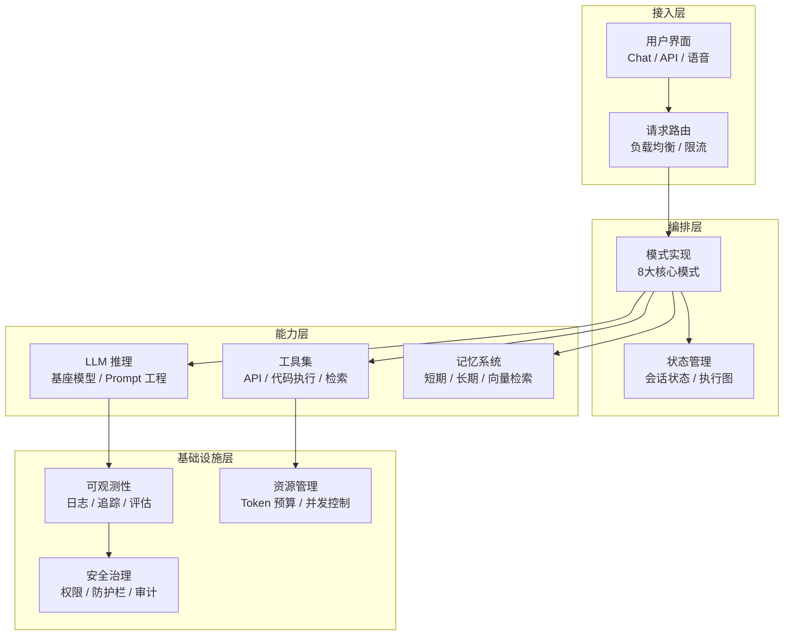
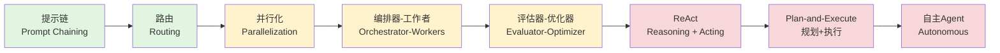
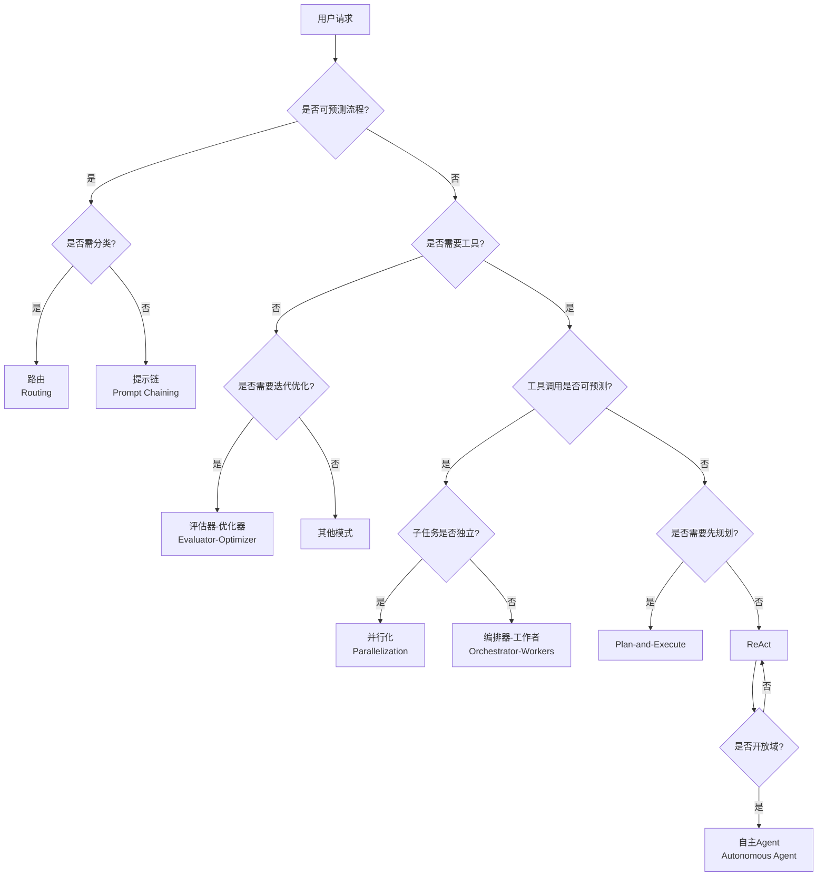
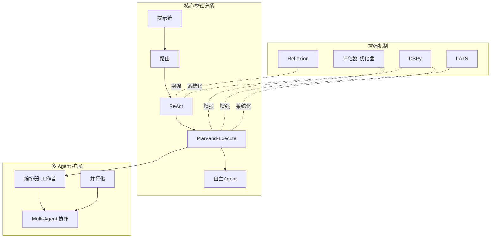
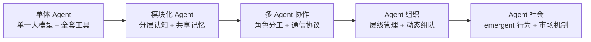

# 架构模式总览

构建 Agent 系统不是选择"用不用 Agent"的二元问题，而是在**控制权谱系**上找到适合业务场景的架构位置。本节从完整系统架构出发，逐层解析 8 大核心模式的适用边界、实现成本和失败模式。

## 完整系统架构

一个生产级 Agent 系统包含四层基础设施，架构模式解决的是**编排层（Orchestration）**的问题——即如何组织 LLM 调用、工具执行和状态流转：



**各层职责说明**：

| 层级 | 核心职责 | 关键设计问题 | 代表技术 |
|------|---------|------------|---------|
| **接入层** | 将用户请求转化为内部事件格式，管理会话生命周期 | 多轮对话如何保持上下文一致性？语音输入的 ASR 误差如何补偿？ | WebSocket、SSE、FastAPI |
| **编排层** | 选择并执行架构模式，管理 LLM 调用链和工具调度 | 当前任务该用提示链还是 ReAct？执行偏离时如何重试？ | LangGraph、AutoGen、CrewAI |
| **能力层** | 提供推理、工具执行和记忆存取的原子能力 | 模型选型（速度 vs 能力）、工具版本管理、向量检索精度 | OpenAI API、向量数据库、Sandbox |
| **基础设施层** | 保障系统可靠、安全、可观测 | 如何防止 Agent 无限循环耗尽预算？如何追踪多步执行链路？ | OpenTelemetry、Prometheus、RBAC |

**关键认知**：编排层是架构模式的应用场域，但模式的可靠性高度依赖下层基础设施。一个没有 Token 预算控制和执行追踪的 ReAct Agent，在生产环境中等同于不可控的递归程序。

## 8 大核心架构模式

按控制权从开发者向模型转移的谱系排列：



**绿色 = 高可控性，黄色 = 中等风险，红色 = 高自主性伴随高不确定性**

### 模式对比矩阵

| 模式 | 控制权归属 | 延迟 | 可靠性 | 成本可预测性 | 适用任务特征 |
|------|-----------|------|--------|-------------|------------|
| **提示链** | 开发者 100% | 低（固定步骤） | 高 | 极高（固定 Token 数） | 流程明确、步骤线性、无分支 |
| **路由** | 开发者 80% | 低（单次决策） | 高 | 高（最多 2 次 LLM 调用） | 任务类型可分类，每类有固定处理链 |
| **并行化** | 开发者 70% | 中（并发控制） | 中 | 中（并发数 × 单次成本） | 子任务独立、可并行、需结果聚合 |
| **编排器-工作者** | 开发者 60% | 中（动态分解） | 中 | 低（分解粒度不确定） | 任务可分解但子任务数量未知 |
| **评估器-优化器** | 开发者 50% | 高（迭代优化） | 高 | 低（迭代次数不定） | 输出质量敏感、可定义评估标准 |
| **ReAct** | 模型 60% | 中（多步推理） | 中 | 低（步数不确定） | 工具密集型、需要实时信息 |
| **Plan-and-Execute** | 模型 70% | 高（规划+执行） | 中 | 低 | 长程任务、需要全局视角 |
| **自主Agent** | 模型 90% | 高（开放探索） | 低 | 极低 | 开放域探索、目标模糊、允许失败 |

### 模式间的演进关系



## 各模式详解与实现要点

### 1. 提示链（Prompt Chaining）

**核心机制**：将复杂任务分解为固定的 LLM 调用序列，每步输出作为下一步输入。

```python
from typing import TypedDict

class ChainState(TypedDict):
    raw_input: str
    extracted_entities: dict
    sql_query: str
    query_result: list
    final_answer: str

def extract_entities(state: ChainState) -> ChainState:
    """步骤1：提取查询实体"""
    prompt = f"从以下查询中提取城市和时间：{state['raw_input']}"
    response = llm.invoke(prompt)
    return {**state, "extracted_entities": parse_json(response)}

def generate_sql(state: ChainState) -> ChainState:
    """步骤2：生成 SQL"""
    prompt = f"根据实体 {state['extracted_entities']} 生成查询SQL"
    return {**state, "sql_query": llm.invoke(prompt)}

def execute_query(state: ChainState) -> ChainState:
    """步骤3：执行查询（非 LLM，确定性代码）"""
    result = db.execute(state["sql_query"])
    return {**state, "query_result": result}

def generate_answer(state: ChainState) -> ChainState:
    """步骤4：生成自然语言回答"""
    prompt = f"根据查询结果 {state['query_result']} 生成回答"
    return {**state, "final_answer": llm.invoke(prompt)}

# 固定执行链
chain = extract_entities | generate_sql | execute_query | generate_answer
result = chain({"raw_input": "北京昨天的平均气温是多少？"})
```

**失败模式**：
- 上游步骤产生错误输出，下游步骤级联失败（无自动恢复机制）
- 固定步骤无法处理需要跳步或回退的场景

**修复**：引入步骤间校验门（Gate）：

```python
def validate_entities(state: ChainState) -> ChainState:
    entities = state["extracted_entities"]
    if not entities.get("city"):
        raise ValueError("未提取到城市信息，无法继续")
    return state

chain = extract_entities | validate_entities | generate_sql | ...
```

### 2. 路由（Routing）

**核心机制**：使用 LLM 或分类器将请求分发到专门的子链/Agent。

```python
from enum import Enum

class Intent(Enum):
    WEATHER = "weather"
    ORDER = "order"
    GENERAL = "general"

ROUTES = {
    Intent.WEATHER: weather_agent,
    Intent.ORDER: order_workflow,
    Intent.GENERAL: general_llm,
}

def router(query: str) -> Intent:
    """轻量模型做分类，降低成本"""
    prompt = f"分类以下查询意图（weather/order/general）：{query}"
    response = light_llm.invoke(prompt)
    return Intent(response.strip().lower())

def run(query: str):
    intent = router(query)
    return ROUTES[intent](query)
```

**关键权衡**：分类准确率 vs 路由成本。使用 embedding 相似度做粗排 + 轻量模型做精排，是工业界常见做法。

### 3. 并行化（Parallelization）

**核心机制**：将任务拆分为独立子任务并行执行，结果聚合后输出。

```python
import asyncio

async def parallel_analysis(text: str) -> dict:
    """并行执行情感分析、实体提取和摘要"""
    tasks = [
        asyncio.create_task(sentiment_agent(text)),
        asyncio.create_task(ner_agent(text)),
        asyncio.create_task(summarize_agent(text)),
    ]
    sentiment, entities, summary = await asyncio.gather(*tasks)
    
    return {
        "sentiment": sentiment,
        "entities": entities,
        "summary": summary,
    }
```

**反模式**：在子任务间存在隐式依赖时强行并行，导致结果不一致。

### 4. 编排器-工作者（Orchestrator-Workers）

**核心机制**：编排器动态分解任务，分发给工作者并行/串行执行，最后整合结果。

```python
class Orchestrator:
    def run(self, task: str) -> str:
        # 动态分解（模型决定子任务数量和类型）
        subtasks = self.decompose(task)
        
        # 分发执行
        results = []
        for subtask in subtasks:
            worker = self.select_worker(subtask)
            result = worker.execute(subtask)
            results.append(result)
        
        # 整合
        return self.synthesize(task, subtasks, results)
```

### 5. 评估器-优化器（Evaluator-Optimizer）

**核心机制**：生成 → 评估 → 若未达标则反馈优化，循环直到通过或达到上限。

```python
def evaluator_optimizer_loop(
    task: str,
    generator: callable,
    evaluator: callable,
    max_iterations: int = 5
) -> str:
    for i in range(max_iterations):
        output = generator(task, feedback if i > 0 else None)
        score, feedback = evaluator(task, output)
        
        if score >= THRESHOLD:
            return output
    
    return output  # 返回最佳尝试
```

**适用场景**：代码生成、文案写作、数据清洗等"有明确质量标准"的任务。

### 6-8. ReAct / Plan-and-Execute / 自主Agent

这三种模式已在独立文章中详述：
- [[06-ReAct|ReAct]] — 推理与行动交替的循环架构
- [[07-Plan-and-Execute|Plan and Execute]] — 先规划后执行的两阶段架构
- [[08-自主Agent|自主Agent]] — 开放域探索的最高自主性架构

## 扩展架构模式

上述 8 大模式覆盖了当前主流实现，但在特定场景下，以下扩展模式提供了重要的能力补充。

### Reflexion（反思增强）

Shinn et al. (2023) 提出的自我反思框架。传统 ReAct 在失败后会停止或简单重试；Reflexion 让 Agent 生成对失败的 verbal feedback，将其存入记忆，指导下一轮尝试。

**核心机制**：
```
尝试 → 失败 → 生成 verbal feedback → 存入记忆 → 重试时检索 feedback → 调整策略
```

**适用场景**：代码生成（测试失败后的修复）、数学证明、结构化数据提取。关键在于评估标准必须客观可判定。

**与评估器-优化器的区别**：评估器-优化器是外部系统给 Agent 打分；Reflexion 是 Agent 自己生成改进建议。前者适合有明确评估指标的任务，后者适合需要"理解错误原因"的任务。

**局限**：模型可能"反思"出错误方向，导致在错误策略上越走越远。应设置最大反思轮数，并在多轮无改进时切换到人工介入。

### LATS（Language Agent Tree Search）

Zhou et al. (2023) 将蒙特卡洛树搜索（MCTS）与 LLM 结合。ReAct 每步选择当前最优行动（贪心策略），容易陷入局部最优；LATS 维护一棵思考-行动树，通过评估节点价值来搜索全局最优序列。

**核心机制**：
- **扩展（Expansion）**：从当前节点生成多个候选行动
- **模拟（Simulation）**：快速推演行动后果（可用轻量模型）
- **评估（Evaluation）**：评估节点价值（可用强模型）
- **反向传播（Backpropagation）**：更新路径上所有节点的价值估计

**适用场景**：决策空间大的任务（游戏策略、旅行规划）、需要回溯的探索性任务、高价值但低频次的关键决策。

**工程技巧**：使用强模型做评估、轻量模型做扩展，可降低成本 60-80%。设置分支因子上限（通常 2-4），避免组合爆炸。

**代价**：token 消耗与分支因子和搜索深度成指数关系，通常仅适用于高价值任务。

### DSPy（声明式 Agent 编程）

Khattab et al. (2023) 提出的一种编程范式。传统 Prompt Engineering 是不可维护的手工艺；DSPy 将 Agent 的行为模块化为可组合的签名（Signature），通过优化器自动调优提示和权重。

**核心洞察**：Agent 系统需要软件工程原则——模块化、可测试、可优化——而非依赖个体的 Prompt 调优技巧。

**与本文架构的关系**：DSPy 主要作用于认知层和编排层，提供模块化的推理组件和自动优化能力。它不替代架构模式，而是让模式的实现更系统化和可维护。

**适用场景**：需要系统性地比较多种提示策略、需要可复现的 Agent 流水线、团队规模较大需要协作开发 Agent 系统。



## 架构演进趋势

### 从单 Agent 到多 Agent 系统

早期 Agent 架构聚焦单一 Agent 的认知能力（ReAct、Plan-and-Execute）。随着任务复杂度增长，多 Agent 系统成为主流趋势。

**演进动力**：
1. **专业化**：单一通用 Agent 难以在所有领域都达到专业水平，多 Agent 允许每个 Agent 专精一个领域
2. **可扩展性**：多 Agent 系统可通过增加 Agent 实例水平扩展，单 Agent 受限于上下文长度和推理时间
3. **鲁棒性**：多 Agent 的冗余和投票机制可降低单点故障风险
4. **可维护性**：每个 Agent 可独立迭代，避免"一个 Prompt 改动导致全局行为偏移"

**架构形态演进**：



当前工业界主要集中在 B-C 阶段。D-E 阶段仍属于研究前沿。

### 从 Prompt 工程到 Agent 工程

第一代 LLM Agent（2022-2023）的核心竞争力在于 Prompt 设计技巧。第二代（2024-）的核心竞争力转向系统工程：

- **可测试性**：Agent 行为需要单元测试、集成测试和对抗测试
- **可观测性**：Thought-Action-Observation 链条需要完整追踪和可视化
- **可配置性**：通过配置而非代码修改来调整 Agent 行为（工具开关、策略选择、安全策略）
- **版本管理**：Prompt、工具 schema、记忆格式都需要版本控制和回滚能力

### 从通用模型到专用认知架构

基座模型的能力在快速提升，但 Agent 架构设计的价值不会因此消失。恰恰相反：

- 更强的基座模型 → 更大的"能力溢出"风险（Agent 做了不该做的事）→ 更需要架构层面的约束和安全设计
- 更长的上下文 → 更大的注意力稀释风险 → 更需要分层记忆和精确检索
- 更快的推理速度 → 更多的迭代轮数 → 更需要成本控制和预算管理

**核心趋势**：Agent 架构从"如何榨取模型能力"转向"如何安全地约束和编排模型能力"。

## 主流框架的架构模式支持

| 框架 | 提示链 | 路由 | 并行化 | 编排器-工作者 | 评估器-优化器 | ReAct | Plan-and-Execute | 自主Agent |
|------|--------|------|--------|--------------|--------------|-------|-----------------|----------|
| **LangChain** | ✅ LCEL | ✅ | ✅ | ✅ | 需自建 | ✅ 内置 | 需自建 | 需自建 |
| **LangGraph** | ✅ | ✅ | ✅ | ✅ | ✅ | ✅ | ✅ 内置 | ✅ |
| **AutoGen** | ✅ | ✅ | ✅ | ✅ 核心 | 需自建 | ✅ | ✅ | ✅ 核心 |
| **CrewAI** | ✅ | ✅ | ✅ | ✅ 核心 | 需自建 | ✅ | ✅ | ✅ |
| **原生 API** | 需自建 | 需自建 | 需自建 | 需自建 | 需自建 | 需自建 | 需自建 | 需自建 |

**选型建议**：
- **原型验证**（< 1 周）：LangChain LCEL 快速搭建提示链和路由
- **生产系统**（需要状态持久化）：LangGraph 的状态图和检查点机制
- **多 Agent 协作**：AutoGen 的对话编程模型或 CrewAI 的角色抽象
- **极致控制**：原生 API + 自研编排层（避免框架抽象泄漏）

## 架构反模式

### 反模式 1：为简单任务选择高自主性模式

**表现**：用 ReAct 实现"查询订单状态"——一个只需单次数据库查询的确定性任务。

**代价**：延迟从 500ms 增加到 3-5s，成本增加 5-10 倍，可靠性下降。

**修复**：回归提示链或直连 API：

```python
# 坏：ReAct 处理确定性查询
agent.run("查询订单 12345 的状态")

# 好：工作流直接处理
order = db.query("SELECT * FROM orders WHERE id = %s", (12345,))
return format_order_status(order)
```

### 反模式 2：在编排层忽视状态管理

**表现**：多步 Agent 没有持久化执行状态，服务重启后用户会话丢失。

**修复**：LangGraph 的 Checkpoint 机制或自研状态快照：

```python
# LangGraph 检查点示例
from langgraph.checkpoint.sqlite import SqliteSaver

memory = SqliteSaver.from_conn_string(":memory:")
graph = builder.compile(checkpointer=memory)

# 恢复会话
config = {"configurable": {"thread_id": "user-123"}}
result = graph.invoke(input_state, config=config)  # 自动恢复之前状态
```

### 反模式 3：混合模式中边界模糊

**表现**：工作流和 Agent 混用，但没有明确的"切换协议"——Agent 可能绕过硬编码的安全检查。

**修复**：显式定义控制权交接点和安全检查门：

```python
def hybrid_system(user_input: str):
    # 阶段1：工作流（确定性）
    intent = classify_intent(user_input)  # 硬编码规则或轻量分类
    
    # 安全检查门
    if intent == "DELETE_ACCOUNT":
        return require_human_approval(user_input)
    
    # 阶段2：Agent（开放性）
    if intent in REQUIRES_AGENT:
        return agent.run(user_input, constraints=get_constraints(intent))
    
    # 阶段3：工作流（确定性）
    return workflow.execute(intent, user_input)
```

## 延伸阅读

- [[01-提示链|提示链（Prompt Chaining）]] — 固定步骤链的实现与优化
- [[02-路由|路由（Routing）]] — 意图分类与动态分发
- [[03-并行化|并行化（Parallelization）]] — 并发子任务设计
- [[04-编排器-工作者|编排器-工作者]] — 动态任务分解模式
- [[05-评估器-优化器|评估器-优化器]] — 迭代优化架构
- [[06-ReAct]] — 推理与行动交替模式
- [[07-Plan-and-Execute]] — 先规划后执行模式
- [[08-自主Agent]] — 开放域自主探索模式
- [Building Effective Agents — Anthropic](https://www.anthropic.com/research/building-effective-agents) — 官方架构建议
- Shinn, N., et al. (2023). Reflexion: Self-Reflective Agents with Verbal Reinforcement Learning. *NeurIPS 2023*.
- Zhou, A., et al. (2023). Large Language Model Agent Tree Search. *arXiv preprint arXiv:2310.04406*.
- Khattab, O., et al. (2023). DSPy: Compiling Declarative Language Model Calls into Self-Improving Pipelines. *arXiv preprint arXiv:2310.03714*.
