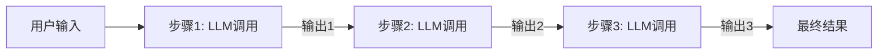
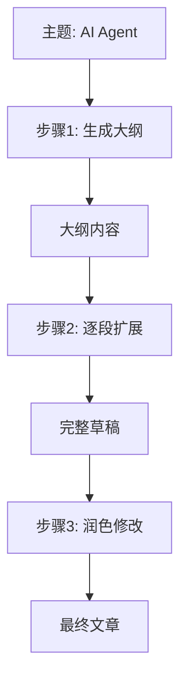
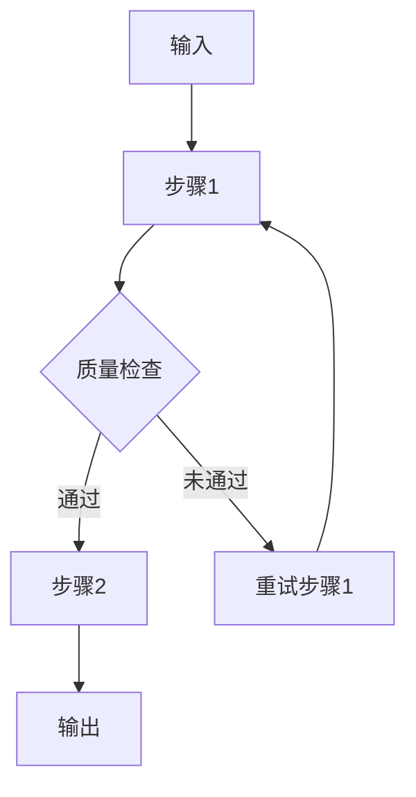

# 提示链（Prompt Chaining）

## 定义

**提示链（Prompt Chaining）** 是将一个复杂任务分解为一系列线性步骤，每个步骤由一个 LLM 调用完成，前一步的输出作为后一步的输入。



## 适用场景

- 任务可以明确分解为线性步骤
- 每步输出可作为下一步的明确输入
- 需要中间结果的检查和转换
- 对延迟不敏感、流程固定的任务

## 典型示例：文章生成



## 代码示例

### 纯 Python 实现

```python
def generate_article(topic: str) -> str:
    # 步骤1: 生成大纲
    outline = llm.invoke(
        f"请为'{topic}'生成一篇文章大纲，包含3-5个要点。"
    )
    
    # 步骤2: 根据大纲生成正文
    draft = llm.invoke(
        f"根据以下大纲写一篇详细文章：\n{outline}"
    )
    
    # 步骤3: 润色
    final = llm.invoke(
        f"请润色以下文章，使其更流畅、专业：\n{draft}"
    )
    
    return final
```

### LangChain 实现

```python
from langchain_core.prompts import ChatPromptTemplate
from langchain_core.output_parsers import StrOutputParser

# 定义每个步骤的 prompt
outline_prompt = ChatPromptTemplate.from_template(
    "为'{topic}'生成大纲："
)
draft_prompt = ChatPromptTemplate.from_template(
    "根据大纲写作：\n{outline}"
)
polish_prompt = ChatPromptTemplate.from_template(
    "润色文章：\n{draft}"
)

# 串联成链
chain = (
    {"topic": lambda x: x}
    | outline_prompt
    | llm
    | StrOutputParser()
    | {"outline": lambda x: x}
    | draft_prompt
    | llm
    | StrOutputParser()
    | {"draft": lambda x: x}
    | polish_prompt
    | llm
    | StrOutputParser()
)

result = chain.invoke("AI Agent 架构设计")
```

## 变体：带条件分支的提示链



```python
def chain_with_retry(input_text: str, max_retries: int = 3) -> str:
    for attempt in range(max_retries):
        result = step1(input_text)
        if quality_check(result):
            break
    else:
        raise Exception("步骤1多次失败")
    
    return step2(result)
```

## 优缺点

| 优点 | 缺点 |
|------|------|
| 简单直观，易于理解和实现 | 延迟累积，总延迟 = 各步骤延迟之和 |
| 每步可独立测试和调试 | 无法并行处理独立子任务 |
| 中间结果可被检查和使用 | 错误会在链中传播放大 |
| 成本可预测 | 不适合需要动态调整的任务 |

## 最佳实践

1. **保持步骤精简**：每个 LLM 调用只做一件事，降低出错概率
2. **添加验证点**：在关键步骤后增加格式/质量检查
3. **设计好输出格式**：前一步的输出格式要便于下一步解析
4. **错误处理**：为每个步骤设计失败重试或降级策略

## 与其他模式的关系

- **vs [[02-路由|路由]]**：提示链是线性流程，路由是有分支的选择
- **vs [[03-并行化|并行化]]**：提示链串行执行，并行化同时执行多个独立任务
- **vs [[06-ReAct|ReAct]]**：提示链由开发者预定义步骤，ReAct 由 LLM 自主决定步骤

## 延伸阅读

- [[00-模式总览]] — 所有架构模式对比
- [[02-路由]] — 当任务需要分类分发时
- [[03-并行化]] — 当子任务可以并行执行时
