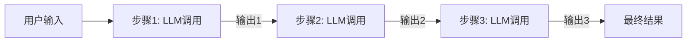
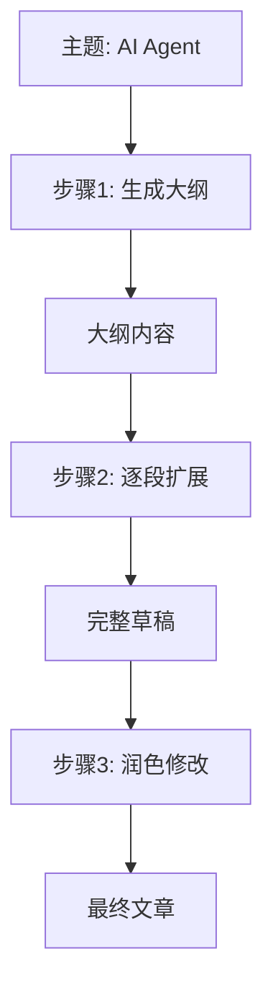
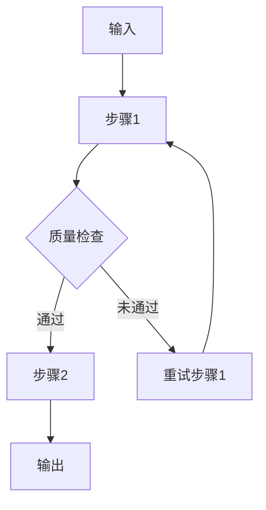

# 提示链（Prompt Chaining）

## 定义

**提示链（Prompt Chaining）** 是将一个复杂任务分解为一系列线性步骤，每个步骤由一个 LLM 调用完成，前一步的输出作为后一步的输入。



## 适用场景

- 任务可以明确分解为线性步骤
- 每步输出可作为下一步的明确输入
- 需要中间结果的检查和转换
- 对延迟不敏感、流程固定的任务

## 典型示例：文章生成



## 代码示例

### 纯 Python 实现

```python
def generate_article(topic: str) -> str:
    # 步骤1: 生成大纲
    outline = llm.invoke(
        f"请为'{topic}'生成一篇文章大纲，包含3-5个要点。"
    )
    
    # 步骤2: 根据大纲生成正文
    draft = llm.invoke(
        f"根据以下大纲写一篇详细文章：\n{outline}"
    )
    
    # 步骤3: 润色
    final = llm.invoke(
        f"请润色以下文章，使其更流畅、专业：\n{draft}"
    )
    
    return final
```

### LangChain 实现

```python
from langchain_core.prompts import ChatPromptTemplate
from langchain_core.output_parsers import StrOutputParser

# 定义每个步骤的 prompt
outline_prompt = ChatPromptTemplate.from_template(
    "为'{topic}'生成大纲："
)
draft_prompt = ChatPromptTemplate.from_template(
    "根据大纲写作：\n{outline}"
)
polish_prompt = ChatPromptTemplate.from_template(
    "润色文章：\n{draft}"
)

# 串联成链
chain = (
    {"topic": lambda x: x}
    | outline_prompt
    | llm
    | StrOutputParser()
    | {"outline": lambda x: x}
    | draft_prompt
    | llm
    | StrOutputParser()
    | {"draft": lambda x: x}
    | polish_prompt
    | llm
    | StrOutputParser()
)

result = chain.invoke("AI Agent 架构设计")
```

## 变体：带条件分支的提示链



```python
def chain_with_retry(input_text: str, max_retries: int = 3) -> str:
    for attempt in range(max_retries):
        result = step1(input_text)
        if quality_check(result):
            break
    else:
        raise Exception("步骤1多次失败")
    
    return step2(result)
```

## 优缺点

| 优点 | 缺点 |
|------|------|
| 简单直观，易于理解和实现 | 延迟累积，总延迟 = 各步骤延迟之和 |
| 每步可独立测试和调试 | 无法并行处理独立子任务 |
| 中间结果可被检查和使用 | 错误会在链中传播放大 |
| 成本可预测 | 不适合需要动态调整的任务 |

## 反模式与修复

| 反模式 | 问题描述 | 影响 | 修复方案 |
|--------|----------|------|----------|
| 硬编码中间结果格式 | 在提示词中写死前一步输出的格式（如 XML 标签、特定分隔符），导致格式微变即链断裂 | 上游 LLM 输出格式稍有偏差，后续所有步骤全部失败，整条链不可用 | 使用结构化输出（JSON Schema / Pydantic）配合输出解析器，对解析失败做降级处理 |
| 无中间验证的盲传 | 将步骤 1 的原始输出不加检查地直接拼接到步骤 2 的 prompt 中 | 错误逐级放大：步骤 1 的小偏差到步骤 3 已变成严重偏离；浪费后续 LLM 调用成本 | 在每步之后加入格式校验和语义检查（如 `assert`、Pydantic `model_validate`），失败时重试或回退 |
| 过长提示链（步骤过多） | 将任务拆成 8-10 个以上串行步骤，每步都是一次 LLM 调用 | 总延迟线性累加（N 步 x 平均 2s = 20s+），成本也随之翻倍；中间任何一步失败都需重跑全链 | 合并语义相近的步骤，或将可独立的子链替换为 [[03-并行化]] 模式，减少串行深度 |
| 缺少错误恢复机制 | 链中任何一步失败就直接抛异常，没有重试、降级或回退逻辑 | 一次瞬时网络抖动或模型 rate-limit 就会导致整个任务失败，用户体验差 | 为每步添加带退避的重试逻辑（exponential backoff），并在关键步骤设置降级路径（如使用缓存结果或备用模型） |
| 上下文窗口溢出 | 将前序所有步骤的完整输出逐层传递，导致后续步骤的 prompt 远超模型上下文窗口限制 | LLM 截断输入，丢失关键信息；或直接报错无法处理 | 每步只传递下一步**必需**的摘要信息，使用中间存储保存完整结果，按需检索 |
| 单一模型贯穿全链 | 链中所有步骤使用同一个模型（同一个 temperature、同一个能力级别） | 简单格式化任务用强模型浪费成本；需要强推理的步骤用弱模型质量不达标 | 按步骤复杂度选择不同模型：格式化用轻量模型，推理用强模型，参考 [[02-路由]] 的多模型路由策略 |

最值得警惕的反模式是**无中间验证的盲传**。提示链的每一步都会引入 LLM 的不确定性，如果不在中间环节做校验，微小的格式偏差或语义偏移会逐级放大，最终导致输出完全偏离预期。建议在每个步骤后用 Pydantic 模型或正则表达式做严格校验，校验失败时自动重试并附加错误信息引导模型修正。

另一个常见陷阱是**上下文窗口溢出**。开发者容易习惯性地将前序步骤的完整输出拼入下一步 prompt，步骤少时看不出问题，但当链长增长或输入文本较长时，后续步骤的有效上下文会被大量前序内容挤占。应在设计阶段就规划好每步的信息传递格式，只传递必要字段，将完整中间结果存入外部存储。

## 权衡分析

提示链的核心设计选择是**串行线性执行 vs 其他编排方式**。以下是关键权衡点：

### 延迟 vs 可控性

| 维度 | 提示链 | 并行化 | 自主 Agent |
|------|--------|--------|-----------|
| 总延迟 | 高（各步骤延迟之和） | 低（取最慢子任务） | 不可预测 |
| 可控性 | 高（每步可检查） | 中（聚合前难检查） | 低（全程自主） |
| 调试难度 | 低（线性追踪） | 中（并发问题） | 高（非确定性） |
| 适用任务 | 流程固定、步骤明确 | 子任务独立 | 开放域复杂任务 |

### 成本 vs 质量

- **更多步骤 = 更高质量，但更高成本**：每增加一个 LLM 调用，成本线性增长，但质量提升呈边际递减
- **验证点是额外开销**：添加质量检查会增加延迟和成本，但能防止错误传播——在高价值任务（如医疗报告生成）中值得投入
- **步骤拆分粒度的权衡**：拆得太细导致调用次数膨胀，拆得太粗则丧失中间检查的优势

### 何时选择提示链

- 任务流程**事先完全确定**，不需要运行时动态调整
- 每步输出**格式可预测**，便于下一步解析
- 对**调试可观测性**要求高（如合规场景需要审计每步决策）
- 团队对 Agent 架构**经验有限**，需要最简单的起步方案

### 何时避免提示链

- 子任务之间**无依赖关系**——用并行化可显著降低延迟
- 任务需要**动态决策**下一步做什么——用 ReAct 或自主 Agent
- 步骤数**超过 5 步**且每步成本敏感——考虑评估器-优化器模式做迭代精简

## 最佳实践

1. **保持步骤精简**：每个 LLM 调用只做一件事，降低出错概率
2. **添加验证点**：在关键步骤后增加格式/质量检查
3. **设计好输出格式**：前一步的输出格式要便于下一步解析
4. **错误处理**：为每个步骤设计失败重试或降级策略

## 与其他模式的关系

- **vs [[02-路由|路由]]**：提示链是线性流程，路由是有分支的选择
- **vs [[03-并行化|并行化]]**：提示链串行执行，并行化同时执行多个独立任务
- **vs [[06-ReAct|ReAct]]**：提示链由开发者预定义步骤，ReAct 由 LLM 自主决定步骤

## 延伸阅读

- [[00-模式总览]] — 所有架构模式对比
- [[02-路由]] — 当任务需要分类分发时
- [[03-并行化]] — 当子任务可以并行执行时
