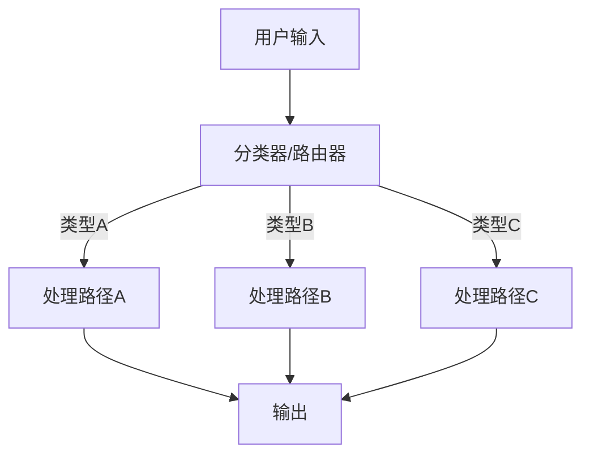
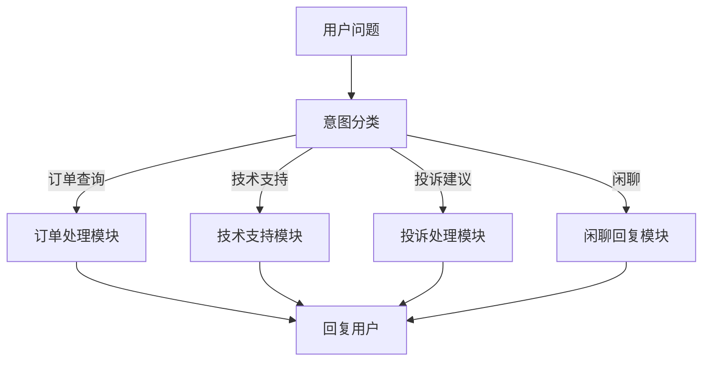
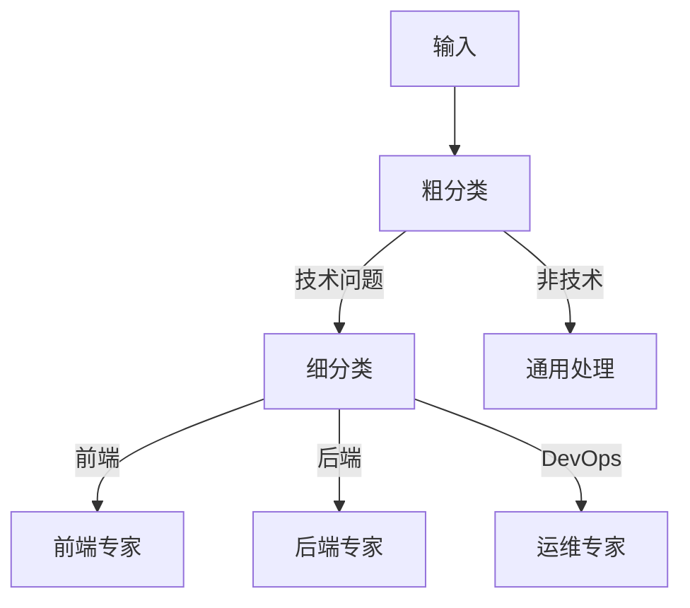

# 路由（Routing）

## 定义

**路由（Routing）** 是根据输入的特征（内容、类型、意图等），将请求分发到最合适的处理路径或专用模型的模式。



## 适用场景

- 系统需要处理多种不同类型的任务
- 不同任务类型需要不同的处理方式或专用模型
- 需要按领域/复杂度/敏感度分流
- 希望优化成本和性能（简单任务用轻量模型）

## 典型示例：客服系统



## 代码示例

### 基于 LLM 的分类路由

```python
from enum import Enum

class QueryType(Enum):
    ORDER = "订单查询"
    TECH = "技术支持"
    COMPLAINT = "投诉建议"
    CHAT = "闲聊"

def classify_query(user_input: str) -> QueryType:
    """使用 LLM 对输入进行分类"""
    prompt = f"""请将用户输入分类为以下类型之一：
- 订单查询
- 技术支持
- 投诉建议
- 闲聊

用户输入：{user_input}

只返回类型名称，不要其他解释。"""
    
    result = llm.invoke(prompt).strip()
    return QueryType(result)

def route_and_process(user_input: str) -> str:
    query_type = classify_query(user_input)
    
    handlers = {
        QueryType.ORDER: handle_order,
        QueryType.TECH: handle_tech,
        QueryType.COMPLAINT: handle_complaint,
        QueryType.CHAT: handle_chat,
    }
    
    handler = handlers[query_type]
    return handler(user_input)
```

### 多模型路由

```python
def smart_route(prompt: str) -> str:
    """根据复杂度选择模型"""
    complexity = assess_complexity(prompt)
    
    if complexity == "simple":
        return cheap_model.invoke(prompt)  # 轻量模型，成本低
    elif complexity == "medium":
        return standard_model.invoke(prompt)
    else:
        return powerful_model.invoke(prompt)  # 强模型，成本高
```

## 变体：级联路由



## 优缺点

| 优点 | 缺点 |
|------|------|
| 各路径可独立优化 | 分类错误会导致整个请求处理失败 |
| 可为不同任务选择最适合的模型 | 增加一层延迟（分类步骤） |
| 便于扩展新类型 | 分类边界模糊时效果下降 |
| 成本优化（简单任务用轻量模型） | 需要维护分类器和多条路径 |

## 最佳实践

1. **分类器要简单**：分类任务本身应该是简单的，避免"分类器也变成 Agent"
2. **兜底路径**： always 提供默认/兜底处理路径
3. **持续优化**：收集分类错误样本，迭代优化分类器
4. **置信度阈值**：当分类置信度低时，降级到通用处理或人工介入

## 与其他模式的关系

- **vs [[01-提示链|提示链]]**：路由是多分支选择，提示链是单线执行
- **vs [[03-并行化|并行化]]**：路由选择一条路径，并行化同时走多条路径
- **vs [[04-编排器-工作者|编排器-工作者]]**：路由是静态分类，编排器动态分解任务

## 延伸阅读

- [[00-模式总览]] — 所有架构模式对比
- [[01-提示链]] — 单一路径的线性处理
- [[03-并行化]] — 同时尝试多条路径
