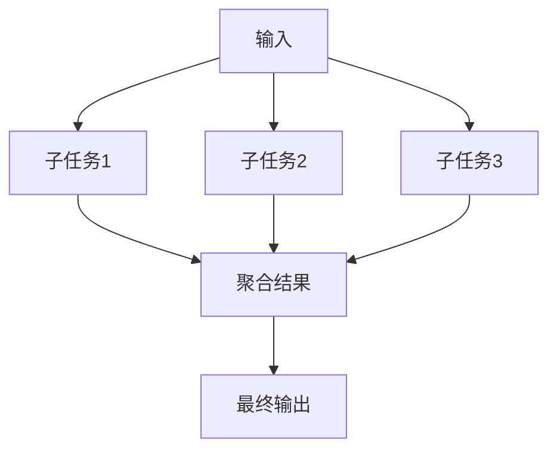
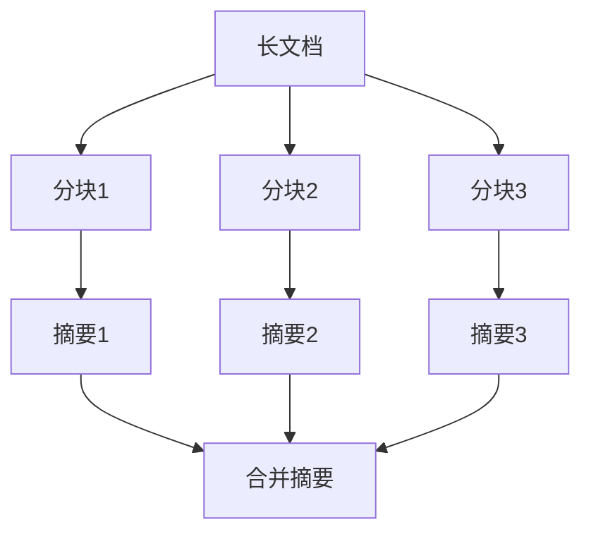
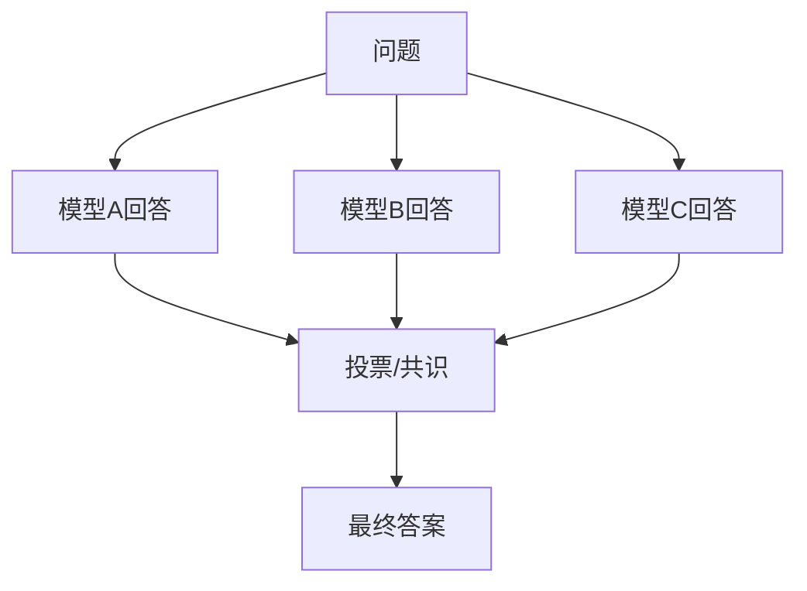

# 并行化（Parallelization）

## 定义

**并行化（Parallelization）** 是将一个任务分解为多个可独立执行的子任务，同时运行它们，然后聚合结果的模式。



## 两种变体

### 1. 分片（Sectioning）

将大任务按数据/维度拆分，每个子任务处理一部分。



### 2. 投票（Voting）

同时用多个方法/模型处理同一任务，聚合结果以提高可靠性。



## 适用场景

- 任务可自然分解为独立子任务
- 需要处理大量数据（分片处理）
- 需要提高结果的可靠性（多模型投票）
- 延迟敏感但子任务之间无依赖

## 代码示例

### 分片处理

```python
import asyncio

async def process_chunks(document: str) -> str:
    # 将文档分块
    chunks = split_into_chunks(document, chunk_size=2000)
    
    # 并行处理每个块
    tasks = [
        llm.ainvoke(f"总结以下内容：\n{chunk}")
        for chunk in chunks
    ]
    summaries = await asyncio.gather(*tasks)
    
    # 合并结果
    final_summary = await llm.ainvoke(
        f"基于以下各段总结，生成整体摘要：\n{'\n'.join(summaries)}"
    )
    
    return final_summary
```

### 多模型投票

```python
import asyncio
from collections import Counter

async def ensemble_answer(question: str) -> str:
    # 多个模型并行回答
    models = [gpt4, claude, gemini]
    
    tasks = [model.ainvoke(question) for model in models]
    answers = await asyncio.gather(*tasks)
    
    # 简单多数投票
    if all_answers_similar(answers):
        return answers[0]
    
    # 不一致时，让最强模型做最终判断
    consensus_prompt = f"""多个模型对以下问题给出了不同答案，
请判断哪个最准确：

问题：{question}

答案A：{answers[0]}
答案B：{answers[1]}
答案C：{answers[2]}

请给出最准确的答案并解释原因。"""
    
    return await gpt4.ainvoke(consensus_prompt)
```

### LangGraph 并行节点

```python
from langgraph.graph import StateGraph, END
from typing import TypedDict, Annotated
import operator

class State(TypedDict):
    input: str
    results: Annotated[list, operator.add]
    final: str

builder = StateGraph(State)

# 并行节点
builder.add_node("processor_a", lambda s: {"results": [llm_a.invoke(s["input"])]})
builder.add_node("processor_b", lambda s: {"results": [llm_b.invoke(s["input"])]})
builder.add_node("aggregator", lambda s: {"final": combine(s["results"])})

# 从入口并行分叉
builder.set_entry_point("processor_a")
builder.add_edge("__start__", "processor_b")
builder.add_edge("processor_a", "aggregator")
builder.add_edge("processor_b", "aggregator")
builder.add_edge("aggregator", END)

graph = builder.compile()
```

## 优缺点

| 优点 | 缺点 |
|------|------|
| 显著降低总延迟（延迟 = 最慢子任务） | 成本增加（多次 LLM 调用） |
| 提高可靠性（投票机制） | 结果聚合可能复杂 |
| 可扩展性强 | 子任务独立性要求高 |
| 充分利用异步能力 | 调试并行问题较困难 |

## 反模式与修复

| 反模式 | 问题 | 影响 | 修复方案 |
|--------|------|------|----------|
| 隐式子任务依赖 | 子任务之间存在未声明的数据依赖，但被当作独立任务并行执行 | 结果不确定，某些运行正确某些运行错误，极难复现和调试 | 在分解阶段显式声明依赖图，有依赖的子任务串行执行，无依赖的才并行 |
| 无超时控制 | 某个子任务挂起或响应极慢，`asyncio.gather` 永远等待 | 整个并行流程被一个慢任务阻塞，资源泄漏 | 为每个子任务设置超时（`asyncio.wait_for`），超时后标记失败并继续聚合其他结果 |
| 不设并发上限 | 同时发起数百个 LLM 调用 | 触发 API 限流（Rate Limit），大量请求失败，成本失控 | 使用信号量（`asyncio.Semaphore`）限制并发数，或使用批量 API |
| 投票逻辑过于简单 | 仅用字符串精确匹配判断"多数一致"，LLM 输出措辞不同时无法识别共识 | 投票机制形同虚设，多数情况下走兜底逻辑 | 使用语义相似度比较替代字符串匹配，或将多个回答交给聚合模型判断一致性 |
| 聚合逻辑丢失子任务上下文 | 聚合时只传入各子任务的最终结果，不包含原始输入和推理过程 | 聚合模型无法判断各结果的可靠性，合并质量低 | 聚合时同时传入原始输入、子任务结果和置信度信息，便于聚合模型做加权判断 |

## 权衡分析

并行化的核心设计选择是**延迟优化 vs 成本控制 vs 结果一致性**。

### 分片 vs 投票

| 维度 | 分片（Sectioning） | 投票（Voting） |
|------|-------------------|----------------|
| 目标 | 降低延迟 | 提高可靠性 |
| 成本 | 与串行相同（同量调用） | 成倍增加（N 个模型 = N 倍成本） |
| 聚合复杂度 | 中（需要合并语义） | 高（需要判断共识） |
| 适用场景 | 大数据量处理 | 高可靠性要求（医疗、金融） |

### 延迟 vs 成本

- **并行化将延迟从 O(N) 降到 O(1)**，但成本不变（分片）或倍增（投票）
- 投票模式中，3 模型投票的成本是单模型的 3 倍，但可靠性提升并非线性——当模型同质化严重时，投票收益递减
- **异步并发 vs 同步等待**：`asyncio.gather` 可以真正并行，但需要 API 支持并发请求；同步实现只是代码组织方式的改变，不降低实际延迟

### 聚合策略的取舍

- **简单拼接**：最低成本，但可能产生冗余和矛盾
- **LLM 聚合**：质量最高，但增加一次额外调用的成本和延迟
- **多数投票**：可靠性高，但要求答案可比较（不适合开放式生成）
- **加权聚合**：需要置信度评分，实现复杂度高

### 何时选择并行化

- 子任务之间**完全独立**，无数据依赖
- 对**延迟敏感**（如实时客服、在线搜索）
- 需要**提高可靠性**（多模型投票消除单模型偏差）
- 数据量大，单次处理**超出上下文窗口**

### 何时避免并行化

- 子任务之间**有依赖关系**——强制并行会导致不确定结果
- API **有严格的 Rate Limit**——并发请求反而触发限流，总时间更长
- 结果**需要严格一致性**——投票可能产生分歧，聚合引入新误差
- 任务本身**很轻量**——并行化的调度开销可能超过任务执行时间

## 最佳实践

1. **确保独立性**：子任务之间不能有依赖，否则并行结果不确定
2. **控制并发数**：避免同时发起过多请求导致限流
3. **结果聚合策略**：提前设计好如何合并/选择结果
4. **超时处理**：设置子任务超时，防止一个慢任务阻塞整体

## 与其他模式的关系

- **vs [[01-提示链|提示链]]**：提示链串行，并行化同时执行
- **vs [[02-路由|路由]]**：路由选一条路径，并行化走多条路径
- **vs [[04-编排器-工作者|编排器-工作者]]**：并行化是静态分解，编排器动态分配任务

## 延伸阅读

- [[00-模式总览]] — 所有架构模式对比
- [[04-编排器-工作者]] — 动态任务分解
- [[05-评估器-优化器]] — 迭代优化模式
