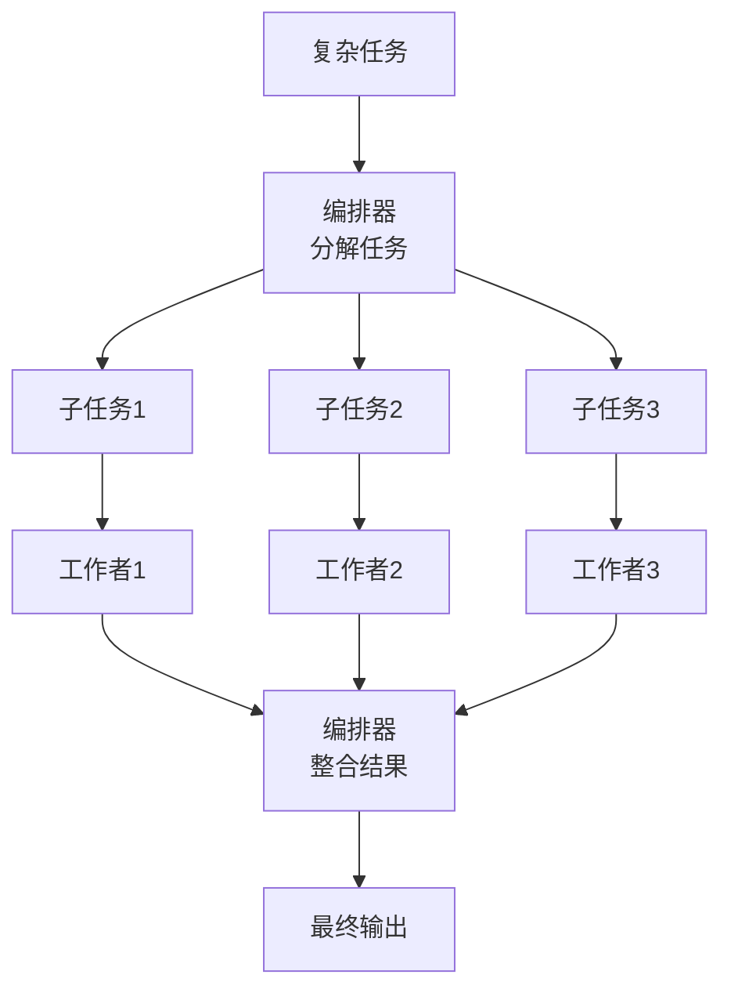
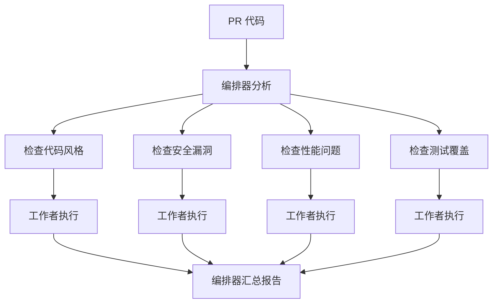

# 编排器-工作者（Orchestrator-Workers）

## 定义

**编排器-工作者（Orcistrator-Workers）** 是一种动态任务分解模式：中央编排器（Orchestrator）分析任务并分解为子任务，然后委派给多个工作者（Workers）并行或串行执行，最后编排器整合结果。



## 适用场景

- 任务复杂度事先无法完全确定
- 需要根据输入动态决定子任务
- 子任务可以并行执行
- 需要中央协调和结果整合

## 典型示例：代码审查 Agent



## 代码示例

### Python 实现

```python
import asyncio
from dataclasses import dataclass
from typing import List

@dataclass
class SubTask:
    id: str
    description: str
    worker_type: str

class Orchestrator:
    def __init__(self, llm):
        self.llm = llm
        self.workers = {
            "research": ResearchWorker(),
            "analysis": AnalysisWorker(),
            "writer": WriterWorker(),
        }
    
    async def decompose(self, task: str) -> List[SubTask]:
        """动态分解任务"""
        prompt = f"""将以下任务分解为子任务列表。
每个子任务包含：id, description, worker_type
可用工作者类型：research, analysis, writer

任务：{task}

以 JSON 格式返回子任务列表。"""
        
        result = self.llm.invoke(prompt)
        return parse_subtasks(result)
    
    async def execute(self, task: str) -> str:
        # 步骤1: 分解任务
        subtasks = await self.decompose(task)
        
        # 步骤2: 并行执行子任务
        async def run_subtask(st: SubTask):
            worker = self.workers[st.worker_type]
            result = await worker.execute(st.description)
            return {"id": st.id, "result": result}
        
        results = await asyncio.gather(*[
            run_subtask(st) for st in subtasks
        ])
        
        # 步骤3: 整合结果
        return await self.synthesize(task, results)
    
    async def synthesize(self, original_task: str, results: list) -> str:
        """整合所有子任务结果"""
        prompt = f"""基于以下子任务结果，完成原始任务。

原始任务：{original_task}

子任务结果：
{format_results(results)}

请生成完整、连贯的最终输出。"""
        
        return self.llm.invoke(prompt)
```

### 动态重分解

当工作者返回的结果需要进一步处理时，编排器可以动态生成新的子任务：

```python
async def execute_with_retry(self, task: str, max_depth: int = 3) -> str:
    results = []
    pending = [SubTask("0", task, "any")]
    depth = 0
    
    while pending and depth < max_depth:
        depth += 1
        current = pending.pop(0)
        
        # 检查是否需要进一步分解
        if needs_decomposition(current.result):
            new_subtasks = await self.decompose(current.result)
            pending.extend(new_subtasks)
        else:
            results.append(current.result)
    
    return await self.synthesize(task, results)
```

## 优缺点

| 优点 | 缺点 |
|------|------|
| 动态适应任务复杂度 | 编排器成为单点瓶颈 |
| 子任务可并行执行 | 任务分解质量直接影响最终结果 |
| 适合开放域复杂任务 | 调试和追踪较复杂 |
| 可递归分解 | 可能出现过度分解 |

## 反模式与修复

| 反模式 | 问题 | 影响 | 修复方案 |
|--------|------|------|----------|
| 编排器单点故障 | 编排器 LLM 调用失败时整个流程中断，无备用方案 | 所有任务停摆，已在执行的工作者结果被浪费 | 为编排器设置重试和降级策略；关键场景可用规则引擎作为编排器的备用方案 |
| 无工作者健康检查 | 工作者长时间无响应或返回垃圾结果，编排器无感知地继续分配任务 | 大量子任务超时或结果质量为零，最终输出不可用 | 引入工作者心跳/超时检测机制，自动将失败工作者的任务重新分配给备用工作者 |
| 负载不均衡 | 所有工作者接收相同数量的任务，但任务复杂度差异巨大 | 简单任务工作者早早完成空转，复杂任务工作者严重超载 | 引入任务优先级和复杂度评估，按工作者能力动态分配任务量 |
| 过度递归分解 | 编排器不断将任务细分为更小子任务，没有终止条件 | 递归深度失控，最终产生数百个微任务，开销远超任务本身价值 | 设置最大递归深度（如 3 层），当子任务粒度低于阈值时强制执行 |
| 工作者输出格式不统一 | 各工作者返回不同格式的结果，编排器整合时解析失败 | 整合阶段消耗大量 Token 做格式转换，或直接解析错误 | 为所有工作者定义统一的输出 Schema，在工作者返回前强制校验格式 |

## 权衡分析

编排器-工作者的核心设计选择是**动态分解 vs 静态分解、中央控制 vs 去中心化**。

### 编排器-工作者 vs 并行化 vs 提示链

| 维度 | 编排器-工作者 | 并行化 | 提示链 |
|------|-------------|--------|--------|
| 任务分解 | 动态（LLM 决定） | 静态（开发者预定义） | 静态（开发者预定义） |
| 灵活性 | 高 | 低 | 低 |
| 可预测性 | 低 | 高 | 高 |
| 调试难度 | 高 | 中 | 低 |
| 适用场景 | 开放域、任务复杂度不确定 | 任务结构明确 | 流程固定 |

### 编排器设计的取舍

- **LLM 作为编排器**：最灵活，但成本高、延迟大、结果不确定
- **规则引擎作为编排器**：确定性强、成本低，但无法处理未预见的任务类型
- **混合方案**：规则引擎处理常见场景，LLM 处理边缘 case——平衡成本和灵活性

### 分解粒度的权衡

- **粗粒度**（2-3 个子任务）：编排器开销小，但工作者任务仍然复杂
- **细粒度**（10+ 个子任务）：工作者任务简单，但编排器开销大，整合复杂
- **经验法则**：子任务应能在 1-3 次 LLM 调用内完成；如果需要更多调用，考虑进一步分解

### 递归分解的风险与收益

- **收益**：可以处理分形结构的任务（如"写一本书" → "写每一章" → "写每一节"）
- **风险**：递归深度不可控时，可能产生数百个微任务，调度和整合开销远超任务本身
- **折中**：设置最大递归深度（通常 2-3 层），并在每层检查是否真正需要进一步分解

### 何时选择编排器-工作者

- 任务复杂度**事先无法确定**，需要运行时动态判断
- 需要**结合多种专业能力**（如研究 + 写作 + 审查）
- 任务可能需要**递归分解**

### 何时避免编排器-工作者

- 任务结构**完全确定**——提示链或并行化更简单、更可预测
- 对**延迟和成本有严格预算**——编排器的额外 LLM 调用是硬开销
- 团队**调试能力有限**——动态分解的问题难以复现和排查

## 最佳实践

1. **分解粒度**：子任务要足够独立，避免过度细粒度导致开销过大
2. **结果格式约定**：规定工作者输出的统一格式，便于编排器整合
3. **超时控制**：为子任务设置超时，防止单个工作者卡住
4. **失败重试**：单个工作者失败时，可重试或分配给备用工作者
5. **限制递归深度**：防止无限分解，设置最大分解层数

## 与其他模式的关系

- **vs [[03-并行化|并行化]]**：并行化是静态分解，编排器动态分解
- **vs [[05-评估器-优化器|评估器-优化器]]**：编排器-工作者关注分解执行，评估器-优化器关注迭代改进
- **vs [[07-Plan-and-Execute|Plan-and-Execute]]**：编排器-工作者由 LLM 控制分解，Plan-and-Execute 也是由 LLM 规划

## 延伸阅读

- [[00-模式总览]] — 所有架构模式对比
- [[03-并行化]] — 静态并行执行
- [[07-Plan-and-Execute]] — 先规划后执行
