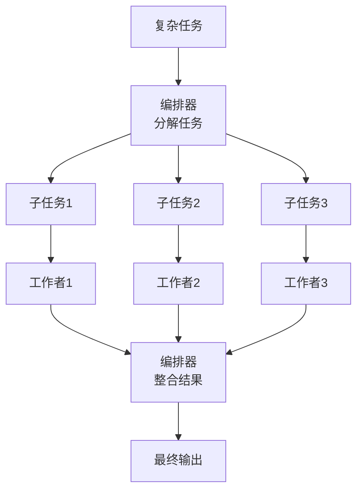
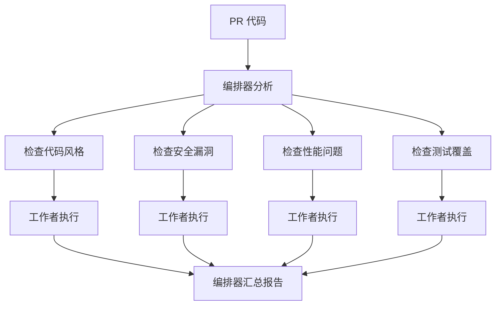

# 编排器-工作者（Orchestrator-Workers）

## 定义

**编排器-工作者（Orcistrator-Workers）** 是一种动态任务分解模式：中央编排器（Orchestrator）分析任务并分解为子任务，然后委派给多个工作者（Workers）并行或串行执行，最后编排器整合结果。



## 适用场景

- 任务复杂度事先无法完全确定
- 需要根据输入动态决定子任务
- 子任务可以并行执行
- 需要中央协调和结果整合

## 典型示例：代码审查 Agent



## 代码示例

### Python 实现

```python
import asyncio
from dataclasses import dataclass
from typing import List

@dataclass
class SubTask:
    id: str
    description: str
    worker_type: str

class Orchestrator:
    def __init__(self, llm):
        self.llm = llm
        self.workers = {
            "research": ResearchWorker(),
            "analysis": AnalysisWorker(),
            "writer": WriterWorker(),
        }
    
    async def decompose(self, task: str) -> List[SubTask]:
        """动态分解任务"""
        prompt = f"""将以下任务分解为子任务列表。
每个子任务包含：id, description, worker_type
可用工作者类型：research, analysis, writer

任务：{task}

以 JSON 格式返回子任务列表。"""
        
        result = self.llm.invoke(prompt)
        return parse_subtasks(result)
    
    async def execute(self, task: str) -> str:
        # 步骤1: 分解任务
        subtasks = await self.decompose(task)
        
        # 步骤2: 并行执行子任务
        async def run_subtask(st: SubTask):
            worker = self.workers[st.worker_type]
            result = await worker.execute(st.description)
            return {"id": st.id, "result": result}
        
        results = await asyncio.gather(*[
            run_subtask(st) for st in subtasks
        ])
        
        # 步骤3: 整合结果
        return await self.synthesize(task, results)
    
    async def synthesize(self, original_task: str, results: list) -> str:
        """整合所有子任务结果"""
        prompt = f"""基于以下子任务结果，完成原始任务。

原始任务：{original_task}

子任务结果：
{format_results(results)}

请生成完整、连贯的最终输出。"""
        
        return self.llm.invoke(prompt)
```

### 动态重分解

当工作者返回的结果需要进一步处理时，编排器可以动态生成新的子任务：

```python
async def execute_with_retry(self, task: str, max_depth: int = 3) -> str:
    results = []
    pending = [SubTask("0", task, "any")]
    depth = 0
    
    while pending and depth < max_depth:
        depth += 1
        current = pending.pop(0)
        
        # 检查是否需要进一步分解
        if needs_decomposition(current.result):
            new_subtasks = await self.decompose(current.result)
            pending.extend(new_subtasks)
        else:
            results.append(current.result)
    
    return await self.synthesize(task, results)
```

## 优缺点

| 优点 | 缺点 |
|------|------|
| 动态适应任务复杂度 | 编排器成为单点瓶颈 |
| 子任务可并行执行 | 任务分解质量直接影响最终结果 |
| 适合开放域复杂任务 | 调试和追踪较复杂 |
| 可递归分解 | 可能出现过度分解 |

## 最佳实践

1. **分解粒度**：子任务要足够独立，避免过度细粒度导致开销过大
2. **结果格式约定**：规定工作者输出的统一格式，便于编排器整合
3. **超时控制**：为子任务设置超时，防止单个工作者卡住
4. **失败重试**：单个工作者失败时，可重试或分配给备用工作者
5. **限制递归深度**：防止无限分解，设置最大分解层数

## 与其他模式的关系

- **vs [[03-并行化|并行化]]**：并行化是静态分解，编排器动态分解
- **vs [[05-评估器-优化器|评估器-优化器]]**：编排器-工作者关注分解执行，评估器-优化器关注迭代改进
- **vs [[07-Plan-and-Execute|Plan-and-Execute]]**：编排器-工作者由 LLM 控制分解，Plan-and-Execute 也是由 LLM 规划

## 延伸阅读

- [[00-模式总览]] — 所有架构模式对比
- [[03-并行化]] — 静态并行执行
- [[07-Plan-and-Execute]] — 先规划后执行
