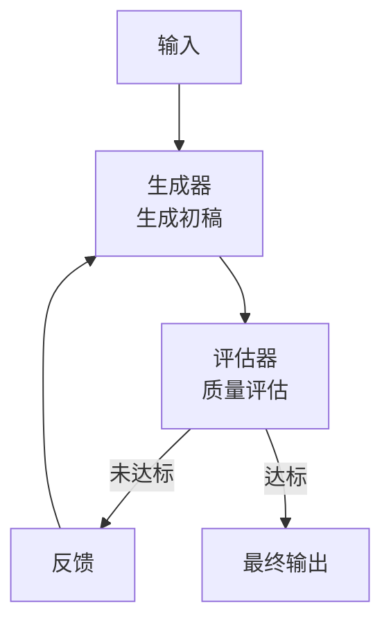
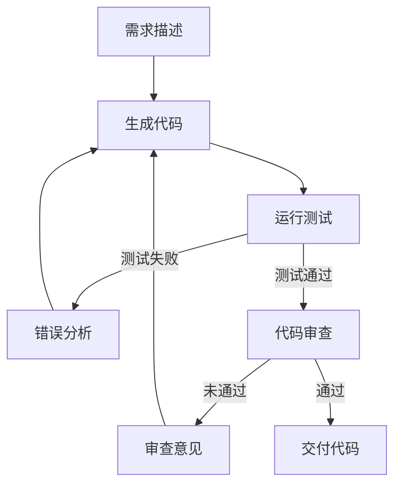
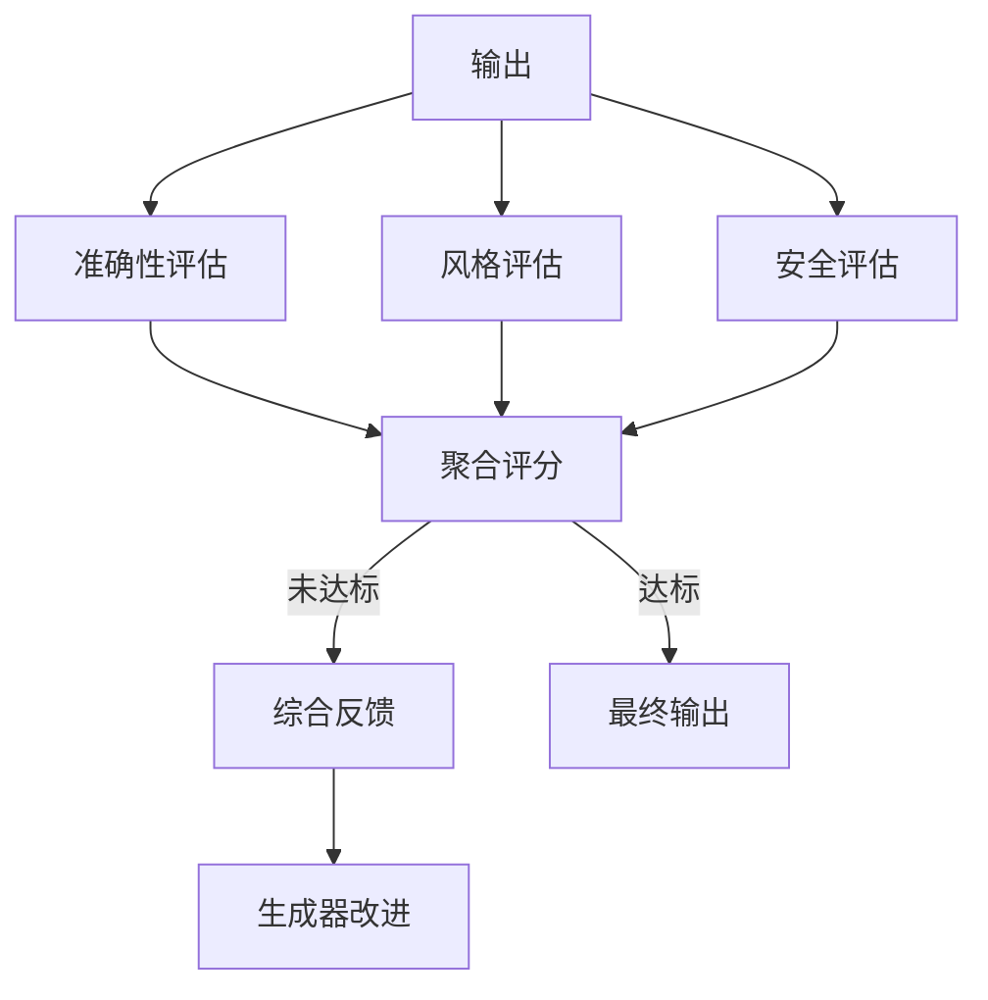

# 评估器-优化器（Evaluator-Optimizer）

## 定义

**评估器-优化器（Evaluator-Optimizer）** 是一种迭代优化模式：生成器（Generator）产出结果，评估器（Evaluator）检查质量并给出反馈，生成器根据反馈改进，循环直到满足质量标准。



## 适用场景

- 输出质量有明显可评估的标准
- 迭代改进可以持续提升质量
- 评估比生成更容易（或成本更低）
- 需要高质量输出的场景（代码、文档、翻译等）

## 典型示例：代码生成与修复



## 代码示例

### Python 实现

```python
class EvaluatorOptimizer:
    def __init__(self, generator_llm, evaluator_llm, max_iterations=5):
        self.generator = generator_llm
        self.evaluator = evaluator_llm
        self.max_iterations = max_iterations
    
    def generate(self, prompt: str, feedback: str = "") -> str:
        """生成内容，可选携带反馈"""
        full_prompt = prompt
        if feedback:
            full_prompt += f"\n\n之前的反馈：{feedback}"
        return self.generator.invoke(full_prompt)
    
    def evaluate(self, output: str, criteria: str) -> tuple[bool, str]:
        """评估输出，返回(是否通过, 反馈)"""
        eval_prompt = f"""评估以下输出是否满足标准。

标准：{criteria}

输出：
{output}

请判断：通过/未通过
改进建议："""
        
        result = self.evaluator.invoke(eval_prompt)
        passed = "通过" in result
        feedback = extract_feedback(result)
        return passed, feedback
    
    def run(self, prompt: str, criteria: str) -> str:
        """运行生成-评估循环"""
        output = self.generate(prompt)
        
        for i in range(self.max_iterations):
            passed, feedback = self.evaluate(output, criteria)
            if passed:
                return output
            
            output = self.generate(prompt, feedback)
        
        # 达到最大迭代次数，返回最佳结果
        return output
```

### 代码修复场景

```python
def generate_and_fix_code(requirement: str, test_cases: list) -> str:
    """生成代码并通过测试用例迭代修复"""
    
    code = llm.invoke(f"根据需求编写 Python 函数：\n{requirement}")
    
    for iteration in range(5):
        # 运行测试
        results = run_tests(code, test_cases)
        
        if all(r.passed for r in results):
            return code
        
        # 构建失败信息
        failures = "\n".join(
            f"测试：{r.test_name}\n错误：{r.error}"
            for r in results if not r.passed
        )
        
        # 修复代码
        fix_prompt = f"""修复以下代码以通过测试。

当前代码：
{code}

失败的测试：
{failures}

请修复代码，只返回修复后的完整代码。"""
        
        code = llm.invoke(fix_prompt)
    
    raise Exception("无法在最大迭代次数内修复代码")
```

## 变体：多维度评估



## 优缺点

| 优点 | 缺点 |
|------|------|
| 持续提升输出质量 | 延迟增加（多轮迭代） |
| 评估和生成可分离优化 | 可能陷入局部最优 |
| 质量有明确标准 | 评估标准本身可能不完美 |
| 适合对质量敏感的场景 | 成本随迭代次数增加 |

## 反模式与修复

| 反模式 | 问题 | 影响 | 修复方案 |
|--------|------|------|----------|
| 无限优化循环 | 未设置最大迭代次数，或设置后未真正检查收敛条件 | Agent 陷入死循环，持续消耗 Token 和时间，永远无法返回结果 | 设置硬性迭代上限（如 5-10 轮），并增加收敛检测——连续两轮评分无提升时提前终止 |
| 评估标准过于严苛 | 评估器使用完美主义标准（如"无任何瑕疵"），导致几乎无法通过 | 所有输出都被打回重做，最终以达到迭代上限告终，输出质量反而因过度修改而下降 | 将评估标准分为"必须满足"和"加分项"，只有必须项不通过时才触发优化循环 |
| 生成器与评估器是同一模型 | 用同一个 LLM 既生成又评估，存在系统性自评估偏差 | 生成器倾向于的错误模式恰好是评估器忽略的盲区，循环无法真正改进质量 | 生成器和评估器使用不同模型，或在评估 prompt 中明确要求扮演"严格审查者"角色 |
| 反馈信息过于模糊 | 评估器只返回"未通过"而无具体改进建议 | 生成器无从改进，每轮都在盲目修改，收敛速度极慢 | 要求评估器返回结构化反馈：具体问题、位置、改进方向，作为下一轮生成的明确指引 |
| 评估成本高于生成成本 | 评估器使用比生成器更昂贵的模型或更多 Token | 每轮迭代成本翻倍，5 轮迭代的评估成本可能超过生成成本 5 倍 | 采用渐进式评估——先用轻量模型快速筛选，通过后再用强模型精细评估 |

## 权衡分析

评估器-优化器的核心设计选择是**迭代深度 vs 成本/延迟、评估严格度 vs 收敛速度**。

### 迭代次数 vs 成本与质量

| 迭代次数 | 成本倍数 | 延迟倍数 | 质量提升 | 适用场景 |
|----------|----------|----------|----------|----------|
| 1 轮 | 2×（生成 + 评估） | 2× | 基础 | 低价值任务，快速原型 |
| 3 轮 | 4-6× | 4-6× | 显著 | 大多数生产场景 |
| 5 轮 | 6-10× | 6-10× | 边际递减 | 高价值任务（代码、翻译） |
| 10+ 轮 | >15× | >15× | 几乎无提升 | 通常不推荐 |

关键观察：**质量提升在 3-5 轮后趋于平缓**，但成本和延迟线性增长。大多数场景下 3 轮是性价比最优的迭代次数。

### 评估严格度的取舍

- **严格评估**：通过率低，迭代次数多，最终质量高，但成本和延迟也高
- **宽松评估**：通过率高，迭代次数少，成本低，但可能放过低质量输出
- **分级评估**是折中方案：先用宽松标准快速筛选（低成本），再用严格标准精细评估（高质量）

### 生成器与评估器的模型选择

- **同一模型**：成本最低，但存在自评估偏差——模型倾向于忽略自身常见的错误模式
- **不同模型**：可以互补盲区，但增加集成复杂度和成本
- **评估器用弱模型**：可降低评估成本，但可能无法准确判断高质量输出
- **评估器用强模型**：判断最准确，但评估成本可能超过生成成本

### 何时选择评估器-优化器

- 输出质量有**明确可衡量的标准**（如测试通过率、格式合规性）
- **评估比生成容易**（如运行测试比写代码简单）
- 任务对**质量敏感**（如生产代码、正式文档、客户回复）
- 有**明确的反馈信号**可以指导改进

### 何时避免评估器-优化器

- **没有清晰的评估标准**——主观质量（如"写得好不好"）难以驱动有效迭代
- 任务对**延迟极其敏感**——每轮迭代都是额外延迟
- **评估成本高于生成成本**——如需要人工评估，规模化不经济
- 生成质量**已经足够好**——迭代的边际收益不值得额外开销

## 最佳实践

1. **评估标准要明确**：模糊的评估标准会导致迭代无效
2. **设置迭代上限**：防止无限循环，设置 max_iterations
3. **评估器要独立**：避免生成器和评估器是同一个模型（自评估偏差）
4. **渐进式评估**：先快速粗筛，再精细评估
5. **记录迭代历史**：便于分析改进路径和调试

## 与其他模式的关系

- **vs [[01-提示链|提示链]]**：提示链是线性执行，评估器-优化器是循环迭代
- **vs [[04-编排器-工作者|编排器-工作者]]**：编排器关注分解，评估器关注质量
- **vs [[06-ReAct|ReAct]]**：ReAct 每步都评估环境反馈，评估器-优化器评估自身输出

## 延伸阅读

- [[00-模式总览]] — 所有架构模式对比
- [[01-提示链]] — 线性执行模式
- [[06-ReAct]] — 推理-行动交替模式
