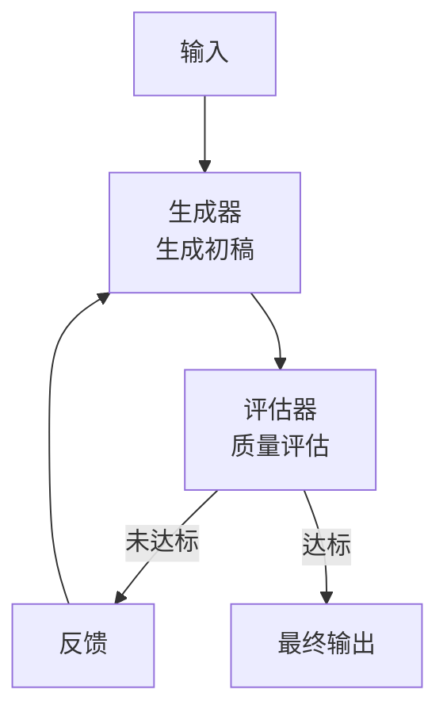
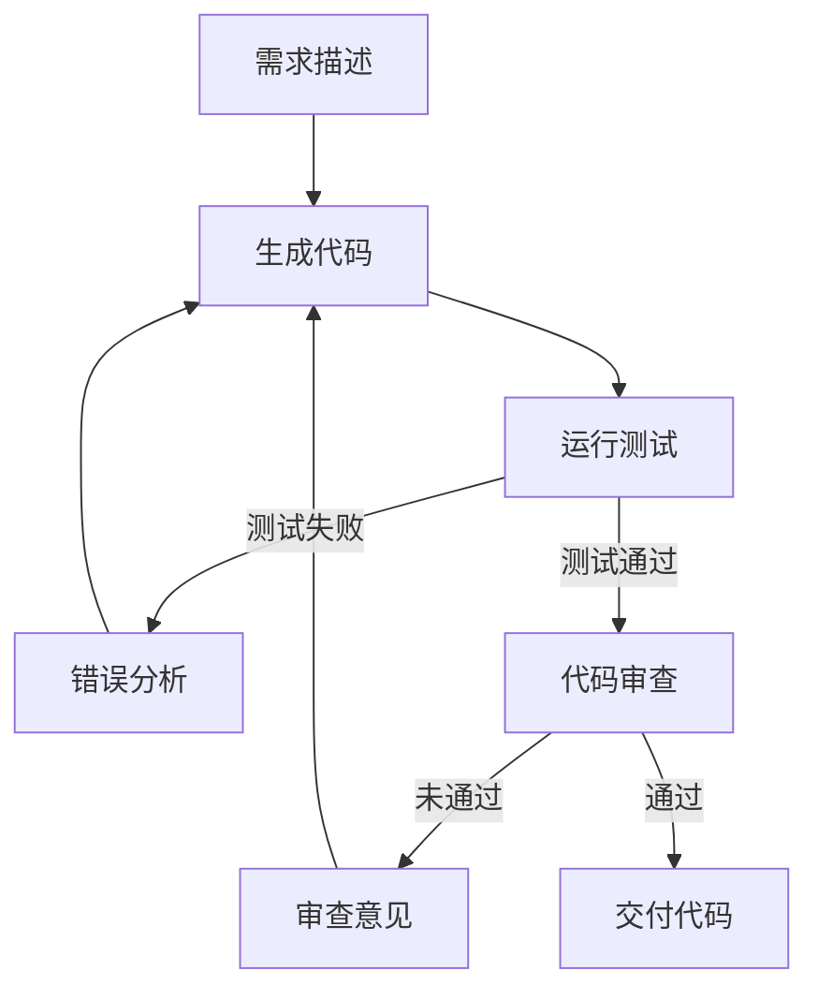
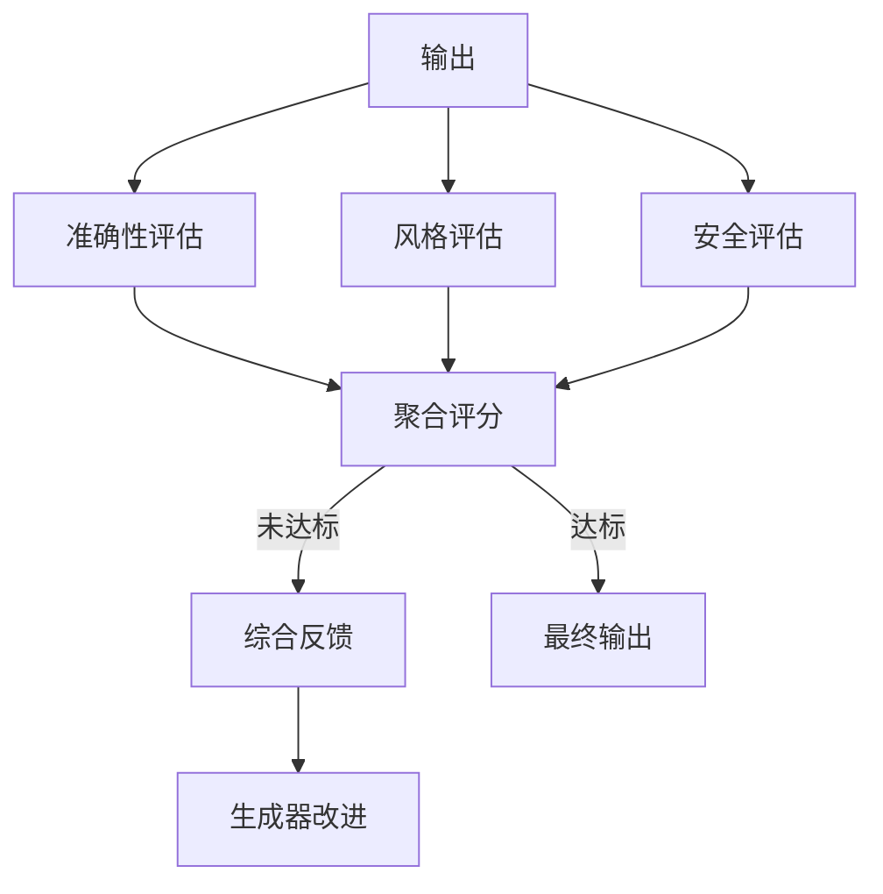

# 评估器-优化器（Evaluator-Optimizer）

## 定义

**评估器-优化器（Evaluator-Optimizer）** 是一种迭代优化模式：生成器（Generator）产出结果，评估器（Evaluator）检查质量并给出反馈，生成器根据反馈改进，循环直到满足质量标准。



## 适用场景

- 输出质量有明显可评估的标准
- 迭代改进可以持续提升质量
- 评估比生成更容易（或成本更低）
- 需要高质量输出的场景（代码、文档、翻译等）

## 典型示例：代码生成与修复



## 代码示例

### Python 实现

```python
class EvaluatorOptimizer:
    def __init__(self, generator_llm, evaluator_llm, max_iterations=5):
        self.generator = generator_llm
        self.evaluator = evaluator_llm
        self.max_iterations = max_iterations
    
    def generate(self, prompt: str, feedback: str = "") -> str:
        """生成内容，可选携带反馈"""
        full_prompt = prompt
        if feedback:
            full_prompt += f"\n\n之前的反馈：{feedback}"
        return self.generator.invoke(full_prompt)
    
    def evaluate(self, output: str, criteria: str) -> tuple[bool, str]:
        """评估输出，返回(是否通过, 反馈)"""
        eval_prompt = f"""评估以下输出是否满足标准。

标准：{criteria}

输出：
{output}

请判断：通过/未通过
改进建议："""
        
        result = self.evaluator.invoke(eval_prompt)
        passed = "通过" in result
        feedback = extract_feedback(result)
        return passed, feedback
    
    def run(self, prompt: str, criteria: str) -> str:
        """运行生成-评估循环"""
        output = self.generate(prompt)
        
        for i in range(self.max_iterations):
            passed, feedback = self.evaluate(output, criteria)
            if passed:
                return output
            
            output = self.generate(prompt, feedback)
        
        # 达到最大迭代次数，返回最佳结果
        return output
```

### 代码修复场景

```python
def generate_and_fix_code(requirement: str, test_cases: list) -> str:
    """生成代码并通过测试用例迭代修复"""
    
    code = llm.invoke(f"根据需求编写 Python 函数：\n{requirement}")
    
    for iteration in range(5):
        # 运行测试
        results = run_tests(code, test_cases)
        
        if all(r.passed for r in results):
            return code
        
        # 构建失败信息
        failures = "\n".join(
            f"测试：{r.test_name}\n错误：{r.error}"
            for r in results if not r.passed
        )
        
        # 修复代码
        fix_prompt = f"""修复以下代码以通过测试。

当前代码：
{code}

失败的测试：
{failures}

请修复代码，只返回修复后的完整代码。"""
        
        code = llm.invoke(fix_prompt)
    
    raise Exception("无法在最大迭代次数内修复代码")
```

## 变体：多维度评估



## 优缺点

| 优点 | 缺点 |
|------|------|
| 持续提升输出质量 | 延迟增加（多轮迭代） |
| 评估和生成可分离优化 | 可能陷入局部最优 |
| 质量有明确标准 | 评估标准本身可能不完美 |
| 适合对质量敏感的场景 | 成本随迭代次数增加 |

## 最佳实践

1. **评估标准要明确**：模糊的评估标准会导致迭代无效
2. **设置迭代上限**：防止无限循环，设置 max_iterations
3. **评估器要独立**：避免生成器和评估器是同一个模型（自评估偏差）
4. **渐进式评估**：先快速粗筛，再精细评估
5. **记录迭代历史**：便于分析改进路径和调试

## 与其他模式的关系

- **vs [[01-提示链|提示链]]**：提示链是线性执行，评估器-优化器是循环迭代
- **vs [[04-编排器-工作者|编排器-工作者]]**：编排器关注分解，评估器关注质量
- **vs [[06-ReAct|ReAct]]**：ReAct 每步都评估环境反馈，评估器-优化器评估自身输出

## 延伸阅读

- [[00-模式总览]] — 所有架构模式对比
- [[01-提示链]] — 线性执行模式
- [[06-ReAct]] — 推理-行动交替模式
