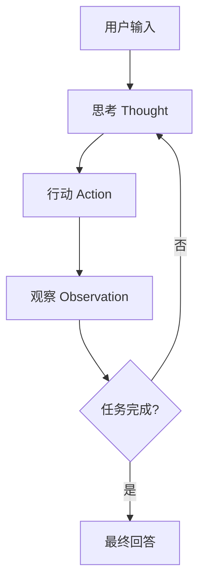
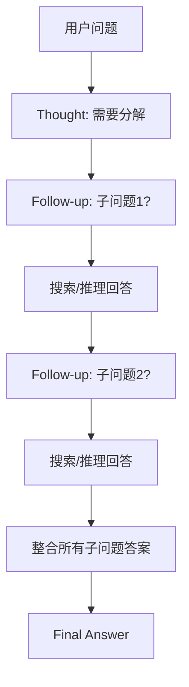

# ReAct（Reasoning + Acting）

## 定义

**ReAct** 是一种将**推理（Reasoning）**和**行动（Acting）**交错进行的 Agent 模式。LLM 在每一步先进行思考（Thought），然后决定行动（Action），观察结果（Observation），再继续思考，形成循环。



该模式由 Yao et al. (2022) 在 *ReAct: Synergizing Reasoning and Acting in Language Models* 中提出。核心洞察是：将推理轨迹与行动交织，比单独使用 Chain-of-Thought 或工具调用更能解决复杂任务，因为推理指导行动选择，而行动反馈又修正后续推理。

## 核心思想

ReAct 的核心洞察：

> **推理指导行动，行动反馈修正推理。**

与单纯依赖 LLM 内部知识回答不同，ReAct 让模型通过外部交互获取信息，显著提升准确性和事实性。每一步的 Thought 不是对最终答案的猜测，而是对"下一步该做什么"的元认知——这使得失败时可以从中间状态恢复，而非只能从头再来。

## 数学形式化

基于 Yao et al. (2022) 的原始定义，ReAct 可形式化为一个部分可观察马尔可夫决策过程（POMDP）的近似求解：

在时刻 $t$，Agent 的状态由历史轨迹 $\tau_t = [(a_1, o_1), (a_2, o_2), \dots, (a_{t-1}, o_{t-1})]$ 组成，其中 $a_i$ 为行动，$o_i$ 为观察。ReAct 通过 LLM 近似策略：

$$\text{Thought}_t, \text{Action}_t \sim \pi_{\text{LLM}}(\cdot \mid q, \tau_t)$$

其中 $q$ 是用户原始查询。每一步采样：

1. **推理**：$r_t \sim \pi(\cdot \mid q, \tau_t)$ —— LLM 生成 Thought
2. **行动**：$a_t \sim \pi(\cdot \mid q, \tau_t, r_t)$ —— 基于 Thought 选择行动
3. **观察**：$o_t = \mathcal{E}(a_t)$ —— 环境/工具执行返回观察
4. **循环**：$\tau_{t+1} = \tau_t \oplus (a_t, o_t)$

当 Action 为 `Finish[answer]` 时终止。这个框架的关键在于：Thought 充当了**信念状态**（belief state）的文本化表示，使 LLM 能在部分可观察环境中进行有效的行动选择。

## 完整推理链示例

以下是一个真实的多步复杂任务——"苹果公司 2024 年的研发支出占总收入的比例是多少？"——的完整 ReAct 轨迹：

```text
Question: 苹果公司 2024 年的研发支出占总收入的比例是多少？

Thought 1: 我需要找到苹果公司 2024 年的两个数据：
1) 年度总收入（Total Revenue）
2) 年度研发支出（R&D Expenditure）
然后计算 R&D / Revenue 的比例。
我应该先搜索苹果公司 2024 财报数据。
Action 1: search[Apple Inc 2024 annual report revenue R&D]
Observation 1: Apple Inc. FY2024 (ended Sep 28, 2024) — 
Total Net Sales: $391.04 billion; Research and Development: $31.37 billion

Thought 2: 已获取关键数据：
- 总收入（Net Sales）= $391.04 billion
- 研发支出（R&D）= $31.37 billion
需要计算比例：31.37 / 391.04
Action 2: calculator[31.37 / 391.04]
Observation 2: 0.080221358...

Thought 3: 计算结果为约 0.0802，即 8.02%。
需要确认这是否是最新数据，以及 "Net Sales" 是否等同于 "总收入"。
在苹果财报中，Net Sales 是主要收入指标，可以视为总收入。
Action 3: search[Apple FY2024 total revenue vs net sales definition]
Observation 3: Apple's income statement shows "Total net sales" as the primary revenue figure, with no separate "total revenue" line. Net sales = $391.035B for FY2024.

Thought 4: 确认完毕。使用 Net Sales $391.035 billion 和 R&D $31.37 billion 计算：
31.37 / 391.035 = 0.08022 = 8.02%
数据来自苹果官方 FY2024 财报（截至 2024 年 9 月 28 日）。
Action 4: Finish[苹果公司 2024 财年（截至 2024 年 9 月 28 日）研发支出为 313.7 亿美元，占总收入（净销售额 3910.4 亿美元）的约 8.02%。]
```

这个例子展示了 ReAct 的几个关键能力：
- **自我纠错**：Thought 3 主动验证 "Net Sales" 是否等于 "总收入"，而非盲目接受初始假设
- **工具组合**：搜索引擎获取事实，计算器做精确运算，搜索引擎再次验证
- **渐进式收敛**：每一步只推进一小部分，避免一次性推理过长导致的错误累积

## 与 Chain-of-Thought 的本质区别

| 维度 | Chain-of-Thought (CoT) | ReAct |
|------|------------------------|-------|
| 推理与行动的关系 | 纯内部推理，无外部交互 | 推理与外部行动交织 |
| 知识来源 | 仅 LLM 参数化知识 | 参数知识 + 外部工具/环境 |
| 错误恢复 | 推理链一旦出错无法修正 | 每步观察可触发推理修正 |
| 适用任务 | 数学推理、逻辑谜题、常识问答 | 需要实时信息、多工具协作的任务 |
| 幻觉风险 | 高（编造中间事实） | 低（事实通过工具验证） |
| 延迟 | 单次推理 | 多轮交互，延迟显著更高 |
| 成本 | 单次 API 调用 | 多步调用，成本累加 |

### 何时 CoT 足够，何时必须 ReAct

**选择 CoT 的场景：**
- 问题答案完全包含在 LLM 预训练知识中（如数学证明、代码逻辑分析）
- 任务不涉及需要实时性的外部信息
- 延迟敏感，无法接受多轮交互开销
- 工具生态不完善，或调用成本过高

**必须选择 ReAct 的场景：**
- 答案依赖实时或私有数据（股价、天气、内部数据库）
- 任务需要多工具协同（先搜索再计算再格式化）
- 需要验证的事实可能超出模型知识截止日期
- 任务允许渐进式探索（如"帮我研究某个陌生领域"）

**关键原则**：如果任务可以通过一次高质量 CoT 提示解决，不要引入 ReAct 的复杂性和开销。ReAct 的价值在于**将任务分解为需要外部验证的子问题**，而非简单地增加思考步骤。

## 代码示例

### 基础实现

```python
import re
from dataclasses import dataclass
from typing import Callable, Protocol

class LLM(Protocol):
    def invoke(self, prompt: str) -> str: ...

@dataclass
class Tool:
    name: str
    description: str
    func: Callable[[str], str]

    def run(self, query: str) -> str:
        try:
            return str(self.func(query))
        except Exception as e:
            return f"Error: {type(e).__name__}: {e}"

class ReActAgent:
    FINAL_ANSWER = "Final Answer:"
    
    def __init__(self, llm: LLM, tools: list[Tool], max_steps: int = 10):
        self.llm = llm
        self.tools = {t.name: t for t in tools}
        self.max_steps = max_steps
        self._pattern = re.compile(
            r"Thought:\s*(.+?)\nAction:\s*(.+?)(?:\n|$)",
            re.DOTALL | re.IGNORECASE
        )
    
    def _build_prompt(self, query: str) -> str:
        tool_desc = "\n".join(
            f"- {name}: {tool.description}"
            for name, tool in self.tools.items()
        )
        return f"""Solve the following task by alternating between Thought and Action.
You have access to these tools:
{tool_desc}

Use this exact format:
Thought: [your reasoning about what to do next]
Action: [ToolName[query]] or Final Answer: [your answer]

Task: {query}

Begin:
"""
    
    def _parse_response(self, response: str) -> tuple[str, str]:
        match = self._pattern.search(response)
        if not match:
            # Fallback: if LLM deviates from format, treat entire response as thought
            # and ask for a properly formatted action
            return response.strip(), ""
        return match.group(1).strip(), match.group(2).strip()
    
    def _parse_action(self, action: str) -> tuple[str, str]:
        # Parse "ToolName[argument]" format
        match = re.match(r"(\w+)\[(.*)\]", action)
        if not match:
            raise ValueError(f"Invalid action format: {action}")
        return match.group(1), match.group(2)
    
    def run(self, query: str) -> str:
        prompt = self._build_prompt(query)
        history: list[str] = []
        
        for step in range(self.max_steps):
            full_prompt = prompt + "\n".join(history) + "\nThought:"
            response = "Thought: " + self.llm.invoke(full_prompt)
            
            thought, action = self._parse_response(response)
            
            if not action:
                history.append(f"Thought: {thought}")
                history.append("Observation: Error - Could not parse action. Please use format 'Action: ToolName[argument]' or 'Action: Final Answer: ...'")
                continue
            
            if action.startswith(self.FINAL_ANSWER):
                return action[len(self.FINAL_ANSWER):].strip()
            
            # Execute tool
            try:
                tool_name, tool_input = self._parse_action(action)
                if tool_name not in self.tools:
                    observation = f"Error: Unknown tool '{tool_name}'. Available: {list(self.tools.keys())}"
                else:
                    observation = self.tools[tool_name].run(tool_input)
            except ValueError as e:
                observation = f"Error: {e}. Use format: ToolName[argument]"
            except Exception as e:
                observation = f"Error executing action: {type(e).__name__}: {e}"
            
            history.append(f"Thought: {thought}")
            history.append(f"Action: {action}")
            history.append(f"Observation: {observation}")
        
        return f"Reached max steps ({self.max_steps}). Partial history:\n" + "\n".join(history)
```

### LangChain ReAct Agent

```python
from langchain.agents import create_react_agent, AgentExecutor
from langchain.tools import Tool
from langchain import hub

# 定义工具
tools = [
    Tool(name="search", func=search, description="搜索引擎，用于查找事实信息"),
    Tool(name="calculator", func=calc, description="计算器，执行数学表达式"),
    Tool(name="weather", func=get_weather, description="获取指定城市和日期的天气"),
]

# 使用 LangChain Hub 的标准 ReAct prompt
react_prompt = hub.pull("hwchase17/react")

# 创建 ReAct Agent
agent = create_react_agent(llm, tools, react_prompt)
executor = AgentExecutor(
    agent=agent,
    tools=tools,
    verbose=True,
    max_iterations=15,
    handle_parsing_errors=True,  # 关键：处理 LLM 输出格式错误
    return_intermediate_steps=True,  # 返回完整推理链用于调试
)

# 运行
result = executor.invoke({
    "input": "苹果公司 2024 年研发支出占总收入的比例是多少？"
})
print(result["output"])
```

### 生产级增强：带循环检测与超时

```python
import time
from collections import Counter

class ProductionReActAgent(ReActAgent):
    def __init__(self, *args, similarity_threshold: float = 0.85, 
                 max_time_sec: float = 60.0, **kwargs):
        super().__init__(*args, **kwargs)
        self.similarity_threshold = similarity_threshold
        self.max_time_sec = max_time_sec
    
    def _detect_loop(self, thoughts: list[str]) -> bool:
        """检测是否陷入循环：连续相似 thought 出现超过阈值"""
        if len(thoughts) < 4:
            return False
        # 简化检测：检查最近 4 个 thought 中是否有重复
        recent = [t.lower() for t in thoughts[-4:]]
        counts = Counter(recent)
        return any(c >= 2 for c in counts.values())
    
    def run(self, query: str) -> dict:
        start = time.time()
        prompt = self._build_prompt(query)
        history: list[str] = []
        thoughts: list[str] = []
        
        for step in range(self.max_steps):
            if time.time() - start > self.max_time_sec:
                return {
                    "success": False,
                    "answer": None,
                    "error": "timeout",
                    "history": history,
                    "steps": step,
                }
            
            full_prompt = prompt + "\n".join(history) + "\nThought:"
            response = "Thought: " + self.llm.invoke(full_prompt)
            thought, action = self._parse_response(response)
            thoughts.append(thought)
            
            if self._detect_loop(thoughts):
                return {
                    "success": False,
                    "answer": None,
                    "error": "loop_detected",
                    "history": history,
                    "steps": step,
                }
            
            if action.startswith(self.FINAL_ANSWER):
                return {
                    "success": True,
                    "answer": action[len(self.FINAL_ANSWER):].strip(),
                    "history": history,
                    "steps": step + 1,
                }
            
            try:
                tool_name, tool_input = self._parse_action(action)
                observation = self.tools[tool_name].run(tool_input) if tool_name in self.tools else f"Unknown tool: {tool_name}"
            except Exception as e:
                observation = f"Error: {e}"
            
            history.append(f"Thought: {thought}")
            history.append(f"Action: {action}")
            history.append(f"Observation: {observation}")
        
        return {
            "success": False,
            "answer": None,
            "error": "max_steps_reached",
            "history": history,
            "steps": self.max_steps,
        }
```

## 失败模式分析

### 1. 循环陷阱（Loop Trap）

**表现**：Agent 反复执行相同的 Thought/Action 组合，无法前进。

```text
Thought: 搜索没有返回结果，我再试一次不同的关键词
Action: search[Apple revenue 2024]
Observation: No results found

Thought: 搜索没有返回结果，我再试一次不同的关键词
Action: search[Apple revenue 2024]
Observation: No results found
...（循环）
```

**根因**：
- LLM 缺乏对历史轨迹的记忆压缩，每次只看到最近几步
- Prompt 中没有明确禁止重复行动的指令
- 工具本身存在固有限制（如搜索 API 返回空），但 Agent 没有识别

**修复方案**：
```python
# 在 prompt 中显式禁止重复行动
loop_prevention = """
Important: Before taking an action, check if you have already tried 
this exact action in a previous step. If yes, try a DIFFERENT approach.
Previously tried actions: {past_actions}
"""

# 实现层面：如 ProductionReActAgent 中的 _detect_loop 方法
# 当检测到循环时，注入特殊提示要求 Agent 改变策略
```

### 2. 错误行动恢复（Error Recovery）

**表现**：工具调用失败（如 API 超时、参数错误），Agent 不知道如何处理错误 Observation。

**根因**：
- 错误 Observation 未结构化，LLM 难以解析
- Prompt 未训练 Agent 面对错误时的应对策略

**修复方案**：
```python
# 工具层统一错误格式
class Tool:
    def run(self, query: str) -> str:
        try:
            result = self.func(query)
            return json.dumps({"status": "ok", "data": result})
        except Exception as e:
            return json.dumps({
                "status": "error",
                "error_type": type(e).__name__,
                "message": str(e),
                "suggestion": self._suggest_fix(e)
            })
    
    def _suggest_fix(self, e: Exception) -> str:
        # 为常见错误提供修复提示
        if isinstance(e, ValueError):
            return "Check your input format and try again."
        if isinstance(e, TimeoutError):
            return "The service is slow. Try a simpler query or wait."
        return "Try a different approach."
```

### 3. 幻觉调用（Hallucinated Tool Call）

**表现**：LLM 调用了一个不存在的工具，或编造了工具参数格式。

```text
Thought: 我需要查询数据库
Action: query_database[SELECT * FROM users]  # 实际上没有 query_database 工具
```

**修复方案**：
```python
# 1. Prompt 中严格枚举可用工具
# 2. 解析失败时重试并给出纠正提示
def _parse_action(self, action: str) -> tuple[str, str]:
    match = re.match(r"(\w+)\[(.*)\]", action)
    if not match:
        available = ", ".join(self.tools.keys())
        raise ValueError(
            f"Invalid format '{action}'. "
            f"Use: ToolName[argument]. Available tools: {available}"
        )
    return match.group(1), match.group(2)

# 3. LangChain 的 handle_parsing_errors=True 会自动捕获并重新提示
```

## 改进变体

### ReAct + Self-Ask

Self-Ask（Press et al., 2022）在 ReAct 的基础上增加了**显式的问题分解**：Agent 不仅思考下一步行动，还会主动提出子问题，然后自己回答这些子问题。



适用场景：问题本身包含多个需要分别验证的隐含子问题。例如"2024 年诺贝尔奖得主中谁的年龄最大？"需要先列出所有得主，再分别查年龄，最后比较。

### ReAct + Reflexion

Reflexion（Shinn et al., 2023）为 ReAct 增加了**自我反思层**。每次任务结束后（无论成功或失败），Agent 生成一个文本化的经验总结（`reflection`），存储到记忆库中，供未来任务参考。

```python
class ReflexionAgent(ReActAgent):
    def __init__(self, *args, **kwargs):
        super().__init__(*args, **kwargs)
        self.reflections: list[str] = []
    
    def run(self, query: str) -> dict:
        # 在 prompt 中注入历史 reflections
        # ... 标准 ReAct 执行 ...
        
        # 任务结束后生成 reflection
        reflection_prompt = f"""Based on the task execution history below,
generate a concise lesson learned (1-2 sentences) that would help 
improve performance on similar future tasks.

History:
{chr(10).join(history)}

Reflection:"""
        
        reflection = self.llm.invoke(reflection_prompt).strip()
        self.reflections.append(reflection)
        return result
```

关键优势：从失败中学习。如果某次任务因选择了错误的搜索关键词而失败，Reflexion 会记录"对于公司财务数据，优先使用官方 investor relations 站点而非通用搜索"，避免未来重复犯错。

## 生产环境部署考量

### 延迟优化

ReAct 的本质延迟 = N × (LLM 推理延迟 + 工具调用延迟)，其中 N 是步数。典型优化策略：

| 策略 | 做法 | 效果 | 代价 |
|------|------|------|------|
| **步数上限** | 设置 `max_iterations=5-10` | 消除无限循环 | 可能截断合法长链 |
| **流式输出** | 解析 Thought 的同时开始准备 Action | 减少用户感知延迟 | 实现复杂度增加 |
| **工具并行** | 单步中并行调用独立工具 | 减少等待串行工具的时间 | 需要依赖分析 |
| **模型降级** | 简单推理步用小模型，复杂步用大模型 | 降低平均成本 | 路由判断需要额外开销 |
| **Prompt 缓存** | 系统 prompt + 工具描述保持不变 | 利用供应商的 prompt caching | 仅部分供应商支持 |

### 成本控制

以 GPT-4o 为例，假设每步 500 tokens 输入 + 100 tokens 输出，平均 5 步完成：

- 输入成本：5 × 500 × $2.50/1M = $0.00625
- 输出成本：5 × 100 × $10/1M = $0.005
- **总计：约 $0.011 / 请求**

对比 CoT（单次 1000 input + 200 output）：
- 总计约 $0.0045 / 请求

**ReAct 成本约为 CoT 的 2-3 倍**，但准确率提升通常值得这个溢价。在高吞吐量场景中，可以考虑：

1. **缓存常见查询**：对高频问题（如"今天天气"）直接返回缓存结果，跳过 ReAct
2. **意图分类前置**：先用轻量模型判断是否需要工具，纯知识问题直接 CoT 回答
3. **批量工具调用**：如果多步工具调用无依赖，合并为一步并行执行

### 可靠性工程

```python
from tenacity import retry, stop_after_attempt, wait_exponential

class ReliableTool:
    @retry(
        stop=stop_after_attempt(3),
        wait=wait_exponential(multiplier=1, min=2, max=10),
        retry=lambda e: isinstance(e, (TimeoutError, ConnectionError))
    )
    def run(self, query: str) -> str:
        # 工具实现，自动重试临时失败
        return self._call_api(query)

# Agent 层面：健康检查与熔断
class CircuitBreaker:
    def __init__(self, failure_threshold: int = 5, recovery_timeout: float = 30.0):
        self.failure_threshold = failure_threshold
        self.recovery_timeout = recovery_timeout
        self.failures = 0
        self.last_failure_time: float | None = None
        self.state = "closed"  # closed, open, half-open
    
    def call(self, func: Callable, *args, **kwargs):
        if self.state == "open":
            if time.time() - self.last_failure_time > self.recovery_timeout:
                self.state = "half-open"
            else:
                raise RuntimeError("Circuit breaker is OPEN")
        
        try:
            result = func(*args, **kwargs)
            if self.state == "half-open":
                self.state = "closed"
                self.failures = 0
            return result
        except Exception as e:
            self.failures += 1
            self.last_failure_time = time.time()
            if self.failures >= self.failure_threshold:
                self.state = "open"
            raise e
```

## 真实案例：OpenAI 函数调用如何实现 ReAct 语义

OpenAI 的 Function Calling（以及后续模型中的 `tools` 参数）在 API 层面实现了 ReAct 的核心语义，但做了工程化封装：

```python
from openai import OpenAI

client = OpenAI()

# 定义工具（对应 ReAct 中的可用 Action）
tools = [
    {
        "type": "function",
        "function": {
            "name": "search",
            "description": "Search for information",
            "parameters": {
                "type": "object",
                "properties": {
                    "query": {"type": "string"}
                },
                "required": ["query"]
            }
        }
    }
]

# 第一轮：模型生成 "function call"（即 ReAct 的 Action）
response = client.chat.completions.create(
    model="gpt-4o",
    messages=[
        {"role": "user", "content": "2024 年诺贝尔物理学奖得主是谁？"}
    ],
    tools=tools,
    tool_choice="auto"
)

# 模型输出 tool_calls（Action）
message = response.choices[0].message
if message.tool_calls:
    tool_call = message.tool_calls[0]
    # 执行工具（Observation）
    observation = execute_tool(tool_call.function.name, 
                               tool_call.function.arguments)
    
    # 第二轮：将 Observation 返回给模型
    response2 = client.chat.completions.create(
        model="gpt-4o",
        messages=[
            {"role": "user", "content": "2024 年诺贝尔物理学奖得主是谁？"},
            {"role": "assistant", "content": None, "tool_calls": message.tool_calls},
            {"role": "tool", "tool_call_id": tool_call.id, "content": observation}
        ],
        tools=tools
    )
    # 模型生成最终答案
    print(response2.choices[0].message.content)
```

**对应关系**：

| ReAct 概念 | OpenAI Function Calling |
|-----------|------------------------|
| Thought | 模型的内部推理（不暴露为文本） |
| Action | `tool_calls` 数组 |
| Observation | `role: "tool"` 的消息 |
| Final Answer | 不带 `tool_calls` 的普通 assistant 消息 |
| 可用工具 | `tools` 参数中的 JSON Schema |

OpenAI 的实现将 Thought 隐藏在模型内部（通过 system prompt 和训练实现），只暴露 Action/Observation 接口。这使得 API 更简洁，但也降低了可解释性——你无法直接看到模型"在想什么"。

## 反模式与修复

### 反模式 1：工具描述过于笼统

```python
# 错误
Tool(name="search", func=search, description="搜索工具")

# 正确
Tool(name="search", func=search, 
     description="通用网络搜索引擎。输入为自然语言查询字符串，"
                 "返回网页摘要列表。适用于查找事实、人物、事件、"
                 "最新新闻。不适用于数学计算或代码执行。")
```

LLM 的工具选择完全依赖描述文本。模糊描述导致错误选择，清晰描述本身就是一种"软路由"。

### 反模式 2：Observation 非结构化

```python
# 错误：返回原始 HTML 或超大 JSON
Observation: <html><body><div>...10000 chars...</div></body></html>

# 正确：提取关键信息，结构化呈现
Observation: {"status": "ok", "results": [
    {"title": "Apple FY2024 Report", "snippet": "Net Sales: $391.04B", "url": "..."}
]}
```

### 反模式 3：Prompt 中缺乏 Few-shot 示例

ReAct 对格式高度敏感。对于能力较弱的模型（如 GPT-3.5、Claude 3 Haiku），在 prompt 中提供 1-2 个正确格式的示例能显著提升遵循率。

```python
few_shot = """
Example 1:
Question: What is the capital of France?
Thought: I need to find the capital city of France.
Action: search[capital of France]
Observation: The capital of France is Paris.
Thought: I have found the answer.
Action: Final Answer: Paris

Now solve the real task:
"""
```

## 设计权衡

### ReAct vs Plan-and-Execute

| 维度 | ReAct | Plan-and-Execute |
|------|-------|-----------------|
| 规划时机 | 边执行边规划 | 先全局规划 |
| 适用任务 | 短程、工具密集型、探索性 | 长程、复杂多步、目标明确 |
| 透明度 | 逐步可见 | 全局计划可见 |
| 灵活性 | 高（每步可转向） | 中（需要重规划） |
| 效率 | 每步都推理，Token 消耗高 | 规划一次，执行多次 |
| 可靠性 | 单步失败可局部恢复 | 单步失败可能需全局重规划 |

### 推理深度 vs 延迟

更深的推理（更长的 Thought）通常带来更准确的行动选择，但增加每步的 Token 消耗和延迟。实践中：

- **简单工具调用**：Thought 控制在 1-2 句话（如"需要查天气"）
- **复杂推理**：允许多句分析（如"A 数据与 B 数据矛盾，优先采信 A，因为..."）
- **成本敏感场景**：在 prompt 中明确要求"保持 Thought 简洁，不超过 30 个词"

## 与其他模式的关系

- **vs [[01-提示链|提示链]]**：提示链是预定义步骤，ReAct 是动态推理
- **vs [[07-Plan-and-Execute|Plan-and-Execute]]**：ReAct 边推理边执行，Plan-and-Execute 先规划再执行
- **vs [[08-自主Agent|自主Agent]]**：ReAct 是结构化循环，自主 Agent 更自由
- **vs [[05-评估器-优化器|评估器-优化器]]**：ReAct 在执行中隐式评估，评估器-优化器是显式评估-修正分离

## 延伸阅读

- [[00-模式总览]] — 所有架构模式对比
- [[07-Plan-and-Execute]] — 先规划后执行的变体
- [[01-工具设计]] — 如何设计好的 Agent 工具
- [ReAct: Synergizing Reasoning and Acting in Language Models](https://arxiv.org/abs/2210.03629) — Yao et al., 2022
- [Self-Ask](https://arxiv.org/abs/2210.03350) — Press et al., 2022
- [Reflexion](https://arxiv.org/abs/2303.11366) — Shinn et al., 2023
- [LangChain ReAct Documentation](https://python.langchain.com/docs/modules/agents/agent_types/react)
