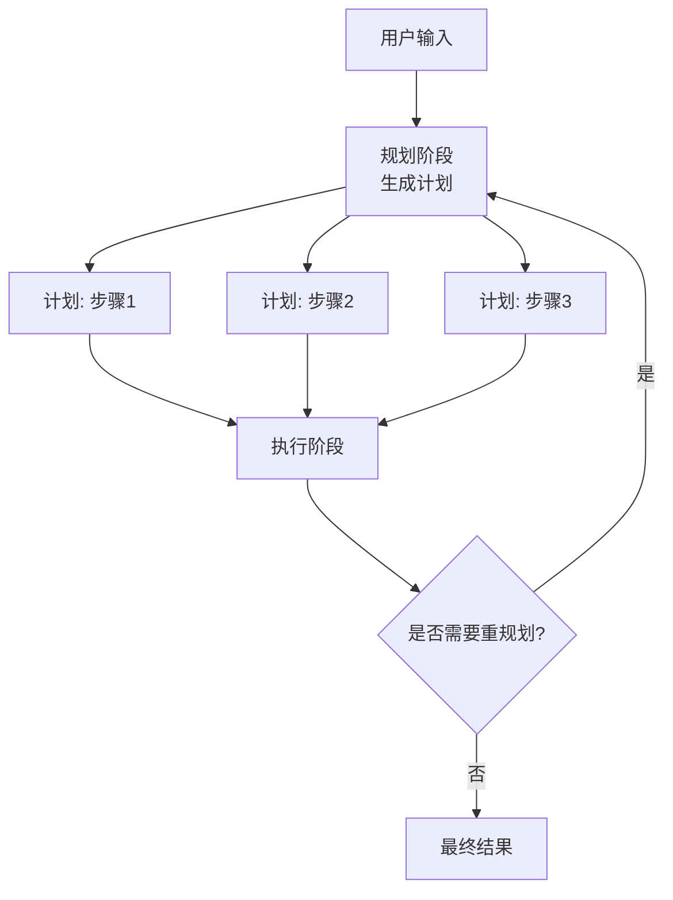
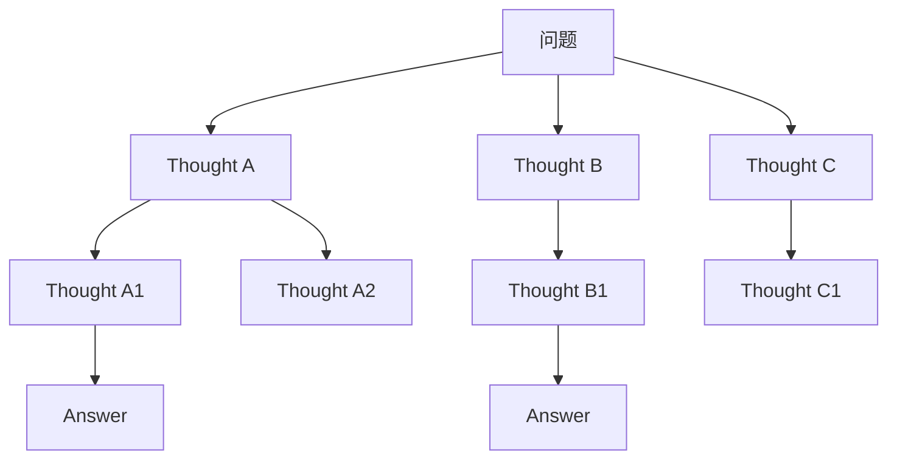
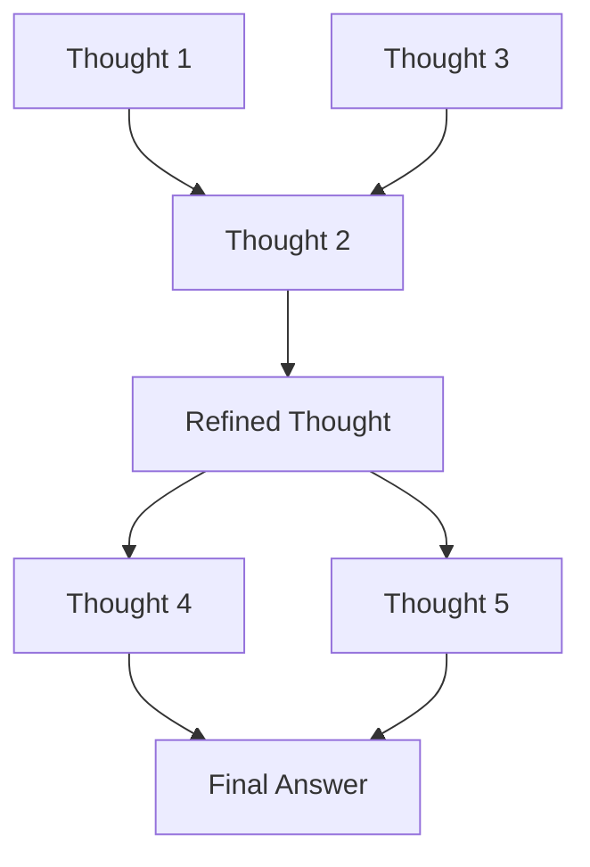

# Plan-and-Execute（先规划后执行）

## 定义

**Plan-and-Execute** 是一种两阶段 Agent 模式：第一阶段由 LLM 制定完整执行计划，第二阶段按步骤执行计划，执行过程中可根据反馈动态调整。



与 [[06-ReAct|ReAct]] 的"边想边做"不同，Plan-and-Execute 的核心假设是：**对于结构清晰的多步任务，全局规划能避免局部最优，且计划本身对用户具有价值**。规划阶段输出的是一个可审查、可修改的中间产物——这是它与纯反应式 Agent 的本质差异。

## 适用场景

- 任务需要多步完成且步骤关系复杂（存在依赖、并行、条件分支）
- 需要全局视角规划，而非局部最优（如资源分配、路径规划）
- 执行过程中可能遇到意外需要调整，但调整频率不高
- 计划本身对用户有价值（可展示进度、支持人工审批）
- 需要预计算成本/时间预算（如"这个任务预计需要多少步/多少钱"）

## 经典 AI 规划与现代 LLM 规划的对比

Plan-and-Execute 并非 LLM 时代的发明。AI 规划社区从 1970 年代起就发展了严格的规划形式体系。理解这些基础有助于判断何时应该用形式化规划器，何时用 LLM 规划。

### STRIPS（1971）

STRIPS（Stanford Research Institute Problem Solver）定义了经典规划的基础表示：

- **状态**：一组逻辑命题的合取（如 `At(Agent, Home) ∧ Have(Money)`）
- **动作**：前提条件（Precondition）+ 删除列表（Delete List）+ 添加列表（Add List）
- **目标**：目标命题的合取
- **规划器**：搜索从初始状态到目标状态的动作序列

```
Action: Go(x, y)
  Precondition: At(Agent, x)
  Delete: At(Agent, x)
  Add: At(Agent, y)
```

**优点**：规划结果可严格验证（定理证明器可证正确性）；搜索空间可控时效率极高。

**局限**：需要人类将问题精确建模为逻辑命题；无法处理不确定性、自然语言输入、开放域知识。

### PDDL（1998–至今）

PDDL（Planning Domain Definition Language）是 STRIPS 的扩展标准，增加了：

- 类型系统与层次化对象
- 条件效果与派生谓词
- 时序规划（durative actions）
- 数值约束（资源、成本）

```lisp
(:action drive
  :parameters (?truck ?from ?to)
  :precondition (and (at ?truck ?from) (road ?from ?to))
  :effect (and (not (at ?truck ?from)) (at ?truck ?to)
               (increase (total-cost) (distance ?from ?to))))
```

**优点**：表达能力覆盖工业级规划问题（物流、航天、调度）；有大量高效求解器（Fast Downward、FF、LAMA）。

**局限**：建模成本极高；对自然语言描述的输入完全不兼容；无法利用 LLM 的常识推理填补建模缺口。

### LLM 规划（2022–至今）

LLM 将规划问题从"形式化建模 + 搜索"转变为"自然语言描述 + 生成"。

| 维度 | 经典规划（STRIPS/PDDL） | LLM 规划 |
|------|------------------------|---------|
| 输入形式 | 严格的逻辑/代数描述 | 自然语言 + 部分结构化提示 |
| 知识来源 | 人工建模的领域知识 | LLM 预训练知识 + 实时工具 |
| 正确性保证 | 可形式化验证 | 启发式正确，无严格保证 |
| 领域迁移 | 需重新建模 | 通过 prompt 调整即可 |
| 处理不确定性 | 需显式建模（概率 PDDL） | 自然语言描述即可 |
| 计算复杂度 | NP-hard，但求解器高度优化 | 线性生成，但质量不稳定 |

**核心结论**：经典规划器在**建模充分、目标明确、环境确定性高**的场景下仍然更可靠；LLM 规划在**开放域、快速原型、需求模糊**的场景下更有优势。混合架构（LLM 将自然语言翻译为 PDDL，再用 Fast Downward 求解）是当前研究前沿。

## 规划表示法

### 自然语言计划

最灵活，但对执行器的解析要求高。

```text
Plan:
1. 搜索苹果公司 2024 财年财报中的总收入数据
2. 在同一财报中查找研发支出数据
3. 用计算器计算研发支出除以总收入的比例
4. 将结果格式化为百分比并给出数据来源
```

**优点**：LLM 生成最自然；人类可读性最佳；易于在 prompt 中直接要求模型输出。

**缺点**：执行器需要理解自然语言才能映射到具体工具；结构歧义（"在同一财报中"依赖前一步的上下文）；难以自动化验证计划结构的完整性。

### 结构化计划（JSON）

```json
{
  "plan_id": "apple-rd-ratio-2024",
  "steps": [
    {
      "id": 1,
      "description": "获取苹果公司 2024 财年总收入",
      "tool": "search",
      "tool_input": "Apple FY2024 total net sales revenue",
      "depends_on": [],
      "expected_output_type": "numeric_with_unit"
    },
    {
      "id": 2,
      "description": "获取苹果公司 2024 财年研发支出",
      "tool": "search",
      "tool_input": "Apple FY2024 R&D expenditure",
      "depends_on": [],
      "expected_output_type": "numeric_with_unit"
    },
    {
      "id": 3,
      "description": "计算比例",
      "tool": "calculator",
      "tool_input": "{step1.result} / {step2.result}",
      "depends_on": [1, 2],
      "expected_output_type": "percentage"
    }
  ]
}
```

**优点**：机器可解析；支持依赖声明（`depends_on`）；执行器可直接按图执行；便于静态验证（检查所有依赖是否声明、是否有循环依赖）。

**缺点**：LLM 生成 JSON 时容易出格式错误（尤其是嵌套结构）；需要额外的 JSON schema 约束；对 LLM 的指令遵循能力要求更高。

### PDDL 风格计划

对于已有形式化建模的领域，LLM 可直接生成 PDDL 动作序列或高层操作（HLA, High-Level Action）计划。

```lisp
(define (plan apple-analysis)
  (:steps
    (search :query "Apple FY2024 revenue")
    (search :query "Apple FY2024 R&D")
    (calculate :expr "(/ R&D revenue)")
    (format :type "percentage")))
```

**优点**：与经典规划器无缝集成；可利用已有领域模型；计划可验证。

**缺点**：需要预先存在的 PDDL 领域文件；对 LLM 要求极高（需理解 PDDL 语法）。

**推荐**：对于大多数 LLM Agent 场景，**JSON 结构化计划**是最佳平衡点。自然语言计划适合原型阶段，PDDL 计划适合与经典规划器混合的工业场景。

## 代码示例

### 基础实现

```python
from dataclasses import dataclass, field
from typing import Any, Protocol
import json

class LLM(Protocol):
    def invoke(self, prompt: str) -> str: ...

@dataclass
class PlanStep:
    id: int
    description: str
    tool: str | None
    tool_input: str = ""
    depends_on: list[int] = field(default_factory=list)
    status: str = "pending"  # pending, running, completed, failed
    result: Any = None
    error: str | None = None

@dataclass
class Plan:
    plan_id: str
    steps: list[PlanStep]

class PlanAndExecuteAgent:
    def __init__(self, planner_llm: LLM, executor_llm: LLM, 
                 tools: dict[str, callable], max_replans: int = 3):
        self.planner = planner_llm
        self.executor = executor_llm
        self.tools = tools
        self.max_replans = max_replans

    def plan(self, task: str, context: str = "") -> Plan:
        """生成结构化执行计划"""
        schema = json.dumps({
            "plan_id": "string",
            "steps": [
                {
                    "id": "integer (1-based)",
                    "description": "string: what this step does",
                    "tool": "string or null: tool name from available tools",
                    "tool_input": "string: input to the tool",
                    "depends_on": ["integers: step IDs this depends on"]
                }
            ]
        }, indent=2)

        tool_list = "\n".join(f"- {n}: {f.__doc__ or 'no description'}" 
                              for n, f in self.tools.items())
        
        prompt = f"""You are a task planner. Break down the given task into executable steps.
Available tools:
{tool_list}

{context}

Return ONLY a JSON object matching this schema:
{schema}

Task: {task}

Plan (JSON only, no markdown):"""
        
        response = self.planner.invoke(prompt).strip()
        # 处理 markdown 代码块包裹
        if response.startswith("```"):
            response = response.split("\n", 1)[1].rsplit("\n```", 1)[0]
        
        data = json.loads(response)
        steps = [PlanStep(**s) for s in data["steps"]]
        return Plan(plan_id=data.get("plan_id", "plan"), steps=steps)

    def _validate_plan(self, plan: Plan) -> list[str]:
        """静态验证计划结构"""
        errors = []
        step_ids = {s.id for s in plan.steps}
        for s in plan.steps:
            for dep in s.depends_on:
                if dep not in step_ids:
                    errors.append(f"Step {s.id} depends on non-existent step {dep}")
            if s.tool and s.tool not in self.tools:
                errors.append(f"Step {s.id} uses unknown tool '{s.tool}'")
        # 检查循环依赖
        visited, rec_stack = set(), set()
        def has_cycle(sid: int) -> bool:
            visited.add(sid)
            rec_stack.add(sid)
            step = next((s for s in plan.steps if s.id == sid), None)
            if step:
                for dep in step.depends_on:
                    if dep not in visited:
                        if has_cycle(dep):
                            return True
                    elif dep in rec_stack:
                        return True
            rec_stack.remove(sid)
            return False
        for s in plan.steps:
            if s.id not in visited:
                if has_cycle(s.id):
                    errors.append("Circular dependency detected")
        return errors

    def execute_step(self, step: PlanStep, results: dict[int, Any]) -> Any:
        """执行单个步骤"""
        if step.tool is None:
            # 纯推理步骤，用 executor LLM 处理
            prompt = f"""Execute this step based on previous results.
Step: {step.description}
Previous results: {results}
Provide a concise result."""
            return self.executor.invoke(prompt)
        
        tool = self.tools.get(step.tool)
        if not tool:
            raise ValueError(f"Tool '{step.tool}' not found")
        
        # 替换模板变量如 {step1.result}
        tool_input = step.tool_input
        for sid, res in results.items():
            tool_input = tool_input.replace(f"{{step{sid}.result}}", str(res))
        
        try:
            return tool(tool_input)
        except Exception as e:
            raise RuntimeError(f"Tool '{step.tool}' failed: {e}") from e

    def run(self, task: str) -> dict:
        replan_count = 0
        context = ""
        
        while replan_count <= self.max_replans:
            # 阶段1: 规划
            plan = self.plan(task, context)
            validation_errors = self._validate_plan(plan)
            if validation_errors:
                context = f"Previous plan had errors: {validation_errors}. Please fix."
                replan_count += 1
                continue

            # 阶段2: 执行
            results: dict[int, Any] = {}
            failed_step: PlanStep | None = None
            
            # 按拓扑序执行（简单实现：按 id 排序，假设 plan 已合理排序）
            for step in sorted(plan.steps, key=lambda s: s.id):
                # 检查依赖是否完成
                for dep in step.depends_on:
                    dep_step = next((s for s in plan.steps if s.id == dep), None)
                    if dep_step and dep_step.status == "failed":
                        failed_step = step
                        step.status = "failed"
                        step.error = f"Dependency step {dep} failed"
                        break
                if failed_step:
                    break
                
                step.status = "running"
                try:
                    step.result = self.execute_step(step, results)
                    step.status = "completed"
                    results[step.id] = step.result
                except Exception as e:
                    step.status = "failed"
                    step.error = str(e)
                    failed_step = step
                    break
            
            if not failed_step:
                return {
                    "success": True,
                    "plan": plan,
                    "results": results,
                    "replan_count": replan_count,
                }
            
            # 需要重规划
            replan_count += 1
            completed = [(s.id, s.description, s.result) 
                        for s in plan.steps if s.status == "completed"]
            failed = (failed_step.id, failed_step.description, failed_step.error)
            context = f"""Previous plan execution failed.
Completed steps: {completed}
Failed step: {failed}
Please create a new plan that accounts for the failure.
You may skip failed steps if they are not essential, or use different tools."""
        
        return {
            "success": False,
            "error": f"Exceeded max replans ({self.max_replans})",
            "last_plan": plan,
        }
```

### LangGraph 实现

```python
from langgraph.graph import StateGraph, END
from typing import TypedDict, Annotated
import operator

class PlanExecuteState(TypedDict):
    input: str
    plan: list[str]
    past_steps: Annotated[list[tuple], operator.add]
    response: str | None
    replan_count: int

def planner(state: PlanExecuteState):
    plan_prompt = f"""Create a step-by-step plan for: {state['input']}
Return one step per line, numbered."""
    plan_text = planning_llm.invoke(plan_prompt)
    steps = [line.strip() for line in plan_text.split("\n") if line.strip()]
    return {"plan": steps, "replan_count": state.get("replan_count", 0)}

def executor(state: PlanExecuteState):
    task = state["plan"][0]
    exec_prompt = f"""Execute this step. Use tools if needed.
Task: {task}
Previous results: {state['past_steps']}"""
    result = executor_llm.invoke(exec_prompt)
    return {
        "past_steps": [(task, result)],
        "plan": state["plan"][1:],
    }

def should_replan(state: PlanExecuteState):
    if not state["plan"]:
        return "__end__"
    # 简单的重规划判断：如果上一步结果包含 "error" 或 "failed"
    last_result = state["past_steps"][-1][1] if state["past_steps"] else ""
    if "error" in last_result.lower() or state.get("replan_count", 0) > 3:
        return "__end__"
    return "executor"

builder = StateGraph(PlanExecuteState)
builder.add_node("planner", planner)
builder.add_node("executor", executor)
builder.set_entry_point("planner")
builder.add_edge("planner", "executor")
builder.add_conditional_edges("executor", should_replan)

graph = builder.compile()
result = graph.invoke({"input": "北京三日游行程规划"})
```

## 规划失败的回退策略

### 策略 1：完全重规划（Full Replan）

从任务目标出发，基于已完成的步骤和失败信息，重新生成完整计划。

**适用**：失败步骤的根本原因影响整个计划结构（如核心假设错误、关键工具不可用）。

**代价**：延迟高（一次完整规划调用 + 重新执行已完成的步骤或调整依赖）。

**实现**：如基础代码示例中的 `while replan_count <= self.max_replans` 循环。

### 策略 2：局部修复（Local Fix）

只修改失败步骤及其直接后继步骤，保留已完成的部分不变。

```python
def local_fix(plan: Plan, failed_step_id: int, 
              error_message: str, llm: LLM) -> Plan:
    """仅修复失败步骤周围的局部计划"""
    failed_idx = next(i for i, s in enumerate(plan.steps) if s.id == failed_step_id)
    
    # 找到需要重新规划的范围：失败步骤 + 所有依赖它的步骤
    affected_ids = {failed_step_id}
    changed = True
    while changed:
        changed = False
        for s in plan.steps:
            if any(dep in affected_ids for dep in s.depends_on) and s.id not in affected_ids:
                affected_ids.add(s.id)
                changed = True
    
    # 构建上下文：已完成的结果 + 失败信息
    completed = [s for s in plan.steps if s.status == "completed"]
    context = f"Completed steps: {[s.description for s in completed]}\n"
    context += f"Failed step {failed_step_id}: {error_message}\n"
    context += f"Affected steps to replan: {affected_ids}"
    
    # 用 LLM 仅生成受影响步骤的替代方案
    new_steps = plan.steps[:failed_idx]  # 保留失败步骤之前的
    # ... 调用 LLM 生成替代步骤 ...
    return Plan(plan_id=plan.plan_id + "-fixed", steps=new_steps)
```

**适用**：失败是局部性的（如某个搜索查询返回空、某个 API 临时不可用），不影响整体计划结构。

**代价**：显著低于完全重规划；保留已执行步骤的结果。

### 策略 3：降级到 ReAct

当计划反复失败（达到 `max_replans`）时，放弃全局规划，降级为 [[06-ReAct|ReAct]] 模式边推理边执行。

```python
def run(self, task: str) -> dict:
    # 尝试 Plan-and-Execute
    result = self._plan_and_execute(task)
    if result["success"]:
        return result
    
    # 降级到 ReAct
    if self.fallback_react_agent:
        return {
            "success": True,
            "method": "fallback_react",
            "result": self.fallback_react_agent.run(task),
            "note": "Plan-and-Execute failed after max replans, fell back to ReAct"
        }
    
    return result  # 无降级能力，返回失败
```

**适用**：任务本质上是探索性的，无法预先制定可靠计划；或环境高度动态，任何预规划都会迅速失效。

**代价**：失去计划透明度和预计算能力；进入逐次推理模式，Token 成本上升。

**选择指南**：

```
失败发生?
├── 核心假设错误 / 任务目标改变 → 完全重规划
├── 局部工具失败 / 数据缺失 → 局部修复
└── 多次重规划仍失败 / 环境高度不确定 → 降级到 ReAct
```

## 计划验证与执行监控

### 静态验证（规划后，执行前）

在计划生成后、执行前进行快速检查：

1. **结构完整性**：所有步骤 ID 唯一；依赖引用的步骤存在；无循环依赖
2. **工具可用性**：计划中引用的所有工具都在当前环境中注册
3. **输入模板检查**：`tool_input` 中的模板变量（如 `{step1.result}`）引用的步骤存在
4. **类型一致性**（可选）：如果工具有输入 schema，验证 `tool_input` 是否符合 schema

```python
def validate_step_input(step: PlanStep, tool_schemas: dict) -> list[str]:
    errors = []
    if step.tool in tool_schemas:
        schema = tool_schemas[step.tool]
        # 简单检查：如果 schema 要求数字输入，但 tool_input 明显不是数字
        if schema.get("type") == "number":
            try:
                float(step.tool_input)
            except ValueError:
                errors.append(f"Step {step.id}: input '{step.tool_input}' is not numeric")
    return errors
```

### 动态监控（执行中）

执行过程中的实时监控：

1. **超时监控**：每个步骤设置最大执行时间，超时触发重规划或跳过
2. **结果质量检查**：用轻量模型或规则判断步骤结果是否满足预期（如"搜索结果是否包含关键信息"）
3. **预算跟踪**：累计 Token 消耗和 API 调用成本，超过预算时触发优雅降级

```python
@dataclass
class ExecutionBudget:
    max_steps: int
    max_cost_usd: float
    max_time_sec: float
    
class MonitoredExecutor:
    def __init__(self, budget: ExecutionBudget):
        self.budget = budget
        self.step_count = 0
        self.cost_accrued = 0.0
        self.start_time = time.time()
    
    def check_budget(self) -> dict:
        remaining_steps = self.budget.max_steps - self.step_count
        remaining_cost = self.budget.max_cost_usd - self.cost_accrued
        remaining_time = self.budget.max_time_sec - (time.time() - self.start_time)
        
        status = "ok"
        if remaining_steps <= 0:
            status = "steps_exhausted"
        elif remaining_cost <= 0:
            status = "cost_exhausted"
        elif remaining_time <= 0:
            status = "timeout"
        
        return {
            "status": status,
            "remaining": {"steps": remaining_steps, "cost": remaining_cost, "time": remaining_time},
        }
```

## Hierarchical Task Network（HTN）在 LLM 中的应用

HTN 是经典 AI 规划的重要范式，其核心思想是**任务分解**：复杂任务被递归分解为更简单的子任务，直到达到原子动作。

```
Task: 规划北京三日游
├── Method: 经典文化游
│   ├── Subtask: Day1 - 故宫 + 天安门
│   ├── Subtask: Day2 - 长城 + 鸟巢
│   └── Subtask: Day3 - 颐和园 + 胡同
└── Method: 现代都市游
    ├── Subtask: Day1 - CBD + 三里屯
    ├── Subtask: Day2 - 798 + 望京
    └── Subtask: Day3 - 环球影城
```

在 LLM 规划中应用 HTN 思想：

```python
class HTNPlanner:
    def __init__(self, llm: LLM, methods: dict[str, list[callable]]):
        """
        methods: {task_type: [decomposition_func, ...]}
        每个 decomposition_func 接收任务描述，返回子任务列表或 None（无法分解）
        """
        self.llm = llm
        self.methods = methods
    
    def decompose(self, task: str, depth: int = 0, max_depth: int = 5) -> list[PlanStep]:
        if depth >= max_depth:
            # 叶子节点：直接生成执行步骤
            return [PlanStep(id=0, description=task, tool=None)]
        
        # 尝试所有适用方法
        for method in self.methods.get(self._classify_task(task), []):
            subtasks = method(task)
            if subtasks is not None:
                steps = []
                for i, sub in enumerate(subtasks):
                    substeps = self.decompose(sub, depth + 1, max_depth)
                    for s in substeps:
                        s.id = len(steps) + 1
                    steps.extend(substeps)
                return steps
        
        # 无适用方法，作为原子任务
        return [PlanStep(id=1, description=task, tool=None)]
    
    def _classify_task(self, task: str) -> str:
        # 可用轻量分类器或 LLM 判断任务类型
        prompt = f"Classify this task into one category: travel, research, calculation, coding. Task: {task}"
        return self.llm.invoke(prompt).strip().lower()
```

**HTN 的优势**：
- **可复用性**：分解方法（Methods）是领域知识库，可跨任务复用
- **可解释性**：任务分解树天然展示"为什么这样规划"
- **可控性**：人类可以定义某些任务的分解方式，LLM 只负责选择和填充细节

**HTN 的挑战**：
- 方法库的维护成本高
- LLM 需要理解任务分类和分解语义
- 分解粒度需要人工校准

## Tree of Thoughts / Graph of Thoughts 与 Plan-and-Execute 的关系

### Tree of Thoughts (ToT)

ToT（Yao et al., 2023）将推理过程扩展为**树形搜索**：在每一步，LLM 生成多个候选 Thought，通过评估函数选择最有前景的分支继续探索。



与 Plan-and-Execute 的关系：
- **ToT 是规划器**：可以用 ToT 作为 Plan-and-Execute 的规划阶段，生成多个候选计划并选择最优
- **互补使用**：Plan-and-Execute 负责宏观步骤分解，ToT 负责单个复杂步骤的内部推理
- **关键差异**：ToT 探索的是"推理路径空间"，Plan-and-Execute 分解的是"任务动作空间"

### Graph of Thoughts (GoT)

GoT（Besta et al., 2023）进一步将推理结构从树扩展为**有向图**，允许 Thought 的合并（Aggregation）和精炼（Refinement）。



GoT 对 Plan-and-Execute 的增强：
- **并行步骤结果聚合**：当计划中有并行执行的步骤时，GoT 可以建模它们的合并点
- **计划精炼**：初始计划执行后，用 GoT 对结果进行多视角整合，生成更优的修订计划

**整合建议**：

```
Plan-and-Execute (框架)
├── 规划阶段
│   ├── 简单任务：单次 LLM 生成
│   └── 复杂任务：ToT 搜索最优计划
├── 执行阶段
│   ├── 串行步骤：标准执行
│   └── 并行步骤：GoT 聚合结果
└── 重规划阶段
    └── GoT 精炼失败原因，生成改进计划
```

## 生产环境中的规划系统案例

### 案例 1：旅行规划 Agent

场景：用户输入"我想去日本关西玩 5 天，预算 2 万人民币，喜欢历史景点和美食"。

规划表示：JSON，包含天数结构、每日子步骤（交通、住宿、景点、餐饮）。

关键设计：
- **验证层**：计划生成后，调用地图 API 验证景点间距离是否现实（"一天内从京都到奈良再到大阪是可行的"）
- **预算约束**：每个步骤关联预估成本，汇总后检查是否超预算
- **人机回环**：完整计划生成后暂停，等待用户确认或修改，再进入执行阶段

### 案例 2：数据管道修复 Agent

场景：数据管道报错，Agent 需要诊断并修复。

规划表示：自然语言 + 工具标签，因为步骤高度依赖运行时状态。

关键设计：
- **动态重规划**：每执行一个诊断步骤（如"检查日志"），根据返回的日志内容动态调整下一步（而非严格遵循预定义计划）
- **安全约束**：计划中包含"破坏性操作"标签（如删除数据、重启服务），这些步骤需要人工审批
- **降级策略**：如果诊断陷入循环（如反复检查同一组件），降级为 ReAct 模式进行开放式探索

### 案例 3：代码重构 Agent

场景：将单体应用中的某个模块重构为微服务。

规划表示：结构化 JSON，包含代码分析、依赖提取、接口定义、测试编写、部署配置等阶段。

关键设计：
- **依赖分析前置**：规划阶段先静态分析代码依赖图，确保计划中的步骤顺序满足依赖关系
- **局部验证**：每个代码修改步骤后运行编译和单元测试，失败立即局部修复
- **版本控制集成**：每完成一个计划步骤自动提交（git commit），失败时可回滚到上一个稳定状态

## 反模式与修复

### 反模式 1：计划粒度过细

```json
{
  "steps": [
    {"id": 1, "description": "打开浏览器"},
    {"id": 2, "description": "输入搜索关键词"},
    {"id": 3, "description": "点击搜索按钮"},
    ...
  ]
}
```

**问题**：细粒度计划对 LLM 生成和执行器都造成不必要的开销。LLM 生成 20 步计划的时间可能超过直接执行。

**修复**：
- 定义"原子步骤"为"一个 LLM 调用或一次工具调用能完成的单元"
- 在 prompt 中明确要求："每个步骤应该是高层任务，不超过 3-5 个步骤"
- 对过细的计划自动合并相邻步骤

### 反模式 2：缺乏依赖声明

```json
{
  "steps": [
    {"id": 1, "description": "获取 A 数据", "depends_on": []},
    {"id": 2, "description": "用 A 数据计算 B", "depends_on": []},
    {"id": 3, "description": "输出 B", "depends_on": []}
  ]
}
```

**问题**：步骤 2 隐含依赖步骤 1，但未声明。执行器可能并行执行导致步骤 2 因数据缺失而失败。

**修复**：
- 在规划 prompt 中强调："必须显式声明所有依赖关系"
- 静态验证器检查 `tool_input` 中是否引用了其他步骤的结果但未声明 `depends_on`

### 反模式 3：重规划触发过于敏感

**问题**：每个小错误都触发完全重规划，导致延迟爆炸和 Token 成本飙升。

**修复**：
- 区分"可恢复错误"（如 API 超时，重试即可）和"结构性错误"（如工具不存在，需要重规划）
- 设置重规划冷却期：同一任务在短时间内最多重规划 N 次
- 优先尝试局部修复，再考虑完全重规划

### 反模式 4：忽视用户反馈循环

**问题**：计划生成后直接执行，用户无法中途干预或纠正错误方向。

**修复**：
- 关键检查点（如计划生成后、重规划前）引入用户确认
- 支持用户在执行中暂停、修改计划、继续执行
- 将用户反馈作为重规划的上下文输入

## 设计权衡

### 全局规划 vs 反应式执行

| 维度 | Plan-and-Execute | ReAct |
|------|-----------------|-------|
| 规划时机 | 先全局规划 | 边执行边规划 |
| 透明度 | 全局计划可见，支持预审查 | 逐步可见 |
| 灵活性 | 中（需重规划才能转向） | 高（每步可重新评估） |
| 效率 | 规划一次，执行多次 | 每步都推理 |
| 错误传播 | 单步失败可能需全局重规划 | 单步失败可局部恢复 |
| 适用任务 | 目标明确、结构清晰 | 探索性、目标模糊 |

### 计划表示的选择

| 表示法 | 灵活性 | 机器可解析 | 可验证 | 适用场景 |
|--------|--------|-----------|--------|---------|
| 自然语言 | ★★★ | ★ | ★ | 原型、人机回环 |
| JSON | ★★ | ★★★ | ★★ | 生产系统、工具调用 |
| PDDL | ★ | ★★★ | ★★★ | 混合经典规划器、工业场景 |

### 规划-执行耦合度

- **紧耦合**：规划器生成的是具体工具调用序列（如 `search["query"]`），执行器无决策权。优点：执行确定性高；缺点：灵活性差，一步错导致全错。
- **松耦合**：规划器生成的是意图描述（如"获取苹果公司收入数据"），执行器负责选择具体工具和参数。优点：容错性强；缺点：执行器需要额外推理，延迟增加。

推荐：**中耦合**——规划器生成工具名和结构化输入模板，但执行器保留对输入的细调权和错误恢复权。

## 与其他模式的关系

- **vs [[06-ReAct|ReAct]]**：ReAct 边推理边执行，Plan-and-Execute 先规划再执行
- **vs [[04-编排器-工作者|编排器-工作者]]**：编排器动态分配任务给工作者，Plan-and-Execute 的计划由单一路径执行（可扩展为并行执行）
- **vs [[05-评估器-优化器|评估器-优化器]]**：Plan-and-Execute 中的重规划是隐式评估-优化，评估器-优化器是显式分离的评估和修正循环
- **vs [[08-自主Agent|自主Agent]]**：Plan-and-Execute 是结构化的规划驱动，自主 Agent 的行为更自由

## 延伸阅读

- [[00-模式总览]] — 所有架构模式对比
- [[06-ReAct]] — 边推理边执行的替代方案
- [[04-编排器-工作者]] — 动态任务分解模式
- [STRIPS: A New Approach to the Application of Theorem Proving to Problem Solving](https://www.ai.mit.edu/projects/jrg/Python/strips.pdf) — Fikes & Nilsson, 1971
- [PDDL - The Planning Domain Definition Language](https://arxiv.org/abs/1106.4561) — Haslum et al., 2019
- [Tree of Thoughts](https://arxiv.org/abs/2305.10601) — Yao et al., 2023
- [Graph of Thoughts](https://arxiv.org/abs/2308.09687) — Besta et al., 2023
- [Hierarchical Task Networks](https://www.cs.umd.edu/projects/planning/) — UMCP / SHOP2 系列工作
