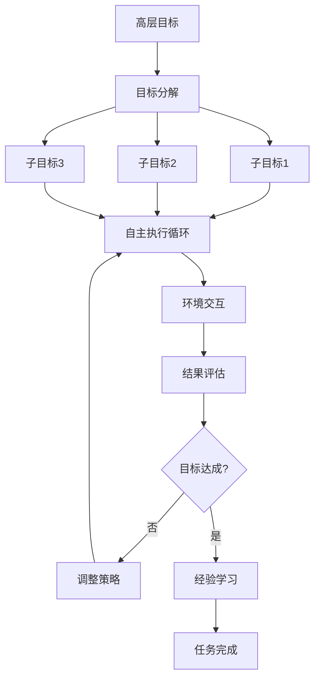
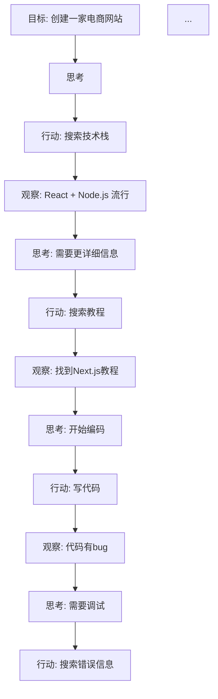
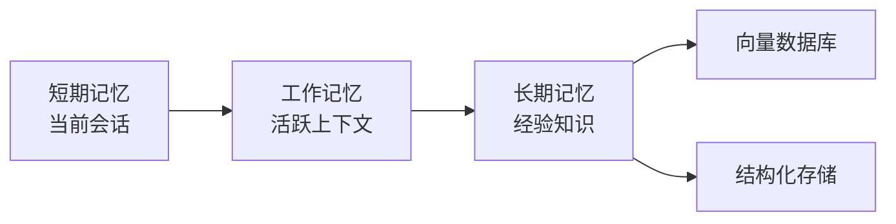

# 自主 Agent（Autonomous Agent）

## 定义

**自主 Agent（Autonomous Agent）** 是最高级别的 Agent 模式：给定高层目标后，Agent 自主设定子目标、制定计划、执行行动、评估结果、学习经验，全程无需人类干预。



## 核心特征

1. **目标自主性**：能从高层目标自主推导出子目标
2. **策略学习**：从成功/失败中学习，调整未来行为
3. **长期记忆**：保留跨会话的经验和知识
4. **环境适应**：根据环境变化动态调整行为

## 典型示例：AutoGPT

AutoGPT 是自主 Agent 的代表实现：



## 代码示例

### 简化版自主 Agent

```python
class AutonomousAgent:
    def __init__(self, llm, tools, memory):
        self.llm = llm
        self.tools = tools
        self.memory = memory
        self.max_iterations = 50
    
    def run(self, goal: str) -> str:
        """自主执行直到目标完成或达到限制"""
        context = {
            "goal": goal,
            "subgoals": [],
            "completed": [],
            "current_task": None,
        }
        
        for iteration in range(self.max_iterations):
            # 1. 反思当前状态
            reflection = self._reflect(context)
            
            # 2. 决定下一步
            action = self._decide_next_action(context, reflection)
            
            if action["type"] == "complete":
                return action["result"]
            
            if action["type"] == "subgoal":
                context["subgoals"].append(action["content"])
                continue
            
            # 3. 执行行动
            result = self._execute(action)
            
            # 4. 更新记忆和状态
            self.memory.store(action, result)
            context["completed"].append({
                "action": action,
                "result": result,
            })
        
        return "达到最大迭代次数"
    
    def _reflect(self, context: dict) -> str:
        """反思当前进展"""
        prompt = f"""评估当前任务进展：
目标：{context['goal']}
已完成：{context['completed']}
待办：{context['subgoals']}

分析：
1. 取得了什么进展？
2. 遇到了什么障碍？
3. 下一步应该做什么？"""
        
        return self.llm.invoke(prompt)
    
    def _decide_next_action(self, context: dict, reflection: str) -> dict:
        """决定下一步行动"""
        prompt = f"""基于以下信息，决定下一步行动：

反思：{reflection}

可选行动类型：
- subgoal: 设定新子目标
- tool: 调用工具
- complete: 完成任务

请返回 JSON 格式的行动决策。"""
        
        return parse_json(self.llm.invoke(prompt))
    
    def _execute(self, action: dict) -> str:
        """执行具体行动"""
        if action["type"] == "tool":
            tool = self.tools[action["tool_name"]]
            return tool.run(action["params"])
        return "未知行动类型"
```

## 记忆设计

自主 Agent 的核心是**长期记忆系统**：



```python
class AgentMemory:
    def __init__(self):
        self.short_term = []  # 当前会话历史
        self.working = {}     # 当前关注的上下文
        self.long_term = VectorStore()  # 长期经验
    
    def store_experience(self, action, result, outcome):
        """存储经验到长期记忆"""
        experience = {
            "action": action,
            "result": result,
            "outcome": outcome,  # success / failure
            "timestamp": now(),
        }
        self.long_term.add(experience)
    
    def retrieve_relevant(self, current_task: str, k: int = 5):
        """检索相关历史经验"""
        return self.long_term.similarity_search(current_task, k=k)
```

## 优缺点

| 优点 | 缺点 |
|------|------|
| 最大程度减少人工干预 | 可靠性最低，可能偏离目标 |
| 可处理开放域复杂任务 | 延迟和成本难以预测 |
| 能从经验中学习改进 | 调试和追踪极其困难 |
| 最接近"通用 AI"愿景 | 需要复杂的安全防护机制 |

## 安全与约束

自主 Agent 必须具备**多层防护**：

```python
class SafetyGuardrails:
    def check_action(self, action: dict) -> tuple[bool, str]:
        """检查行动是否安全"""
        
        # 1. 权限检查
        if not self._has_permission(action):
            return False, "权限不足"
        
        # 2. 危害检查
        if self._is_harmful(action):
            return False, "检测到潜在危害"
        
        # 3. 资源限制检查
        if self._exceeds_limits(action):
            return False, "超出资源限制"
        
        # 4. 人类审批（敏感操作）
        if self._needs_approval(action):
            approved = self._request_human_approval(action)
            if not approved:
                return False, "未通过人工审批"
        
        return True, "通过"
```

## 反模式与修复

| 反模式 | 问题 | 影响 | 修复方案 |
|--------|------|------|----------|
| 无紧急停止机制（Kill Switch） | Agent 运行过程中无法被人类中断，只能等待其自然终止或耗尽迭代次数 | Agent 偏离目标时无法及时止损，可能造成资源浪费甚至不可逆的操作后果 | 实现异步中断接口（信号量/WebSocket），支持人类随时暂停或终止 Agent 执行 |
| 自主权无边界 | Agent 可以调用任意工具、访问任意资源，没有权限范围限制 | Agent 可能执行危险操作（删除文件、发送邮件、调用付费 API），后果不可控 | 实现最小权限原则——按任务类型授予 Agent 最小必要权限，敏感操作必须人工审批 |
| 缺乏人类监督回路 | Agent 完全自主运行，关键决策不经过人类确认 | Agent 在歧义场景下做出错误决策，且无人及时纠正 | 引入人类在回路（Human-in-the-Loop）机制，高风险决策点暂停等待人类确认 |
| 目标漂移（Goal Drift） | Agent 在长期运行中逐渐偏离原始目标，被中间发现的"有趣"方向带偏 | 最终结果与用户原始需求完全无关，大量计算资源被浪费 | 在每轮反思中将当前状态与原始目标对比，偏差超过阈时强制回溯并重新规划 |
| 记忆污染 | Agent 将错误的经验存入长期记忆，后续检索时被误导做出更差的决策 | 错误经验不断累积，Agent 行为随时间退化而非改善 | 对记忆条目标注成功/失败标签和置信度，检索时优先使用高置信度的成功经验，定期清理低质量记忆 |

## 权衡分析

自主 Agent 的核心设计选择是**自主程度 vs 可控性、开放域能力 vs 可靠性**。

### 自主性分级 vs 风险

| 自主性级别 | 人类干预 | 适用场景 | 风险等级 |
|-----------|----------|----------|----------|
| L0 无自主 | 每步审批 | 高风险操作（金融交易） | 极低 |
| L1 工具自主 | 工具选择审批 | 企业内部工具集成 | 低 |
| L2 步序自主 | 任务开始审批 | 研究分析、内容生成 | 中 |
| L3 目标自主 | 目标设定审批 | 开放域探索 | 高 |
| L4 演进自主 | 无人类干预 | 理论研究、受限实验 | 极高 |

### 成本与收益的极端不确定性

- **成本不可预测**：自主 Agent 的 LLM 调用次数取决于任务复杂度和中间发现，无法事先估算
- **收益也不可预测**：可能 5 分钟完成任务，也可能运行数小时后偏离目标
- **与提示链的对比**：提示链成本 = 步骤数 × 单次调用成本，可精确预算；自主 Agent 成本 = 迭代次数 × 单次调用成本，迭代次数未知

### 记忆系统的代价

- **短期记忆**：成本低，但会话结束后丢失所有经验
- **长期记忆**：可跨会话学习，但引入向量数据库的运维成本和检索延迟
- **记忆污染风险**：错误经验被存入长期记忆后，会持续误导后续决策——清理记忆的成本可能高于重新开始

### 安全 vs 能力的张力

- **更严格的安全防护**：减少风险，但也限制了 Agent 解决问题的能力
- **更宽松的权限**：Agent 能力更强，但潜在危害也更大
- **渐进式放权**是当前最佳实践：从最严格的限制开始，根据实际表现逐步放开权限

### 何时选择自主 Agent

- 任务**开放性极强**，无法预定义处理流程
- 需要**长时间运行**（数小时甚至数天）
- 任务需要**持续学习和适应**
- 有**完善的安全防护和监控机制**

### 何时避免自主 Agent

- 任务**可预定义流程**——提示链、路由或编排器-工作者更可靠
- 对**成本有硬性预算**——自主 Agent 的成本不可预测
- **缺乏安全基础设施**——没有沙箱、权限控制和监控系统时不应运行自主 Agent
- 需要**可审计的决策过程**——自主 Agent 的决策路径难以完整追溯

## 最佳实践

1. **渐进式放权**：从人类审核每个决策开始，逐步增加自主性
2. **明确边界**：清晰定义 Agent 不能做什么
3. **可中断设计**：随时可以被人类暂停或接管
4. **完整日志**：记录每一个决策和推理过程
5. **沙箱环境**：在隔离环境中运行，限制潜在危害

## 与其他模式的关系

- **vs [[06-ReAct|ReAct]]**：ReAct 是结构化循环，自主 Agent 更自由、更复杂
- **vs [[07-Plan-and-Execute|Plan-and-Execute]]**：Plan-and-Execute 是一次性规划，自主 Agent 持续规划调整
- **vs [[04-编排器-工作者|编排器-工作者]]**：编排器由中央控制，自主 Agent 是自组织

## 延伸阅读

- [[00-模式总览]] — 所有架构模式对比
- [[03-记忆管理]] — Agent 记忆系统设计
- [[01-安全防护栏]] — Agent 安全防护机制
- [[07-Plan-and-Execute]] — 更受控的规划执行模式
