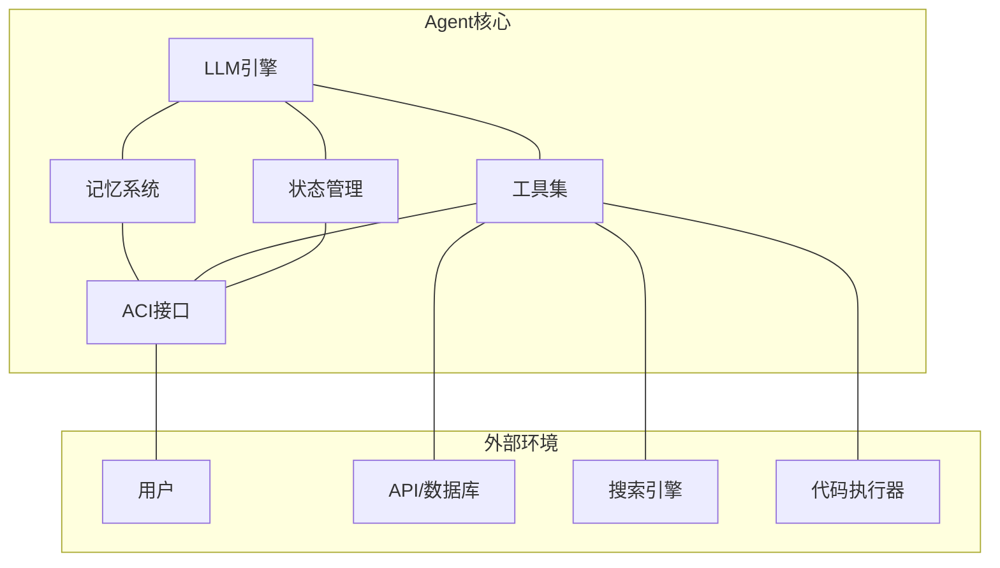
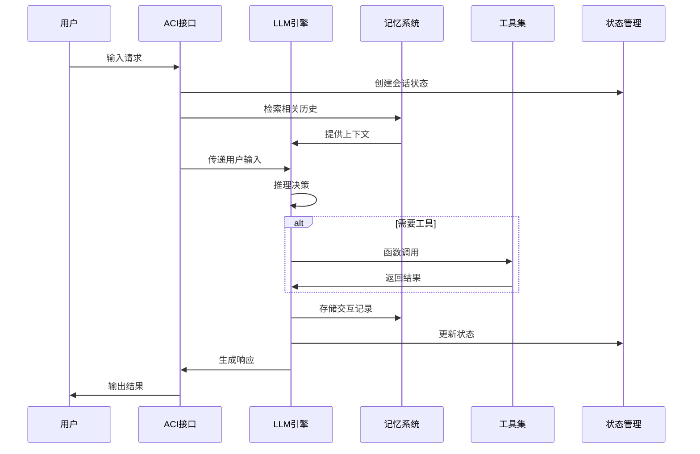

# 核心组件总览

Agent 系统由多个核心组件协同工作。理解各组件的职责和交互关系是构建可靠 Agent 的基础。

## 组件架构图

## 核心组件

| 组件 | 职责 | 关键设计决策 |
|------|------|-------------|
| [[01-工具设计|工具]] | 扩展 Agent 能力边界 | 工具粒度、描述质量、错误处理 |
| [[02-函数调用|函数调用]] | LLM 与外部系统的桥梁 | Schema 设计、参数校验、结果解析 |
| [[03-记忆管理|记忆]] | 保留和检索上下文信息 | 记忆类型、存储方式、检索策略 |
| [[04-ACI设计|ACI]] | 人机交互接口 | 交互模式、反馈机制、控制权分配 |
| [[05-状态管理|状态]] | 管理 Agent 生命周期状态 | 状态模型、持久化、恢复机制 |

## 组件交互流程

## 设计原则

1. **LLM 是核心**：所有组件围绕 LLM 的推理能力构建
2. **工具是扩展**：Agent 的能力上限取决于工具集的质量
3. **记忆是上下文**：记忆系统决定了 Agent 的"连续性"
4. **ACI 是边界**：ACI 设计决定了用户体验和安全性
5. **状态是生命周期**：状态管理决定了系统的可靠性和可恢复性

## 各组件详解

- [[01-工具设计]] — 如何设计高质量的 Agent 工具
- [[02-函数调用]] — LLM Function Calling 机制详解
- [[03-记忆管理]] — 短期记忆与长期记忆设计
- [[04-ACI设计]] — Agent-Computer Interface 设计模式
- [[05-状态管理]] — Agent 状态生命周期管理
