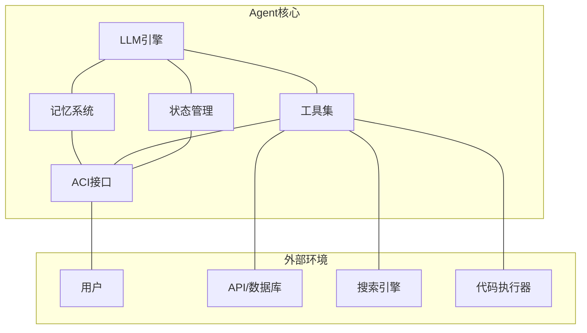
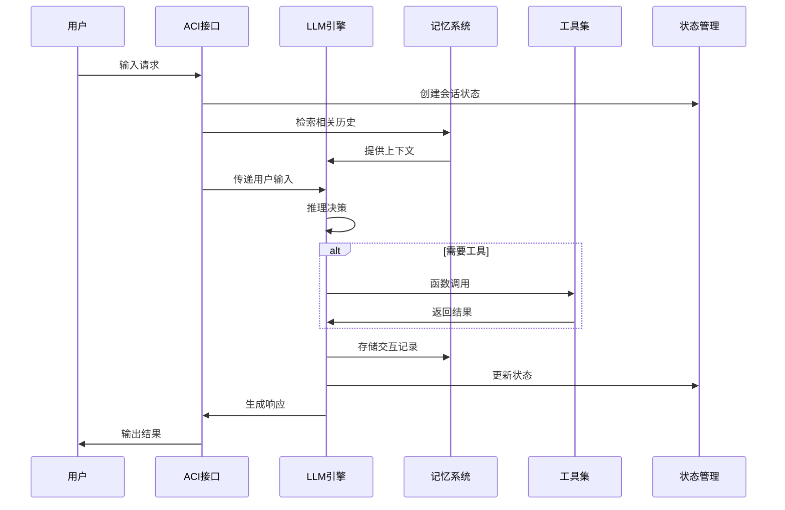
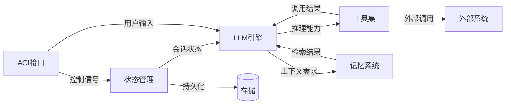

# 核心组件总览

Agent 系统由多个核心组件协同工作。理解各组件的职责、交互关系和设计权衡是构建可靠 Agent 的基础。

## 组件架构图

## 核心组件职责

| 组件 | 职责 | 关键设计决策 | 详细文档 |
|------|------|-------------|---------|
| [[01-工具设计\|工具]] | 扩展 Agent 能力边界 | 工具粒度、描述质量、错误处理 | [[01-工具设计]] |
| [[02-函数调用\|函数调用]] | LLM 与外部系统的桥梁 | Schema 设计、参数校验、结果解析 | [[02-函数调用]] |
| [[03-记忆管理\|记忆]] | 保留和检索上下文信息 | 记忆类型、存储方式、检索策略 | [[03-记忆管理]] |
| [[04-ACI设计\|ACI]] | 人机交互接口 | 交互模式、反馈机制、控制权分配 | [[04-ACI设计]] |
| [[05-状态管理\|状态]] | 管理 Agent 生命周期状态 | 状态模型、持久化、恢复机制 | [[05-状态管理]] |

## 组件交互流程

## 组件依赖关系

各组件之间存在明确的依赖关系，理解这些依赖有助于正确的集成顺序和故障排查：

**关键依赖说明**：

- **LLM → 工具**：LLM 决定调用哪些工具，工具描述质量直接影响调用准确率
- **LLM → 记忆**：LLM 需要历史上下文来保持对话连贯性
- **状态 → LLM**：状态管理为 LLM 提供当前会话的元信息（轮次、成本、权限）
- **ACI → 状态**：ACI 根据状态决定是否需要人工介入

## 设计原则

1. **LLM 是核心**：所有组件围绕 LLM 的推理能力构建
2. **工具是扩展**：Agent 的能力上限取决于工具集的质量
3. **记忆是上下文**：记忆系统决定了 Agent 的"连续性"
4. **ACI 是边界**：ACI 设计决定了用户体验和安全性
5. **状态是生命周期**：状态管理决定了系统的可靠性和可恢复性

## 组件选型指南

| 场景 | 推荐组件配置 | 理由 |
|------|------------|------|
| 简单问答 | LLM + 最小记忆 | 无需工具和复杂状态 |
| 任务自动化 | LLM + 工具 + 状态 | 需要执行外部操作 |
| 多轮对话 | LLM + 记忆 + ACI | 需要上下文保持和用户交互 |
| 复杂工作流 | 全组件 | 需要完整的生命周期管理 |

## 反模式与修复

| 反模式 | 问题 | 影响 | 修复方案 |
|--------|------|------|---------|
| **组件缺失** | 跳过状态管理直接部署 | 会话丢失，无法恢复 | 按依赖顺序逐步集成组件 |
| **过度耦合** | 组件间直接调用而非接口通信 | 修改一个组件影响其他组件 | 定义清晰的组件接口 + 依赖注入 |
| **记忆无上限** | 记忆系统不设容量限制 | 上下文窗口溢出，Token 成本失控 | 设置记忆容量上限 + 淘汰策略 |
| **工具无校验** | 工具参数不做 Schema 校验 | LLM 生成的无效参数导致运行时错误 | JSON Schema 校验 + 友好错误消息 |
| **状态不持久化** | 状态仅保存在内存中 | 进程重启后会话丢失 | 状态持久化到数据库或文件 |
| **ACI 无反馈** | 用户看不到 Agent 的执行进度 | 用户体验差，频繁刷新 | 流式输出 + 执行状态展示 |

## 权衡分析

| 维度 | 精简组件 | 完整组件 | 建议 |
|------|---------|---------|------|
| **开发速度** | 快 | 慢 | MVP 阶段用精简配置 |
| **功能上限** | 低 | 高 | 复杂场景需要完整组件 |
| **调试难度** | 低 | 高 | 逐步引入组件，每步验证 |
| **运行成本** | 低 | 高 | 记忆和工具是成本主要来源 |
| **可靠性** | 中 | 高 | 状态管理是可靠性的关键 |

**实践建议**：从 LLM + 最小记忆开始，验证核心功能后再逐步引入工具、状态管理和 ACI。每个组件引入后都应进行集成测试，确保不影响已有功能。

## 各组件详解

- [[01-工具设计]] — 如何设计高质量的 Agent 工具
- [[02-函数调用]] — LLM Function Calling 机制详解
- [[03-记忆管理]] — 短期记忆与长期记忆设计
- [[04-ACI设计]] — Agent-Computer Interface 设计模式
- [[05-状态管理]] — Agent 状态生命周期管理
