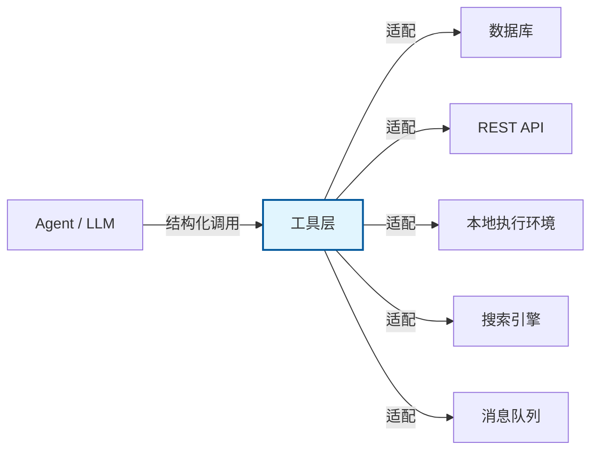
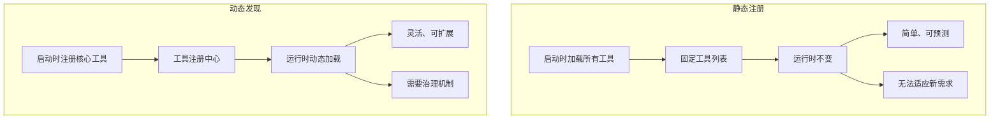
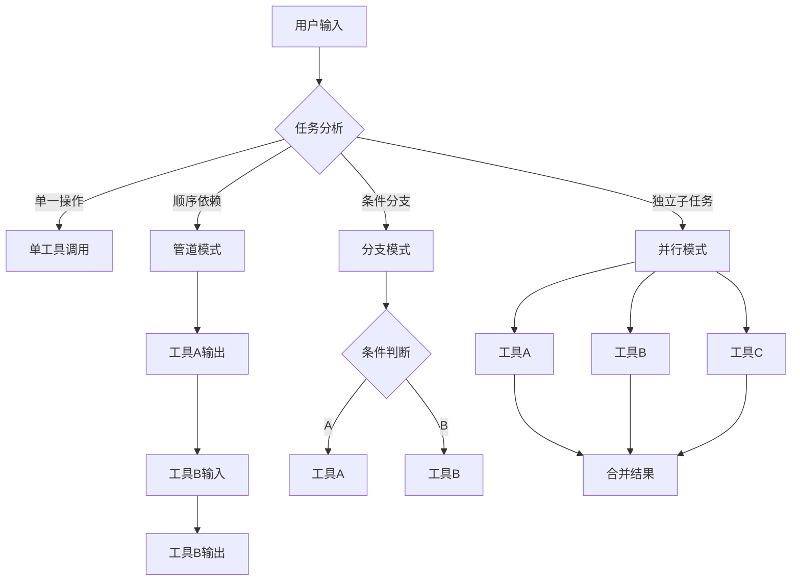

# 工具设计（Tool Design）

## 定义

**工具（Tool）** 是 Agent 可调用的外部功能单元，使 LLM 能够超越文本生成，与真实世界进行有状态、可观测的交互。工具设计直接影响 Agent 的能力边界、可靠性上限和运营成本。

从架构视角看，工具是 LLM 与外部系统的**适配层（Adapter Layer）**。它屏蔽了外部系统的实现复杂性，将异构能力（REST API、数据库查询、本地计算、第三方服务）统一为 LLM 可理解的结构化接口。



工具层的关键设计挑战在于：**如何在保持 LLM 选择准确率的同时，最大化外部能力的可用性**。这涉及到命名、描述、参数粒度、错误反馈、性能特征等多维度的权衡。

## 工具的核心要素

一个生产级工具至少包含六个维度：

| 要素 | 说明 | 设计权衡 |
|------|------|---------|
| **名称（Name）** | 简洁、唯一的标识符，LLM 直接引用 | 过长降低 token 效率，过短易冲突 |
| **描述（Description）** | 自然语言说明功能、使用场景与限制 | 过详消耗上下文，过略导致误选 |
| **参数 Schema** | 结构化参数定义（类型、约束、默认值） | 严格减少错误，灵活提升覆盖 |
| **执行逻辑** | 实际的函数/服务实现 | 同步简单，异步可扩展 |
| **错误处理** | 结构化错误码、恢复建议、降级策略 | 详细帮助修复，冗余干扰推理 |
| **元数据** | 版本、作者、权限标签、性能特征 | 丰富支持治理，过多增加维护 |

### 名称设计的隐性成本

LLM 选择工具时，名称是最高优先级的信号。研究表明，工具名称的前 2-3 个 token 对选择准确率影响最大 [^1]。

```python
# 差：语义模糊，容易与相似工具混淆
@tool
def search(q: str): ...

# 好：领域+动作+对象的三段式命名
@tool
def ecommerce_search_products(query: str, category: str = None): ...

# 更好：动作+对象+修饰符，避免命名空间冲突
@tool
def search_products_by_keyword(
    query: str,
    category: str = None,
    max_results: int = 10
) -> list:
    """在电商目录中按关键词搜索商品。

    适用于：用户想要查找、浏览或比较商品时。
    不适用于：查询订单状态（使用 get_order_status）、
             获取商品库存（使用 get_product_inventory）。
    """
    ...
```

**权衡**：长名称提升准确性但消耗上下文窗口；短名称节省 token 但增加歧义。建议在 3-5 个英文单词之间，并建立统一的命名规范。

### 描述作为"契约"

工具描述是 LLM 进行工具选择的**唯一信息来源**。在复杂 Agent 中，描述的质量直接决定调用成功率。

```python
# 生产级工具描述模板
description = """{一句话功能概述}

适用场景：
- {场景1}
- {场景2}

不适用场景：
- {反例1}（请使用 {替代工具}）
- {反例2}

副作用：{是否修改外部状态}
典型延迟：{P50/P99 延迟}
权限要求：{所需权限级别}
"""
```

[^1]: 基于 OpenAI function calling 行为观察与社区实验数据。

## 真实开源工具案例分析

### LangChain Tools

LangChain 的工具层是早期最成熟的实现之一，其核心抽象是 `BaseTool`：

```python
from langchain.tools import BaseTool
from pydantic import BaseModel, Field
from typing import Type

class CalculatorInput(BaseModel):
    expression: str = Field(description="数学表达式，如 '2 + 3 * 4'")

class CalculatorTool(BaseTool):
    name: str = "calculator"
    description: str = "执行数学计算。适用于：需要精确数值计算的场景。不适用于：逻辑推理、文本生成。"
    args_schema: Type[BaseModel] = CalculatorInput

    def _run(self, expression: str) -> str:
        try:
            # 安全求值：使用受限的 eval 或 ast.literal_eval
            result = self._safe_eval(expression)
            return f"计算结果: {result}"
        except Exception as e:
            return f"计算错误: {str(e)}。请检查表达式语法。"

    async def _arun(self, expression: str) -> str:
        # 异步实现，用于并发场景
        return self._run(expression)

    def _safe_eval(self, expression: str):
        import ast
        import operator
        # 仅允许安全的数学运算
        allowed_ops = {
            ast.Add: operator.add,
            ast.Sub: operator.sub,
            ast.Mult: operator.mul,
            ast.Div: operator.truediv,
            ast.Pow: operator.pow,
        }
        tree = ast.parse(expression, mode='eval')
        # 遍历 AST 确保安全
        ...
```

**LangChain 工具设计的特点**：
- 强制 `args_schema`（Pydantic 模型）保证参数类型安全
- 同步/异步双接口支持，适配不同运行时
- 通过 `callbacks` 机制支持观测和追踪

**局限性**：工具数量膨胀时缺乏发现机制；权限模型较粗粒度。

### OpenAI Plugins（历史参考）

OpenAI Plugins（2023）定义了 LLM 调用外部能力的早期标准，虽然现已转向 Function Calling，但其设计思想仍有参考价值：

```yaml
# ai-plugin.json — 插件元数据
schema_version: v1
name_for_human: 天气查询
name_for_model: weather_query
description_for_human: 查询全球城市的实时天气
description_for_model: >
  当用户询问任何城市的天气时使用此工具。
  必须提供城市名称，可选温度单位。
  如果用户没有指定城市，请先询问。
api:
  type: openapi
  url: https://weather.example.com/openapi.yaml
auth:
  type: none
```

**关键设计**：为"人类"和"模型"分别提供描述，因为两者对信息密度的需求不同。这一模式被后续的 MCP 规范继承。

### MCP（Model Context Protocol）Tools

MCP 是 Anthropic 2024 年推出的开放协议，旨在标准化 AI 应用与外部数据源的连接方式 [^2]。

```typescript
// MCP Server 工具定义
const tools: Tool[] = [
  {
    name: "read_file",
    description: "读取文件内容。路径必须是绝对路径。",
    inputSchema: {
      type: "object",
      properties: {
        path: {
          type: "string",
          description: "文件的绝对路径"
        },
        offset: {
          type: "number",
          description: "起始行号（0-based），可选"
        },
        limit: {
          type: "number",
          description: "读取最大行数，可选"
        }
      },
      required: ["path"]
    }
  }
];

// MCP 工具调用响应
interface ToolResult {
  content: Array<TextContent | ImageContent>;
  isError?: boolean;  // 显式错误标记
}
```

**MCP 的设计优势**：
- 协议级标准化：工具定义、调用、响应格式统一
- 支持多模态输出（文本、图像、二进制资源）
- 内置分页和进度报告机制
- 服务器可动态注册和发现工具

[^2]: [Model Context Protocol Specification](https://modelcontextprotocol.io/), Anthropic, 2024.

## 工具版本演化策略

生产环境中工具的接口必然演化。缺乏版本策略会导致 Agent 行为在部署后突然变化。

### 向后兼容的三个层级

```python
from enum import Enum

class CompatibilityLevel(Enum):
    FULL = "full"       # 旧客户端零感知
    DEPRECATED = "dep"  # 旧客户端收到警告
    BREAKING = "break"  # 旧客户端必须升级

def register_tool_with_version(
    tool_def: dict,
    version: str,
    compat: CompatibilityLevel
):
    """注册带版本信息的工具。"""
    tool_def["version"] = version
    tool_def["deprecated"] = (compat == CompatibilityLevel.DEPRECATED)
    tool_def["deprecated_since"] = "2026-01-15" if compat == CompatibilityLevel.DEPRECATED else None
    tool_def["migration_guide"] = "请使用 search_products_v2" if compat == CompatibilityLevel.DEPRECATED else None
    return tool_def
```

### 废弃通知模式

```python
import warnings
from datetime import datetime, timedelta

class VersionedTool:
    def __init__(self, name: str, version: str, sunset_date: str = None):
        self.name = name
        self.version = version
        self.sunset_date = datetime.fromisoformat(sunset_date) if sunset_date else None

    def execute(self, **kwargs):
        if self.sunset_date and datetime.now() > self.sunset_date:
            raise ToolSunsetError(
                f"工具 {self.name} v{self.version} 已于 {self.sunset_date} 停止服务。"
                f"请迁移至 {self.migration_target}"
            )

        if self.deprecated:
            # 在响应中嵌入废弃通知，让 LLM 知晓
            result = self._do_execute(**kwargs)
            result["_meta"] = {
                "warning": f"此工具已废弃，将于 {self.sunset_date} 停止服务",
                "alternative": self.migration_target
            }
            return result
        return self._do_execute(**kwargs)
```

### 版本迁移路径设计

```mermaid
graph LR
    A[search_products v1] -->|新增 filter 参数| B[search_products v1.1]
    B -->|重命名参数| C[search_products v2]
    C -->|D[旧客户端兼容层]
    D -->|自动转换参数| C
    B -->|Sunset 后移除| E[已废弃]
    A -->|直接移除| E
```

**关键原则**：永远不为同一功能提供两个活跃版本。新版本上线后，旧版本进入废弃期（建议 30-90 天），期间自动将旧调用迁移到新接口并返回警告。

## 性能考量

### 工具调用延迟预算

在对话式 Agent 中，工具延迟直接决定用户体验。建议为每个工具定义延迟预算：

```python
from dataclasses import dataclass
from typing import Callable
import time

@dataclass
class LatencyBudget:
    p50_ms: int   # 50% 请求在此时间内完成
    p99_ms: int   # 99% 请求在此时间内完成
    timeout_ms: int  # 硬性超时

class TimedTool:
    def __init__(self, fn: Callable, budget: LatencyBudget):
        self.fn = fn
        self.budget = budget
        self._latency_history = []

    def execute(self, **kwargs):
        start = time.monotonic()
        try:
            result = self._execute_with_timeout(**kwargs)
            latency = (time.monotonic() - start) * 1000
            self._record_latency(latency)
            return result
        except TimeoutError:
            return {
                "success": False,
                "error": f"工具执行超时（限制 {self.budget.timeout_ms}ms）",
                "suggestion": "请稍后重试，或尝试简化请求参数"
            }

    def _execute_with_timeout(self, **kwargs):
        # 实际实现使用 asyncio.wait_for 或信号量
        ...

    def _record_latency(self, latency: float):
        self._latency_history.append(latency)
        if len(self._latency_history) > 1000:
            self._latency_history = self._latency_history[-1000:]

    def get_current_p99(self) -> float:
        sorted_hist = sorted(self._latency_history)
        idx = int(len(sorted_hist) * 0.99)
        return sorted_hist[idx] if sorted_hist else 0.0
```

### 超时策略

```python
import asyncio
from enum import Enum

class TimeoutStrategy(Enum):
    FAIL = "fail"           # 直接失败
    FALLBACK = "fallback"   # 返回降级结果
    CACHE = "cache"         # 返回缓存数据
    DEFER = "defer"         # 异步完成，先返回占位符

async def execute_with_strategy(
    tool_fn,
    args: dict,
    timeout_ms: int,
    strategy: TimeoutStrategy,
    fallback_value=None
):
    try:
        return await asyncio.wait_for(
            tool_fn(**args),
            timeout=timeout_ms / 1000
        )
    except asyncio.TimeoutError:
        if strategy == TimeoutStrategy.FAIL:
            raise
        elif strategy == TimeoutStrategy.FALLBACK:
            return fallback_value or {"success": False, "error": "超时，返回默认值"}
        elif strategy == TimeoutStrategy.CACHE:
            return await get_cached_result(args)
        elif strategy == TimeoutStrategy.DEFER:
            # 启动后台任务，先返回占位符
            asyncio.create_task(tool_fn(**args))
            return {"status": "processing", "check_url": "/status/123"}
```

**策略选择权衡**：

| 策略 | 延迟影响 | 数据新鲜度 | 适用场景 |
|------|---------|-----------|---------|
| FAIL | 最低 | 最高 | 金融交易、关键状态变更 |
| FALLBACK | 低 | 中 | 推荐系统、非关键查询 |
| CACHE | 最低 | 低 | 配置读取、参考数据 |
| DEFER | 中 | 高 | 报告生成、批量分析 |

### 批处理模式

当 Agent 需要多次调用同类工具时，批处理可显著降低总延迟：

```python
from typing import List

class BatchTool:
    """支持批处理的工具包装器。"""

    def __init__(self, single_fn, max_batch_size: int = 10):
        self.single_fn = single_fn
        self.max_batch_size = max_batch_size

    async def batch_execute(self, requests: List[dict]) -> List[dict]:
        """批量执行，自动分块和并发。"""
        results = []
        for i in range(0, len(requests), self.max_batch_size):
            chunk = requests[i:i + self.max_batch_size]
            # 并发执行每个 chunk
            chunk_results = await asyncio.gather(
                *[self.single_fn(**req) for req in chunk],
                return_exceptions=True
            )
            results.extend([
                r if not isinstance(r, Exception) else
                {"success": False, "error": str(r)}
                for r in chunk_results
            ])
        return results

# 使用场景：LLM 并行调用多个独立查询
# 将 5 个 get_product_details 调用合并为 1 个批处理请求
```

## 工具发现机制

### 静态注册 vs 动态发现



### 动态工具发现实现

```python
from typing import Dict, Callable
import importlib

class ToolRegistry:
    """支持动态发现的工具注册中心。"""

    def __init__(self):
        self._tools: Dict[str, dict] = {}
        self._categories: Dict[str, list] = {}

    def register(self, tool_def: dict, category: str = "general"):
        name = tool_def["name"]
        if name in self._tools:
            raise ValueError(f"工具 '{name}' 已存在")
        self._tools[name] = tool_def
        self._categories.setdefault(category, []).append(name)

    def discover(self, query: str = None, category: str = None) -> list:
        """基于查询或分类发现工具。"""
        candidates = []
        if category:
            candidates = [self._tools[n] for n in self._categories.get(category, [])]
        else:
            candidates = list(self._tools.values())

        if query:
            # 基于描述的简单语义过滤
            candidates = [
                t for t in candidates
                if query.lower() in t.get("description", "").lower()
            ]
        return candidates

    def load_from_module(self, module_path: str):
        """从 Python 模块动态加载工具。"""
        module = importlib.import_module(module_path)
        for attr_name in dir(module):
            attr = getattr(module, attr_name)
            if hasattr(attr, "_is_tool"):
                self.register(attr.tool_definition, category=getattr(attr, "_category", "general"))

# 使用示例：根据 Agent 当前任务动态选择工具子集
registry = ToolRegistry()
registry.register(search_products_tool, "ecommerce")
registry.register(send_email_tool, "communication")

# Agent 初始化时只加载相关分类的工具
task = "查询订单"
relevant_tools = registry.discover(category="ecommerce")
```

### 运行时工具加载的安全边界

动态发现引入了**供应链风险**：运行时可加载的代码必须受控。

```python
class SecureToolLoader:
    ALLOWED_PACKAGES = {"company.tools", "company.integrations"}
    BLOCKED_NAMES = {"eval", "exec", "subprocess", "os.system"}

    def load(self, module_path: str) -> dict:
        # 1. 包名白名单检查
        if not any(module_path.startswith(p) for p in self.ALLOWED_PACKAGES):
            raise SecurityError(f"不允许从 {module_path} 加载工具")

        # 2. 静态代码扫描（AST 分析）
        source = self._get_source(module_path)
        if self._contains_blocked_patterns(source):
            raise SecurityError("工具代码包含危险操作")

        # 3. 沙箱中执行注册
        return self._execute_in_sandbox(module_path)
```

## 工具安全性

### 沙箱执行

工具执行不可信代码时，沙箱是必需的安全边界：

```python
import subprocess
import tempfile
import os

class SandboxExecutor:
    """使用容器/进程隔离执行不可信代码。"""

    def __init__(self, timeout: int = 30, memory_mb: int = 256):
        self.timeout = timeout
        self.memory_mb = memory_mb

    def execute(self, code: str, inputs: dict) -> dict:
        with tempfile.TemporaryDirectory() as tmpdir:
            # 写入代码和输入
            code_path = os.path.join(tmpdir, "script.py")
            with open(code_path, "w") as f:
                f.write(code)

            try:
                result = subprocess.run(
                    ["python", "-I", "-S", code_path],  # -I 隔离模式, -S 禁用 site
                    capture_output=True,
                    text=True,
                    timeout=self.timeout,
                    # 资源限制（Linux）
                    preexec_fn=self._set_limits,
                    cwd=tmpdir,
                    env={"PATH": "/usr/bin"}  # 最小化环境
                )
                return {
                    "success": result.returncode == 0,
                    "stdout": result.stdout,
                    "stderr": result.stderr,
                }
            except subprocess.TimeoutExpired:
                return {"success": False, "error": "执行超时"}

    def _set_limits(self):
        import resource
        # 限制内存
        resource.setrlimit(resource.RLIMIT_AS, (self.memory_mb * 1024 * 1024, -1))
        # 限制 CPU 时间
        resource.setrlimit(resource.RLIMIT_CPU, (self.timeout, -1))
        # 禁用核心转储
        resource.setrlimit(resource.RLIMIT_CORE, (0, 0))
```

**生产环境建议**：使用更严格的隔离机制，如 gVisor、Firecracker microVM 或 Kubernetes 受限 Pod。

### 权限模型

```python
from enum import Enum, auto

class Permission(Enum):
    READ = auto()
    WRITE = auto()
    DELETE = auto()
    EXECUTE = auto()
    NETWORK = auto()

class PermissionModel:
    """基于角色的工具权限控制。"""

    ROLE_PERMISSIONS = {
        "user": {Permission.READ, Permission.NETWORK},
        "premium": {Permission.READ, Permission.WRITE, Permission.NETWORK},
        "admin": {Permission.READ, Permission.WRITE, Permission.DELETE, Permission.EXECUTE, Permission.NETWORK},
    }

    def __init__(self, user_role: str):
        self.permissions = self.ROLE_PERMISSIONS.get(user_role, set())

    def can_execute(self, tool_def: dict) -> bool:
        required = set(Permission[p] for p in tool_def.get("permissions", ["READ"]))
        return required.issubset(self.permissions)

    def enforce(self, tool_def: dict, user_context: dict):
        if not self.can_execute(tool_def):
            raise PermissionDeniedError(
                f"用户角色 '{user_context.get('role')}' 无权执行工具 '{tool_def['name']}'"
            )
```

### 审计日志

```python
import json
from datetime import datetime
from typing import Optional

class AuditLogger:
    """记录所有工具调用以供安全审计。"""

    def log_tool_call(
        self,
        tool_name: str,
        arguments: dict,
        result: dict,
        user_id: str,
        session_id: str,
        latency_ms: float,
        error: Optional[str] = None
    ):
        entry = {
            "timestamp": datetime.utcnow().isoformat(),
            "event_type": "tool_call",
            "tool_name": tool_name,
            "tool_version": result.get("_tool_version"),
            "arguments": self._sanitize(arguments),  # 脱敏处理
            "success": result.get("success", True),
            "error": error,
            "latency_ms": latency_ms,
            "user_id": user_id,
            "session_id": session_id,
            # 数据血缘
            "data_sources": result.get("_data_sources", []),
            "data_classification": result.get("_classification", "internal"),
        }
        self._write(entry)

    def _sanitize(self, arguments: dict) -> dict:
        """移除或哈希化敏感参数（如 API key、密码）。"""
        sanitized = {}
        for k, v in arguments.items():
            if any(s in k.lower() for s in ["key", "password", "token", "secret"]):
                sanitized[k] = "***REDACTED***"
            else:
                sanitized[k] = v
        return sanitized

    def _write(self, entry: dict):
        # 写入不可篡改的审计存储（如 WORM 存储、区块链、只读日志）
        print(json.dumps(entry, ensure_ascii=False))
```

**审计日志的价值**：事后追溯异常调用、合规性报告（SOC2/GDPR）、训练数据血缘追踪。

## 工具组合模式

复杂任务很少能通过单次工具调用完成。组合模式定义了多个工具如何协同工作。

### 管道模式（Pipeline）

前一个工具的输出作为后一个工具的输入：

```python
from typing import List, Callable

class Pipeline:
    """顺序执行工具链，支持中间结果转换。"""

    def __init__(self):
        self.steps: List[Callable] = []

    def add(self, tool_fn: Callable, input_transform: Callable = None):
        self.steps.append((tool_fn, input_transform))
        return self

    async def execute(self, initial_input: dict) -> dict:
        result = initial_input
        for i, (tool_fn, transform) in enumerate(self.steps):
            if transform:
                result = transform(result)
            try:
                result = await tool_fn(**result)
            except Exception as e:
                return {
                    "success": False,
                    "failed_step": i,
                    "error": str(e),
                    "partial_result": result
                }
        return result

# 示例：搜索商品 -> 获取详情 -> 生成推荐
pipeline = Pipeline()
pipeline.add(search_products, lambda x: {"query": x["user_query"]})
pipeline.add(get_product_details, lambda r: {"product_ids": [p["id"] for p in r["results"]]})
pipeline.add(generate_recommendations, lambda r: {"products": r["details"]})
```

### 分支模式（Branching）

基于条件选择不同的工具路径：

```python
class ConditionalBranch:
    """基于条件动态选择工具分支。"""

    def __init__(self):
        self.branches = []

    def when(self, condition: Callable, tool_fn: Callable):
        self.branches.append((condition, tool_fn))
        return self

    def default(self, tool_fn: Callable):
        self.branches.append((lambda _: True, tool_fn))
        return self

    async def execute(self, context: dict) -> dict:
        for condition, tool_fn in self.branches:
            if condition(context):
                return await tool_fn(**context)
        raise ValueError("没有匹配的分支")

# 示例：根据查询类型路由到不同搜索工具
router = ConditionalBranch()
router.when(
    lambda ctx: ctx["query_type"] == "product",
    search_products
)
router.when(
    lambda ctx: ctx["query_type"] == "order",
    search_orders
)
router.default(search_general)
```

### 并行模式（Parallel）

同时调用多个独立工具，合并结果：

```python
import asyncio

class ParallelGroup:
    """并行执行多个工具，支持结果合并策略。"""

    def __init__(self, merge_strategy: str = "dict"):
        self.tools = []
        self.merge_strategy = merge_strategy

    def add(self, name: str, tool_fn: Callable, **kwargs):
        self.tools.append((name, tool_fn, kwargs))
        return self

    async def execute(self) -> dict:
        # 并发启动所有工具
        tasks = [
            asyncio.create_task(self._safe_execute(name, fn, kwargs))
            for name, fn, kwargs in self.tools
        ]
        results = await asyncio.gather(*tasks, return_exceptions=True)

        merged = {}
        for (name, _, _), result in zip(self.tools, results):
            if isinstance(result, Exception):
                merged[name] = {"success": False, "error": str(result)}
            else:
                merged[name] = result
        return merged

    async def _safe_execute(self, name: str, fn: Callable, kwargs: dict):
        return await fn(**kwargs)

# 示例：同时查询天气、汇率、新闻
parallel = ParallelGroup()
parallel.add("weather", get_weather, city="北京")
parallel.add("exchange_rate", get_exchange_rate, from_currency="CNY", to_currency="USD")
parallel.add("news", get_news, topic="经济")
# 结果: {"weather": {...}, "exchange_rate": {...}, "news": {...}}
```



## 常见反模式与修复

| 反模式 | 问题 | 影响 | 修复方案 |
|--------|------|------|---------|
| **万能工具** | 一个工具处理所有操作，通过 `action` 参数区分 | LLM 选择困难，参数填充错误率高 | 拆分为单一职责工具，每个工具一个动作 |
| **描述模糊** | "处理一些数据" 之类的描述 | LLM 随机选择工具，调用准确率 <50% | 使用模板化描述，明确适用/不适用场景 |
| **参数过度嵌套** | 超过 3 层嵌套的对象参数 | LLM 生成 JSON 时结构错误率高 | 扁平化参数，或使用多步工具组合 |
| **无副作用声明** | 修改状态的工具未在描述中声明 | 意外的重复调用导致数据损坏 | 在描述首句标注 `[副作用: 写入]` |
| **静默失败** | 工具内部捕获所有异常，返回空结果 | Agent 无法感知错误，继续基于错误数据推理 | 返回结构化错误，包含 `success` 字段和恢复建议 |
| **返回非结构化文本** | 返回大段自然语言而非结构化数据 | LLM 难以从中提取关键信息用于后续调用 | 返回 JSON，关键字段固定命名 |
| **工具数量无限制** | 一次暴露 50+ 工具 | 上下文膨胀，选择准确率指数下降 | 按场景动态加载子集，建议 5-15 个/会话 |
| **无版本管理** | 直接修改活跃工具的接口 | 部署后 Agent 行为突然变化 | 采用语义化版本，废弃期至少 30 天 |

### 万能工具拆分示例

```python
# 反模式：万能工具
@tool
def manage_user(action: str, data: dict) -> dict:
    """操作用户数据"""
    if action == "create": ...
    elif action == "update": ...
    elif action == "delete": ...
    # LLM 经常填错 action 或 data 结构

# 修复：拆分为独立工具
@tool
def create_user(name: str, email: str, role: str = "user") -> dict:
    """创建新用户。副作用：写入数据库。"""
    ...

@tool
def update_user_email(user_id: str, new_email: str) -> dict:
    """更新用户邮箱。副作用：修改用户信息。"""
    ...

@tool
def deactivate_user(user_id: str, reason: str = None) -> dict:
    """停用用户账号。副作用：修改用户状态。"""
    ...
```

## 最佳实践总结

1. **单一职责**：每个工具只做一件事，工具数量增加带来的选择困难远小于万能工具带来的参数错误
2. **描述即契约**：把工具描述当作 API 文档来维护，明确适用场景、限制和副作用
3. **结构化返回**：始终返回机器可读的结构化数据（JSON），包含 `success` 标志和错误详情
4. **延迟预算**：为每个工具定义 P99 延迟目标和超时策略，超时时返回有意义的降级结果
5. **版本管理**：工具接口变更必须经过废弃期，提供自动迁移和清晰的通知
6. **权限最小化**：每个工具只请求所需的最小权限集，通过角色模型控制访问
7. **可观测性**：记录所有工具调用的延迟、参数、结果和错误，支持追踪和审计
8. **动态加载**：按 Agent 任务场景动态发现工具子集，避免一次性暴露全部工具
9. **组合优于复杂**：复杂操作通过管道、分支、并行模式组合简单工具，而非创建复杂参数的工具
10. **安全边界**：涉及代码执行、网络访问或敏感数据的操作必须在沙箱中运行

## 延伸阅读

- [[02-函数调用]] — LLM Function Calling 机制实现细节
- [[00-组件总览]] — 核心组件全景图
- [[06-ReAct]] — 基于工具调用的经典 Agent 推理模式
- [[05-MCP协议]] — 标准化的工具协议规范
- [[03-防护栏与沙箱]] — 工具执行的安全边界设计
