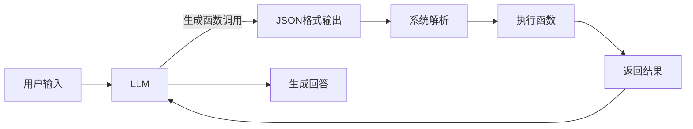
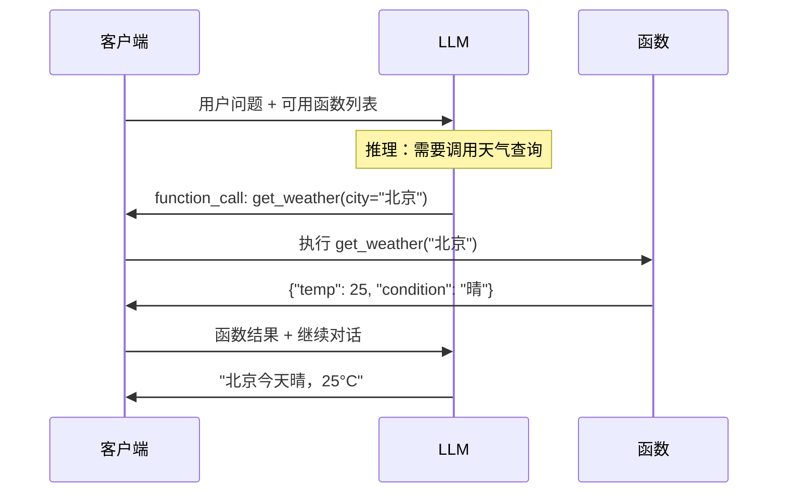

# 函数调用（Function Calling）

## 定义

**函数调用（Function Calling）** 是 LLM 生成结构化输出以调用外部函数的能力。它是 Agent 与外部世界交互的核心机制，使 LLM 从"纯文本生成器"转变为"可行动的 Agent"。

从协议视角看，函数调用是 LLM 与外部系统之间的**远程过程调用（RPC）抽象**。LLM 不直接执行函数，而是生成符合预定义 Schema 的结构化请求，由运行时（Runtime）解析、执行并将结果回传 [^1]。



这一设计的核心洞察是：**LLM 擅长推理"做什么"，但不擅长"怎么做"**。函数调用将"做什么"的决策权交给 LLM，将"怎么做"的执行权交给类型安全、可测试的外部代码。

[^1]: OpenAI. "Function calling and other API updates." OpenAI Blog, 2023.

## 工作原理

函数调用通常遵循以下流程：

1. **定义 Schema**：描述可用函数的 JSON Schema
2. **传递 Schema**：在请求中将函数定义传给 LLM
3. **模型决策**：LLM 决定是否需要调用函数、调用哪个、传入什么参数
4. **解析执行**：系统解析 LLM 输出的函数调用，执行对应函数
5. **结果回传**：将函数执行结果传回 LLM，继续对话



## 主流实现详细对比

| 维度 | OpenAI | Anthropic | Google Gemini | Mistral |
|------|--------|-----------|---------------|---------|
| **参数格式** | `tools` 数组，`type: "function"` | `tools` 数组，`input_schema` | `tools` 数组，直接传 Python 函数 | `tools` 数组，类 OpenAI 格式 |
| **Schema 标准** | JSON Schema Draft 7 | JSON Schema | 内部推断 + 可选 Schema | JSON Schema |
| **调用指示字段** | `tool_calls` | `stop_reason == "tool_use"` | `function_call` in parts | `tool_calls` |
| **多轮结果回传** | `role: "tool"` + `tool_call_id` | `role: "user"` + `content` 含 `tool_result` | `send_message` 自动处理 | `role: "tool"` |
| **并行调用** | ✅ 原生支持（n >= 1） | ✅ 原生支持 | ✅ 自动 | ✅ 原生支持 |
| **流式调用** | ✅ `stream=True` + `delta.tool_calls` | ✅ `stream=True` | ✅ | ✅ |
| **强制调用** | `tool_choice: "required"` | 无原生支持（需 prompt 工程） | `tool_config` | `tool_choice: "any"` |
| **不支持调用** | `tool_choice: "none"` | 自然结束（无 tool_use） | 自然结束 | `tool_choice: "none"` |
| **工具结果长度** | 建议 < 10K tokens | 建议 < 20K tokens | 灵活 | 建议 < 8K tokens |
| **Schema 复杂度** | 支持嵌套对象、枚举 | 同左 | 较简单 | 同左 |

### 为什么实现存在差异？

各厂商的函数调用设计反映了不同的产品定位和技术路线：

- **OpenAI**：最早标准化，Schema 严格，工具生态最成熟。`tool_choice` 提供精细控制，适合需要确定性行为的 Agent。
- **Anthropic**：Schema 更简洁，工具结果以 content block 形式回传，与对话流融合更自然。Claude 3.5 的工具调用准确率业界领先。
- **Google**：Gemini 支持直接传入 Python 函数对象，降低了上手门槛，但牺牲了跨语言一致性。自动函数执行模式适合快速原型。
- **Mistral**：高度兼容 OpenAI 格式，便于迁移。但功能集较精简，适合预算敏感场景。

## 各厂商实现详解

### OpenAI Function Calling

OpenAI 的函数调用是事实上的行业标准。其工具定义严格遵循 JSON Schema：

```python
from openai import OpenAI
import json

client = OpenAI()

tools = [
    {
        "type": "function",
        "function": {
            "name": "get_weather",
            "description": "获取指定城市的当前天气。当用户询问天气、温度、降雨时必须使用。",
            "parameters": {
                "type": "object",
                "properties": {
                    "city": {
                        "type": "string",
                        "description": "城市名称，如'北京'、'Shanghai'",
                    },
                    "unit": {
                        "type": "string",
                        "enum": ["celsius", "fahrenheit"],
                        "description": "温度单位，默认为摄氏度",
                    },
                    "forecast_days": {
                        "type": "integer",
                        "minimum": 1,
                        "maximum": 7,
                        "description": "预报天数，1=今天，最多7天",
                    },
                },
                "required": ["city"],
            },
        },
    }
]

# 第一次调用：让模型决定是否需要函数调用
response = client.chat.completions.create(
    model="gpt-4",
    messages=[{"role": "user", "content": "北京天气如何？"}],
    tools=tools,
    tool_choice="auto",  # auto / required / none / {"type": "function", "function": {"name": "xxx"}}
)

message = response.choices[0].message

# 检查是否有函数调用
if message.tool_calls:
    for tool_call in message.tool_calls:
        function_name = tool_call.function.name
        arguments = json.loads(tool_call.function.arguments)

        # 执行函数（带错误处理）
        try:
            result = get_weather(**arguments)
        except Exception as e:
            result = {"success": False, "error": str(e)}

        # 将结果传回模型
        messages.append(message)  # 助手消息（含 tool_calls）
        messages.append({
            "role": "tool",
            "tool_call_id": tool_call.id,
            "content": json.dumps(result, ensure_ascii=False),
        })

    # 第二次调用：获取最终回答
    final = client.chat.completions.create(
        model="gpt-4",
        messages=messages,
        tools=tools,
    )
    print(final.choices[0].message.content)
```

**OpenAI 特有功能**：`tool_choice` 参数允许精确控制调用行为：
- `auto`：模型自行决定是否调用（默认）
- `required`：强制至少调用一个工具
- `none`：禁止调用任何工具
- `{"type": "function", "function": {"name": "xxx"}}`：强制调用指定工具

### Anthropic Tool Use

Anthropic 的工具使用在 API 设计上更贴近对话本质：

```python
import anthropic

client = anthropic.Anthropic()

tools = [
    {
        "name": "get_weather",
        "description": "获取指定城市的天气",
        "input_schema": {
            "type": "object",
            "properties": {
                "city": {
                    "type": "string",
                    "description": "城市名称",
                },
            },
            "required": ["city"],
        },
    }
]

response = client.messages.create(
    model="claude-3-sonnet-20240229",
    max_tokens=1024,
    tools=tools,
    messages=[{"role": "user", "content": "北京天气如何？"}],
)

# Anthropic 使用 content blocks 表示工具调用
if response.stop_reason == "tool_use":
    tool_results = []
    for content in response.content:
        if content.type == "text":
            # 助手可能在调用工具前有一些说明文字
            print(f"Assistant: {content.text}")
        elif content.type == "tool_use":
            try:
                result = get_weather(**content.input)
                tool_results.append({
                    "type": "tool_result",
                    "tool_use_id": content.id,
                    "content": json.dumps(result, ensure_ascii=False),
                })
            except Exception as e:
                tool_results.append({
                    "type": "tool_result",
                    "tool_use_id": content.id,
                    "content": f"错误: {str(e)}",
                    "is_error": True,  # Anthropic 支持显式错误标记
                })

    # 将结果以 user 消息回传
    follow_up = client.messages.create(
        model="claude-3-sonnet-20240229",
        max_tokens=1024,
        tools=tools,
        messages=[
            {"role": "user", "content": "北京天气如何？"},
            {"role": "assistant", "content": response.content},
            {"role": "user", "content": tool_results},
        ],
    )
```

**Anthropic 的优势**：`is_error` 标记让模型明确知道工具执行失败，从而生成更合理的恢复策略。

### Google Gemini Function Calling

Gemini 提供了最简化的函数调用体验：

```python
import google.generativeai as genai

# 定义函数（标准 Python，无装饰器要求）
def get_weather(city: str, unit: str = "celsius") -> dict:
    """获取指定城市的当前天气。

    Args:
        city: 城市名称，如"北京"
        unit: 温度单位，"celsius" 或 "fahrenheit"
    """
    ...

model = genai.GenerativeModel(
    model_name="gemini-pro",
    tools=[get_weather],  # 直接传入 Python 函数
)

# 自动函数调用模式
chat = model.start_chat(enable_automatic_function_calling=True)
response = chat.send_message("北京天气如何？")
# Gemini 自动执行函数并获取最终回答

# 手动控制模式（生产环境推荐）
chat = model.start_chat()
response = chat.send_message("北京天气如何？")

for part in response.parts:
    if fn_call := part.function_call:
        result = get_weather(**dict(fn_call.args))
        # 回传结果
        response = chat.send_message(
            genai.protos.Content(
                parts=[
                    genai.protos.Part(
                        function_response=genai.protos.FunctionResponse(
                            name=fn_call.name,
                            response=result,
                        )
                    )
                ]
            )
        )
```

## 流式函数调用（Streaming Function Calling）

流式输出对用户体验至关重要，尤其是在 Agent 需要"思考"较长时间的场景中。流式函数调用的核心挑战是：**工具调用参数可能跨多个 chunk 到达**。

### OpenAI 流式实现

```python
from openai import OpenAI

client = OpenAI()

def stream_with_tools():
    """处理流式输出中的工具调用增量。"""
    stream = client.chat.completions.create(
        model="gpt-4",
        messages=[{"role": "user", "content": "北京和上海的天气如何？"}],
        tools=tools,
        stream=True,
    )

    accumulated_tool_calls = {}
    content_buffer = ""

    for chunk in stream:
        delta = chunk.choices[0].delta

        # 收集文本内容
        if delta.content:
            content_buffer += delta.content
            print(delta.content, end="", flush=True)

        # 收集工具调用增量
        if delta.tool_calls:
            for tc in delta.tool_calls:
                index = tc.index
                if index not in accumulated_tool_calls:
                    accumulated_tool_calls[index] = {
                        "id": tc.id,
                        "type": tc.type,
                        "function": {"name": "", "arguments": ""}
                    }

                # 增量更新函数名
                if tc.function.name:
                    accumulated_tool_calls[index]["function"]["name"] += tc.function.name

                # 增量更新参数（关键：参数可能分多 chunk）
                if tc.function.arguments:
                    accumulated_tool_calls[index]["function"]["arguments"] += tc.function.arguments

    # 流结束后，解析完整的工具调用
    for tc in accumulated_tool_calls.values():
        print(f"\n调用工具: {tc['function']['name']}")
        print(f"参数: {tc['function']['arguments']}")
        # 解析并执行...
```

**关键注意事项**：
1. `tc.function.arguments` 增量可能不完整的 JSON，必须等流结束后再 `json.loads`
2. 同一工具调用的 `id` 仅在第一个 chunk 中出现，后续 chunk 的 `id` 为 `None`
3. `index` 字段用于区分并行调用的多个工具

### Anthropic 流式实现

```python
import anthropic

client = anthropic.Anthropic()

with client.messages.stream(
    model="claude-3-sonnet-20240229",
    max_tokens=1024,
    tools=tools,
    messages=[{"role": "user", "content": "北京天气如何？"}],
) as stream:
    for text in stream.text_stream:
        print(text, end="", flush=True)

    # 流结束后获取最终消息
    final_message = stream.get_final_message()
    if final_message.stop_reason == "tool_use":
        for content in final_message.content:
            if content.type == "tool_use":
                print(f"\n需要调用: {content.name}({content.input})")
```

## 并行调用模式（Parallel Tool Calls）

现代 LLM 支持在一次响应中请求多个独立工具调用，这对提升 Agent 效率至关重要。

```python
# 场景：用户询问"北京和上海哪个更适合周末旅行？"
# LLM 需要同时获取两个城市的天气和景点信息

from openai import OpenAI
import asyncio

client = OpenAI()

async def execute_parallel_calls(tool_calls):
    """并发执行所有工具调用。"""
    async def execute_single(tool_call):
        function_name = tool_call.function.name
        arguments = json.loads(tool_call.function.arguments)

        # 动态路由到实际函数
        fn = FUNCTION_REGISTRY.get(function_name)
        if not fn:
            return {
                "tool_call_id": tool_call.id,
                "success": False,
                "error": f"未知函数: {function_name}"
            }

        try:
            result = await fn(**arguments)
            return {
                "tool_call_id": tool_call.id,
                "success": True,
                "result": result
            }
        except Exception as e:
            return {
                "tool_call_id": tool_call.id,
                "success": False,
                "error": str(e)
            }

    # 并发执行所有工具调用
    results = await asyncio.gather(*[
        execute_single(tc) for tc in tool_calls
    ])
    return results

# 使用示例
response = client.chat.completions.create(
    model="gpt-4",
    messages=[{"role": "user", "content": "比较北京和上海的天气和景点"}],
    tools=[get_weather, get_attractions],
    parallel_tool_calls=True,  # 显式启用并行调用
)

if response.choices[0].message.tool_calls:
    results = asyncio.run(execute_parallel_calls(
        response.choices[0].message.tool_calls
    ))
    # 将结果回传...
```

**何时使用并行调用**：
- 多个独立的信息查询（天气、汇率、新闻）
- 批量数据处理（查询多个订单状态）
- 对比分析（两个城市、两个产品）

**何时避免并行调用**：
- 调用间有依赖关系（先查询用户 ID，再查询订单）
- 操作有状态副作用且可能冲突（同时修改同一记录）

## 强制调用（Forced Function Calling）

在某些场景中，开发者需要确保 LLM 调用特定工具，而非生成自由文本。

```python
# 场景：结构化数据提取，必须调用 extract_info

def extract_structured_data(text: str, schema: dict) -> dict:
    """强制 LLM 调用 extract_info 工具输出结构化数据。"""

    extract_tool = {
        "type": "function",
        "function": {
            "name": "extract_info",
            "description": "从文本中提取结构化信息",
            "parameters": schema,
        },
    }

    response = client.chat.completions.create(
        model="gpt-4",
        messages=[
            {"role": "system", "content": "你必须使用 extract_info 工具提取信息，不要直接输出文本。"},
            {"role": "user", "content": text},
        ],
        tools=[extract_tool],
        tool_choice={"type": "function", "function": {"name": "extract_info"}},
    )

    # 由于 tool_choice 强制，此处一定有 tool_calls
    tc = response.choices[0].message.tool_calls[0]
    return json.loads(tc.function.arguments)

# 使用：从简历中提取结构化信息
resume_schema = {
    "type": "object",
    "properties": {
        "name": {"type": "string"},
        "email": {"type": "string"},
        "skills": {"type": "array", "items": {"type": "string"}},
        "experience_years": {"type": "integer"},
    },
    "required": ["name", "email"],
}

data = extract_structured_data("张三，邮箱 zhangsan@example.com，5年Python经验...", resume_schema)
```

**强制调用的典型场景**：
1. **结构化输出**：需要 JSON 格式的确定性输出
2. **安全网关**：所有输出必须经过审核工具检查
3. **工作流编排**：特定步骤必须调用指定系统接口
4. **数据提取**：从非结构化文本提取结构化字段

## 函数调用中间件模式

生产级 Agent 需要在工具调用链中插入横切关注点：日志、重试、转换、权限检查。

```python
from typing import Callable, Any
from functools import wraps
import time
import json

class FunctionMiddleware:
    """可组合的函数调用中间件。"""

    @staticmethod
    def retry(max_retries: int = 3, backoff: float = 1.0):
        """自动重试中间件。"""
        def decorator(fn: Callable) -> Callable:
            @wraps(fn)
            async def wrapper(*args, **kwargs):
                last_error = None
                for attempt in range(max_retries):
                    try:
                        return await fn(*args, **kwargs)
                    except Exception as e:
                        last_error = e
                        if attempt < max_retries - 1:
                            wait = backoff * (2 ** attempt)
                            await asyncio.sleep(wait)
                raise last_error
            return wrapper
        return decorator

    @staticmethod
    def timeout(limit_ms: int):
        """超时控制中间件。"""
        def decorator(fn: Callable) -> Callable:
            @wraps(fn)
            async def wrapper(*args, **kwargs):
                return await asyncio.wait_for(
                    fn(*args, **kwargs),
                    timeout=limit_ms / 1000
                )
            return wrapper
        return decorator

    @staticmethod
    def validate_output(schema: dict):
        """输出校验中间件。"""
        def decorator(fn: Callable) -> Callable:
            @wraps(fn)
            async def wrapper(*args, **kwargs):
                result = await fn(*args, **kwargs)
                # 使用 jsonschema 校验
                from jsonschema import validate
                validate(instance=result, schema=schema)
                return result
            return wrapper
        return decorator

    @staticmethod
    def log_calls(logger: Callable):
        """调用日志中间件。"""
        def decorator(fn: Callable) -> Callable:
            @wraps(fn)
            async def wrapper(*args, **kwargs):
                start = time.monotonic()
                try:
                    result = await fn(*args, **kwargs)
                    logger({
                        "function": fn.__name__,
                        "args": kwargs,
                        "success": True,
                        "latency_ms": (time.monotonic() - start) * 1000,
                    })
                    return result
                except Exception as e:
                    logger({
                        "function": fn.__name__,
                        "args": kwargs,
                        "success": False,
                        "error": str(e),
                        "latency_ms": (time.monotonic() - start) * 1000,
                    })
                    raise
            return wrapper
        return decorator

# 组合使用
@FunctionMiddleware.retry(max_retries=3)
@FunctionMiddleware.timeout(limit_ms=5000)
@FunctionMiddleware.log_calls(logger=audit_logger)
async def get_weather(city: str, unit: str = "celsius") -> dict:
    ...
```

### 中间件管道

```python
class MiddlewarePipeline:
    """构建可复用的函数调用管道。"""

    def __init__(self):
        self.middlewares = []

    def use(self, middleware: Callable):
        self.middlewares.append(middleware)
        return self

    def build(self, fn: Callable) -> Callable:
        """将中间件链应用到目标函数。"""
        wrapped = fn
        for mw in reversed(self.middlewares):
            wrapped = mw(wrapped)
        return wrapped

# 构建全局管道
pipeline = MiddlewarePipeline()
pipeline.use(FunctionMiddleware.log_calls(logger))
pipeline.use(FunctionMiddleware.retry(max_retries=3))
pipeline.use(FunctionMiddleware.timeout(limit_ms=10000))

# 应用到所有工具
get_weather_wrapped = pipeline.build(get_weather)
get_stock_wrapped = pipeline.build(get_stock_price)
```

## JSON Schema 到 Pydantic 的自动生成

手写 JSON Schema 容易出错且难以维护。从 Python 类型定义自动生成 Schema 是更可持续的方案。

```python
from pydantic import BaseModel, Field
from typing import Optional, Literal
import json

class WeatherInput(BaseModel):
    """天气查询参数"""
    city: str = Field(description="城市名称，如'北京'")
    unit: Literal["celsius", "fahrenheit"] = Field(
        default="celsius",
        description="温度单位"
    )
    forecast_days: int = Field(
        default=1,
        ge=1,
        le=7,
        description="预报天数"
    )

    class Config:
        json_schema_extra = {
            "examples": [
                {"city": "北京", "unit": "celsius", "forecast_days": 1}
            ]
        }

# 自动生成 JSON Schema
schema = WeatherInput.model_json_schema()
print(json.dumps(schema, indent=2, ensure_ascii=False))

# 转换为 OpenAI 工具格式
def pydantic_to_openai_tool(model_class: type[BaseModel], name: str, description: str) -> dict:
    """将 Pydantic 模型转换为 OpenAI 工具定义。"""
    schema = model_class.model_json_schema()

    # 清理 Pydantic 生成的额外字段
    if "title" in schema:
        del schema["title"]

    return {
        "type": "function",
        "function": {
            "name": name,
            "description": description,
            "parameters": schema,
        },
    }

# 使用
tool_def = pydantic_to_openai_tool(
    WeatherInput,
    "get_weather",
    "获取指定城市的天气信息"
)
```

### 反向解析：LLM 输出到 Pydantic 模型

```python
from pydantic import BaseModel, ValidationError

class ToolCallInput(BaseModel):
    """LLM 输出的工具调用参数"""
    city: str
    unit: str = "celsius"
    forecast_days: int = 1

def parse_tool_arguments(raw_json: str) -> BaseModel:
    """安全解析 LLM 输出的参数。"""
    try:
        data = json.loads(raw_json)
        return ToolCallInput(**data)
    except json.JSONDecodeError as e:
        raise ValueError(f"LLM 输出不是有效的 JSON: {e}")
    except ValidationError as e:
        # 返回详细的校验错误，帮助 LLM 修正
        errors = []
        for err in e.errors():
            errors.append(f"字段 '{'.'.join(err['loc'])}': {err['msg']}")
        raise ValueError(f"参数校验失败: {'; '.join(errors)}")

# 使用
arguments = parse_tool_arguments('{"city": "北京", "unit": "invalid"}')
# 抛出: ValueError: 参数校验失败: 字段 'unit': unexpected value
```

## 多轮函数调用的状态管理

复杂 Agent 任务通常需要多轮工具调用。状态管理的核心挑战是：**维护调用历史、处理循环依赖、管理上下文窗口**。

```python
from dataclasses import dataclass, field
from typing import List, Optional, Callable
from enum import Enum

class CallStatus(Enum):
    PENDING = "pending"
    EXECUTING = "executing"
    SUCCESS = "success"
    FAILED = "failed"
    RETRYING = "retrying"

@dataclass
class ToolCallRecord:
    """单次工具调用的完整记录。"""
    call_id: str
    tool_name: str
    arguments: dict
    status: CallStatus = CallStatus.PENDING
    result: Optional[dict] = None
    error: Optional[str] = None
    latency_ms: Optional[float] = None
    timestamp: float = field(default_factory=time.time)
    parent_call_id: Optional[str] = None  # 支持调用链追踪

class MultiRoundManager:
    """管理多轮函数调用的状态和上下文。"""

    MAX_CALLS_PER_TURN = 10  # 防止无限循环
    MAX_TOTAL_CALLS = 50     # 单次会话上限

    def __init__(self, client, tools: list):
        self.client = client
        self.tools = tools
        self.call_history: List[ToolCallRecord] = []
        self.messages: List[dict] = []
        self.total_calls = 0

    async def run(self, user_input: str) -> str:
        """执行完整的多轮调用，直到获得最终回答。"""
        self.messages.append({"role": "user", "content": user_input})

        while self.total_calls < self.MAX_TOTAL_CALLS:
            response = self.client.chat.completions.create(
                model="gpt-4",
                messages=self.messages,
                tools=self.tools,
            )

            message = response.choices[0].message

            # 无工具调用，任务完成
            if not message.tool_calls:
                self.messages.append(message)
                return message.content

            # 检查单轮调用上限
            if len(message.tool_calls) > self.MAX_CALLS_PER_TURN:
                raise RuntimeError(
                    f"单轮调用超过限制 ({self.MAX_CALLS_PER_TURN})，"
                    "可能存在循环或过度调用"
                )

            # 记录助手消息（含 tool_calls）
            self.messages.append(message)

            # 执行所有工具调用
            for tool_call in message.tool_calls:
                if self.total_calls >= self.MAX_TOTAL_CALLS:
                    raise RuntimeError("总调用次数超过会话上限")

                record = ToolCallRecord(
                    call_id=tool_call.id,
                    tool_name=tool_call.function.name,
                    arguments=json.loads(tool_call.function.arguments),
                )
                self.call_history.append(record)
                self.total_calls += 1

                # 执行并记录结果
                result = await self._execute_tool(record)
                self.messages.append({
                    "role": "tool",
                    "tool_call_id": record.call_id,
                    "content": json.dumps(result, ensure_ascii=False),
                })

        raise RuntimeError("总调用次数超过上限，任务未能完成")

    async def _execute_tool(self, record: ToolCallRecord) -> dict:
        """执行单个工具并记录结果。"""
        fn = FUNCTION_REGISTRY.get(record.tool_name)
        if not fn:
            return {"success": False, "error": f"未知工具: {record.tool_name}"}

        record.status = CallStatus.EXECUTING
        start = time.monotonic()
        try:
            result = await fn(**record.arguments)
            record.status = CallStatus.SUCCESS
            record.result = result
            return result
        except Exception as e:
            record.status = CallStatus.FAILED
            record.error = str(e)
            return {"success": False, "error": str(e)}
        finally:
            record.latency_ms = (time.monotonic() - start) * 1000

    def get_call_tree(self) -> dict:
        """获取调用树（用于调试和审计）。"""
        # 构建调用链...
        return {}
```

### 循环检测与防止

```python
class LoopDetector:
    """检测并防止工具调用循环。"""

    def __init__(self, max_repeated_calls: int = 3):
        self.max_repeated = max_repeated_calls
        self.recent_calls = []

    def check(self, tool_name: str, arguments: dict) -> bool:
        """检查是否可能进入循环。返回 True 表示允许调用。"""
        call_signature = (tool_name, json.dumps(arguments, sort_keys=True))
        self.recent_calls.append(call_signature)

        # 只保留最近 20 次调用
        if len(self.recent_calls) > 20:
            self.recent_calls = self.recent_calls[-20:]

        # 检查相同调用是否重复过多次
        repeat_count = self.recent_calls.count(call_signature)
        if repeat_count >= self.max_repeated:
            return False

        # 检查简单循环模式：A->B->A
        if len(self.recent_calls) >= 4:
            last_4 = self.recent_calls[-4:]
            if last_4[0] == last_4[2] and last_4[1] == last_4[3]:
                return False

        return True
```

## 常见陷阱与解决方案

| 陷阱 | 说明 | 影响 | 解决方案 |
|------|------|------|---------|
| **幻觉调用** | LLM 生成不存在的函数名或错误参数 | 运行时异常，Agent 崩溃 | 严格的 Schema 校验 + 函数名白名单 |
| **参数类型错误** | LLM 输出 `"123"` 而非 `123` | 类型不匹配导致执行失败 | Pydantic 强类型校验 + 自动类型转换 |
| **无限循环** | Agent 反复调用同一工具 | 成本飙升，用户体验差 | 调用次数上限 + 循环检测器 |
| **信息泄露** | 敏感数据通过函数参数暴露 | 隐私合规风险 | 输入过滤、参数脱敏、权限控制 |
| **Schema 过大** | 单个工具定义消耗数千 token | 上下文窗口浪费，推理质量下降 | 拆分工具、使用引用（$ref）、精简描述 |
| **结果过长** | 工具返回大量数据 | 后续推理 token 成本激增 | 结果截断、分页、摘要后回传 |
| **流式参数截断** | 流式输出中参数被截断 | JSON 解析失败 | 等待流结束后再解析，处理截断异常 |
| **多轮上下文膨胀** | 工具结果累积消耗上下文 | 超出窗口限制，早期信息丢失 | 摘要压缩、滑动窗口、关键信息提取 |

## 反模式与修复

| 反模式 | 问题描述 | 影响 | 修复方案 |
|--------|----------|------|----------|
| **无 Schema 校验** | 直接信任 LLM 输出的 JSON 参数并执行，不经过类型和结构校验 | 运行时类型异常、意外行为、安全漏洞（如注入攻击） | 使用 Pydantic 或 jsonschema 在执行前强制校验所有参数，拒绝不合规输入并返回结构化错误让 LLM 修正 |
| **工具注册过多** | 一次性向 LLM 注册数十甚至上百个工具定义，未按场景动态筛选 | 上下文窗口被 Schema 消耗殆尽，LLM 推理质量下降，选择正确工具的准确率降低 | 按场景动态加载工具子集，使用工具路由器预筛选，或采用分类-检索两阶段策略，参考 [[01-工具设计]] 中的工具组合模式 |
| **不处理工具执行失败** | 函数调用后不检查异常或返回码，直接将结果（可能为 None 或垃圾数据）回传 LLM | LLM 基于错误结果继续推理，产生连锁错误，最终输出完全不可用 | 用 try/except 包裹所有工具执行，捕获异常后返回包含错误类型和恢复建议的结构化信息，利用 `is_error` 等标记告知 LLM |
| **无调用次数限制** | 允许 LLM 无限轮次调用工具，不设单轮和会话级上限 | Agent 陷入死循环、API 成本失控、用户体验严重恶化 | 设置单轮调用上限（5-10 次）和会话总上限（30-50 次），结合循环检测器识别重复调用模式 |
| **结果不截断** | 工具返回海量原始数据（如整个数据库表、完整日志文件）直接回传 LLM | 后续推理 token 成本激增，超出上下文窗口导致信息丢失，响应延迟飙升 | 对工具返回结果设置 token 上限，超长结果先做摘要或分页，只回传与当前任务相关的子集 |
| **同步阻塞执行** | 在等待工具执行结果时阻塞整个 Agent 线程，不支持并行调用 | 多个独立工具调用串行执行，总延迟累加，用户体验极差 | 独立工具调用使用 `asyncio.gather` 并发执行；对有依赖关系的调用保持顺序，但整体流程异步化 |
| **硬编码工具路由** | 用 if/elif 硬编码工具名到函数的映射，新增工具需修改核心逻辑 | 代码耦合严重，扩展性差，容易遗漏分支导致"未知工具"错误 | 维护一个函数注册表（FUNCTION_REGISTRY），通过名称动态分发，配合 Schema 校验确保参数匹配 |

**工具注册过多**和**无 Schema 校验**是最常见的两个反模式，且经常同时出现。当系统向 LLM 暴露过多工具时，模型需要在数百个选项中做出选择，准确率会显著下降（研究表明超过 20 个工具后准确率开始明显下滑）。结合无 Schema 校验，LLM 可能选错工具并传入错误参数，导致连锁失败。正确的做法是参考 [[01-工具设计]] 中的分层策略：核心工具始终可用，辅助工具按需加载，并通过意图分类器预筛选候选工具集。

**结果不截断**在涉及数据库查询或网页抓取的场景中尤为突出。一个未限制的 SQL 查询可能返回数万行数据，直接注入上下文窗口会导致两个后果：一是 token 成本激增（一次调用消耗数美元），二是关键信息被海量数据淹没，LLM 的推理质量急剧下降。建议对所有返回结果设置硬性 token 上限（如 2000 tokens），超限时自动触发摘要或分页机制，并在工具 Schema 的 description 中明确告知 LLM 结果会被截断。

## 最佳实践

1. **Schema 优先**：使用 Pydantic 定义参数模型，自动生成和校验 JSON Schema
2. **强制类型校验**：永远不要信任 LLM 输出的参数类型，始终通过 Pydantic/jsonschema 校验
3. **超时控制**：每个函数执行设置超时，防止阻塞整个 Agent 流程
4. **调用限制**：限制单轮（5-10 次）和单次会话（30-50 次）的最大函数调用次数
5. **错误回传**：函数执行失败时，将结构化错误信息（含恢复建议）回传 LLM
6. **并行执行**：独立工具调用必须并发执行，减少总延迟
7. **结果精简**：工具返回结果控制在 500-2000 tokens 内，超长结果先摘要
8. **中间件化**：日志、重试、超时、校验通过中间件组合，保持业务逻辑纯净
9. **状态追踪**：多轮调用维护完整的调用树，支持调试、审计和循环检测
10. **降级策略**：核心工具失败时提供缓存数据或默认值，避免 Agent 完全卡死

## 权衡分析

| 维度 | 方案A | 方案B | 建议 |
|------|-------|-------|------|
| **输出格式** | 结构化输出（JSON Schema 强制） | 自由文本生成 | 数据提取、API 调用等确定性场景选结构化输出；创意写作、开放问答等场景允许自由文本 |
| **调用模式** | 并行工具调用（asyncio.gather） | 顺序工具调用 | 多个无依赖的查询类工具（天气、汇率、新闻）优先并行；有依赖关系或状态副作用的操作保持顺序 |
| **Schema 严格度** | 严格 Schema（required 字段多、类型约束强） | 宽松 Schema（optional 字段多、描述性约束） | 生产环境倾向严格 Schema 以减少运行时错误；探索阶段可用宽松 Schema 加快迭代 |
| **工具数量** | 少量精炼工具（5-10 个） | 大量覆盖工具（50+ 个） | 核心工具保持精简始终可用；辅助工具按场景动态加载，避免上下文窗口被 Schema 消耗 |
| **结果回传** | 完整结果直接回传 LLM | 截断/摘要后回传 | 数据量小（< 2000 tokens）时直接回传；大数据结果必须截断或摘要，防止上下文膨胀 |
| **错误处理** | 结构化错误信息回传 LLM 自主修正 | 直接抛出异常终止流程 | 优先将错误类型和恢复建议回传 LLM 让其自主修正；连续修正失败后再终止并通知用户 |

## 延伸阅读

- [[01-工具设计]] — 工具设计的整体原则与组合模式
- [[00-组件总览]] — 核心组件全景图
- [[06-ReAct]] — 基于函数调用的经典 Agent 推理模式
- [[05-MCP协议]] — 标准化的工具协议与发现机制
- [[02-路由]] — 基于函数调用的请求路由模式
