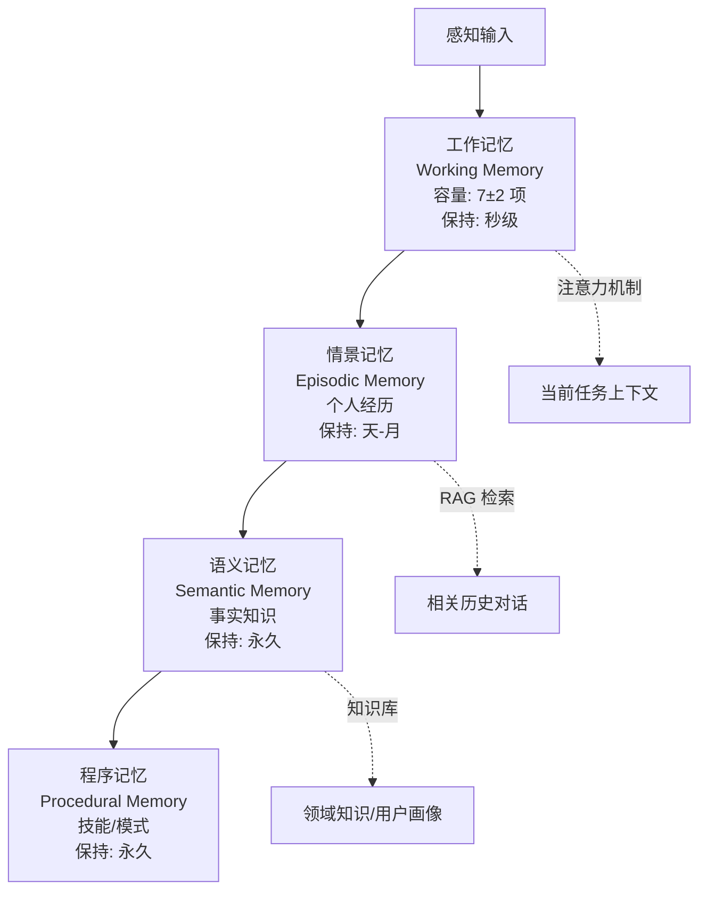
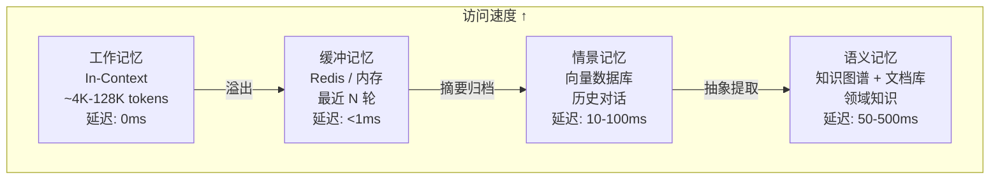
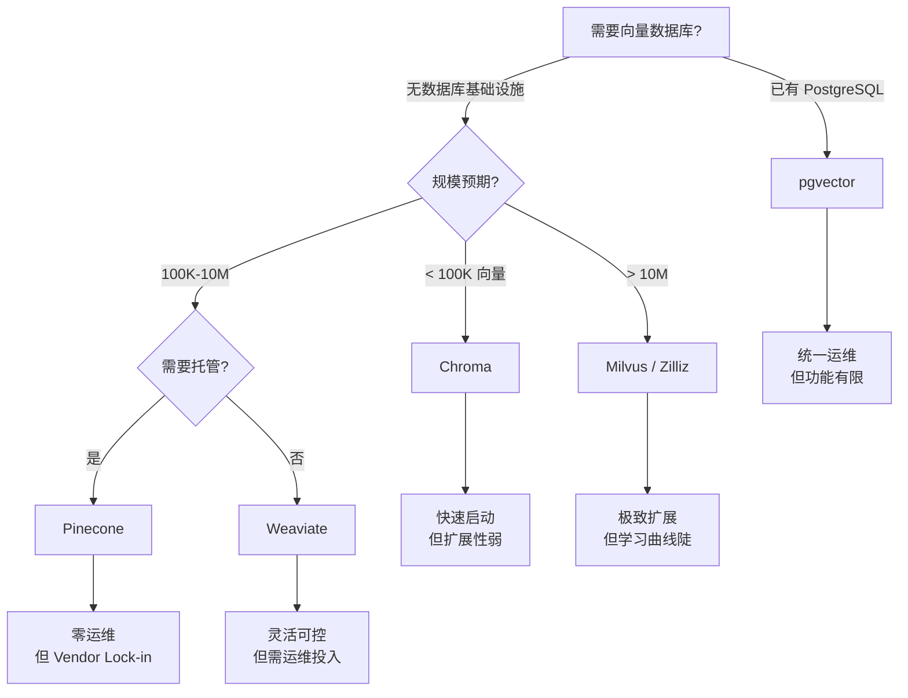
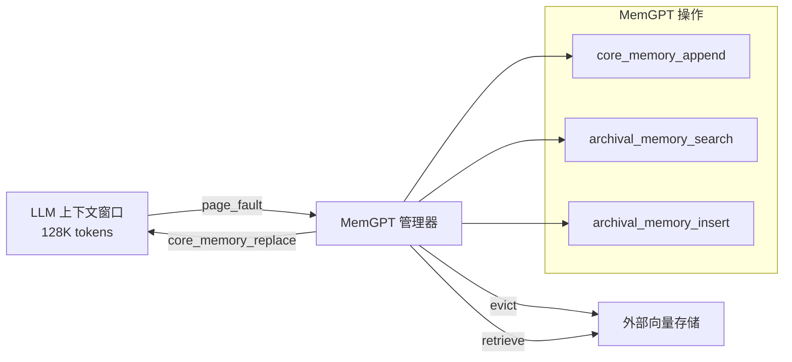

# 记忆管理（Memory Management）

## 定义

**记忆（Memory）** 是 Agent 保留、组织和检索过去交互信息的能力。与无状态 LLM 调用不同，记忆赋予 Agent 时间连续性——它能记住用户的偏好、之前的决策、对话上下文，甚至从错误中学习。记忆系统的质量直接决定 Agent 的个性化程度、任务完成率和用户信任度。

从认知科学视角，Agent 记忆可类比人类记忆的多层结构 [^1]：



[^1]: Atkinson, R.C. & Shiffrin, R.M. "Human Memory: A Proposed System and its Control Processes." *Psychology of Learning and Motivation*, 1968.

**核心设计挑战**：LLM 的上下文窗口是有限的（4K-2M tokens），而真实世界的交互历史是无限的。记忆系统必须在**信息保留**与**上下文效率**之间做持续权衡——保留太少，Agent 显得健忘；保留太多，关键信息被噪声淹没。

## 分层记忆架构

生产级 Agent 应采用四层记忆模型，每层有不同的存储介质、访问延迟和保留策略。



### 工作记忆（Working Memory）

工作记忆是当前 LLM 上下文窗口中的内容，是 Agent "此刻在想什么"。它容量最小但访问最快。

```python
from dataclasses import dataclass, field
from typing import List, Dict, Optional, Any
import time

@dataclass
class Message:
    role: str  # "user" | "assistant" | "system" | "tool"
    content: str
    timestamp: float = field(default_factory=time.time)
    metadata: Dict[str, Any] = field(default_factory=dict)

class WorkingMemory:
    """管理当前上下文窗口内的消息，支持智能截断。"""

    def __init__(self, max_tokens: int = 8000, reserved_tokens: int = 2000):
        self.max_tokens = max_tokens
        self.reserved = reserved_tokens  # 为响应保留的空间
        self.messages: List[Message] = []
        self._token_count = 0

    def add(self, message: Message) -> None:
        self.messages.append(message)
        self._token_count += self._estimate_tokens(message.content)
        self._evict_if_needed()

    def _estimate_tokens(self, text: str) -> int:
        # 粗略估计：中文 1 字 ≈ 1 token，英文 1 word ≈ 1.3 tokens
        # 生产环境应使用 tiktoken 或模型专用 tokenizer
        import re
        cn_chars = len(re.findall(r'[一-鿿]', text))
        en_words = len(re.findall(r'[a-zA-Z]+', text))
        return cn_chars + int(en_words * 1.3) + 3  # +3 for role overhead

    def _evict_if_needed(self) -> None:
        budget = self.max_tokens - self.reserved
        while self._token_count > budget and len(self.messages) > 2:
            # 保留 system message 和最近的用户-助手对
            removed = self.messages.pop(1)  # 移除最旧的用户/助手消息
            self._token_count -= self._estimate_tokens(removed.content)

    def get_context(self) -> List[Dict[str, str]]:
        return [
            {"role": m.role, "content": m.content}
            for m in self.messages
        ]

    def get_token_count(self) -> int:
        return self._token_count
```

**设计权衡**：工作记忆的 `max_tokens` 并非越大越好。过大的上下文会稀释注意力——研究表明 LLM 对上下文中间部分的召回率显著低于开头和结尾（"lost in the middle" 现象 [^2]）。建议将核心指令放在开头，最近交互放在末尾。

[^2]: Liu, N.F. et al. "Lost in the Middle: How Language Models Use Long Contexts." *TACL*, 2024.

### 缓冲记忆（Buffer Memory）

缓冲记忆存储最近 N 轮完整对话，作为工作记忆的"后备池"。当工作记忆溢出时，可从缓冲记忆中检索被丢弃但可能仍相关的信息。

```python
import json
from collections import deque
from typing import Iterator

class BufferMemory:
    """滑动窗口缓冲，保留最近 N 轮对话。"""

    def __init__(self, max_turns: int = 10):
        self.max_turns = max_turns
        self.turns: deque = deque(maxlen=max_turns)
        self._current_turn: List[Message] = []

    def add_message(self, message: Message) -> None:
        self._current_turn.append(message)
        if message.role == "assistant":
            self.turns.append(list(self._current_turn))
            self._current_turn = []

    def get_recent_turns(self, n: int = 3) -> Iterator[List[Message]]:
        """获取最近 N 轮对话。"""
        yield from list(self.turns)[-n:]

    def search(self, keyword: str) -> List[Message]:
        """简单关键词搜索缓冲中的消息。"""
        results = []
        for turn in self.turns:
            for msg in turn:
                if keyword.lower() in msg.content.lower():
                    results.append(msg)
        return results
```

### 情景记忆（Episodic Memory）

情景记忆存储跨会话的历史交互片段，通常使用向量数据库实现语义检索。这是 Agent "记住用户" 的核心机制。

```python
from typing import Protocol
import numpy as np

class VectorStore(Protocol):
    """向量存储抽象，便于切换底层实现。"""
    def add(self, texts: List[str], embeddings: List[List[float]], metadatas: List[dict]): ...
    def search(self, query_embedding: List[float], k: int = 5, filters: dict = None) -> List[dict]: ...
    def delete(self, ids: List[str]) -> int: ...

class EpisodicMemory:
    """基于向量检索的情景记忆。"""

    def __init__(self, store: VectorStore, embedding_fn, max_results: int = 5):
        self.store = store
        self.embed = embedding_fn
        self.max_results = max_results

    def store_interaction(
        self,
        user_message: str,
        assistant_response: str,
        session_id: str,
        importance: float = 1.0
    ) -> None:
        """存储一次完整交互。"""
        combined = f"User: {user_message}\nAssistant: {assistant_response}"
        embedding = self.embed(combined)
        self.store.add(
            texts=[combined],
            embeddings=[embedding],
            metadatas=[{
                "session_id": session_id,
                "timestamp": time.time(),
                "importance": importance,
                "user_msg": user_message,
                "assistant_msg": assistant_response,
            }]
        )

    def retrieve_relevant(
        self,
        query: str,
        session_id: str = None,
        k: int = None
    ) -> List[dict]:
        """检索与当前查询相关的历史交互。"""
        k = k or self.max_results
        query_embedding = self.embed(query)
        filters = {"session_id": session_id} if session_id else None
        return self.store.search(query_embedding, k=k, filters=filters)
```

### 语义记忆（Semantic Memory）

语义记忆存储从交互中抽象出的结构化知识——用户偏好、事实、规则。与情景记忆的"发生了什么"不同，语义记忆回答"什么是真的"。

```python
class SemanticMemory:
    """结构化知识存储，使用键值 + 知识图谱混合。"""

    def __init__(self):
        self.facts: Dict[str, Any] = {}  # 简单键值
        self.relationships: List[tuple] = []  # (subject, predicate, object)

    def store_fact(self, key: str, value: Any, confidence: float = 1.0, source: str = None):
        self.facts[key] = {
            "value": value,
            "confidence": confidence,
            "source": source,
            "updated_at": time.time(),
        }

    def store_relationship(self, subject: str, predicate: str, obj: str, confidence: float = 1.0):
        self.relationships.append((subject, predicate, obj, confidence))

    def query_fact(self, key: str) -> Optional[dict]:
        return self.facts.get(key)

    def query_relationships(self, subject: str = None, predicate: str = None) -> List[tuple]:
        return [
            r for r in self.relationships
            if (subject is None or r[0] == subject)
            and (predicate is None or r[1] == predicate)
        ]

    def get_user_profile(self) -> dict:
        """聚合用户的已知偏好和属性。"""
        return {
            k: v["value"] for k, v in self.facts.items()
            if k.startswith("user.")
        }
```

## 向量数据库选型对比

情景记忆和长期检索依赖向量数据库。不同数据库在延迟、成本、功能和运维复杂度上差异显著。

| 维度 | Pinecone | Weaviate | Chroma | Milvus/Zilliz | pgvector |
|------|----------|----------|--------|---------------|----------|
| **部署模式** | 全托管 SaaS | 自托管 / SaaS | 嵌入式 / 服务端 | 自托管 / 全托管 | PostgreSQL 扩展 |
| **延迟 (P99)** | <50ms | <20ms (本地) | <10ms (本地) | <30ms | <50ms |
| **最大维度** | 20,000 | 65,536 | 无硬性限制 | 32,768 | 16,000 |
| **混合搜索** | ✅ metadata + vector | ✅ BM25 + vector | ✅ 基础 | ✅ 多路召回 | ✅ 需额外插件 |
| **多租户隔离** | ✅ Namespace | ✅ Class 级别 | ⚠️ Collection | ✅ Partition | ✅ Row-level security |
| **成本模型** | 按存储 + 查询 | 按资源 | 开源免费 | 按资源 | 现有 PG 成本 |
| **运维复杂度** | 低 | 中 | 低 | 高 | 低 |
| **适合规模** | 生产级，任意规模 | 企业级，需要灵活性 | 原型 / 中小规模 | 大规模，十亿级 | PG 已有环境 |

### 选型决策树



### pgvector 快速示例

对于已有 PostgreSQL 基础设施的团队，pgvector 是最低摩擦的选择：

```python
import psycopg2
from psycopg2.extras import Json

class PgVectorStore:
    """基于 pgvector 的向量存储实现。"""

    def __init__(self, dsn: str, dimension: int = 1536):
        self.conn = psycopg2.connect(dsn)
        self.dimension = dimension
        self._ensure_table()

    def _ensure_table(self):
        with self.conn.cursor() as cur:
            cur.execute("CREATE EXTENSION IF NOT EXISTS vector")
            cur.execute(f"""
                CREATE TABLE IF NOT EXISTS memories (
                    id SERIAL PRIMARY KEY,
                    text TEXT NOT NULL,
                    embedding vector({self.dimension}),
                    metadata JSONB,
                    created_at TIMESTAMP DEFAULT NOW()
                )
            """)
            cur.execute("""
                CREATE INDEX IF NOT EXISTS idx_memories_embedding
                ON memories USING ivfflat (embedding vector_cosine_ops)
                WITH (lists = 100)
            """)
            self.conn.commit()

    def add(self, texts, embeddings, metadatas):
        with self.conn.cursor() as cur:
            for text, emb, meta in zip(texts, embeddings, metadatas):
                cur.execute(
                    "INSERT INTO memories (text, embedding, metadata) VALUES (%s, %s, %s)",
                    (text, str(emb), Json(meta))
                )
            self.conn.commit()

    def search(self, query_embedding, k=5, filters=None):
        with self.conn.cursor() as cur:
            where_clause = ""
            params = [str(query_embedding), k]
            if filters:
                conditions = []
                for key, value in filters.items():
                    conditions.append(f"metadata->>'{key}' = %s")
                    params.append(value)
                where_clause = "WHERE " + " AND ".join(conditions)

            cur.execute(f"""
                SELECT text, metadata, 1 - (embedding <=> %s::vector) as similarity
                FROM memories
                {where_clause}
                ORDER BY embedding <=> %s::vector
                LIMIT %s
            """, [str(query_embedding), str(query_embedding), k] + (params[2:] if filters else []))

            return [
                {"text": r[0], "metadata": r[1], "similarity": r[2]}
                for r in cur.fetchall()
            ]

    def delete(self, ids):
        with self.conn.cursor() as cur:
            cur.execute("DELETE FROM memories WHERE id = ANY(%s)", (ids,))
            self.conn.commit()
            return cur.rowcount
```

## 记忆衰减策略

并非所有记忆都同等重要。不加筛选的记忆积累会导致检索质量下降（"记忆污染"）。衰减策略决定哪些记忆保留、哪些淡化、哪些遗忘。

### 三维衰减模型

```python
import math
from dataclasses import dataclass

@dataclass
class MemoryScore:
    """记忆的综合保留评分。"""
    recency: float      # 时间衰减因子
    importance: float   # 重要性（由 LLM 或规则打分）
    frequency: float    # 访问频率
    final_score: float

class DecayStrategy:
    """基于三维模型的记忆衰减策略。"""

    def __init__(
        self,
        half_life_days: float = 7.0,      # 时间半衰期
        importance_boost: float = 2.0,     # 重要性权重
        frequency_boost: float = 1.5,      # 频率权重
        min_score_threshold: float = 0.1   # 低于此值可被清理
    ):
        self.half_life = half_life_days * 86400  # 转为秒
        self.importance_boost = importance_boost
        self.frequency_boost = frequency_boost
        self.min_threshold = min_score_threshold

    def compute_score(self, memory: dict, current_time: float) -> MemoryScore:
        age_seconds = current_time - memory.get("timestamp", current_time)
        recency = math.exp(-age_seconds / self.half_life * math.log(2))

        importance = memory.get("importance", 1.0)
        access_count = memory.get("access_count", 1)
        frequency = min(math.log1p(access_count), 3.0) / 3.0  # 归一化到 0-1

        final = (
            recency * 1.0 +
            importance * self.importance_boost +
            frequency * self.frequency_boost
        ) / (1 + self.importance_boost + self.frequency_boost)

        return MemoryScore(recency, importance, frequency, final)

    def should_retain(self, memory: dict, current_time: float) -> bool:
        score = self.compute_score(memory, current_time)
        return score.final_score >= self.min_threshold
```

### 重要性自动评分

让 LLM 评估每条记忆的重要性：

```python
IMPORTANCE_PROMPT = """评估以下对话片段的长期重要性。

规则：
- 1分：寒暄、礼貌用语、重复确认
- 3分：具体请求、临时偏好
- 5分：关键事实、持久偏好、重要决策
- 7分：身份敏感信息、长期约束
- 10分：安全红线、法律相关

对话：
{conversation}

只返回 1-10 的整数评分，无需解释。"""

async def score_importance(llm_client, user_msg: str, assistant_msg: str) -> int:
    conversation = f"User: {user_msg}\nAssistant: {assistant_msg}"
    response = await llm_client.complete(
        model="gpt-4o-mini",
        messages=[{"role": "user", "content": IMPORTANCE_PROMPT.format(conversation=conversation)}],
        max_tokens=3,
    )
    try:
        return min(max(int(response.strip()), 1), 10)
    except ValueError:
        return 3  # 默认中等重要性
```

**权衡**：自动评分增加存储延迟（每轮额外 LLM 调用），但显著提升长期检索质量。替代方案是使用规则启发式（关键词匹配、实体提取），延迟更低但准确度差。

## 记忆冲突解决

同一实体在不同时间可能产生矛盾信息。Agent 必须能检测冲突、评估可信度、决定当前应相信什么。

```python
from typing import List, Tuple
from dataclasses import dataclass
from enum import Enum

class ConflictResolution(Enum):
    LATEST_WINS = "latest"      # 最新信息优先
    HIGHEST_CONFIDENCE = "confidence"  # 高可信度优先
    MANUAL_REVIEW = "manual"    # 标记待人工确认
    MERGED = "merged"           # 保留所有，标记冲突

@dataclass
class FactVersion:
    value: Any
    timestamp: float
    confidence: float
    source: str

class ConflictResolver:
    """检测并解决记忆中的事实冲突。"""

    def __init__(self, strategy: ConflictResolution = ConflictResolution.LATEST_WINS):
        self.strategy = strategy
        self.facts: Dict[str, List[FactVersion]] = {}

    def store(self, key: str, value: Any, confidence: float = 1.0, source: str = "agent"):
        if key not in self.facts:
            self.facts[key] = []

        # 检测与现有值的冲突
        versions = self.facts[key]
        if versions:
            latest = versions[-1]
            if latest.value != value:
                resolved = self._resolve_conflict(key, latest, FactVersion(
                    value=value, timestamp=time.time(),
                    confidence=confidence, source=source
                ))
                if resolved:
                    versions.append(resolved)
            else:
                # 值未变，提升可信度
                latest.confidence = min(latest.confidence + 0.1, 1.0)
        else:
            versions.append(FactVersion(
                value=value, timestamp=time.time(),
                confidence=confidence, source=source
            ))

    def _resolve_conflict(
        self,
        key: str,
        old: FactVersion,
        new: FactVersion
    ) -> FactVersion:
        if self.strategy == ConflictResolution.LATEST_WINS:
            return new

        elif self.strategy == ConflictResolution.HIGHEST_CONFIDENCE:
            return old if old.confidence >= new.confidence else new

        elif self.strategy == ConflictResolution.MERGED:
            # 保留两者，标记冲突
            return FactVersion(
                value={
                    "_conflict": True,
                    "candidates": [
                        {"value": old.value, "since": old.timestamp, "source": old.source},
                        {"value": new.value, "since": new.timestamp, "source": new.source},
                    ]
                },
                timestamp=new.timestamp,
                confidence=max(old.confidence, new.confidence) * 0.9,  # 冲突降低可信度
                source="conflict_resolver"
            )

        elif self.strategy == ConflictResolution.MANUAL_REVIEW:
            # 标记待人工确认，暂用旧值
            self._flag_for_review(key, old, new)
            return old

    def get_current_value(self, key: str) -> Optional[Any]:
        versions = self.facts.get(key, [])
        if not versions:
            return None
        latest = versions[-1]
        if isinstance(latest.value, dict) and latest.value.get("_conflict"):
            # 冲突状态下，根据策略返回最新候选
            candidates = latest.value["candidates"]
            return candidates[-1]["value"]
        return latest.value

    def _flag_for_review(self, key: str, old: FactVersion, new: FactVersion):
        # 写入审核队列
        print(f"[REVIEW] Key '{key}' conflict: {old.value} -> {new.value}")
```

**关键洞察**：冲突解决策略应可配置。用户偏好变更（"我喜欢深色模式" → "换成浅色吧"）是正常的，而事实矛盾（"我的邮箱是 a@x.com" → "我的邮箱是 b@y.com"）需要谨慎处理。

## 记忆压缩与摘要策略

当记忆积累过多时，需要进行有损压缩。压缩策略决定了信息密度与保真度的权衡。

### 增量摘要

每 N 轮对话生成一次摘要，新摘要基于旧摘要 + 新对话：

```python
class IncrementalSummarizer:
    """增量式对话摘要，控制上下文长度。"""

    def __init__(self, llm_client, buffer_size: int = 6):
        self.llm = llm_client
        self.buffer_size = buffer_size
        self.running_summary: Optional[str] = None
        self.buffer: List[Message] = []

    def add(self, message: Message) -> None:
        self.buffer.append(message)
        if len(self.buffer) >= self.buffer_size * 2:  # user + assistant pairs
            self._summarize()

    def _summarize(self) -> None:
        conversation = "\n".join(
            f"{'User' if m.role == 'user' else 'Assistant'}: {m.content}"
            for m in self.buffer
        )

        if self.running_summary:
            prompt = f"""基于已有摘要和以下新对话，更新摘要。

已有摘要：
{self.running_summary}

新对话：
{conversation}

要求：
- 保留关键事实、用户偏好、决策结果
- 去除寒暄和重复内容
- 控制在 300 字以内
- 使用简洁的条目式"""
        else:
            prompt = f"""总结以下对话的关键信息：

{conversation}

要求：
- 提取用户意图、关键事实、达成的共识
- 控制在 300 字以内
- 使用条目式"""

        try:
            self.running_summary = self.llm.complete(
                messages=[{"role": "user", "content": prompt}],
                max_tokens=500,
            )
            self.buffer = []
        except Exception as e:
            # 摘要失败时保留 buffer，下次重试
            print(f"Summary failed: {e}")

    def get_summary(self) -> Optional[str]:
        return self.running_summary
```

### 层次摘要

对长期记忆构建多粒度摘要：日 → 周 → 月 → 永久档案：

```python
from datetime import datetime, timedelta

class HierarchicalSummary:
    """多粒度层次摘要系统。"""

    def __init__(self, llm_client):
        self.llm = llm_client
        self.daily: Dict[str, str] = {}    # YYYY-MM-DD -> summary
        self.weekly: Dict[str, str] = {}   # YYYY-WXX -> summary
        self.monthly: Dict[str, str] = {}  # YYYY-MM -> summary

    def add_day_summary(self, date: str, detail_summary: str):
        self.daily[date] = detail_summary
        self._rollup_if_needed(date)

    def _rollup_if_needed(self, date_str: str):
        date = datetime.strptime(date_str, "%Y-%m-%d")

        # 周日聚合为周摘要
        if date.weekday() == 6:  # Sunday
            week_key = date.strftime("%Y-W%U")
            week_summaries = [
                self.daily[d] for d in self.daily
                if datetime.strptime(d, "%Y-%m-%d").strftime("%Y-W%U") == week_key
            ]
            if week_summaries:
                self.weekly[week_key] = self._condense(week_summaries, "周")

        # 月末聚合为月摘要
        if date.day == (date + timedelta(days=1)).day - 1:  # 月末
            month_key = date.strftime("%Y-%m")
            month_summaries = [
                self.weekly[w] for w in self.weekly
                if w.startswith(month_key[:4]) and datetime.strptime(w + "-1", "%Y-W%U-%w").strftime("%Y-%m") == month_key
            ]
            if month_summaries:
                self.monthly[month_key] = self._condense(month_summaries, "月")

    def _condense(self, summaries: List[str], period: str) -> str:
        combined = "\n---\n".join(summaries)
        prompt = f"""将以下{period}度摘要进一步压缩为长期档案摘要。

输入：
{combined}

要求：
- 只保留最持久、最重要的信息
- 去除临时性、情境性内容
- 控制在 200 字以内"""
        try:
            return self.llm.complete(messages=[{"role": "user", "content": prompt}], max_tokens=400)
        except Exception:
            return combined[:500] + "..."

    def query(self, query: str, date_range: Tuple[str, str] = None) -> str:
        """根据查询和时间范围返回相关摘要。"""
        # 简单实现：返回最近日、周、月摘要的拼接
        parts = []
        if self.monthly:
            parts.append(f"长期档案：{list(self.monthly.values())[-1]}")
        if self.weekly:
            parts.append(f"本周概况：{list(self.weekly.values())[-1]}")
        if self.daily:
            parts.append(f"今日详情：{list(self.daily.values())[-1]}")
        return "\n\n".join(parts)
```

**权衡**：层次摘要显著减少存储量，但每一层压缩都伴随信息丢失。建议对高重要性记忆（用户偏好、关键决策）保留原始文本，仅对日常对话进行摘要压缩。

## 记忆隐私与安全

记忆系统存储用户交互历史，天然是敏感数据的聚合器。隐私设计不是附加功能，而是核心架构约束。

### 数据隔离

```python
import hashlib
from typing import Optional

class TenantIsolatedMemory:
    """多租户隔离的记忆系统。"""

    def __init__(self, vector_store: VectorStore, embedding_fn):
        self.store = vector_store
        self.embed = embedding_fn

    def _tenant_prefix(self, tenant_id: str) -> str:
        """生成租户隔离前缀。"""
        return hashlib.sha256(tenant_id.encode()).hexdigest()[:16]

    def store(
        self,
        tenant_id: str,
        content: str,
        metadata: dict = None
    ):
        """存储带租户隔离的记忆。"""
        meta = (metadata or {}).copy()
        meta["tenant_hash"] = self._tenant_prefix(tenant_id)
        meta["tenant_id_encrypted"] = self._encrypt_tenant_id(tenant_id)

        embedding = self.embed(content)
        self.store.add(
            texts=[content],
            embeddings=[embedding],
            metadatas=[meta]
        )

    def retrieve(self, tenant_id: str, query: str, k: int = 5):
        """仅检索当前租户的记忆。"""
        query_embedding = self.embed(query)
        return self.store.search(
            query_embedding,
            k=k,
            filters={"tenant_hash": self._tenant_prefix(tenant_id)}
        )

    def _encrypt_tenant_id(self, tenant_id: str) -> str:
        # 实际应使用 AES-256-GCM 或类似方案
        return tenant_id  # placeholder
```

### 敏感数据检测与脱敏

```python
import re
from typing import List, Tuple

class PiiDetector:
    """检测并脱敏记忆中的个人信息。"""

    PATTERNS = [
        ("email", re.compile(r'\b[A-Za-z0-9._%+-]+@[A-Za-z0-9.-]+\.[A-Z|a-z]{2,}\b')),
        ("phone", re.compile(r'\b1[3-9]\d{9}\b|\b\d{3}-\d{4}-\d{4}\b')),
        ("id_card", re.compile(r'\b\d{17}[\dXx]|\d{15}\b')),
        ("bank_card", re.compile(r'\b\d{16,19}\b')),
    ]

    def detect(self, text: str) -> List[Tuple[str, str, int, int]]:
        """返回检测到的 (类型, 匹配文本, 起始, 结束) 列表。"""
        findings = []
        for pii_type, pattern in self.PATTERNS:
            for match in pattern.finditer(text):
                findings.append((pii_type, match.group(), match.start(), match.end()))
        return findings

    def redact(self, text: str) -> Tuple[str, List[Tuple[str, str]]]:
        """脱敏并返回 (脱敏文本, [(类型, 原始值)])。原始值用于加密存储。"""
        findings = self.detect(text)
        redacted = text
        offset = 0
        preserved = []

        for pii_type, original, start, end in sorted(findings, key=lambda x: x[2]):
            placeholder = f"[{pii_type.upper()}_REDACTED]"
            redacted = redacted[:start + offset] + placeholder + redacted[end + offset:]
            offset += len(placeholder) - (end - start)
            preserved.append((pii_type, original))

        return redacted, preserved

# 使用：存储前脱敏，检索后按需还原
pii = PiiDetector()
clean_text, sensitive = pii.redact("我的邮箱是 user@example.com，电话 13800138000")
# clean_text: "我的邮箱是 [EMAIL_REDACTED]，电话 [PHONE_REDACTED]"
```

### 遗忘权实现（Right to be Forgotten）

GDPR 和类似法规要求支持用户数据的完全删除：

```python
class ForgettableMemory:
    """支持用户数据完全删除的记忆系统。"""

    def __init__(self, vector_store: VectorStore):
        self.store = vector_store
        self.deletion_log: List[dict] = []  # 审计用

    def forget_user(self, user_id: str) -> dict:
        """删除特定用户的所有记忆，返回删除统计。"""
        # 1. 查找该用户的所有记忆 ID
        all_memories = self.store.search(
            query_embedding=[0.0] * 1536,  # dummy，实际应通过 metadata 索引
            k=10000,
            filters={"user_id": user_id}
        )

        ids_to_delete = [m["id"] for m in all_memories]

        # 2. 执行删除
        deleted_count = self.store.delete(ids_to_delete)

        # 3. 记录审计日志（不含内容）
        self.deletion_log.append({
            "action": "user_forget",
            "user_id_hash": hashlib.sha256(user_id.encode()).hexdigest(),
            "deleted_count": deleted_count,
            "timestamp": time.time(),
            "operator": "system"
        })

        # 4. 向量数据库级联删除确认
        remaining = self.store.search(
            query_embedding=[0.0] * 1536,
            k=1,
            filters={"user_id": user_id}
        )

        return {
            "requested": len(ids_to_delete),
            "deleted": deleted_count,
            "verified_clean": len(remaining) == 0,
        }

    def forget_session(self, session_id: str) -> int:
        """删除特定会话的记忆。"""
        memories = self.store.search(
            query_embedding=[0.0] * 1536,
            k=10000,
            filters={"session_id": session_id}
        )
        return self.store.delete([m["id"] for m in memories])
```

**生产建议**：
1. 物理删除优于逻辑删除（标记删除），避免备份、日志中的数据残留
2. 删除操作需二次确认（"确认删除您的全部对话历史？此操作不可撤销。"）
3. 保留删除操作的审计日志（不含原始内容）以应对合规审查

## 开源方案分析

### MemGPT

MemGPT [^3] 是 UC Berkeley 提出的 LLM 记忆管理系统，核心思想是将 LLM 的有限上下文视为"操作系统内存"，通过显式的 `page_fault` 机制在快速上下文（RAM）和外部存储（磁盘）之间换入换出记忆。



**MemGPT 的核心机制**：
- **Core Memory**：固定大小的工作记忆（如 2000 tokens），分为 `human`（用户信息）和 `persona`（Agent 角色）两区
- **Archival Memory**：外部向量存储，通过 `archival_memory_search` 按需检索
- **Recall Memory**：消息历史的完整存储，支持按时间/关键词检索
- **Self-editing**：LLM 通过函数调用主动管理自己的记忆（"我觉得这个信息很重要，存到 core memory"）

**优势**：形式化地解决了上下文管理问题，有理论支撑；自管理减少了工程复杂度。

**局限**：LLM 自我管理的可靠性依赖模型能力；核心记忆大小固定，不适合需要大量上下文的任务。

[^3]: Packer, C. et al. "MemGPT: Towards LLMs as Operating Systems." *arXiv:2310.08560*, 2023.

### AgentMemory (Letta)

AgentMemory（原 MemGPT 团队后续项目，现 Letta）[^4] 扩展了 MemGPT 的思想，提供更完整的 Agent 记忆框架：

```python
# Letta 风格的多层记忆 API 示意
class LettaStyleMemory:
    """类似 Letta 的分层记忆接口。"""

    def __init__(self):
        self.block_size = 2000  # 每块记忆的大小限制
        self.blocks: Dict[str, List[str]] = {
            "human": [],       # 用户相关信息
            "persona": [],     # Agent 角色设定
            "tasks": [],       # 当前任务上下文
        }

    def core_memory_append(self, block_name: str, content: str):
        """向核心记忆块追加内容。"""
        if block_name not in self.blocks:
            raise ValueError(f"Unknown block: {block_name}")
        self.blocks[block_name].append(content)
        self._enforce_block_limit(block_name)

    def core_memory_replace(self, block_name: str, old_content: str, new_content: str):
        """替换核心记忆中的特定内容。"""
        block = self.blocks[block_name]
        if old_content in block:
            idx = block.index(old_content)
            block[idx] = new_content

    def archival_memory_insert(self, content: str, metadata: dict = None):
        """将内容存入长期档案记忆（向量数据库）。"""
        # 向量化并存储...
        pass

    def archival_memory_search(self, query: str, k: int = 5) -> List[dict]:
        """从档案记忆中语义检索。"""
        # 向量检索...
        pass

    def _enforce_block_limit(self, block_name: str):
        """确保块不超过大小限制。"""
        block = self.blocks[block_name]
        while sum(len(b) for b in block) > self.block_size and len(block) > 1:
            # 溢出时归档最旧条目
            oldest = block.pop(0)
            self.archival_memory_insert(oldest, {"source_block": block_name})
```

[^4]: Letta Documentation. https://docs.letta.com/, 2024.

### 方案对比

| 维度 | 自建系统 | MemGPT | Letta (AgentMemory) |
|------|---------|--------|---------------------|
| **控制权** | 完全可控 | 部分（LLM 自我管理） | 较高（可定制 block） |
| **运维成本** | 高 | 中 | 中 |
| **理论支撑** | 需自行设计 | 强（OS 类比） | 中 |
| **生产就绪** | 依赖实现 | 实验性 | 较成熟 |
| **扩展性** | 高 | 中 | 高 |
| **学习曲线** | 高 | 中 | 低 |

## 常见反模式与修复

| 反模式 | 问题 | 影响 | 修复方案 |
|--------|------|------|---------|
| **全量上下文** | 将所有历史直接塞入 LLM 上下文 | 超出 token 限制，推理质量下降 | 分层记忆 + 智能检索 |
| **无衰减策略** | 记忆无限累积，从不清理 | 检索噪声增加，存储成本飙升 | 三维衰减评分 + 定期清理 |
| **裸存 PII** | 用户敏感信息明文存储 | 合规风险，数据泄露放大 | 存储前 PII 检测 + 脱敏 |
| **单点向量库** | 所有记忆混存在一个集合 | 租户数据隔离缺失 | 按租户分集合 + metadata 过滤 |
| **检索即使用** | 向量检索 top-K 直接拼接 | 可能包含无关或过时信息 | 重排序（Rerank）+ 时效过滤 |
| **无冲突处理** | 新记忆直接覆盖旧记忆 | 用户偏好变更丢失或矛盾 | 版本化存储 + 冲突检测 |
| **摘要过度** | 所有记忆都摘要压缩 | 关键细节丢失 | 高重要性保留原文，低重要性摘要 |
| **无遗忘机制** | 不支持用户删除历史 | GDPR 违规风险 | 物理删除 + 审计日志 |

### 检索重排序示例

```python
class Reranker:
    """对向量检索结果进行二次排序，提升相关性。"""

    def __init__(self, cross_encoder):
        """cross_encoder: 如 sentence-transformers cross-encoder 模型。"""
        self.encoder = cross_encoder

    def rerank(self, query: str, candidates: List[dict], top_k: int = 3) -> List[dict]:
        if not candidates:
            return []

        # 构造 (query, document) 对
        pairs = [(query, c["text"]) for c in candidates]

        # 交叉编码器打分
        scores = self.encoder.predict(pairs)

        # 按分数排序
        scored = list(zip(candidates, scores))
        scored.sort(key=lambda x: x[1], reverse=True)

        return [c for c, _ in scored[:top_k]]
```

## 最佳实践总结

1. **分层架构**：工作记忆（上下文）→ 缓冲记忆（滑动窗口）→ 情景记忆（向量检索）→ 语义记忆（结构化知识），每层独立管理
2. **智能截断**：工作记忆溢出时优先丢弃低重要性、低相关性内容，保留 system prompt 和最近交互
3. **三维衰减**：基于时间、重要性、访问频率综合评分，定期清理低价值记忆
4. **冲突检测**：对同一实体的矛盾信息保持版本历史，根据策略（最新优先 / 最高可信度）解决
5. **渐进压缩**：高重要性记忆保留原文，日常对话做增量摘要，长期归档做层次压缩
6. **隐私优先**：存储前检测并脱敏 PII，多租户物理隔离，支持完整的遗忘权
7. **检索后处理**：向量检索后使用交叉编码器重排序，结合时效过滤和元数据筛选
8. **可观测性**：记录记忆的存储、检索、删除操作，支持调试和合规审计
9. **混合检索**：语义相似度 + 关键词匹配 + 时间衰减的混合排序，比纯向量检索更鲁棒
10. **评估闭环**：定期评估记忆检索的召回率和精确率，用真实用户查询作为测试集

## 延伸阅读

- [[01-工具设计]] — Agent 与外部系统交互的工具层设计
- [[02-函数调用]] — LLM Function Calling 实现细节与状态管理
- [[00-组件总览]] — 核心组件全景图
- RAG 架构 — 检索增强生成，详见本文[情景记忆](#情景记忆episodic-memory)与[向量数据库选型](#向量数据库选型对比)章节
- [[08-自主Agent]] — 长期学习与记忆在自主 Agent 中的应用
- [[05-MCP协议]] — 标准化记忆/上下文协议
