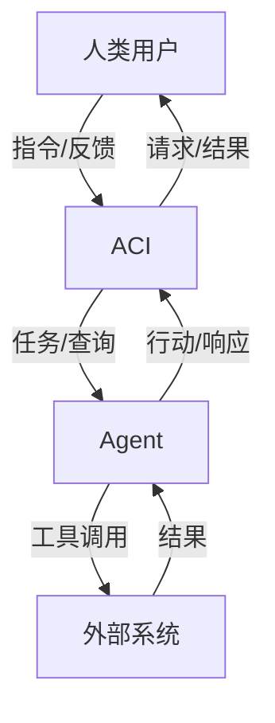
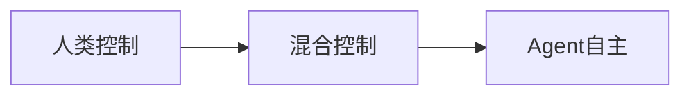
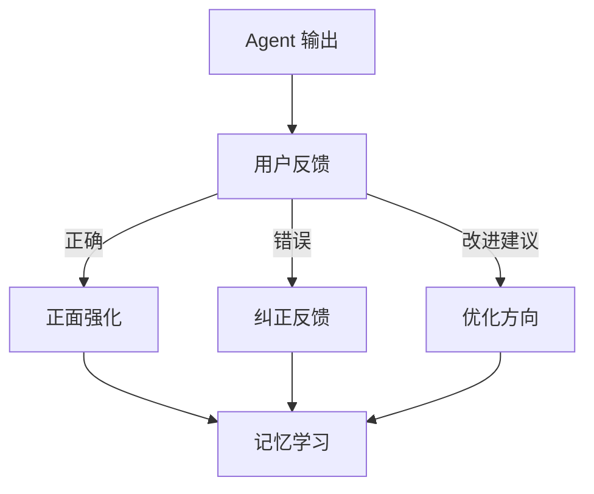

# ACI 设计（Agent-Computer Interface）

## 定义

**ACI（Agent-Computer Interface）** 是 Agent 与人类用户或计算机系统交互的接口。与 GUI（图形用户界面）不同，ACI 关注的是人与 Agent 之间的**控制权分配**、**信息交换**和**协作模式**。



## 交互模式

### 1. 直接指令（Direct Command）

用户给出明确指令，Agent 执行并返回结果。

```
用户: "查询北京明天天气"
Agent: "北京明天晴，25°C"
```

特点：简单直接，适合明确任务。

### 2. 对话式（Conversational）

多轮对话，Agent 通过追问澄清需求。

```
用户: "帮我订机票"
Agent: "请问从哪里出发，目的地是哪里？"
用户: "北京到上海"
Agent: "请确认出行日期？"
```

特点：适合信息不完整的场景。

### 3. 协作式（Collaborative）

Agent 和用户共同完成任务，Agent 提出建议。

```
Agent: "我为您生成了3个方案，请查看：
[方案A] [方案B] [方案C]
您可以选择或要求我调整。"
用户: "方案B不错，但价格能否再优化？"
```

特点：适合创意和决策任务。

### 4. 监督式（Supervisory）

Agent 自主执行，关键决策需人类确认。

```
Agent: "我将执行以下操作：
1. 删除用户订单 #12345
2. 发送退款通知

请确认是否继续？[确认/取消]"
```

特点：适合敏感操作。

## 控制权分配模式



| 模式 | 人类角色 | Agent 角色 | 适用场景 |
|------|---------|-----------|---------|
| **人类主导** | 决策者 | 执行者 | 敏感操作、高风险任务 |
| **人机协作** | 监督者 | 建议者 | 创意工作、方案设计 |
| **Agent 主导** | 设定目标 | 自主执行 | 重复性任务、信息查询 |
| **完全自主** | 事后审查 | 全程自主 | 监控、预警、自动化运维 |

## Human-in-the-Loop 设计

在关键节点引入人类决策：

```python
class HumanInTheLoop:
    def __init__(self, approval_rules):
        self.rules = approval_rules
    
    def check_approval_needed(self, action: dict) -> bool:
        """判断是否需要人工审批"""
        return any(rule.matches(action) for rule in self.rules)
    
    def request_approval(self, action: dict) -> bool:
        """请求人工审批"""
        if not self.check_approval_needed(action):
            return True
        
        # 发送审批请求（UI 通知、邮件、消息等）
        send_notification(
            f"Agent 请求执行操作：{action['description']}",
            action=action,
        )
        
        # 等待审批结果
        return wait_for_approval(timeout=300)

# 审批规则示例
rules = [
    ApprovalRule(
        condition=lambda a: a["type"] == "payment" and a["amount"] > 1000,
        description="大额支付需审批",
    ),
    ApprovalRule(
        condition=lambda a: a["type"] == "delete",
        description="删除操作需审批",
    ),
]
```

## 透明度设计

用户需要理解 Agent 在做什么：

### 思维展示（Chain of Thought Display）

```
用户: "为什么推荐这个方案？"

Agent: "我的推理过程：
1. 您要求：预算5000元以内，性能优先
2. 我筛选了3款符合条件的商品
3. 对比参数后，A 的性价比最高（评分 9.2/10）
4. 用户评价也确认其稳定性好"
```

### 执行轨迹

```
Agent: "我正在为您查询...
✓ 搜索数据库（找到 15 条记录）
✓ 筛选有效记录（剩余 8 条）
⏳ 按评分排序中..."
```

## 反馈机制



```python
class FeedbackSystem:
    def collect_feedback(self, interaction_id: str, feedback_type: str, comment: str = None):
        """收集用户反馈"""
        feedback = {
            "interaction_id": interaction_id,
            "type": feedback_type,  # positive / negative / correction
            "comment": comment,
            "timestamp": now(),
        }
        self.store.save(feedback)
    
    def apply_feedback(self, agent):
        """将反馈应用到 Agent"""
        recent_feedback = self.store.get_recent(k=100)
        
        # 分析负面反馈模式
        patterns = analyze_patterns(recent_feedback)
        
        # 调整 Agent 行为
        for pattern in patterns:
            agent.adjust_behavior(pattern)
```

## 最佳实践

1. **渐进式放权**：从人类主导开始，逐步增加 Agent 自主性
2. **明确边界**：清晰告知用户 Agent 的能力和限制
3. **可中断**：用户随时可以暂停或接管 Agent
4. **撤销支持**：支持撤销 Agent 的操作
5. **多模态交互**：支持文本、语音、图像等多种交互方式

## 延伸阅读

- [[00-组件总览]] — 核心组件全景图
- [[03-记忆管理]] — 交互中的记忆设计
- [[03-人类介入设计]] — Human-in-the-Loop 详细模式
