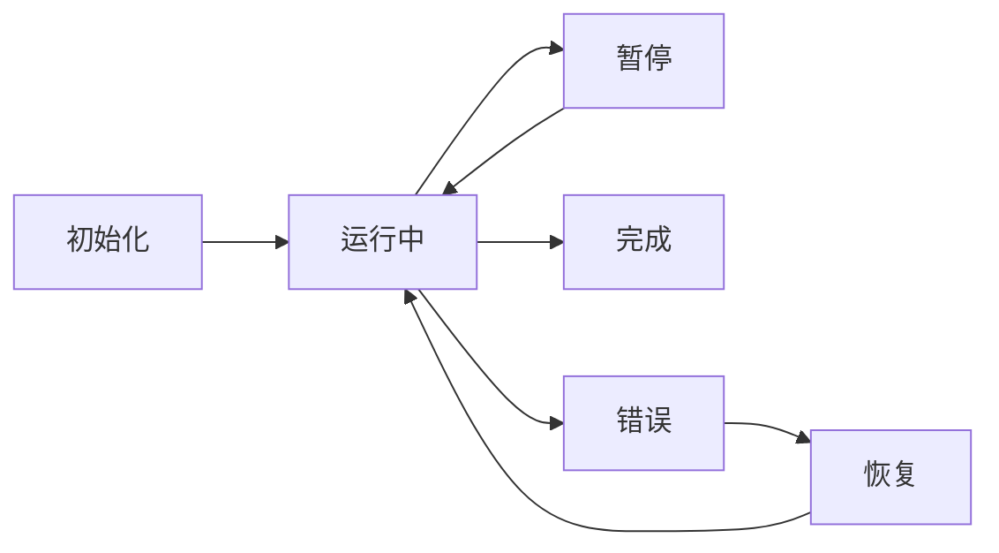
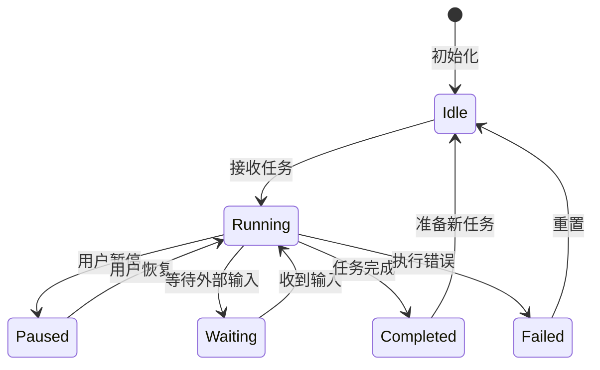

# 状态管理（State Management）

## 定义

**状态管理（State Management）** 是跟踪和维护 Agent 在生命周期中的状态，包括会话状态、任务状态、执行上下文等。良好的状态管理使 Agent 系统具备可靠性、可恢复性和可观测性。



## 状态类型

### 1. 会话状态（Session State）

单个用户会话的上下文信息。

```python
from dataclasses import dataclass, field
from typing import List, Dict, Optional
from datetime import datetime

@dataclass
class SessionState:
    session_id: str
    user_id: str
    created_at: datetime
    last_active: datetime
    messages: List[dict] = field(default_factory=list)
    metadata: Dict = field(default_factory=dict)
    status: str = "active"  # active, paused, ended
    
    def to_dict(self) -> dict:
        return {
            "session_id": self.session_id,
            "user_id": self.user_id,
            "created_at": self.created_at.isoformat(),
            "last_active": self.last_active.isoformat(),
            "messages": self.messages,
            "metadata": self.metadata,
            "status": self.status,
        }
```

### 2. 任务状态（Task State）

Agent 执行任务的进度和上下文。

```python
@dataclass
class TaskState:
    task_id: str
    type: str
    status: str  # pending, running, paused, completed, failed
    progress: float  # 0.0 - 1.0
    steps: List[dict] = field(default_factory=list)
    current_step: int = 0
    result: Optional[dict] = None
    error: Optional[str] = None
    
    def add_step(self, action: str, result: dict):
        self.steps.append({
            "index": len(self.steps),
            "action": action,
            "result": result,
            "timestamp": datetime.now().isoformat(),
        })
        self.current_step = len(self.steps)
        self.progress = self.current_step / self.estimated_total_steps
```

### 3. Agent 状态（Agent State）

Agent 实例的运行时状态。

```python
@dataclass
class AgentState:
    agent_id: str
    type: str
    status: str  # idle, busy, error, shutdown
    current_task: Optional[str] = None
    memory_snapshot: dict = field(default_factory=dict)
    tool_calls_count: int = 0
    total_tokens_used: int = 0
```

## 状态机设计



## 持久化与恢复

### 检查点（Checkpoint）

定期保存状态，支持故障恢复。

```python
class CheckpointManager:
    def __init__(self, storage, interval=60):
        self.storage = storage
        self.interval = interval
        self.last_checkpoint = 0
    
    async def checkpoint(self, state: dict):
        """保存检查点"""
        checkpoint = {
            "timestamp": time.time(),
            "state": state,
            "version": "1.0",
        }
        await self.storage.save(
            f"checkpoint_{state['session_id']}",
            checkpoint,
        )
    
    async def restore(self, session_id: str) -> Optional[dict]:
        """从检查点恢复"""
        checkpoint = await self.storage.load(
            f"checkpoint_{session_id}"
        )
        if checkpoint:
            return checkpoint["state"]
        return None
```

### 状态恢复流程

```python
class ResumableAgent:
    async def run_with_recovery(self, task: str, session_id: str = None):
        # 尝试恢复已有会话
        if session_id:
            state = await self.checkpoint_manager.restore(session_id)
            if state:
                self.load_state(state)
                logger.info(f"恢复会话 {session_id}")
        
        try:
            result = await self.execute(task)
            return result
        except Exception as e:
            # 保存错误状态
            await self.checkpoint_manager.checkpoint(self.get_state())
            raise
```

## LangGraph 状态管理

LangGraph 提供了强大的状态管理抽象：

```python
from langgraph.graph import StateGraph
from typing import TypedDict, Annotated
import operator

class AgentState(TypedDict):
    messages: Annotated[list, operator.add]
    next_step: str
    tool_results: list
    iteration: int

builder = StateGraph(AgentState)

# 节点可以读取和修改状态
def agent_node(state: AgentState):
    # 读取当前状态
    messages = state["messages"]
    iteration = state["iteration"]
    
    # LLM 推理
    response = llm.invoke(messages)
    
    # 返回状态更新（会自动合并到全局状态）
    return {
        "messages": [response],
        "iteration": iteration + 1,
    }

builder.add_node("agent", agent_node)
```

## 最佳实践

1. **状态不可变**：状态更新创建新状态，保留历史版本
2. **最小化状态**：只保存必要信息，减少序列化开销
3. **版本控制**：状态结构变更时保持向后兼容
4. **加密敏感字段**：用户隐私数据加密存储
5. **TTL 管理**：过期状态自动清理

## 延伸阅读

- [[00-组件总览]] — 核心组件全景图
- [[03-记忆管理]] — 状态与记忆的关系
- [[02-LangGraph]] — 框架级状态管理
