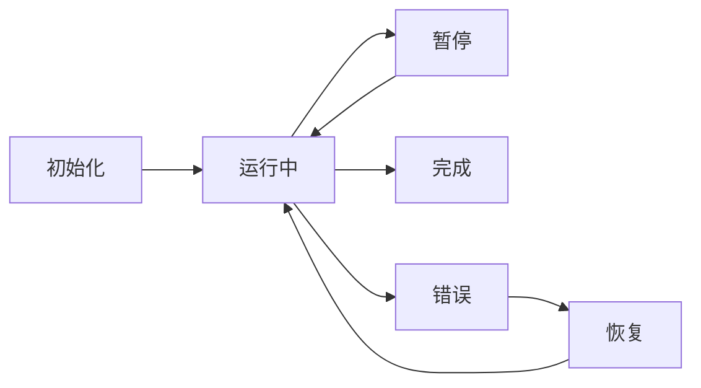
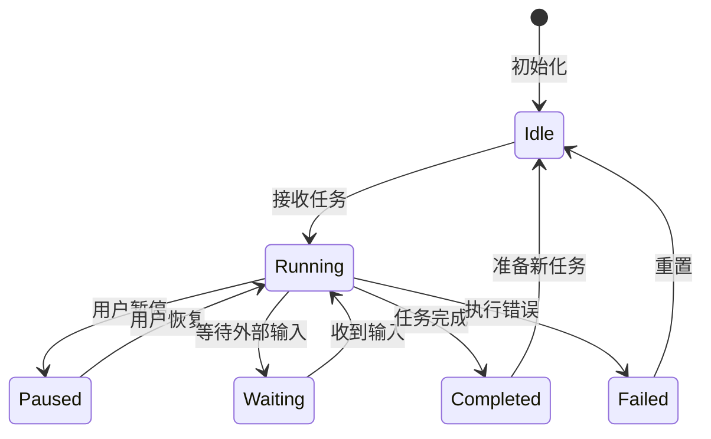

# 状态管理（State Management）

## 定义

**状态管理（State Management）** 是跟踪和维护 Agent 在生命周期中的状态，包括会话状态、任务状态、执行上下文等。良好的状态管理使 Agent 系统具备可靠性、可恢复性和可观测性。



## 状态类型

### 1. 会话状态（Session State）

单个用户会话的上下文信息。

```python
from dataclasses import dataclass, field
from typing import List, Dict, Optional
from datetime import datetime

@dataclass
class SessionState:
    session_id: str
    user_id: str
    created_at: datetime
    last_active: datetime
    messages: List[dict] = field(default_factory=list)
    metadata: Dict = field(default_factory=dict)
    status: str = "active"  # active, paused, ended
    
    def to_dict(self) -> dict:
        return {
            "session_id": self.session_id,
            "user_id": self.user_id,
            "created_at": self.created_at.isoformat(),
            "last_active": self.last_active.isoformat(),
            "messages": self.messages,
            "metadata": self.metadata,
            "status": self.status,
        }
```

### 2. 任务状态（Task State）

Agent 执行任务的进度和上下文。

```python
@dataclass
class TaskState:
    task_id: str
    type: str
    status: str  # pending, running, paused, completed, failed
    progress: float  # 0.0 - 1.0
    steps: List[dict] = field(default_factory=list)
    current_step: int = 0
    result: Optional[dict] = None
    error: Optional[str] = None
    
    def add_step(self, action: str, result: dict):
        self.steps.append({
            "index": len(self.steps),
            "action": action,
            "result": result,
            "timestamp": datetime.now().isoformat(),
        })
        self.current_step = len(self.steps)
        self.progress = self.current_step / self.estimated_total_steps
```

### 3. Agent 状态（Agent State）

Agent 实例的运行时状态。

```python
@dataclass
class AgentState:
    agent_id: str
    type: str
    status: str  # idle, busy, error, shutdown
    current_task: Optional[str] = None
    memory_snapshot: dict = field(default_factory=dict)
    tool_calls_count: int = 0
    total_tokens_used: int = 0
```

## 状态机设计



## 持久化与恢复

### 检查点（Checkpoint）

定期保存状态，支持故障恢复。

```python
class CheckpointManager:
    def __init__(self, storage, interval=60):
        self.storage = storage
        self.interval = interval
        self.last_checkpoint = 0
    
    async def checkpoint(self, state: dict):
        """保存检查点"""
        checkpoint = {
            "timestamp": time.time(),
            "state": state,
            "version": "1.0",
        }
        await self.storage.save(
            f"checkpoint_{state['session_id']}",
            checkpoint,
        )
    
    async def restore(self, session_id: str) -> Optional[dict]:
        """从检查点恢复"""
        checkpoint = await self.storage.load(
            f"checkpoint_{session_id}"
        )
        if checkpoint:
            return checkpoint["state"]
        return None
```

### 状态恢复流程

```python
class ResumableAgent:
    async def run_with_recovery(self, task: str, session_id: str = None):
        # 尝试恢复已有会话
        if session_id:
            state = await self.checkpoint_manager.restore(session_id)
            if state:
                self.load_state(state)
                logger.info(f"恢复会话 {session_id}")
        
        try:
            result = await self.execute(task)
            return result
        except Exception as e:
            # 保存错误状态
            await self.checkpoint_manager.checkpoint(self.get_state())
            raise
```

## LangGraph 状态管理

LangGraph 提供了强大的状态管理抽象：

```python
from langgraph.graph import StateGraph
from typing import TypedDict, Annotated
import operator

class AgentState(TypedDict):
    messages: Annotated[list, operator.add]
    next_step: str
    tool_results: list
    iteration: int

builder = StateGraph(AgentState)

# 节点可以读取和修改状态
def agent_node(state: AgentState):
    # 读取当前状态
    messages = state["messages"]
    iteration = state["iteration"]
    
    # LLM 推理
    response = llm.invoke(messages)
    
    # 返回状态更新（会自动合并到全局状态）
    return {
        "messages": [response],
        "iteration": iteration + 1,
    }

builder.add_node("agent", agent_node)
```

## 反模式与修复

| 反模式 | 问题描述 | 影响 | 修复方案 |
|--------|----------|------|----------|
| **无状态持久化** | Agent 状态仅保存在内存中，不写入外部存储 | 进程崩溃或重启后所有会话丢失，用户被迫从头开始；无法支持分布式部署和水平扩展 | 使用数据库（Redis/PostgreSQL）或检查点机制定期持久化状态，支持从断点恢复 |
| **状态更新竞态条件** | 多个并发请求同时读写同一状态对象，不加锁或乐观锁保护 | 数据覆盖、状态不一致、任务进度丢失；在多轮对话中表现为消息顺序错乱或上下文丢失 | 使用乐观锁（版本号/CAS）或分布式锁保护状态写入；对高频更新场景采用事件溯源模式，将状态变更记录为不可变事件流 |
| **会话间状态泄露** | 全局变量或单例对象中存储了会话级状态，导致不同用户的上下文互相污染 | 用户 A 看到用户 B 的对话历史或私有数据，引发严重的隐私和安全问题 | 严格区分全局状态和会话状态；会话状态以 session_id 为 key 隔离存储；使用请求级别的上下文对象传递状态 |
| **状态结构无版本控制** | 状态数据结构频繁变更但不记录版本号，旧格式数据无法被新代码解析 | 系统升级后历史会话无法恢复，只能强制用户重新开始；回滚部署时新格式数据又无法被旧代码读取 | 为状态结构添加版本号字段；实现向前/向后兼容的序列化/反序列化逻辑；部署迁移脚本在启动时自动升级旧状态 |
| **无限增长的状态** | 消息历史、工具调用记录等只追加不清理，状态对象随时间无限膨胀 | 内存溢出、序列化/反序列化耗时激增、上下文窗口被撑满导致 LLM 推理质量下降 | 实施 TTL 自动清理策略；对消息历史做滑动窗口截断；将历史详情归档到冷存储，状态中只保留摘要，参考 [[03-记忆管理]] 中的记忆压缩策略 |
| **无错误状态恢复** | Agent 执行失败后状态停留在错误中间态，没有回滚或重试机制 | Agent 卡在错误状态无法继续，用户只能手动重置；批量任务中一个步骤失败导致整个流程作废 | 实现状态机的错误-恢复转换；失败时保存检查点并支持从上一个安全点重试；对可补偿操作实现 saga 模式回滚，参见 [[02-LangGraph]] 中的状态图错误处理 |

**无状态持久化**是状态管理中最基础也最致命的反模式。在实际生产环境中，进程重启是常态而非异常——无论是部署更新、自动扩缩容还是 OOM Killer 触发的进程回收，都可能导致内存中的状态丢失。一个没有持久化的 Agent 在每次重启后都会丢失所有进行中的任务，这对用户体验的打击是毁灭性的。正确的实现应该在设计初期就将持久化作为一等公民：选择合适的后端（Redis 用于高频读写、PostgreSQL 用于结构化查询、S3 用于大对象），并确保每次关键状态转换都有对应的写入操作。

**状态更新竞态条件**在多线程/多协程环境中尤为危险。考虑一个场景：Agent 正在执行工具调用，同时另一个请求尝试暂停该任务。如果状态更新不是原子的，可能出现任务状态变为"暂停"但工具仍在执行的情况，导致资源泄漏。解决方案是采用事件溯源（Event Sourcing）模式——不直接修改状态，而是追加状态变更事件，通过回放事件序列重建当前状态。这不仅保证了原子性，还天然支持时间旅行调试和审计，与 [[02-LangGraph]] 的状态图模型理念一致。

## 最佳实践

1. **状态不可变**：状态更新创建新状态，保留历史版本
2. **最小化状态**：只保存必要信息，减少序列化开销
3. **版本控制**：状态结构变更时保持向后兼容
4. **加密敏感字段**：用户隐私数据加密存储
5. **TTL 管理**：过期状态自动清理

## 延伸阅读

- [[00-组件总览]] — 核心组件全景图
- [[03-记忆管理]] — 状态与记忆的关系
- [[02-LangGraph]] — 框架级状态管理
