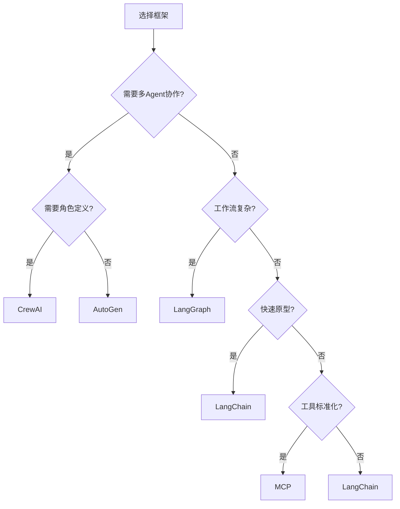

# 框架对比

## 主流框架概览

| 框架 | 开发方 | 核心定位 | 编程语言 | 适用场景 |
|------|--------|---------|---------|---------|
| [[01-LangChain]] | LangChain Inc. | LLM 应用编排 | Python/JS | 通用 LLM 应用 |
| [[02-LangGraph]] | LangChain Inc. | 状态机编排 | Python/JS | 复杂工作流 |
| [[03-AutoGen]] | Microsoft | 多 Agent 对话 | Python | 多 Agent 协作 |
| [[04-CrewAI]] | CrewAI Inc. | 角色驱动团队 | Python | 团队协作任务 |
| [[05-MCP协议]] | Anthropic | 开放协议 | 多语言 | 工具标准化 |

## 核心能力对比

| 维度 | LangChain | LangGraph | AutoGen | CrewAI | MCP |
|------|-----------|-----------|---------|--------|-----|
| **学习曲线** | 中 | 陡 | 中 | 平缓 | 平缓 |
| **工作流控制** | 链式 | 状态机 | 对话驱动 | 角色驱动 | 协议级 |
| **多 Agent** | 有限 | 支持 | 核心能力 | 核心能力 | 间接支持 |
| **工具生态** | 丰富 | 丰富 | 中等 | 中等 | 标准化 |
| **调试体验** | 好 | 好 | 一般 | 好 | — |
| **社区规模** | 最大 | 大 | 中 | 小 | 增长中 |

## 选型决策树



## 框架组合策略

实际项目中，框架往往组合使用：

```python
# LangChain + LangGraph：核心工作流
# AutoGen：多 Agent 对话层
# MCP：工具标准化接口

from langgraph.graph import StateGraph
from autogen import ConversableAgent
from mcp import Client

# 用 LangGraph 管理状态
graph = StateGraph(State)

# 用 AutoGen 实现多 Agent 对话
agent_a = ConversableAgent("agent_a")
agent_b = ConversableAgent("agent_b")

# 用 MCP 连接外部工具
mcp_client = Client()
tools = mcp_client.list_tools()
```

## 迁移成本

| 迁移方向 | 难度 | 说明 |
|---------|------|------|
| 裸 LLM → LangChain | 低 | 引入链式抽象 |
| LangChain → LangGraph | 中 | 增加状态机概念 |
| 任何 → MCP | 低 | 在工具层接入 |
| LangChain → AutoGen | 高 | 架构范式不同 |

## 反模式与修复

| 反模式 | 问题描述 | 影响 | 修复方案 |
|--------|----------|------|----------|
| 需求不明就选框架 | 未充分理解业务需求就选定框架，跳过了原型验证阶段 | 框架能力与实际需求错配，后期迁移成本高，项目延期 | 先用裸 LLM SDK 构建原型，验证核心逻辑后再按[[选型决策树]]选型 |
| 过度框架化 | 简单的 LLM 调用也要引入完整框架（如 LangChain + LangGraph） | 启动延迟增加 200-500ms，依赖膨胀，调试困难，团队学习成本高 | 直接使用 OpenAI/Anthropic SDK，仅在链式逻辑或状态机需求时引入框架 |
| 盲目追求全面覆盖 | 同时引入 LangChain + AutoGen + CrewAI 而不考虑维护成本 | 依赖冲突频发、团队需学习多套范式、调试时无法确定问题出在哪个框架 | 选择 1-2 个核心框架，其他场景用轻量方案或 MCP 工具层补充 |
| 硬绑定单一框架 | 业务逻辑与框架 API 深度耦合（如直接依赖 LangChain 的 Chain 类型） | 框架弃用或重大 API 变更时迁移代价极高，参考迁移成本表 | 用适配器模式隔离框架依赖，业务逻辑保持框架无关，通过接口抽象解耦 |
| 忽略组合策略 | 把一个框架当作万能解决方案，如用 LangChain 处理所有场景 | 用不擅长的方式解决问题（如用 Chain 做复杂循环），效果差且代码臃肿 | 了解各框架优势，采用组合策略：LangGraph 编排 + [[05-MCP协议\|MCP]] 工具标准化 |
| 忽视版本锁定策略 | 开发环境使用最新版框架，未在 `poetry.lock` 中锁定版本号 | CI/CD 与开发环境版本不一致，生产环境因 API 变更崩溃，紧急回滚 | 使用 `poetry.lock` / `requirements.txt` 锁定所有依赖版本，定期评估升级 |

框架选型中最关键的反模式是"需求不明就选框架"和"过度框架化"。很多团队在项目初期就引入过多框架，导致项目复杂度远超实际需求。正确做法是从最简单的方案开始——直接用 LLM SDK 调用模型，当链式逻辑变复杂时引入 [[01-LangChain]]，当需要循环和状态管理时再升级到 [[02-LangGraph]]，当需要多 Agent 协作时引入 [[03-AutoGen]] 或 [[04-CrewAI]]。

另一个高频问题是"硬绑定单一框架"。在实际项目中，框架的 API 可能发生重大变更（LangChain 从 v0.1 到 v0.2 的迁移就是典型案例），如果业务逻辑直接依赖框架内部类型，一次 API 升级就可能需要重写大量代码。推荐用适配器模式隔离框架依赖——业务逻辑定义接口，框架实现接口，这样换框架只需替换适配器层。

## 最佳实践

1. **从简单开始**：先用 LangChain 快速验证想法
2. **按需升级**：工作流复杂时引入 LangGraph
3. **工具标准化**：使用 MCP 降低工具迁移成本
4. **不要过度框架化**：简单任务直接用 SDK 调用 LLM

## 延伸阅读

- [[01-LangChain]] — LangChain 详解
- [[02-LangGraph]] — LangGraph 详解
- [[03-AutoGen]] — AutoGen 详解
- [[04-CrewAI]] — CrewAI 详解
- [[05-MCP协议]] — MCP 协议详解
