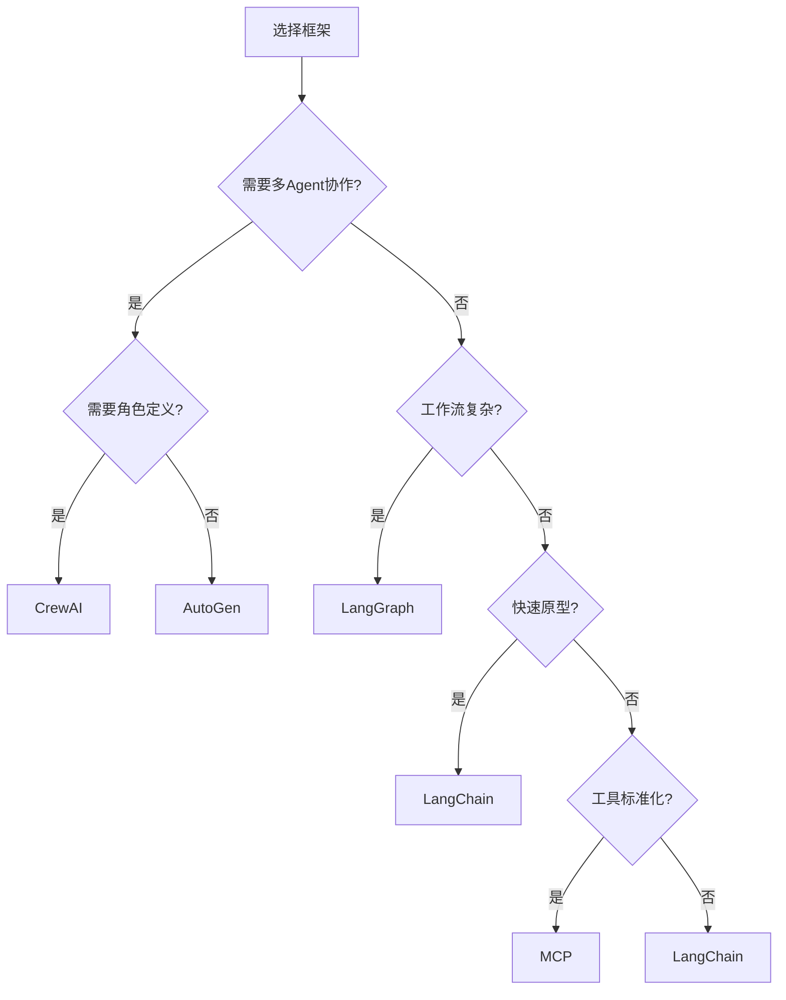

# 框架对比

## 主流框架概览

| 框架 | 开发方 | 核心定位 | 编程语言 | 适用场景 |
|------|--------|---------|---------|---------|
| [[01-LangChain]] | LangChain Inc. | LLM 应用编排 | Python/JS | 通用 LLM 应用 |
| [[02-LangGraph]] | LangChain Inc. | 状态机编排 | Python/JS | 复杂工作流 |
| [[03-AutoGen]] | Microsoft | 多 Agent 对话 | Python | 多 Agent 协作 |
| [[04-CrewAI]] | CrewAI Inc. | 角色驱动团队 | Python | 团队协作任务 |
| [[05-MCP协议]] | Anthropic | 开放协议 | 多语言 | 工具标准化 |

## 核心能力对比

| 维度 | LangChain | LangGraph | AutoGen | CrewAI | MCP |
|------|-----------|-----------|---------|--------|-----|
| **学习曲线** | 中 | 陡 | 中 | 平缓 | 平缓 |
| **工作流控制** | 链式 | 状态机 | 对话驱动 | 角色驱动 | 协议级 |
| **多 Agent** | 有限 | 支持 | 核心能力 | 核心能力 | 间接支持 |
| **工具生态** | 丰富 | 丰富 | 中等 | 中等 | 标准化 |
| **调试体验** | 好 | 好 | 一般 | 好 | — |
| **社区规模** | 最大 | 大 | 中 | 小 | 增长中 |
| **生产就绪度** | 高 | 高 | 中 | 中 | 高 |

## 选型决策树



## 框架组合策略

实际项目中，框架往往组合使用。关键是明确每个框架的职责边界：

```python
# LangGraph + MCP：状态机编排 + 工具标准化
from langgraph.graph import StateGraph
from mcp import Client

# 用 LangGraph 管理工作流状态
graph = StateGraph(State)

# 用 MCP 连接标准化工具
mcp_client = Client()
tools = mcp_client.list_tools()

# 将 MCP 工具注册为 LangGraph 节点
for tool in tools:
    graph.add_node(tool.name, create_tool_node(tool))
```

```python
# AutoGen + LangChain：多 Agent 对话 + 工具链
from autogen import ConversableAgent
from langchain.tools import Tool

# LangChain 提供工具实现
search_tool = Tool("search", func=search_api, description="搜索 API")

# AutoGen 管理多 Agent 对话
agent_a = ConversableAgent("researcher", tools=[search_tool])
agent_b = ConversableAgent("writer")
```

## 迁移成本

| 迁移方向 | 难度 | 说明 | 关键步骤 |
|---------|------|------|---------|
| 裸 LLM → LangChain | 低 | 引入链式抽象 | 封装 LLM 调用为 Chain |
| LangChain → LangGraph | 中 | 增加状态机概念 | 重构 Chain 为 Graph 节点 |
| 任何 → MCP | 低 | 在工具层接入 | 实现 MCP Server 接口 |
| LangChain → AutoGen | 高 | 架构范式不同 | 重新设计 Agent 交互模型 |
| 裸 LLM → MCP | 低 | 工具标准化 | 实现 MCP 协议适配 |

## 框架评估清单

在选择框架前，评估以下维度：

| 评估维度 | 关键问题 | 权重 |
|---------|---------|------|
| **学习曲线** | 团队能在多长时间内上手？ | 高 |
| **社区活跃度** | GitHub stars、issue 响应速度、文档质量 | 高 |
| **生产就绪度** | 是否有大规模生产案例？ | 高 |
| **可扩展性** | 能否支持 10x 的 Agent 规模？ | 中 |
| **调试体验** | 出错时能否快速定位问题？ | 中 |
| **依赖风险** | 框架的依赖是否可控？ | 中 |
| **许可证** | 是否与项目许可证兼容？ | 高 |

## 反模式与修复

| 反模式 | 问题 | 影响 | 修复方案 |
|--------|------|------|---------|
| **框架恋物癖** | 简单任务也要引入完整框架 | 依赖膨胀，启动慢，调试困难 | 简单任务直接用 SDK 调用 LLM |
| **框架锁定** | 深度耦合某个框架的私有 API | 迁移成本极高，被框架绑架 | 使用标准接口（如 MCP）隔离框架依赖 |
| **过度抽象** | 在框架之上再封装一层抽象 | 调试时要穿透多层抽象 | 直接使用框架原生 API |
| **版本追赶** | 框架每次更新都立即升级 | 频繁破坏性变更导致不稳定 | 锁定版本，定期评估升级 |
| **忽略文档** | 不读框架文档，靠猜和试 | 使用方式不符合设计意图 | 先读文档再动手，参考官方示例 |
| **全家桶依赖** | 安装框架的所有子包 | 依赖树膨胀，安全漏洞面大 | 只安装需要的模块 |

## 权衡分析

| 维度 | 裸 LLM SDK | LangChain/LangGraph | AutoGen/CrewAI | MCP |
|------|-----------|---------------------|----------------|-----|
| **开发速度** | 慢 | 快 | 中 | 中 |
| **灵活性** | 最高 | 中 | 低 | 高 |
| **调试难度** | 低 | 中 | 高 | 低 |
| **依赖风险** | 无 | 高 | 中 | 低 |
| **学习成本** | 低 | 中 | 中 | 低 |
| **生态丰富度** | 无 | 高 | 中 | 增长中 |

**实践建议**：

1. **从简单开始**：先用裸 LLM SDK 验证想法
2. **按需引入**：工作流复杂时引入 LangGraph，多 Agent 需求时引入 AutoGen/CrewAI
3. **工具标准化**：使用 MCP 降低工具层的迁移成本
4. **不要过度框架化**：80% 的场景用 LangChain 或裸 SDK 即可解决

## 延伸阅读

- [[01-LangChain]] — LangChain 详解
- [[02-LangGraph]] — LangGraph 详解
- [[03-AutoGen]] — AutoGen 详解
- [[04-CrewAI]] — CrewAI 详解
- [[05-MCP协议]] — MCP 协议详解
- [[01-简单性原则]] — 框架选择的简单性原则
- [[00-协作总览]] — 多 Agent 协作架构
