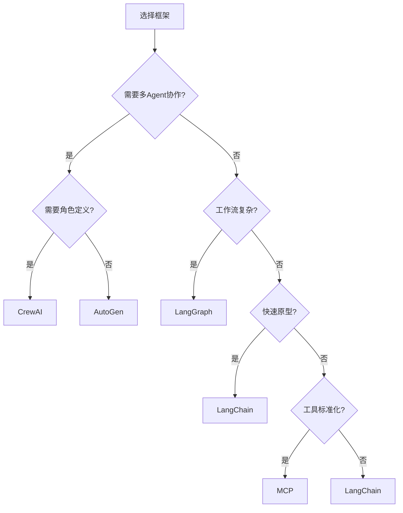

# 框架对比

## 主流框架概览

| 框架 | 开发方 | 核心定位 | 编程语言 | 适用场景 |
|------|--------|---------|---------|---------|
| [[LangChain]] | LangChain Inc. | LLM 应用编排 | Python/JS | 通用 LLM 应用 |
| [[LangGraph]] | LangChain Inc. | 状态机编排 | Python/JS | 复杂工作流 |
| [[AutoGen]] | Microsoft | 多 Agent 对话 | Python | 多 Agent 协作 |
| [[CrewAI]] | CrewAI Inc. | 角色驱动团队 | Python | 团队协作任务 |
| [[MCP协议]] | Anthropic | 开放协议 | 多语言 | 工具标准化 |

## 核心能力对比

| 维度 | LangChain | LangGraph | AutoGen | CrewAI | MCP |
|------|-----------|-----------|---------|--------|-----|
| **学习曲线** | 中 | 陡 | 中 | 平缓 | 平缓 |
| **工作流控制** | 链式 | 状态机 | 对话驱动 | 角色驱动 | 协议级 |
| **多 Agent** | 有限 | 支持 | 核心能力 | 核心能力 | 间接支持 |
| **工具生态** | 丰富 | 丰富 | 中等 | 中等 | 标准化 |
| **调试体验** | 好 | 好 | 一般 | 好 | — |
| **社区规模** | 最大 | 大 | 中 | 小 | 增长中 |

## 选型决策树



## 框架组合策略

实际项目中，框架往往组合使用：

```python
# LangChain + LangGraph：核心工作流
# AutoGen：多 Agent 对话层
# MCP：工具标准化接口

from langgraph.graph import StateGraph
from autogen import ConversableAgent
from mcp import Client

# 用 LangGraph 管理状态
graph = StateGraph(State)

# 用 AutoGen 实现多 Agent 对话
agent_a = ConversableAgent("agent_a")
agent_b = ConversableAgent("agent_b")

# 用 MCP 连接外部工具
mcp_client = Client()
tools = mcp_client.list_tools()
```

## 迁移成本

| 迁移方向 | 难度 | 说明 |
|---------|------|------|
| 裸 LLM → LangChain | 低 | 引入链式抽象 |
| LangChain → LangGraph | 中 | 增加状态机概念 |
| 任何 → MCP | 低 | 在工具层接入 |
| LangChain → AutoGen | 高 | 架构范式不同 |

## 最佳实践

1. **从简单开始**：先用 LangChain 快速验证想法
2. **按需升级**：工作流复杂时引入 LangGraph
3. **工具标准化**：使用 MCP 降低工具迁移成本
4. **不要过度框架化**：简单任务直接用 SDK 调用 LLM

## 延伸阅读

- [[LangChain]] — LangChain 详解
- [[LangGraph]] — LangGraph 详解
- [[AutoGen]] — AutoGen 详解
- [[CrewAI]] — CrewAI 详解
- [[MCP协议]] — MCP 协议详解
