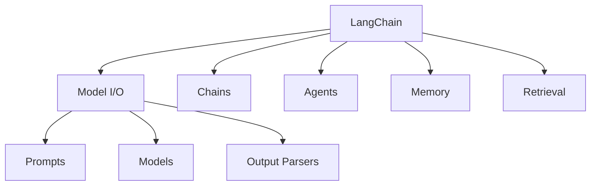

# LangChain

## 简介

**LangChain** 是最早且最流行的 LLM 应用开发框架，提供了一套标准化的抽象来构建由 LLM 驱动的应用程序。



## 核心组件

### 1. Model I/O

统一接口调用各种 LLM。

```python
from langchain_openai import ChatOpenAI
from langchain_anthropic import ChatAnthropic

# 统一接口，可切换不同模型
gpt4 = ChatOpenAI(model="gpt-4")
claude = ChatAnthropic(model="claude-3-sonnet")

# 相同调用方式
response = gpt4.invoke("你好")
response = claude.invoke("你好")
```

### 2. Prompt Templates

参数化提示词模板。

```python
from langchain_core.prompts import ChatPromptTemplate

template = ChatPromptTemplate.from_messages([
    ("system", "你是一个{role}专家。"),
    ("human", "请解释{topic}的概念。"),
])

prompt = template.invoke({
    "role": "机器学习",
    "topic": "Transformer"
})
```

### 3. Chains

将多个组件串联成工作流。

```python
from langchain_core.runnables import RunnablePassthrough
from langchain_core.output_parsers import StrOutputParser

# 简单的 RAG Chain
rag_chain = (
    {"context": retriever | format_docs, "question": RunnablePassthrough()}
    | prompt
    | llm
    | StrOutputParser()
)

result = rag_chain.invoke("什么是RAG？")
```

### 4. Agents

让 LLM 自主决策使用工具。

```python
from langchain.agents import create_tool_calling_agent, AgentExecutor

agent = create_tool_calling_agent(llm, tools, prompt)
agent_executor = AgentExecutor(agent=agent, tools=tools)

result = agent_executor.invoke({"input": "北京天气如何？"})
```

## LCEL（LangChain Expression Language）

LCEL 是 LangChain 的声明式组合语法：

```python
from langchain_core.runnables import RunnableParallel, RunnableLambda

# 并行处理
parallel_chain = RunnableParallel(
    summary=summary_chain,
    sentiment=sentiment_chain,
    keywords=keyword_chain,
)

# 分支条件
chain = (
    RunnableLambda(classify)
    | {
        "technical": technical_chain,
        "business": business_chain,
    }
)
```

## 优缺点

| 优点 | 缺点 |
|------|------|
| 生态最丰富，组件最多 | 版本迭代快，API 变化大 |
| 抽象统一，切换模型容易 | 抽象层有时过于复杂 |
| 文档完善，社区活跃 | 简单任务引入框架过重 |
| 与 LangGraph 无缝衔接 | 学习曲线较陡 |

## 最佳实践

1. **从简单开始**：先用 LCEL 写链，不要过度使用高级抽象
2. **类型安全**：使用 TypedDict 和 Pydantic 定义链的输入输出
3. **可观测性**：启用 LangSmith 追踪链的执行过程
4. **版本锁定**：生产环境锁定依赖版本

## 代码示例：完整 RAG 系统

```python
from langchain import hub
from langchain_community.vectorstores import Chroma
from langchain_openai import OpenAIEmbeddings
from langchain_core.runnables import RunnablePassthrough

# 1. 加载文档并切分
from langchain_community.document_loaders import WebBaseLoader
loader = WebBaseLoader("https://docs.python.org/3/")
docs = loader.load()

# 2. 构建向量存储
vectorstore = Chroma.from_documents(
    documents=docs,
    embedding=OpenAIEmbeddings(),
)
retriever = vectorstore.as_retriever()

# 3. 构建 RAG Chain
prompt = hub.pull("rlm/rag-prompt")

rag_chain = (
    {"context": retriever | format_docs, "question": RunnablePassthrough()}
    | prompt
    | llm
    | StrOutputParser()
)

# 4. 使用
response = rag_chain.invoke("Python 中的 GIL 是什么？")
```

## 延伸阅读

- [[00-框架对比]] — 框架选型指南
- [[02-LangGraph]] — LangChain 的状态机扩展
- [LangChain 官方文档](https://python.langchain.com/)
