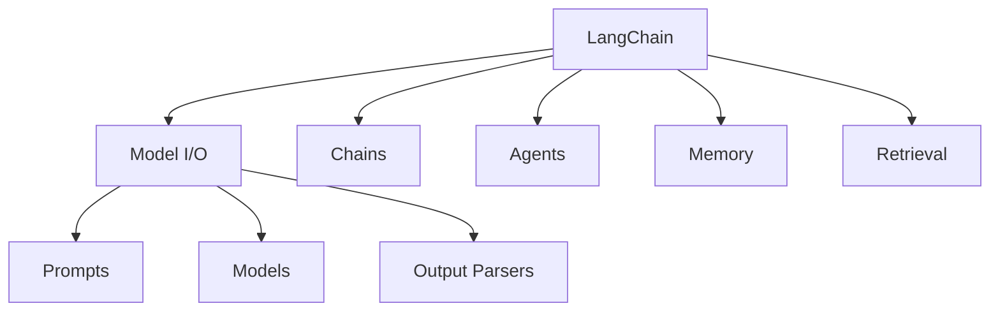

# LangChain

## 简介

**LangChain** 是最早且最流行的 LLM 应用开发框架，提供了一套标准化的抽象来构建由 LLM 驱动的应用程序。



## 核心组件

### 1. Model I/O

统一接口调用各种 LLM。

```python
from langchain_openai import ChatOpenAI
from langchain_anthropic import ChatAnthropic

# 统一接口，可切换不同模型
gpt4 = ChatOpenAI(model="gpt-4")
claude = ChatAnthropic(model="claude-3-sonnet")

# 相同调用方式
response = gpt4.invoke("你好")
response = claude.invoke("你好")
```

### 2. Prompt Templates

参数化提示词模板。

```python
from langchain_core.prompts import ChatPromptTemplate

template = ChatPromptTemplate.from_messages([
    ("system", "你是一个{role}专家。"),
    ("human", "请解释{topic}的概念。"),
])

prompt = template.invoke({
    "role": "机器学习",
    "topic": "Transformer"
})
```

### 3. Chains

将多个组件串联成工作流。

```python
from langchain_core.runnables import RunnablePassthrough
from langchain_core.output_parsers import StrOutputParser

# 简单的 RAG Chain
rag_chain = (
    {"context": retriever | format_docs, "question": RunnablePassthrough()}
    | prompt
    | llm
    | StrOutputParser()
)

result = rag_chain.invoke("什么是RAG？")
```

### 4. Agents

让 LLM 自主决策使用工具。

```python
from langchain.agents import create_tool_calling_agent, AgentExecutor

agent = create_tool_calling_agent(llm, tools, prompt)
agent_executor = AgentExecutor(agent=agent, tools=tools)

result = agent_executor.invoke({"input": "北京天气如何？"})
```

## LCEL（LangChain Expression Language）

LCEL 是 LangChain 的声明式组合语法：

```python
from langchain_core.runnables import RunnableParallel, RunnableLambda

# 并行处理
parallel_chain = RunnableParallel(
    summary=summary_chain,
    sentiment=sentiment_chain,
    keywords=keyword_chain,
)

# 分支条件
chain = (
    RunnableLambda(classify)
    | {
        "technical": technical_chain,
        "business": business_chain,
    }
)
```

## 优缺点

| 优点 | 缺点 |
|------|------|
| 生态最丰富，组件最多 | 版本迭代快，API 变化大 |
| 抽象统一，切换模型容易 | 抽象层有时过于复杂 |
| 文档完善，社区活跃 | 简单任务引入框架过重 |
| 与 LangGraph 无缝衔接 | 学习曲线较陡 |

## 反模式与修复

| 反模式 | 问题描述 | 影响 | 修复方案 |
|--------|----------|------|----------|
| 滥用 AgentExecutor 处理确定性任务 | 对于固定步骤的工作流（如"检索→格式化→生成"）使用 Agent，让 LLM 自行决策每一步 | 每步多一次 LLM 调用，延迟增加 2-5 秒，成本翻倍，且决策可能出错 | 确定性流程用 LCEL Chain（`\|` 管道符），仅在需要动态决策时使用 Agent |
| LCEL 管道嵌套过深 | 在 `RunnableParallel` 内部再嵌套多层并行和分支，形成难以理解的嵌套结构 | 调试时无法定位失败节点，错误堆栈难以阅读，类型推断失效 | 拆分为多个独立的子 Chain，用有意义的变量名组合，每个 Chain 职责单一 |
| 忽视 StrOutputParser | 直接使用 LLM 返回的 `AIMessage` 对象作为后续 Chain 的输入，未用 `StrOutputParser` 转换 | 类型不匹配导致下游 Chain 报错、Prompt 模板填充异常、输出格式不可预测 | 在 LLM 后始终添加 `StrOutputParser()` 或对应的结构化解析器，确保类型链路一致 |
| 硬编码 Prompt 而非使用 Template | 将提示词直接写死在代码中，而非使用 `ChatPromptTemplate` 参数化 | 无法复用 Prompt、无法 A/B 测试不同版本、修改需改代码重新部署 | 使用 `ChatPromptTemplate` 或从 LangSmith Hub 拉取 (`hub.pull()`)，实现 Prompt 版本管理 |
| 在 Agent 工具中执行阻塞操作 | 工具函数内部执行同步网络请求、大文件处理等耗时操作 | Agent 单步执行超时、整个 Chain 卡住、用户体验极差 | 工具函数使用异步实现（`async def`），或在工具内使用 `RunnableLambda` + `run_in_executor` 包装同步调用 |
| 不使用 LangSmith 进行链路追踪 | 生产环境未接入 LangSmith，仅依赖 `print` 调试 Chain 执行过程 | 无法追踪多步 Chain 中哪步出错、无法回放失败用例、无法监控延迟和成本 | 启用 LangSmith：设置 `LANGCHAIN_TRACING_V2=true` 环境变量，所有 Chain 自动上报执行轨迹 |

在 LangChain 中，最常见的反模式是"滥用 AgentExecutor 处理确定性任务"。Agent 的核心价值在于让 LLM 自主决策使用哪些工具、按什么顺序执行——但如果你的工作流步骤是固定的（例如"先检索文档，再格式化上下文，最后生成回答"），用 Agent 不仅浪费 LLM 调用次数（每步决策都需要一次推理），还引入了不确定性。正确的做法是用 LCEL 管道符 `|` 将确定性步骤串联为 Chain，仅在步骤需要动态判断时才使用 Agent。

另一个关键反模式是"不使用 LangSmith"。LangChain 的 Chain 往往涉及多个 Runnable 的串联，一旦出错，没有链路追踪几乎无法定位问题。LangSmith 提供了完整的执行可视化、延迟分析和成本统计——设置一个环境变量即可启用，是生产环境的必备组件。

## 最佳实践

1. **从简单开始**：先用 LCEL 写链，不要过度使用高级抽象
2. **类型安全**：使用 TypedDict 和 Pydantic 定义链的输入输出
3. **可观测性**：启用 LangSmith 追踪链的执行过程
4. **版本锁定**：生产环境锁定依赖版本

## 代码示例：完整 RAG 系统

```python
from langchain import hub
from langchain_community.vectorstores import Chroma
from langchain_openai import OpenAIEmbeddings
from langchain_core.runnables import RunnablePassthrough

# 1. 加载文档并切分
from langchain_community.document_loaders import WebBaseLoader
loader = WebBaseLoader("https://docs.python.org/3/")
docs = loader.load()

# 2. 构建向量存储
vectorstore = Chroma.from_documents(
    documents=docs,
    embedding=OpenAIEmbeddings(),
)
retriever = vectorstore.as_retriever()

# 3. 构建 RAG Chain
prompt = hub.pull("rlm/rag-prompt")

rag_chain = (
    {"context": retriever | format_docs, "question": RunnablePassthrough()}
    | prompt
    | llm
    | StrOutputParser()
)

# 4. 使用
response = rag_chain.invoke("Python 中的 GIL 是什么？")
```

## 延伸阅读

- [[00-框架对比]] — 框架选型指南
- [[02-LangGraph]] — LangChain 的状态机扩展
- [LangChain 官方文档](https://python.langchain.com/)
