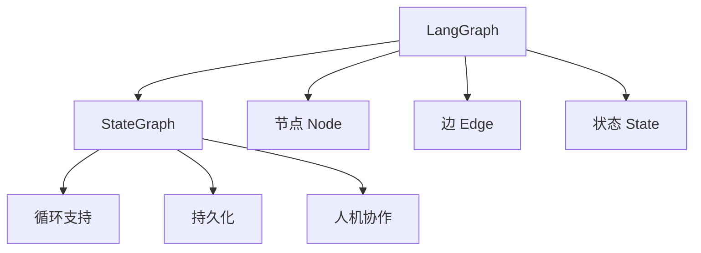

# LangGraph

## 简介

**LangGraph** 是 LangChain 团队推出的用于构建**有状态、循环、多 Agent** 工作流的框架。它将工作流建模为图（Graph），支持循环和条件分支，适合复杂 Agent 系统的编排。



## 核心概念

### 状态（State）

所有节点共享的状态对象，是图的中央数据存储。

```python
from typing import TypedDict, Annotated
import operator

class AgentState(TypedDict):
    messages: Annotated[list, operator.add]  # 累加更新
    next_step: str
    iterations: int
```

### 节点（Node）

处理状态并返回状态更新的函数。

```python
def agent_node(state: AgentState):
    # 读取状态
    messages = state["messages"]
    
    # LLM 推理
    response = llm.invoke(messages)
    
    # 返回状态更新
    return {
        "messages": [response],
        "iterations": state["iterations"] + 1,
    }
```

### 边（Edge）

连接节点，定义执行流程。

```python
from langgraph.graph import StateGraph, END

builder = StateGraph(AgentState)

# 添加节点
builder.add_node("agent", agent_node)
builder.add_node("tool", tool_node)

# 添加边
builder.add_edge("agent", "tool")  # 普通边
builder.add_edge("tool", END)      # 结束边
```

### 条件边（Conditional Edge）

根据状态动态选择下一个节点。

```python
def should_continue(state: AgentState) -> str:
    """决定下一步走向"""
    if state["iterations"] > 10:
        return END
    last_message = state["messages"][-1]
    if last_message.tool_calls:
        return "tool"
    return END

builder.add_conditional_edges(
    "agent",
    should_continue,
    {
        "tool": "tool",
        END: END,
    }
)
```

## 完整示例：ReAct Agent

```python
from langgraph.graph import StateGraph, END
from langgraph.prebuilt import ToolNode
from typing import TypedDict, Annotated
import operator

class ReActState(TypedDict):
    messages: Annotated[list, operator.add]

# 定义工具
tools = [search, calculator]
tool_node = ToolNode(tools)

# Agent 节点
def agent(state: ReActState):
    response = model.bind_tools(tools).invoke(state["messages"])
    return {"messages": [response]}

# 条件判断
def should_continue(state: ReActState):
    last = state["messages"][-1]
    if not last.tool_calls:
        return END
    return "tools"

# 构建图
builder = StateGraph(ReActState)
builder.add_node("agent", agent)
builder.add_node("tools", tool_node)

builder.set_entry_point("agent")
builder.add_conditional_edges("agent", should_continue)
builder.add_edge("tools", "agent")

graph = builder.compile()

# 运行
result = graph.invoke({"messages": [("human", "2+2=?")]})
```

## 持久化与人机协作

```python
from langgraph.checkpoint import MemorySaver

# 添加检查点
memory = MemorySaver()
graph = builder.compile(checkpointer=memory)

# 运行时可中断
config = {"configurable": {"thread_id": "1"}}

# 在节点执行前中断，等待人工输入
builder.add_node("human_review", human_review_node)
builder.add_node("agent", agent_node)
builder.add_edge("agent", "human_review")

# 配置中断点
graph = builder.compile(
    checkpointer=memory,
    interrupt_before=["human_review"],
)
```

## 优缺点

| 优点 | 缺点 |
|------|------|
| 原生支持循环和条件 | 学习曲线较陡 |
| 内置状态持久化 | 调试复杂工作流较困难 |
| 支持人机协作中断 | 相比纯 LangChain 更复杂 |
| 与 LangChain 生态无缝集成 | 文档相对较新 |

## 反模式与修复

| 反模式 | 问题描述 | 影响 | 修复方案 |
|--------|----------|------|----------|
| 状态对象无限膨胀 | 使用 `Annotated[list, operator.add]` 累加消息但不裁剪，导致消息列表无限增长 | 内存溢出、LLM token 超限报错（如超过 128K 上下文窗口）、推理延迟线性增长 | 在 reducer 中添加裁剪逻辑，或在节点中过滤历史消息，保留最近 N 条或使用摘要压缩 |
| 条件边缺少兜底分支 | `should_continue` 函数只处理了正常情况，未处理异常状态（解析失败、空消息） | 条件边返回值不在映射表中，图执行抛出 KeyError，整个工作流崩溃 | 条件函数始终包含默认返回值（如 `return END`），并在映射表中覆盖所有可能的返回值 |
| 节点函数产生副作用 | 节点函数内直接写数据库、发 HTTP 请求，而非将副作用封装为工具节点 | 失败重试时重复执行副作用（如重复发邮件）、无法利用检查点恢复 | 节点函数保持幂等，副作用通过 ToolNode 或显式工具调用执行，配合检查点实现可重试 |
| 未设置迭代上限 | 循环图中缺少 `iterations` 计数或最大轮次限制，依赖 LLM 自行判断何时停止 | Agent 陷入无限循环，持续消耗 token 和 API 调用费用，直到超时或资源耗尽 | 在状态中维护迭代计数器，条件边中检查 `iterations > MAX` 时强制退出，参考文章中的 `should_continue` 示例 |
| 检查点未配置 thread_id | 使用 MemorySaver 但未在 `config` 中传入 `thread_id`，导致所有请求共享同一状态 | 不同用户的对话状态互相污染、人机协作中断恢复到错误的状态、并发场景数据错乱 | 每次 `graph.invoke()` 传入唯一的 `config={"configurable": {"thread_id": unique_id}}`，确保状态隔离 |
| 过度拆分节点粒度 | 将每个微操作（如"格式化输入""调用 LLM""解析输出"）都拆为独立节点 | 图结构过于复杂、调试困难、节点间通信开销累积、状态序列化成本增加 | 节点粒度以"可独立测试的功能单元"为准，通常一个完整的业务步骤对应一个节点 |

LangGraph 中最危险的反模式是"状态对象无限膨胀"。LangGraph 的 `Annotated[list, operator.add]` 是一个累加 reducer，每次节点返回新消息都会追加到列表中。如果不在节点内裁剪历史，经过多轮循环后，状态中的消息列表会越来越大，最终突破 LLM 的上下文窗口限制，导致 API 报错或推理成本失控。解决方案是在关键节点中实现消息裁剪策略——保留最近 N 条消息、或用 LLM 将历史压缩为摘要后替换原始列表。

另一个高频问题是"条件边缺少兜底分支"。条件边的函数返回值必须严格匹配 `add_conditional_edges` 中的映射字典键。如果 LLM 输出异常导致返回了映射中不存在的值，LangGraph 会抛出 `KeyError` 并终止整个图。生产环境中，应始终为条件函数添加默认分支，并在映射字典中覆盖所有可能的返回值（包括异常路径）。

## 权衡分析

选择 LangGraph 的核心权衡是**循环编排能力 vs 学习和调试成本**。

### LangGraph vs LangChain Agent vs 自定义状态机

| 维度 | LangGraph | LangChain Agent | 自定义状态机 |
|------|-----------|-----------------|-------------|
| 循环支持 | 原生支持 | 有限（AgentExecutor 内循环） | 需自行实现 |
| 状态持久化 | 内置 Checkpoint | 无 | 需自行实现 |
| 人机协作 | 内置 interrupt 机制 | 无 | 需自行实现 |
| 学习曲线 | 陡峭 | 平缓 | 中（取决于实现） |
| 调试难度 | 高（图执行不可见） | 中 | 低（完全可控） |
| 适用场景 | 复杂有状态 Agent | 简单工具调用 Agent | 极度定制化需求 |

### 状态设计的取舍

- **扁平状态**：所有字段在同一层，访问简单，但字段多了容易混乱
- **嵌套状态**：按业务域分组（如 `state.messages`、`state.memory`），结构清晰，但 reducer 配置复杂
- **累加 vs 覆盖**：`Annotated[list, operator.add]` 自动追加消息，但不控制大小会内存溢出——需要在节点内手动裁剪

### 检查点策略的权衡

- **每个节点都存检查点**：可恢复性最强，但序列化开销大，存储成本高
- **关键节点存检查点**：平衡恢复粒度和性能，但需要判断哪些节点是"关键"的
- **不存检查点**：性能最好，但任何失败都需要从头重跑
- **MemorySaver vs 数据库**：开发用内存即可，生产必须持久化到 Redis/PostgreSQL

### 何时选择 LangGraph

- 工作流需要**循环**（如 ReAct、反思、多轮对话）
- 需要**状态持久化和恢复**（如长时间运行的任务、人机协作中断）
- 需要**精细控制执行流程**（条件分支、并行节点、子图）
- 已有 LangChain 生态投资，需要**无缝集成**

### 何时避免 LangGraph

- 工作流是**纯线性的**——LangChain LCEL 管道更简单
- 团队**不熟悉图编程范式**——学习成本高于收益
- 需要**极致性能**——图执行的抽象层引入开销
- 工作流**极其简单**（如单次 LLM 调用）——不需要图编排

## 最佳实践

1. **状态设计**：状态类型使用 TypedDict + Annotated，明确更新策略
2. **节点粒度**：节点职责单一，便于测试和复用
3. **条件边清晰**：条件函数返回值与边映射要明确
4. **检查点策略**：关键节点设置检查点，支持恢复

## 延伸阅读

- [[00-框架对比]] — 框架选型指南
- [[01-LangChain]] — LangGraph 的基础依赖
- [LangGraph 官方文档](https://langchain-ai.github.io/langgraph/)
