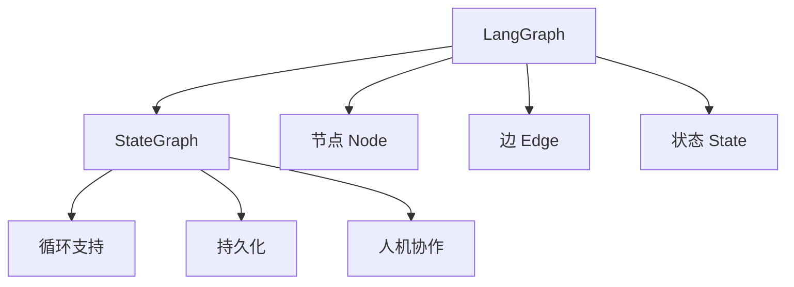

# LangGraph

## 简介

**LangGraph** 是 LangChain 团队推出的用于构建**有状态、循环、多 Agent** 工作流的框架。它将工作流建模为图（Graph），支持循环和条件分支，适合复杂 Agent 系统的编排。



## 核心概念

### 状态（State）

所有节点共享的状态对象，是图的中央数据存储。

```python
from typing import TypedDict, Annotated
import operator

class AgentState(TypedDict):
    messages: Annotated[list, operator.add]  # 累加更新
    next_step: str
    iterations: int
```

### 节点（Node）

处理状态并返回状态更新的函数。

```python
def agent_node(state: AgentState):
    # 读取状态
    messages = state["messages"]
    
    # LLM 推理
    response = llm.invoke(messages)
    
    # 返回状态更新
    return {
        "messages": [response],
        "iterations": state["iterations"] + 1,
    }
```

### 边（Edge）

连接节点，定义执行流程。

```python
from langgraph.graph import StateGraph, END

builder = StateGraph(AgentState)

# 添加节点
builder.add_node("agent", agent_node)
builder.add_node("tool", tool_node)

# 添加边
builder.add_edge("agent", "tool")  # 普通边
builder.add_edge("tool", END)      # 结束边
```

### 条件边（Conditional Edge）

根据状态动态选择下一个节点。

```python
def should_continue(state: AgentState) -> str:
    """决定下一步走向"""
    if state["iterations"] > 10:
        return END
    last_message = state["messages"][-1]
    if last_message.tool_calls:
        return "tool"
    return END

builder.add_conditional_edges(
    "agent",
    should_continue,
    {
        "tool": "tool",
        END: END,
    }
)
```

## 完整示例：ReAct Agent

```python
from langgraph.graph import StateGraph, END
from langgraph.prebuilt import ToolNode
from typing import TypedDict, Annotated
import operator

class ReActState(TypedDict):
    messages: Annotated[list, operator.add]

# 定义工具
tools = [search, calculator]
tool_node = ToolNode(tools)

# Agent 节点
def agent(state: ReActState):
    response = model.bind_tools(tools).invoke(state["messages"])
    return {"messages": [response]}

# 条件判断
def should_continue(state: ReActState):
    last = state["messages"][-1]
    if not last.tool_calls:
        return END
    return "tools"

# 构建图
builder = StateGraph(ReActState)
builder.add_node("agent", agent)
builder.add_node("tools", tool_node)

builder.set_entry_point("agent")
builder.add_conditional_edges("agent", should_continue)
builder.add_edge("tools", "agent")

graph = builder.compile()

# 运行
result = graph.invoke({"messages": [("human", "2+2=?")]})
```

## 持久化与人机协作

```python
from langgraph.checkpoint import MemorySaver

# 添加检查点
memory = MemorySaver()
graph = builder.compile(checkpointer=memory)

# 运行时可中断
config = {"configurable": {"thread_id": "1"}}

# 在节点执行前中断，等待人工输入
builder.add_node("human_review", human_review_node)
builder.add_node("agent", agent_node)
builder.add_edge("agent", "human_review")

# 配置中断点
graph = builder.compile(
    checkpointer=memory,
    interrupt_before=["human_review"],
)
```

## 优缺点

| 优点 | 缺点 |
|------|------|
| 原生支持循环和条件 | 学习曲线较陡 |
| 内置状态持久化 | 调试复杂工作流较困难 |
| 支持人机协作中断 | 相比纯 LangChain 更复杂 |
| 与 LangChain 生态无缝集成 | 文档相对较新 |

## 最佳实践

1. **状态设计**：状态类型使用 TypedDict + Annotated，明确更新策略
2. **节点粒度**：节点职责单一，便于测试和复用
3. **条件边清晰**：条件函数返回值与边映射要明确
4. **检查点策略**：关键节点设置检查点，支持恢复

## 延伸阅读

- [[00-框架对比]] — 框架选型指南
- [[01-LangChain]] — LangGraph 的基础依赖
- [LangGraph 官方文档](https://langchain-ai.github.io/langgraph/)
