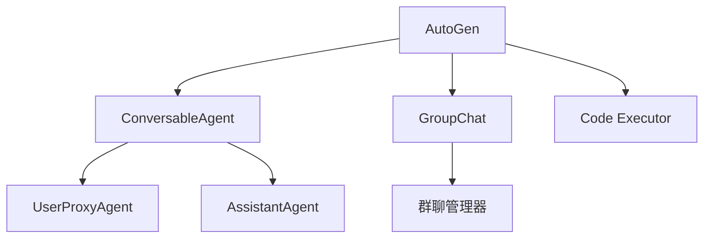

# AutoGen

## 简介

**AutoGen** 是 Microsoft 推出的多 Agent 对话框架，专注于通过**对话**模式让多个 Agent 协作完成任务。核心思想是将 Agent 定义为可对话的实体，通过消息传递实现协作。



## 核心概念

### ConversableAgent

所有 Agent 的基础类，具备发送/接收消息的能力。

```python
from autogen import ConversableAgent

agent = ConversableAgent(
    name="assistant",
    system_message="你是一个有帮助的助手。",
    llm_config={"model": "gpt-4", "api_key": "..."},
)
```

### UserProxyAgent

代表人类的 Agent，可以执行代码和工具。

```python
from autogen import UserProxyAgent

user_proxy = UserProxyAgent(
    name="user_proxy",
    human_input_mode="NEVER",  # 或 ALWAYS, TERMINATE
    code_execution_config={
        "work_dir": "coding",
        "use_docker": False,
    },
)
```

### AssistantAgent

默认的 AI 助手 Agent。

```python
from autogen import AssistantAgent

assistant = AssistantAgent(
    name="coder",
    system_message="你是一个 Python 专家。",
    llm_config={"model": "gpt-4"},
)
```

## 两 Agent 对话

```python
from autogen import AssistantAgent, UserProxyAgent

assistant = AssistantAgent("assistant", llm_config=llm_config)
user_proxy = UserProxyAgent("user_proxy", code_execution_config={"work_dir": "coding"})

# 启动对话
user_proxy.initiate_chat(
    assistant,
    message="写一个计算斐波那契数列的 Python 函数。",
)
```

## 多 Agent 群聊

```python
from autogen import GroupChat, GroupChatManager

# 定义多个 Agent
coder = AssistantAgent("coder", system_message="你负责写代码。")
tester = AssistantAgent("tester", system_message="你负责写测试。")
reviewer = AssistantAgent("reviewer", system_message="你负责代码审查。")

# 创建群聊
group_chat = GroupChat(
    agents=[user_proxy, coder, tester, reviewer],
    messages=[],
    max_round=10,
)

manager = GroupChatManager(groupchat=group_chat, llm_config=llm_config)

# 启动群聊
user_proxy.initiate_chat(
    manager,
    message="实现一个 LRU Cache，包括代码和测试。",
)
```

## 自定义 Agent 能力

```python
from autogen import register_function

# 注册自定义工具
register_function(
    search_database,
    caller=assistant,
    executor=user_proxy,
    name="search_database",
    description="搜索数据库",
)

# 注册后 assistant 可以在对话中调用 search_database
```

## 优缺点

| 优点 | 缺点 |
|------|------|
| 多 Agent 对话模型直观 | 群聊顺序控制不够精细 |
| 内置代码执行能力 | 与 LangChain 生态集成较弱 |
| 支持人机协作模式 | 生产环境部署文档较少 |
| 活跃的开源社区 | API 迭代较快 |

## 最佳实践

1. **System Message 设计**：清晰的角色定义是群聊效果的关键
2. **终止条件**：设置合理的对话终止条件，防止无限循环
3. **代码执行隔离**：使用 Docker 隔离代码执行环境
4. **人机介入模式**：关键决策点设置 human_input_mode="ALWAYS"

## 延伸阅读

- [[00-框架对比]] — 框架选型指南
- [[00-协作总览]] — 多 Agent 设计模式
- [AutoGen 官方文档](https://microsoft.github.io/autogen/)
