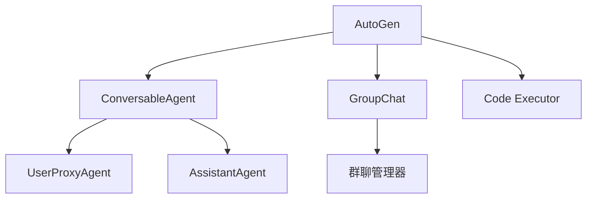

# AutoGen

## 简介

**AutoGen** 是 Microsoft 推出的多 Agent 对话框架，专注于通过**对话**模式让多个 Agent 协作完成任务。核心思想是将 Agent 定义为可对话的实体，通过消息传递实现协作。



## 核心概念

### ConversableAgent

所有 Agent 的基础类，具备发送/接收消息的能力。

```python
from autogen import ConversableAgent

agent = ConversableAgent(
    name="assistant",
    system_message="你是一个有帮助的助手。",
    llm_config={"model": "gpt-4", "api_key": "..."},
)
```

### UserProxyAgent

代表人类的 Agent，可以执行代码和工具。

```python
from autogen import UserProxyAgent

user_proxy = UserProxyAgent(
    name="user_proxy",
    human_input_mode="NEVER",  # 或 ALWAYS, TERMINATE
    code_execution_config={
        "work_dir": "coding",
        "use_docker": False,
    },
)
```

### AssistantAgent

默认的 AI 助手 Agent。

```python
from autogen import AssistantAgent

assistant = AssistantAgent(
    name="coder",
    system_message="你是一个 Python 专家。",
    llm_config={"model": "gpt-4"},
)
```

## 两 Agent 对话

```python
from autogen import AssistantAgent, UserProxyAgent

assistant = AssistantAgent("assistant", llm_config=llm_config)
user_proxy = UserProxyAgent("user_proxy", code_execution_config={"work_dir": "coding"})

# 启动对话
user_proxy.initiate_chat(
    assistant,
    message="写一个计算斐波那契数列的 Python 函数。",
)
```

## 多 Agent 群聊

```python
from autogen import GroupChat, GroupChatManager

# 定义多个 Agent
coder = AssistantAgent("coder", system_message="你负责写代码。")
tester = AssistantAgent("tester", system_message="你负责写测试。")
reviewer = AssistantAgent("reviewer", system_message="你负责代码审查。")

# 创建群聊
group_chat = GroupChat(
    agents=[user_proxy, coder, tester, reviewer],
    messages=[],
    max_round=10,
)

manager = GroupChatManager(groupchat=group_chat, llm_config=llm_config)

# 启动群聊
user_proxy.initiate_chat(
    manager,
    message="实现一个 LRU Cache，包括代码和测试。",
)
```

## 自定义 Agent 能力

```python
from autogen import register_function

# 注册自定义工具
register_function(
    search_database,
    caller=assistant,
    executor=user_proxy,
    name="search_database",
    description="搜索数据库",
)

# 注册后 assistant 可以在对话中调用 search_database
```

## 优缺点

| 优点 | 缺点 |
|------|------|
| 多 Agent 对话模型直观 | 群聊顺序控制不够精细 |
| 内置代码执行能力 | 与 LangChain 生态集成较弱 |
| 支持人机协作模式 | 生产环境部署文档较少 |
| 活跃的开源社区 | API 迭代较快 |

## 反模式与修复

| 反模式 | 问题描述 | 影响 | 修复方案 |
|--------|----------|------|----------|
| GroupChat 未设置 max_round | 群聊创建时未指定 `max_round` 参数，或设置为极大值 | Agent 间对话陷入无限循环，持续消耗 API 费用直到手动终止 | 始终设置合理的 `max_round`（如 10-20），并在 Agent 的 system_message 中明确终止信号 |
| 禁用 Docker 的代码执行隔离 | `code_execution_config` 中设置 `use_docker=False`，让 Agent 生成的代码在宿主机直接执行 | 恶意或错误代码可能删除文件、安装恶意包、泄露环境变量，安全风险极高 | 生产环境强制 `use_docker=True`，开发环境至少使用虚拟环境隔离，限制 `work_dir` 范围 |
| UserProxy 的 human_input_mode 配置错误 | 群聊场景中使用 `human_input_mode="ALWAYS"`，每轮对话都等待人工确认 | 工作流完全卡住等待人工输入，失去自动化意义，用户体验极差 | 自动化场景使用 `"NEVER"`，半自动化场景使用 `"TERMINATE"`（仅在终止时确认），关键决策点单独设置 |
| Agent 角色定义过于模糊 | System message 写成"你是一个有帮助的助手"，未明确角色边界和职责 | Agent 间职责重叠导致互相推诿或重复工作，群聊中发言混乱、输出质量低 | 为每个 Agent 定义明确的角色、职责范围和输出格式，如"你是 Python 后端专家，只负责编写后端代码" |
| 忽视对话终止条件的收敛性 | Agent 的 `is_termination_msg` 函数依赖 LLM 输出特定关键词（如 "TERMINATE"），但未在 prompt 中明确要求 | LLM 可能不输出终止词，对话无法自然结束，或在未完成时提前终止 | 在 system_message 中明确终止条件和格式，同时结合 `max_round` 作为硬性兜底 |
| 群聊中未控制发言顺序 | 使用默认的 `GroupChat` 发言选择策略，未自定义 `speaker_selection_method` | Agent 发言顺序混乱、低优先级 Agent 抢答、关键 Agent 被跳过 | 使用 `speaker_selection_method` 自定义发言顺序（如 `"round_robin"` 或 `"auto"`），或用 `allowed_or_disallowed_speaker_transitions` 约束 |

AutoGen 中最需要警惕的反模式是"禁用 Docker 代码执行隔离"。AutoGen 的核心特性之一是让 Agent 自主生成并执行代码——这意味着 LLM 生成的任意 Python 代码都会在你的机器上运行。如果关闭 Docker 隔离（`use_docker=False`），一次错误的 `os.system("rm -rf /")` 或恶意的数据 exfiltration 就可能造成灾难性后果。即使在开发阶段，也建议使用 Docker 或至少限制 `work_dir` 到一个无关紧要的沙箱目录。

另一个关键问题是"GroupChat 未设置 max_round"。AutoGen 的群聊机制依赖 Agent 间的对话轮次来推进任务，但 LLM 可能陷入无意义的循环对话（如两个 Agent 互相说"请继续"）。没有 `max_round` 兜底，这种循环会持续消耗 token 费用直到账户余额耗尽或手动中断。建议将 `max_round` 设置为合理上限（通常 10-20 轮足够），并在 system_message 中明确要求 Agent 在任务完成时输出终止信号。

## 权衡分析

选择 AutoGen 的核心权衡是**对话驱动的多 Agent 协作 vs 执行控制的精细度**。

### AutoGen vs CrewAI vs LangGraph

| 维度 | AutoGen | CrewAI | LangGraph |
|------|---------|--------|-----------|
| 协作模型 | 对话驱动 | 角色-任务驱动 | 图编排 |
| 代码执行 | 内置（Docker 隔离） | 需外部集成 | 需外部集成 |
| 群聊管理 | 内置 GroupChat | 无（Sequential/Hierarchical） | 需自行构建 |
| 发言顺序控制 | 中（speaker_selection_method） | 高（Task 依赖） | 完全可控 |
| 人机协作 | 内置 human_input_mode | 有限 | 内置 interrupt |
| 生产就绪度 | 中（部署文档少） | 中 | 高（LangChain 生态） |

### 对话驱动 vs 任务驱动

- **对话驱动（AutoGen）**：Agent 通过自然语言对话协作，更接近人类团队工作方式，但对话质量高度依赖 System Message 设计，且难以精确控制执行顺序
- **任务驱动（CrewAI）**：明确定义任务依赖关系，执行流程可预测，但灵活性较低，不适合需要动态调整的场景
- **图驱动（LangGraph）**：最精细的控制，但抽象层级最高，学习成本最大

### 代码执行安全的取舍

- **Docker 隔离**：最安全，但增加部署复杂度和冷启动延迟
- **虚拟环境隔离**：中等安全性，配置简单，但仍可访问宿主机资源
- **无隔离**：最简单，但风险极高——LLM 生成的任意代码都可以执行
- **经验法则**：开发阶段可用虚拟环境，生产环境必须用 Docker

### GroupChat 的控制力问题

- AutoGen 的 GroupChat 让 Agent 自然对话，但**发言顺序不可精确预测**
- `speaker_selection_method="auto"` 让 LLM 决定下一个发言者——灵活但不确定
- `speaker_selection_method="round_robin"` 强制轮流发言——可预测但不灵活
- 需要精确控制执行顺序时，GroupChat 不是最佳选择——考虑 CrewAI 的 Task 依赖或 LangGraph 的图编排

### 何时选择 AutoGen

- 需要**多 Agent 通过对话协作**（如头脑风暴、辩论、代码审查）
- 需要**内置代码执行能力**且不想额外集成
- 项目偏好**微软生态和 Azure 集成**
- 需要**灵活的人机协作模式**

### 何时避免 AutoGen

- 需要**精确控制执行顺序**——CrewAI 的 Task 依赖或 LangGraph 的图更合适
- 对**生产部署成熟度有高要求**——AutoGen 的部署文档相对较少
- 工作流**不需要对话交互**——直接用 LangChain Chain 更简单
- 需要**与 LangChain 生态深度集成**——AutoGen 的集成层较弱

## 最佳实践

1. **System Message 设计**：清晰的角色定义是群聊效果的关键
2. **终止条件**：设置合理的对话终止条件，防止无限循环
3. **代码执行隔离**：使用 Docker 隔离代码执行环境
4. **人机介入模式**：关键决策点设置 human_input_mode="ALWAYS"

## 延伸阅读

- [[00-框架对比]] — 框架选型指南
- [[00-协作总览]] — 多 Agent 设计模式
- [AutoGen 官方文档](https://microsoft.github.io/autogen/)
