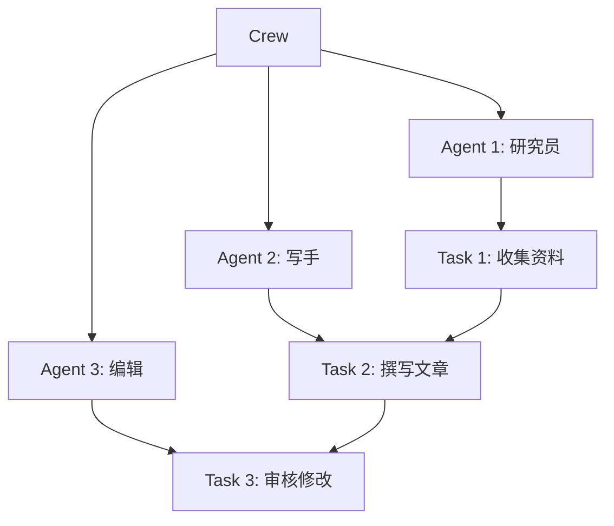
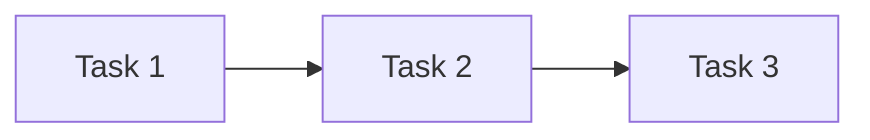
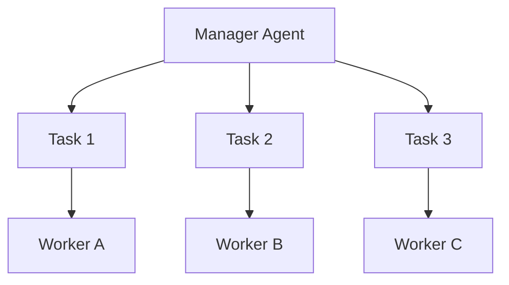

# CrewAI

## 简介

**CrewAI** 是一个基于**角色（Role）**驱动的多 Agent 框架。核心理念：为每个 Agent 定义明确的角色、目标和背景故事，Agent 按角色协作完成任务。



## 核心概念

### Agent（角色）

```python
from crewai import Agent

researcher = Agent(
    role="研究员",
    goal="收集关于 {topic} 的全面信息",
    backstory="你是一位资深研究分析师，擅长信息收集和整理。",
    allow_delegation=False,
    verbose=True,
    llm=llm,
)

writer = Agent(
    role="写手",
    goal="基于研究资料撰写高质量文章",
    backstory="你是一位专业科技作家，擅长将复杂信息转化为易读内容。",
    allow_delegation=False,
    verbose=True,
    llm=llm,
)
```

### Task（任务）

```python
from crewai import Task

research_task = Task(
    description="收集关于 {topic} 的最新信息，包括定义、应用场景和发展趋势。",
    expected_output="一份结构化的研究报告",
    agent=researcher,
)

writing_task = Task(
    description="基于研究报告，撰写一篇面向普通读者的科普文章。",
    expected_output="一篇 1500 字左右的 Markdown 文章",
    agent=writer,
    context=[research_task],  # 依赖前置任务
)
```

### Crew（团队）

```python
from crewai import Crew, Process

crew = Crew(
    agents=[researcher, writer, editor],
    tasks=[research_task, writing_task, editing_task],
    process=Process.sequential,  # sequential 或 hierarchical
    verbose=True,
)

result = crew.kickoff(inputs={"topic": "AI Agent"})
```

## 执行模式

### Sequential（顺序执行）



任务按依赖顺序依次执行，适合有明确前后依赖的工作流。

### Hierarchical（层级执行）



Manager Agent 负责任务分配和结果汇总，适合复杂项目。

## 完整示例

```python
from crewai import Agent, Task, Crew
from langchain_openai import ChatOpenAI

llm = ChatOpenAI(model="gpt-4")

# 定义 Agent
researcher = Agent(
    role="市场研究员",
    goal="分析 {product} 的市场竞争格局",
    backstory="你是一位资深市场分析师。",
    llm=llm,
)

strategist = Agent(
    role="战略顾问",
    goal="基于市场分析制定营销策略",
    backstory="你是一位顶级战略顾问。",
    llm=llm,
)

# 定义任务
research = Task(
    description="分析 {product} 的主要竞争对手、市场份额和差异化因素。",
    expected_output="竞争对手分析报告",
    agent=researcher,
)

strategy = Task(
    description="基于竞争分析，制定 {product} 的营销策略。",
    expected_output="营销策略方案",
    agent=strategist,
    context=[research],
)

# 组建团队并执行
crew = Crew(
    agents=[researcher, strategist],
    tasks=[research, strategy],
    process=Process.sequential,
)

result = crew.kickoff(inputs={"product": "智能手表"})
print(result)
```

## 优缺点

| 优点 | 缺点 |
|------|------|
| 角色驱动设计直观 | 角色定义质量直接影响效果 |
| 学习曲线平缓 | 灵活性不如 LangGraph |
| 适合团队协作场景 | 生态相对较小 |
| 任务依赖关系清晰 | 复杂循环工作流支持有限 |

## 最佳实践

1. **角色精细化**：角色定义要具体，避免笼统描述
2. **任务可验证**：expected_output 要明确可评估
3. **合理分工**：Agent 之间的职责边界要清晰
4. **迭代优化**：根据输出质量调整角色定义和任务描述

## 延伸阅读

- [[00-框架对比]] — 框架选型指南
- [[03-AutoGen]] — 另一多 Agent 框架对比
- [[00-协作总览]] — 多 Agent 设计模式
- [CrewAI 官方文档](https://docs.crewai.com/)
