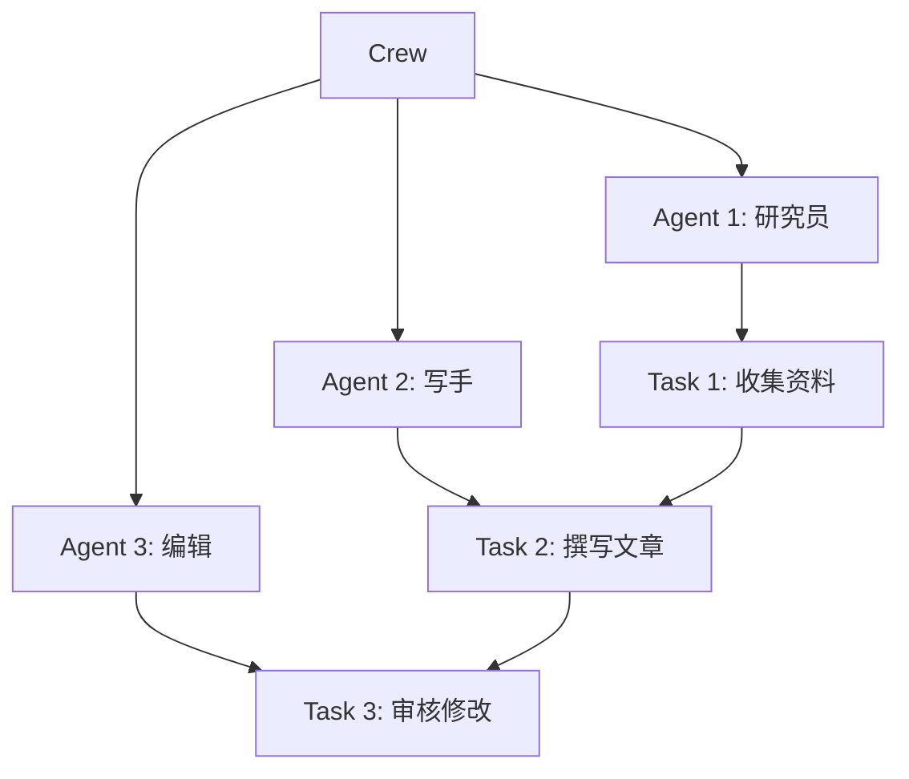
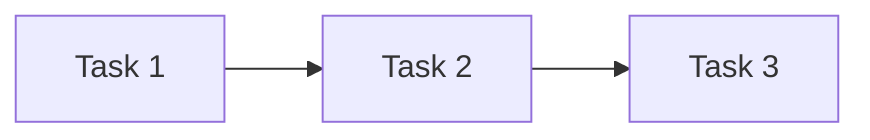
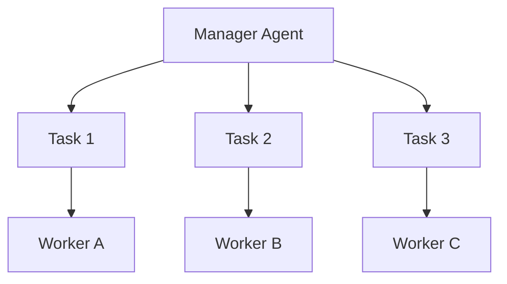

# CrewAI

## 简介

**CrewAI** 是一个基于**角色（Role）**驱动的多 Agent 框架。核心理念：为每个 Agent 定义明确的角色、目标和背景故事，Agent 按角色协作完成任务。



## 核心概念

### Agent（角色）

```python
from crewai import Agent

researcher = Agent(
    role="研究员",
    goal="收集关于 {topic} 的全面信息",
    backstory="你是一位资深研究分析师，擅长信息收集和整理。",
    allow_delegation=False,
    verbose=True,
    llm=llm,
)

writer = Agent(
    role="写手",
    goal="基于研究资料撰写高质量文章",
    backstory="你是一位专业科技作家，擅长将复杂信息转化为易读内容。",
    allow_delegation=False,
    verbose=True,
    llm=llm,
)
```

### Task（任务）

```python
from crewai import Task

research_task = Task(
    description="收集关于 {topic} 的最新信息，包括定义、应用场景和发展趋势。",
    expected_output="一份结构化的研究报告",
    agent=researcher,
)

writing_task = Task(
    description="基于研究报告，撰写一篇面向普通读者的科普文章。",
    expected_output="一篇 1500 字左右的 Markdown 文章",
    agent=writer,
    context=[research_task],  # 依赖前置任务
)
```

### Crew（团队）

```python
from crewai import Crew, Process

crew = Crew(
    agents=[researcher, writer, editor],
    tasks=[research_task, writing_task, editing_task],
    process=Process.sequential,  # sequential 或 hierarchical
    verbose=True,
)

result = crew.kickoff(inputs={"topic": "AI Agent"})
```

## 执行模式

### Sequential（顺序执行）



任务按依赖顺序依次执行，适合有明确前后依赖的工作流。

### Hierarchical（层级执行）



Manager Agent 负责任务分配和结果汇总，适合复杂项目。

## 完整示例

```python
from crewai import Agent, Task, Crew
from langchain_openai import ChatOpenAI

llm = ChatOpenAI(model="gpt-4")

# 定义 Agent
researcher = Agent(
    role="市场研究员",
    goal="分析 {product} 的市场竞争格局",
    backstory="你是一位资深市场分析师。",
    llm=llm,
)

strategist = Agent(
    role="战略顾问",
    goal="基于市场分析制定营销策略",
    backstory="你是一位顶级战略顾问。",
    llm=llm,
)

# 定义任务
research = Task(
    description="分析 {product} 的主要竞争对手、市场份额和差异化因素。",
    expected_output="竞争对手分析报告",
    agent=researcher,
)

strategy = Task(
    description="基于竞争分析，制定 {product} 的营销策略。",
    expected_output="营销策略方案",
    agent=strategist,
    context=[research],
)

# 组建团队并执行
crew = Crew(
    agents=[researcher, strategist],
    tasks=[research, strategy],
    process=Process.sequential,
)

result = crew.kickoff(inputs={"product": "智能手表"})
print(result)
```

## 优缺点

| 优点 | 缺点 |
|------|------|
| 角色驱动设计直观 | 角色定义质量直接影响效果 |
| 学习曲线平缓 | 灵活性不如 LangGraph |
| 适合团队协作场景 | 生态相对较小 |
| 任务依赖关系清晰 | 复杂循环工作流支持有限 |

## 反模式与修复

| 反模式 | 问题描述 | 影响 | 修复方案 |
|--------|----------|------|----------|
| 角色 backstory 过于笼统 | Agent 定义中 backstory 写成"你是一个专家"，未提供具体的领域知识和行为约束 | Agent 输出缺乏专业性、与无角色定义的裸 LLM 调用无异、角色驱动的优势完全丧失 | backstory 应包含：专业背景、工作风格、输出偏好、禁止行为，如"你是一位有 10 年经验的市场分析师，擅长 SWOT 分析" |
| expected_output 定义模糊 | Task 的 `expected_output` 写成"一份报告"或"相关内容"，未指定格式和结构 | Agent 输出格式不可预测、下游 Task 无法可靠解析前置输出、每次运行结果差异大 | expected_output 应明确：格式（Markdown/JSON/表格）、结构（必须包含的章节）、长度约束（如"800-1200 字"） |
| 错误使用 allow_delegation | 为所有 Agent 开启 `allow_delegation=True`，期望 Agent 自动互相委托任务 | Agent 间互相推诿、任务在多个 Agent 间来回传递、执行时间指数增长、最终输出可能遗漏任务 | 仅在 Hierarchical 模式下为 Manager Agent 开启 delegation，Sequential 模式下 Worker Agent 应关闭 delegation |
| Sequential 模式下 Task 无 context 依赖 | 顺序执行的 Task 未通过 `context=[前置_task]` 声明依赖关系 | 后续 Task 无法获取前置 Task 的输出、每个 Task 独立运行失去协作意义、结果断链 | 明确声明 Task 间的 context 依赖：`Task(..., context=[research_task])`，确保输出链路完整传递 |
| 单 Crew 中塞入过多 Agent | 将 10+ 个 Agent 放入同一个 Crew，期望一次性完成复杂项目 | Token 消耗爆炸、角色边界模糊、执行时间过长、Manager Agent 难以协调过多角色 | 拆分为多个子 Crew，每个 Crew 聚焦一个子目标；或使用 Hierarchical 模式让 Manager Agent 分批调度 |
| 未利用 verbose 模式调试 | 开发阶段关闭 `verbose=True`，无法观察 Agent 的推理过程和任务执行细节 | 难以定位输出质量差的原因、无法判断是角色定义问题还是 LLM 能力问题 | 开发和测试阶段始终开启 `verbose=True`，生产环境可关闭但需接入日志系统记录关键决策点 |

CrewAI 中最核心的反模式是"角色 backstory 过于笼统"。CrewAI 的核心价值在于角色驱动——通过精心设计的角色定义（role + goal + backstory）来引导 LLM 的行为。如果 backstory 只是"你是一个专家"，Agent 的表现与直接调用裸 LLM 几乎没有区别，却白白引入了框架开销。有效的 backstory 应该像一份角色说明书：包含专业背景（"你是一位有 10 年经验的数据分析师"）、工作方法（"你习惯先看数据分布再下结论"）、输出偏好（"所有结论必须附带数据表格"）和禁止行为（"不要给出没有数据支撑的猜测"）。

另一个高频问题是"expected_output 定义模糊"。在 Sequential 模式下，每个 Task 的输出会传递给依赖它的下一个 Task。如果 expected_output 不明确，Agent 可能返回一段散文、一个列表或一个表格——下游 Task 的 Agent 无法可靠解析这些不确定格式的输入，导致信息丢失或误解。建议在 expected_output 中明确规定输出的格式（如"Markdown 表格，包含'名称''评分''优劣势'三列"），确保 Task 间的数据传递可靠。

## 权衡分析

选择 CrewAI 的核心权衡是**角色驱动的直观性 vs 执行控制的灵活性**。

### CrewAI vs AutoGen vs LangGraph

| 维度 | CrewAI | AutoGen | LangGraph |
|------|--------|---------|-----------|
| 核心抽象 | 角色 + 任务 | 对话 + 群聊 | 状态图 |
| 学习曲线 | 最平缓 | 中 | 陡峭 |
| 执行模式 | Sequential / Hierarchical | GroupChat | 完全自定义 |
| 任务依赖 | 显式（context 参数） | 隐式（对话推进） | 显式（图边） |
| 灵活性 | 低 | 中 | 高 |
| 适合场景 | 团队协作、内容生产 | 代码生成、头脑风暴 | 复杂有状态 Agent |

### Sequential vs Hierarchical 模式的取舍

- **Sequential**：任务按依赖顺序执行，简单可预测，但无法并行处理独立任务
- **Hierarchical**：Manager Agent 动态分配任务，更灵活，但引入额外的 LLM 调用成本，且 Manager 的决策质量直接影响结果
- **经验法则**：任务依赖关系明确时用 Sequential，需要动态调度时用 Hierarchical

### 角色定义的投入产出

- **高质量角色定义**（详细的 backstory、明确的 goal）：输出质量显著提升，但需要前期投入时间设计
- **低质量角色定义**（笼统描述）：与裸 LLM 调用无异，白白引入框架开销
- **角色定义是 CrewAI 的核心投资**——如果不愿意花时间设计角色，不应选择 CrewAI

### 何时选择 CrewAI

- 需要**多 Agent 模拟团队协作**（如研究 + 写作 + 审查流程）
- 团队**不熟悉图编程范式**，需要最直观的抽象
- 任务有**明确的前后依赖关系**
- 需要**快速原型验证**多 Agent 方案

### 何时避免 CrewAI

- 工作流需要**循环或复杂条件分支**——LangGraph 更合适
- 需要**精细控制每一步执行**——CrewAI 的抽象遮蔽了执行细节
- Agent 之间需要**自由对话交互**——AutoGen 的 GroupChat 更自然
- 任务**不需要角色区分**——直接用 LangChain Chain 更简单

## 最佳实践

1. **角色精细化**：角色定义要具体，避免笼统描述
2. **任务可验证**：expected_output 要明确可评估
3. **合理分工**：Agent 之间的职责边界要清晰
4. **迭代优化**：根据输出质量调整角色定义和任务描述

## 延伸阅读

- [[00-框架对比]] — 框架选型指南
- [[03-AutoGen]] — 另一多 Agent 框架对比
- [[00-协作总览]] — 多 Agent 设计模式
- [CrewAI 官方文档](https://docs.crewai.com/)
