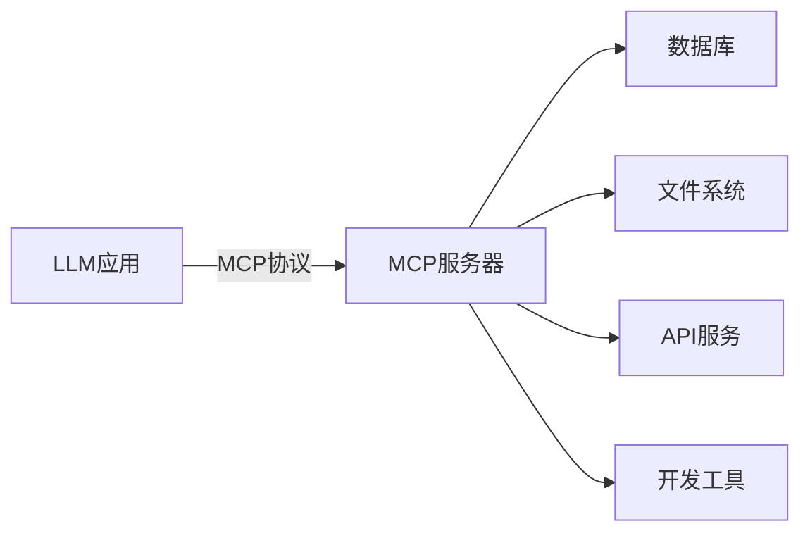
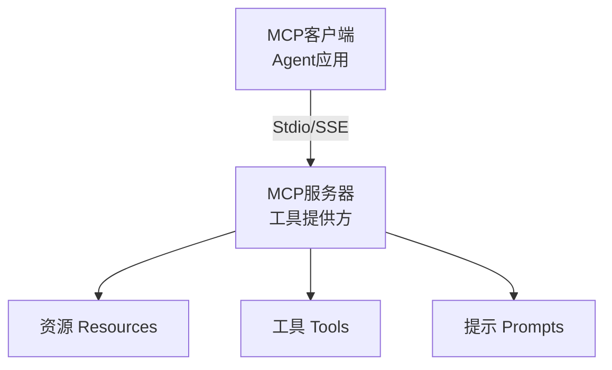

# MCP 协议（Model Context Protocol）

## 简介

**MCP（Model Context Protocol）** 是 Anthropic 推出的开放协议，旨在标准化 LLM 与外部数据源、工具之间的交互方式。它类似于 USB-C 接口——统一了 LLM 连接外部世界的方式。



## 核心架构

MCP 采用客户端-服务器架构：



### 三大原语

| 原语 | 说明 | 示例 |
|------|------|------|
| **Resources** | 只读数据，供模型上下文 | 文件内容、数据库记录 |
| **Tools** | 可调用函数，改变外部状态 | 发送邮件、创建文件 |
| **Prompts** | 可复用的提示模板 | 标准分析模板 |

## 协议优势

1. **标准化**：一次实现，多处使用
2. **解耦**：模型应用与工具实现分离
3. **安全**：通过协议控制权限边界
4. **生态**：社区共享 MCP 服务器

## 实现示例

### MCP 服务器（Python）

```python
from mcp.server import Server
from mcp.types import Resource, Tool
import mcp.server.stdio

server = Server("example-server")

@server.list_resources()
async def list_resources() -> list[Resource]:
    return [
        Resource(
            uri="file:///data/users.json",
            name="用户数据",
            mimeType="application/json",
        ),
    ]

@server.read_resource()
async def read_resource(uri: str) -> str:
    if uri == "file:///data/users.json":
        return read_users_json()
    raise ValueError(f"未知资源: {uri}")

@server.list_tools()
async def list_tools() -> list[Tool]:
    return [
        Tool(
            name="send_email",
            description="发送电子邮件",
            inputSchema={
                "type": "object",
                "properties": {
                    "to": {"type": "string"},
                    "subject": {"type": "string"},
                    "body": {"type": "string"},
                },
                "required": ["to", "subject", "body"],
            },
        ),
    ]

@server.call_tool()
async def call_tool(name: str, arguments: dict) -> list:
    if name == "send_email":
        result = send_email(**arguments)
        return [TextContent(type="text", text=result)]
    raise ValueError(f"未知工具: {name}")

# 启动服务器
async def main():
    async with mcp.server.stdio.stdio_server() as (read_stream, write_stream):
        await server.run(
            read_stream,
            write_stream,
            server.create_initialization_options(),
        )
```

### MCP 客户端

```python
from mcp import ClientSession, StdioServerParameters
from mcp.client.stdio import stdio_client

# 配置服务器连接
server_params = StdioServerParameters(
    command="python",
    args=["mcp_server.py"],
)

async with stdio_client(server_params) as (read, write):
    async with ClientSession(read, write) as session:
        # 初始化
        await session.initialize()
        
        # 列出可用工具
        tools = await session.list_tools()
        print(tools)
        
        # 调用工具
        result = await session.call_tool(
            "send_email",
            arguments={
                "to": "user@example.com",
                "subject": "测试",
                "body": "Hello MCP!",
            },
        )
        print(result)
```

## 与框架集成

```python
# 将 MCP 工具接入 LangChain
from langchain_mcp_adapters import load_mcp_tools
from mcp import ClientSession

tools = await load_mcp_tools(session)

# 直接在 LangChain Agent 中使用
agent = create_tool_calling_agent(llm, tools, prompt)
```

## 已支持的 MCP 服务器

| 类别 | 服务器 | 功能 |
|------|--------|------|
| 文件系统 | filesystem | 读写本地文件 |
| 数据库 | sqlite, postgres | 数据库查询 |
| 开发工具 | git, github | 代码仓库操作 |
| 云服务 | aws, gcp | 云服务管理 |
| 搜索 | brave-search | 网络搜索 |
| 浏览器 | puppeteer | 网页自动化 |

## 优缺点

| 优点 | 缺点 |
|------|------|
| 标准化接口，降低集成成本 | 生态还在早期发展阶段 |
| 一次实现，多处复用 | 性能开销（进程间通信） |
| 安全边界清晰 | 需要额外部署 MCP 服务器 |
| 开源协议，社区共建 | 部分场景下直接调用更简单 |

## 反模式与修复

| 反模式 | 问题描述 | 影响 | 修复方案 |
|--------|----------|------|----------|
| 工具粒度过粗 | 将整个业务操作（如"处理订单"）封装为单个工具，参数包含 10+ 个字段 | LLM 难以正确填充参数、调用失败率高、模型倾向跳过该工具改用自由文本回答 | 拆分为细粒度工具：`search_order`、`update_shipping_address`、`apply_discount`，每个工具 2-4 个参数 |
| 工具描述缺乏示例和约束 | Tool 的 `description` 只写"发送邮件"，未说明参数格式、有效值范围和典型用法 | LLM 生成无效参数（如日期格式错误、邮箱格式不对）、工具调用频繁失败需重试 | description 中包含参数格式说明、有效值示例和边界约束，如"`to` 为邮箱地址，格式如 `user@example.com`" |
| MCP 服务器无权限控制 | 服务器暴露所有工具和资源给所有客户端，无鉴权和权限分级 | 低权限客户端可调用高危操作（如删除数据库）、数据泄露风险、不符合最小权限原则 | 实现 OAuth 2.0 或 API Key 鉴权，按客户端角色限制可访问的工具和资源列表 |
| Stdio 传输用于生产环境 | 使用 Stdio（标准输入输出）作为 MCP 服务器的传输方式部署到生产环境 | 仅支持单客户端连接、无法水平扩展、进程崩溃即服务中断、无健康检查机制 | 生产环境使用 SSE（Server-Sent Events）或 HTTP 传输，配合进程管理器和负载均衡 |
| 未处理 MCP 工具调用超时 | 客户端调用 MCP 工具时未设置超时，或服务器端工具实现无超时保护 | 网络抖动或工具实现 bug 导致客户端无限等待、阻塞整个 Agent 工作流、用户体验极差 | 客户端设置合理的调用超时（如 30 秒），服务器端工具实现中使用 `asyncio.wait_for` 包装长时间操作 |
| 混淆 Resources 与 Tools 的使用场景 | 将可变状态操作（如写入数据库）放在 Resource 中，或将只读数据查询放在 Tool 中 | Resource 语义被破坏（Resource 应为只读）、模型无法正确判断操作是否产生副作用 | 严格区分：Resource 用于只读数据（文件内容、配置信息），Tool 用于产生副作用的操作（发送请求、写入数据） |

MCP 中最严重的反模式是"工具粒度过粗"。MCP 协议的核心价值在于让 LLM 通过标准化接口调用外部工具——但如果单个工具的参数过多（超过 5-6 个），LLM 就很难一次性正确填充所有字段。实践中，参数超过 5 个的工具调用成功率会显著下降，模型往往会选择跳过工具调用而直接生成自由文本回答，使得工具集成形同虚设。正确做法是将复杂操作拆分为多个细粒度工具，每个工具聚焦一个原子操作，参数控制在 2-4 个。

另一个关键问题是"混淆 Resources 与 Tools"。MCP 的三大原语（Resources、Tools、Prompts）有明确的语义区分：Resources 是只读数据，Tools 会产生副作用。如果将写操作放在 Resource 中，模型会认为调用它不会改变外部状态，从而在不恰当的时机调用（如在"预览"阶段就执行了写入）。严格遵守语义划分不仅是协议规范要求，也是防止模型误操作的安全保障。

## 权衡分析

选择 MCP 的核心权衡是**标准化互操作性 vs 额外的架构复杂度**。

### MCP vs 直接工具调用 vs Function Calling

| 维度 | MCP 协议 | 直接工具调用 | Function Calling |
|------|----------|-------------|-----------------|
| 标准化 | 高（开放协议） | 无（私有实现） | 中（各 LLM 不同） |
| 复杂度 | 高（客户端-服务器） | 低 | 低 |
| 性能开销 | 中（进程间通信） | 低 | 低 |
| 可复用性 | 高（一次实现多处用） | 低（绑定特定应用） | 中 |
| 安全边界 | 清晰（协议层控制） | 依赖实现 | 依赖实现 |
| 生态成熟度 | 早期 | — | 成熟 |

### 标准化的收益与代价

- **收益**：工具实现一次，可在任何支持 MCP 的 Agent 中使用；社区可共享 MCP 服务器
- **代价**：需要额外部署和维护 MCP 服务器进程；进程间通信引入延迟（通常 10-50ms）
- **何时值得**：当同一工具需要被**多个 Agent 应用**共享时，标准化的收益超过额外复杂度
- **何时不值**：工具只被**单个应用**使用，且对延迟敏感——直接调用更简单

### Stdio vs SSE 传输的取舍

- **Stdio**：进程间通信，延迟低，但只能本地使用，无法跨网络
- **SSE（Server-Sent Events）**：支持远程访问，但增加网络延迟和部署复杂度
- **经验法则**：本地开发和单机部署用 Stdio，分布式架构用 SSE

### 何时选择 MCP

- 需要**工具在多个 Agent 应用间共享**
- 需要**清晰的安全边界和权限控制**
- 正在构建**工具市场或生态系统**
- 需要**解耦工具实现与 Agent 逻辑**

### 何时避免 MCP

- 工具只被**单个应用**使用——直接调用更简单
- 对**延迟极其敏感**——进程间通信的开销不可接受
- **生态需求不强**——如果不需要跨应用复用，MCP 的额外架构没有收益
- 团队**运维能力有限**——MCP 服务器需要独立部署和监控

## 最佳实践

1. **工具粒度**：MCP 服务器内的工具应保持相关性和一致性
2. **错误处理**：详细的错误信息帮助客户端理解和恢复
3. **资源描述**：清晰的资源描述帮助模型选择合适的数据源
4. **权限控制**：根据场景限制服务器访问的资源和操作

## 延伸阅读

- [[00-框架对比]] — 框架选型指南
- [[01-工具设计]] — 工具设计原则
- [MCP 官方文档](https://modelcontextprotocol.io/)
