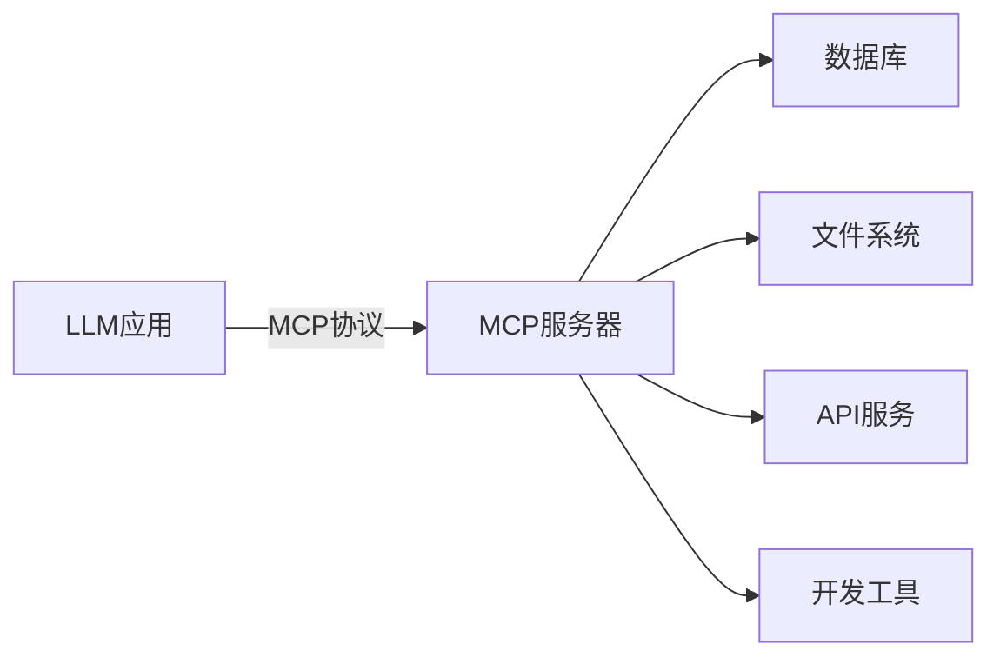
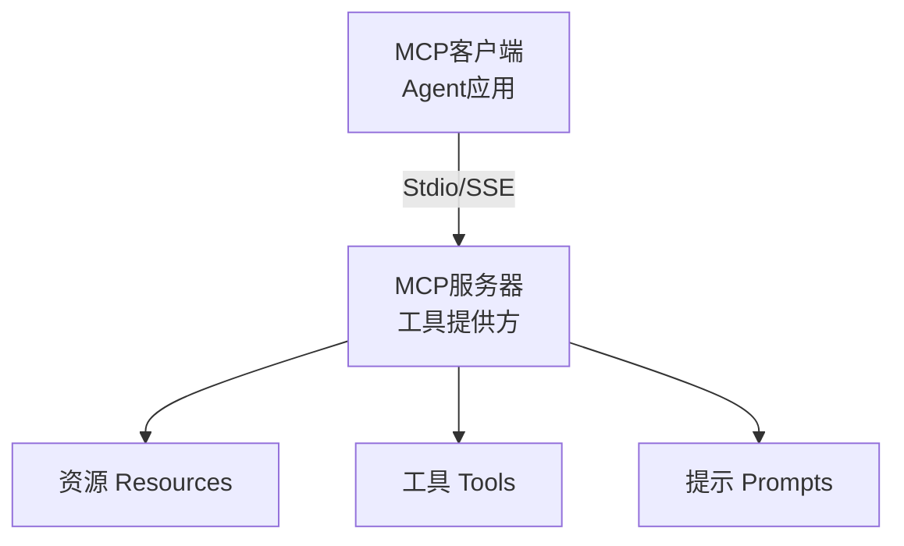

# MCP 协议（Model Context Protocol）

## 简介

**MCP（Model Context Protocol）** 是 Anthropic 推出的开放协议，旨在标准化 LLM 与外部数据源、工具之间的交互方式。它类似于 USB-C 接口——统一了 LLM 连接外部世界的方式。



## 核心架构

MCP 采用客户端-服务器架构：



### 三大原语

| 原语 | 说明 | 示例 |
|------|------|------|
| **Resources** | 只读数据，供模型上下文 | 文件内容、数据库记录 |
| **Tools** | 可调用函数，改变外部状态 | 发送邮件、创建文件 |
| **Prompts** | 可复用的提示模板 | 标准分析模板 |

## 协议优势

1. **标准化**：一次实现，多处使用
2. **解耦**：模型应用与工具实现分离
3. **安全**：通过协议控制权限边界
4. **生态**：社区共享 MCP 服务器

## 实现示例

### MCP 服务器（Python）

```python
from mcp.server import Server
from mcp.types import Resource, Tool
import mcp.server.stdio

server = Server("example-server")

@server.list_resources()
async def list_resources() -> list[Resource]:
    return [
        Resource(
            uri="file:///data/users.json",
            name="用户数据",
            mimeType="application/json",
        ),
    ]

@server.read_resource()
async def read_resource(uri: str) -> str:
    if uri == "file:///data/users.json":
        return read_users_json()
    raise ValueError(f"未知资源: {uri}")

@server.list_tools()
async def list_tools() -> list[Tool]:
    return [
        Tool(
            name="send_email",
            description="发送电子邮件",
            inputSchema={
                "type": "object",
                "properties": {
                    "to": {"type": "string"},
                    "subject": {"type": "string"},
                    "body": {"type": "string"},
                },
                "required": ["to", "subject", "body"],
            },
        ),
    ]

@server.call_tool()
async def call_tool(name: str, arguments: dict) -> list:
    if name == "send_email":
        result = send_email(**arguments)
        return [TextContent(type="text", text=result)]
    raise ValueError(f"未知工具: {name}")

# 启动服务器
async def main():
    async with mcp.server.stdio.stdio_server() as (read_stream, write_stream):
        await server.run(
            read_stream,
            write_stream,
            server.create_initialization_options(),
        )
```

### MCP 客户端

```python
from mcp import ClientSession, StdioServerParameters
from mcp.client.stdio import stdio_client

# 配置服务器连接
server_params = StdioServerParameters(
    command="python",
    args=["mcp_server.py"],
)

async with stdio_client(server_params) as (read, write):
    async with ClientSession(read, write) as session:
        # 初始化
        await session.initialize()
        
        # 列出可用工具
        tools = await session.list_tools()
        print(tools)
        
        # 调用工具
        result = await session.call_tool(
            "send_email",
            arguments={
                "to": "user@example.com",
                "subject": "测试",
                "body": "Hello MCP!",
            },
        )
        print(result)
```

## 与框架集成

```python
# 将 MCP 工具接入 LangChain
from langchain_mcp_adapters import load_mcp_tools
from mcp import ClientSession

tools = await load_mcp_tools(session)

# 直接在 LangChain Agent 中使用
agent = create_tool_calling_agent(llm, tools, prompt)
```

## 已支持的 MCP 服务器

| 类别 | 服务器 | 功能 |
|------|--------|------|
| 文件系统 | filesystem | 读写本地文件 |
| 数据库 | sqlite, postgres | 数据库查询 |
| 开发工具 | git, github | 代码仓库操作 |
| 云服务 | aws, gcp | 云服务管理 |
| 搜索 | brave-search | 网络搜索 |
| 浏览器 | puppeteer | 网页自动化 |

## 优缺点

| 优点 | 缺点 |
|------|------|
| 标准化接口，降低集成成本 | 生态还在早期发展阶段 |
| 一次实现，多处复用 | 性能开销（进程间通信） |
| 安全边界清晰 | 需要额外部署 MCP 服务器 |
| 开源协议，社区共建 | 部分场景下直接调用更简单 |

## 最佳实践

1. **工具粒度**：MCP 服务器内的工具应保持相关性和一致性
2. **错误处理**：详细的错误信息帮助客户端理解和恢复
3. **资源描述**：清晰的资源描述帮助模型选择合适的数据源
4. **权限控制**：根据场景限制服务器访问的资源和操作

## 延伸阅读

- [[00-框架对比]] — 框架选型指南
- [[01-工具设计]] — 工具设计原则
- [MCP 官方文档](https://modelcontextprotocol.io/)
