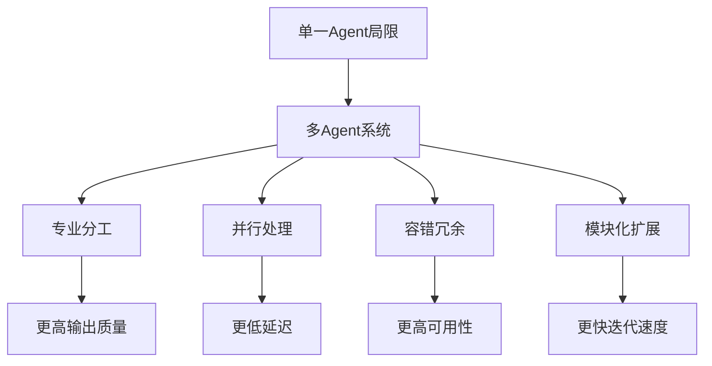

# 多 Agent 协作总览

## 为什么需要多 Agent

单一 Agent 的能力受限于以下维度：

| 限制维度 | 具体问题 | 多 Agent 解法 |
|---------|---------|-------------|
| **Context Window** | 单次推理无法处理海量上下文 | 拆分为子任务，各 Agent 专注局部上下文 |
| **专业化** | 通用模型在特定领域不如专用 Agent | 领域专家 Agent 各司其职 |
| **并发性** | 单 Agent 串行处理效率低 | 多 Agent 并行执行独立子任务 |
| **可靠性** | 单点故障导致整体失败 | 冗余 Agent + 容错路由 |
| **可维护性** | 巨型 prompt 难以迭代 | 模块化 Agent，独立测试和部署 |



## 协作架构模式

### 中心化协调者

由一个 Orchestrator Agent 负责任务分解和结果聚合。适合任务可清晰拆分的场景。

```python
from dataclasses import dataclass
from typing import Protocol

class WorkerAgent(Protocol):
    def execute(self, subtask: str) -> str: ...

@dataclass
class Orchestrator:
    workers: dict[str, WorkerAgent]

    def run(self, task: str) -> str:
        # 1. 分解任务
        subtasks = self._decompose(task)
        # 2. 分配并执行
        results = {}
        for name, subtask in subtasks.items():
            worker = self.workers.get(name)
            if worker is None:
                raise ValueError(f"No worker for role: {name}")
            results[name] = worker.execute(subtask)
        # 3. 聚合结果
        return self._aggregate(results)

    def _decompose(self, task: str) -> dict[str, str]:
        """由 LLM 将任务分解为子任务并映射到 Worker。"""
        # 实际实现中使用 LLM 进行任务规划
        ...

    def _aggregate(self, results: dict[str, str]) -> str:
        """聚合各 Worker 的输出为最终结果。"""
        ...
```

**优点**：逻辑集中，易于调试和监控。
**缺点**：协调者成为瓶颈和单点故障。

### 去中心化协作

Agent 之间直接通信，无需中央协调者。适合需要动态协商的场景。

```python
import asyncio
from collections import defaultdict

class MessageBus:
    """Agent 间的消息总线。"""

    def __init__(self):
        self.subscribers: dict[str, list] = defaultdict(list)

    def subscribe(self, topic: str, agent):
        self.subscribers[topic].append(agent)

    async def publish(self, topic: str, message: dict):
        for agent in self.subscribers.get(topic, []):
            await agent.receive(message)

class PeerAgent:
    def __init__(self, name: str, bus: MessageBus):
        self.name = name
        self.bus = bus
        self.inbox: list[dict] = []

    async def receive(self, message: dict):
        self.inbox.append(message)

    async def propose(self, topic: str, proposal: dict):
        await self.bus.publish(topic, {
            "from": self.name,
            "type": "proposal",
            "content": proposal,
        })

    async def respond(self, topic: str, response: dict):
        await self.bus.publish(topic, {
            "from": self.name,
            "type": "response",
            "content": response,
        })
```

**优点**：无单点故障，扩展性好。
**缺点**：调试困难，难以保证全局一致性。

## 核心挑战

| 挑战 | 说明 | 解决方向 |
|------|------|---------|
| **协作模式** | Agent 如何组织和协作 | [[01-协作模式]] — 星型、网状、层级拓扑 |
| **通信协议** | Agent 间如何交换信息 | [[02-通信协议]] — 消息格式、路由、序列化 |
| **冲突解决** | 意见不一致时如何处理 | [[03-冲突解决]] — 投票、仲裁、协商 |
| **共识机制** | 如何达成集体决策 | 多数投票、加权投票、拜占庭容错 |
| **任务分配** | 谁做什么 | 静态分配 / 基于能力的动态分配 |
| **状态同步** | 共享状态如何保持一致 | 事件溯源、CRDT、乐观锁 |

## 设计原则

1. **单一职责**：每个 Agent 专注一个领域，避免"万能 Agent"反模式
2. **最小通信**：减少 Agent 间通信轮次，每轮通信都是延迟和成本
3. **明确接口**：Agent 间通过结构化消息交互，避免自然语言歧义
4. **容错设计**：单个 Agent 失败不应导致整体系统崩溃
5. **可观测性**：完整记录 Agent 间交互，便于调试和审计

## 任务分配实现

```python
from enum import Enum

class AgentCapability(Enum):
    CODE_GENERATION = "code_generation"
    DATA_ANALYSIS = "data_analysis"
    DOCUMENTATION = "documentation"
    TESTING = "testing"
    REVIEW = "review"

@dataclass
class TaskRouter:
    """基于能力的任务路由器。"""
    agent_capabilities: dict[str, set[AgentCapability]]

    def route(self, task_type: AgentCapability) -> str | None:
        """找到第一个具备所需能力的 Agent。"""
        for agent_id, caps in self.agent_capabilities.items():
            if task_type in caps:
                return agent_id
        return None

    def route_all(self, task_type: AgentCapability) -> list[str]:
        """找到所有具备所需能力的 Agent（用于并行或冗余）。"""
        return [
            agent_id
            for agent_id, caps in self.agent_capabilities.items()
            if task_type in caps
        ]
```

## 反模式与修复

| 反模式 | 症状 | 影响 | 修复方案 |
|--------|------|------|---------|
| **过度拆分** | 3 个步骤就引入 5 个 Agent | 通信开销吞噬收益，延迟倍增 | 从单 Agent 开始，按需拆分 |
| **万能 Agent** | 单个 Agent 承担所有职责 | prompt 膨胀，输出质量下降 | 按领域拆分为专家 Agent |
| **无限协商** | Agent 间多轮协商无收敛 | Token 消耗失控，延迟不可控 | 设置协商轮次上限 + 人类兜底 |
| **隐式依赖** | Agent A 的输出隐式依赖 Agent B | 执行顺序混乱，结果不可复现 | 显式声明依赖关系，DAG 编排 |
| **无超时** | Agent 调用不设超时 | 一个慢 Agent 阻塞整个系统 | 所有跨 Agent 调用设置超时 |
| **状态泄漏** | Agent 间通过全局变量共享状态 | 竞态条件，结果不确定 | 消息传递 + 不可变状态 |

## 权衡分析

| 维度 | 中心化协调 | 去中心化协作 | 建议 |
|------|-----------|------------|------|
| **调试难度** | 低（单点追踪） | 高（分布式追踪） | 开发阶段优先中心化 |
| **扩展性** | 受协调者限制 | 线性扩展 | Agent 数量 >10 时考虑去中心化 |
| **容错性** | 协调者是单点故障 | 天然冗余 | 生产环境需协调者高可用 |
| **延迟** | 协调者增加一跳 | 直接通信更快 | 延迟敏感场景选去中心化 |
| **一致性** | 强一致 | 最终一致 | 金融等场景选中心化 |

**实践建议**：大多数项目应从中心化协调者开始（简单、可调试），在 Agent 数量增长到协调者成为瓶颈后再迁移至去中心化架构。过早引入去中心化是常见的过度工程反模式。

## 反模式与修复

| 反模式 | 问题描述 | 影响 | 修复方案 |
|--------|----------|------|----------|
| 过早去中心化 | Agent 数量不足 5 个就引入去中心化架构 | 通信开销远超收益，调试复杂度指数增长，开发周期拉长 | 从中心化协调者起步，Agent 超过 10 个且协调者成为瓶颈后再迁移 |
| 协调者单点故障 | Orchestrator Agent 无备份和故障转移机制 | 协调者崩溃导致整个多 Agent 系统停摆，可用性降至单点水平 | 部署协调者热备副本，实现健康检查与自动故障转移，参考 [[02-可观测性]] 监控设计 |
| 同步调用链 | Agent A → Agent B → Agent C 全程同步阻塞 | 端到端延迟为各 Agent 延迟之和，一个慢 Agent 拖慢整条链路 | 独立子任务改为异步并行执行，依赖关系用 DAG 编排而非串行等待 |
| 无可观测性设计 | Agent 间交互缺少 trace ID 和结构化日志 | 出现问题时无法定位到具体 Agent 和消息，调试如同黑箱 | 为每条消息附加 correlation_id 和 trace_id，接入分布式追踪系统 |
| Agent 数量膨胀 | 每个微小功能都拆分为独立 Agent | 通信开销吞噬并行收益，Agent 启动和上下文加载成本累积，总成本飙升 | 评估拆分 ROI，合并职责相近的 Agent，遵循单一职责但不过度拆分 |
| 全局状态依赖 | 多个 Agent 读写同一全局变量或共享缓存 | 竞态条件导致结果不确定，难以复现和排查问题 | 改用消息传递机制，状态变更通过事件广播，确保状态不可变性 |

**关于协调者单点故障**：这是多 Agent 系统中最致命的架构风险。在生产环境中，协调者不仅承担任务分配，还负责结果聚合和异常处理。一旦协调者因 LLM 调用超时、内存溢出或网络分区而失效，所有 Worker Agent 将失去指令来源，已执行的子任务结果无法回收，整个系统进入不可用状态。建议采用主备切换模式，备节点持续同步主节点的状态快照，故障发生时秒级接管。

**关于同步调用链**：多 Agent 系统中，同步调用链的延迟惩罚是乘法级而非加法级的。假设每个 Agent 的 LLM 调用耗时 3 秒，3 个 Agent 串行调用总耗时 9 秒；而并行执行仅需 3 秒。更严重的是，同步链中任何一环失败都会导致整条链重试，进一步放大延迟。应将无依赖关系的子任务设计为并行执行，仅在结果聚合点做同步等待。

## 延伸阅读

- [[01-协作模式]] — 协作拓扑结构详解
- [[02-通信协议]] — 通信机制设计
- [[03-冲突解决]] — 冲突检测与消解
- [[01-简单性原则]] — 何时引入多 Agent
- [[02-可观测性]] — 多 Agent 系统的监控设计
