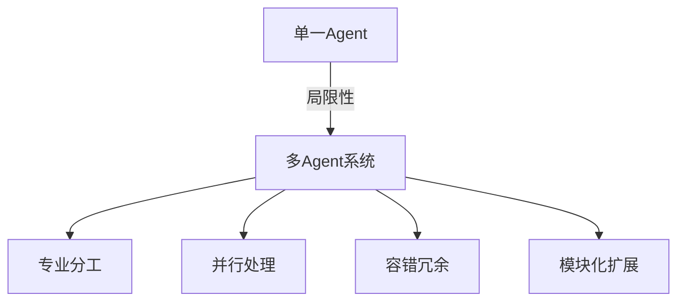
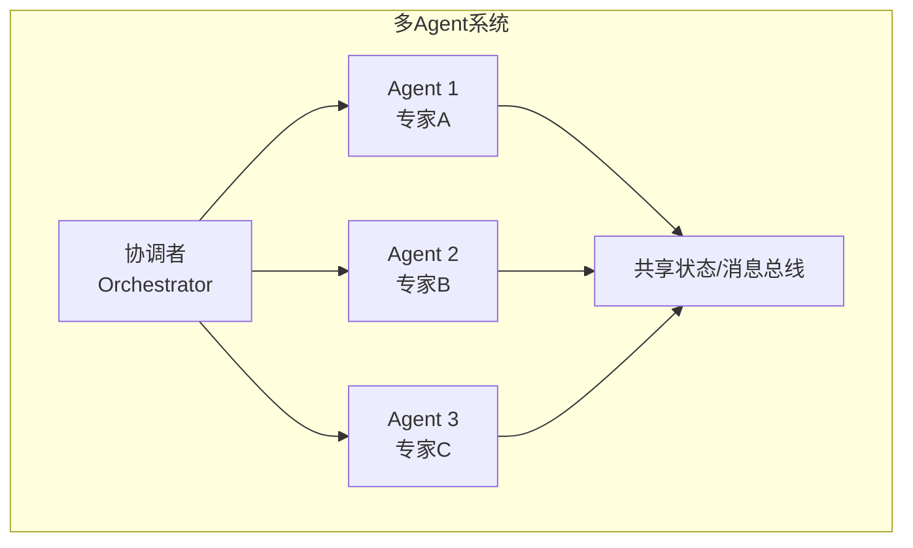

# 多 Agent 协作总览

## 为什么需要多 Agent

单一 Agent 的能力受限于：
- **Context Window**：无法处理海量上下文
- **专业化**：通用模型在特定领域不如专用 Agent
- **并发性**：单 Agent 串行处理效率低
- **可靠性**：单点故障风险

## 多 Agent 系统的核心挑战

| 挑战 | 说明 | 解决方向 |
|------|------|---------|
| **协作模式** | Agent 如何组织和协作 | [[01-协作模式]] |
| **通信协议** | Agent 间如何交换信息 | [[02-通信协议]] |
| **冲突解决** | 意见不一致时如何处理 | [[03-冲突解决]] |
| **共识机制** | 如何达成集体决策 | 投票、协商、仲裁 |
| **任务分配** | 谁做什么 | 静态分配 / 动态分配 |

## 系统架构

## 设计原则

1. **单一职责**：每个 Agent 专注一个领域
2. **最小通信**：减少不必要的 Agent 间通信
3. **明确接口**：Agent 间通过标准化消息交互
4. **容错设计**：单个 Agent 失败不影响整体
5. **可观测性**：完整记录 Agent 间交互

## 延伸阅读

- [[01-协作模式]] — 协作拓扑结构
- [[02-通信协议]] — 通信机制设计
- [[03-冲突解决]] — 冲突检测与消解
