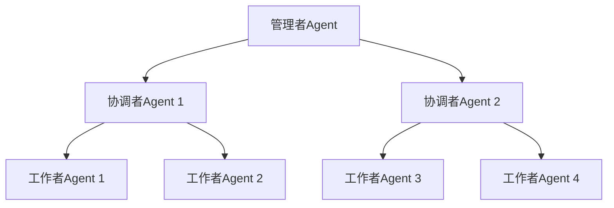
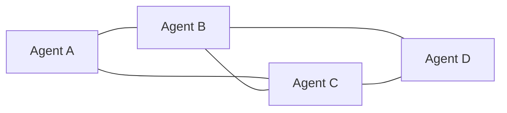
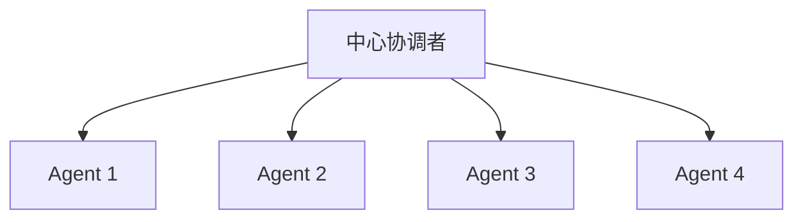
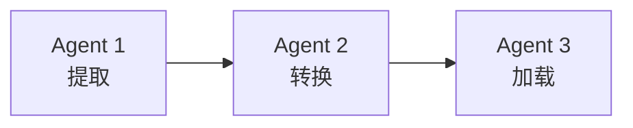
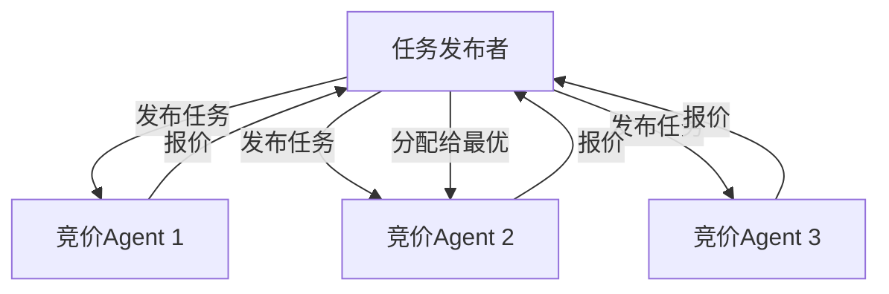

# 协作模式

## 1. 层级结构（Hierarchical）

**特点**：命令自上而下，结果自下而上汇总。

**适用场景**：企业级系统、任务明确的项目管理。

## 2. 扁平协作（Flat/Peer-to-Peer）

**特点**：Agent 之间平等协作，无中心节点。

**适用场景**：头脑风暴、对等协作、去中心化系统。

## 3. 星型结构（Star）

**特点**：所有通信通过中心节点，协调者负责任务分配和结果聚合。

**适用场景**：[[04-编排器-工作者]] 模式、Map-Reduce 类任务。

## 4. 流水线（Pipeline）

**特点**：Agent 按顺序处理，每个 Agent 的输出是下一个的输入。

**适用场景**：ETL 处理、内容生产流水线。

## 5. 市场/拍卖（Market/Auction）

**特点**：任务通过竞价分配给最适合的 Agent。

**适用场景**：动态负载均衡、资源分配。

## 模式对比

| 模式 | 通信复杂度 | 中心化程度 | 容错性 | 扩展性 |
|------|-----------|-----------|--------|--------|
| 层级结构 | O(n) | 高 | 中 | 中 |
| 扁平协作 | O(n²) | 低 | 高 | 中 |
| 星型结构 | O(n) | 高 | 低 | 高 |
| 流水线 | O(n) | 中 | 低 | 低 |
| 市场 | O(n) | 中 | 高 | 高 |

## 最佳实践

1. **匹配任务特性**：结构化任务用层级，创意任务用扁平
2. **避免过度设计**：2-3 个 Agent 的简单协作不需要复杂拓扑
3. **通信最小化**：减少 Agent 间不必要的消息传递
4. **超时机制**：Agent 响应超时时有降级策略

## 延伸阅读

- [[00-协作总览]] — 多 Agent 系统概述
- [[02-通信协议]] — 通信机制设计
- [[03-冲突解决]] — 冲突处理策略
