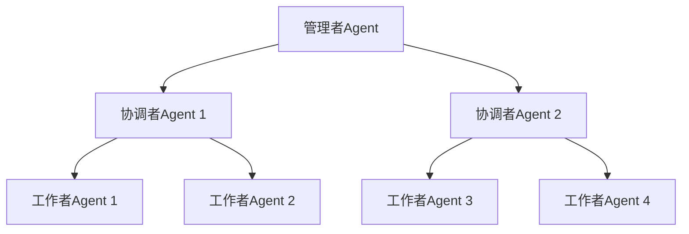
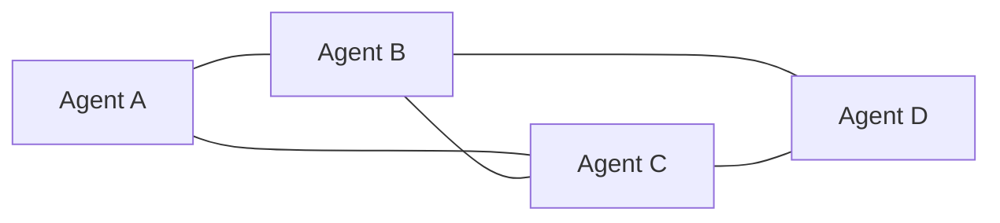
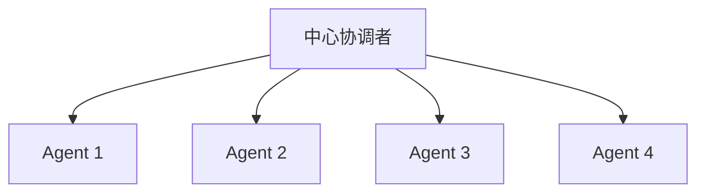
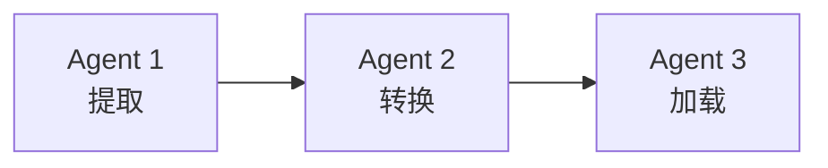
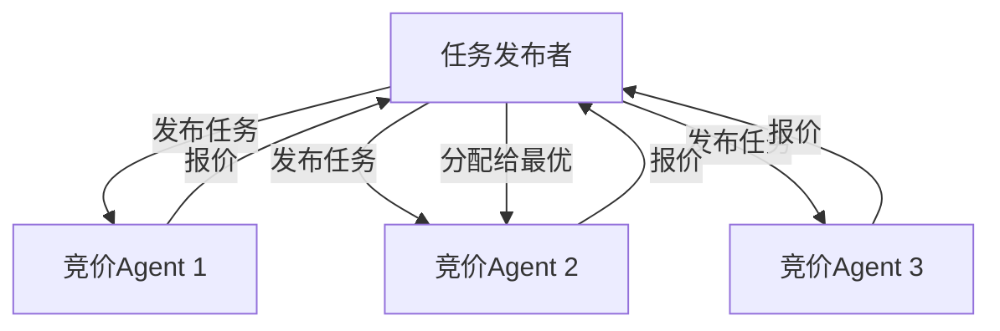

# 协作模式

## 1. 层级结构（Hierarchical）

**特点**：命令自上而下，结果自下而上汇总。

**适用场景**：企业级系统、任务明确的项目管理。

## 2. 扁平协作（Flat/Peer-to-Peer）

**特点**：Agent 之间平等协作，无中心节点。

**适用场景**：头脑风暴、对等协作、去中心化系统。

## 3. 星型结构（Star）

**特点**：所有通信通过中心节点，协调者负责任务分配和结果聚合。

**适用场景**：[[04-编排器-工作者]] 模式、Map-Reduce 类任务。

## 4. 流水线（Pipeline）

**特点**：Agent 按顺序处理，每个 Agent 的输出是下一个的输入。

**适用场景**：ETL 处理、内容生产流水线。

## 5. 市场/拍卖（Market/Auction）

**特点**：任务通过竞价分配给最适合的 Agent。

**适用场景**：动态负载均衡、资源分配。

## 模式对比

| 模式 | 通信复杂度 | 中心化程度 | 容错性 | 扩展性 |
|------|-----------|-----------|--------|--------|
| 层级结构 | O(n) | 高 | 中 | 中 |
| 扁平协作 | O(n²) | 低 | 高 | 中 |
| 星型结构 | O(n) | 高 | 低 | 高 |
| 流水线 | O(n) | 中 | 低 | 低 |
| 市场 | O(n) | 中 | 高 | 高 |

## 反模式与修复

| 反模式 | 问题 | 影响 | 修复方案 |
|--------|------|------|---------|
| **盲目套用层级** | 简单任务也引入多层管理者 Agent | 管理开销远超任务本身复杂度，延迟增加数倍 | 2-3 个 Agent 直接协作即可，无需额外管理层 |
| **星型单点瓶颈** | 所有通信经中心协调者转发 | 中心节点成为吞吐量瓶颈，扩展上限受限 | 无直接依赖的 Agent 间允许直接通信，或改用分层星型 |
| **流水线无旁路** | 流水线中某 Agent 失败后整条链阻塞 | 后续所有步骤停摆，系统可用性极低 | 增加旁路（bypass）机制和单步超时，失败时跳过或降级 |
| **扁平网状全连接** | N 个 Agent 间两两建立通信通道 | 通信复杂度 O(n^2)，消息洪泛导致信息过载 | 引入主题路由或分组机制，只在需要协作的 Agent 间建立连接 |
| **市场竞价无截止** | 任务竞价没有时间限制或轮次上限 | 竞价过程无限持续，任务永远无法分配 | 设置竞价截止时间和最大轮次，超时后由调度器强制分配 |
| **拓扑与任务不匹配** | 创意发散任务用层级结构，结构化任务用扁平结构 | 层级压抑发散思维，扁平结构无法保证流程一致性 | 根据任务特性选择拓扑：结构化用层级/流水线，发散用扁平/市场 |

## 最佳实践

1. **匹配任务特性**：结构化任务用层级，创意任务用扁平
2. **避免过度设计**：2-3 个 Agent 的简单协作不需要复杂拓扑
3. **通信最小化**：减少 Agent 间不必要的消息传递
4. **超时机制**：Agent 响应超时时有降级策略

## 反模式与修复

| 反模式 | 问题描述 | 影响 | 修复方案 |
|--------|----------|------|----------|
| 拓扑与任务不匹配 | 用扁平协作处理高度结构化的顺序任务 | 无序执行导致依赖违反，输出结果错误，需多次重试 | 结构化任务选流水线或层级结构，创意任务选扁平协作，参考模式对比表选择 |
| 星型结构中心过载 | 中心协调者同时承担任务分配、结果聚合、异常处理和状态管理 | 协调者成为性能瓶颈，Agent 数量增加时延迟线性增长，单点故障风险高 | 将协调职责拆分为独立组件：调度器、聚合器、监控器，或改用层级结构分散压力 |
| 流水线无旁路设计 | 流水线中每个 Agent 都是必经节点，无条件跳过机制 | 某些场景下中间 Agent 无需处理却必须等待，白白增加延迟 | 为流水线添加条件路由，允许根据输入类型跳过无关 Agent |
| 层级过深 | 管理者 → 协调者 → 子协调者 → 工作者，层级超过 3 层 | 指令传达失真，每层引入额外延迟和信息损耗，协调成本指数增长 | 扁平化层级结构，最多保留 2 层；同层 Agent 直接通信减少传递 |
| 市场模式竞价死锁 | 多个任务同时竞价，Agent 被锁定在低价值任务中无法释放 | 高优先级任务无 Agent 可用，系统吞吐量下降，资源分配严重失衡 | 引入竞价超时机制和优先级抢占，高优先级任务可中断低优先级任务的 Agent 分配 |
| 伪扁平协作 | 声称扁平协作但实际由某个 Agent 隐式主导决策 | 其他 Agent 沦为"旁观者"，协作退化为中心化且无容错，参与度低导致输出质量差 | 明确每个 Agent 的决策权和发言轮次，使用结构化协商协议确保平等参与 |

**关于拓扑与任务不匹配**：这是选择协作模式时最常犯的错误。很多团队因为扁平协作"看起来更灵活"就直接采用，却忽略了任务本身的结构特征。例如，一个"提取 → 清洗 → 分析 → 报告"的典型数据处理任务，天然适合流水线模式；硬套扁平协作后，分析 Agent 可能在数据清洗完成前就开始工作，导致基于脏数据产出错误结论。正确做法是先分析任务的依赖关系图（DAG），再选择匹配的拓扑结构。

**关于星型结构中心过载**：星型结构在 Agent 数量较少时表现良好，但中心协调者的负载与 Agent 数量呈线性甚至超线性关系。当协调者需要为每个 Worker Agent 维护上下文、追踪状态并处理响应时，其自身的 context window 会迅速膨胀。实测表明，当 Worker Agent 超过 8 个时，协调者的任务分解准确率下降约 30%。此时应考虑拆分协调者职责或切换至层级结构。

## 延伸阅读

- [[00-协作总览]] — 多 Agent 系统概述
- [[02-通信协议]] — 通信机制设计
- [[03-冲突解决]] — 冲突处理策略
