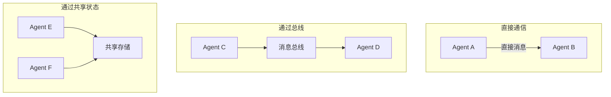

# 通信协议

## 通信模式

### 1. 消息传递（Message Passing）

Agent 通过结构化消息交换信息。

```python
@dataclass
class AgentMessage:
    sender: str
    receiver: str
    message_type: str  # request, response, broadcast, event
    content: dict
    timestamp: datetime
    correlation_id: str  # 关联请求-响应
```

### 2. 共享状态（Shared State）

Agent 读写共享状态存储。

```python
class SharedState:
    def __init__(self):
        self._state = {}
        self._lock = asyncio.Lock()
    
    async def read(self, key: str) -> any:
        async with self._lock:
            return self._state.get(key)
    
    async def write(self, key: str, value: any):
        async with self._lock:
            self._state[key] = value
```

### 3. 发布-订阅（Pub/Sub）

Agent 订阅感兴趣的主题，接收相关事件。

```python
class MessageBus:
    def __init__(self):
        self.subscribers = defaultdict(list)
    
    def subscribe(self, topic: str, handler):
        self.subscribers[topic].append(handler)
    
    async def publish(self, topic: str, message: dict):
        for handler in self.subscribers[topic]:
            await handler(message)
```

## 通信拓扑



## 消息类型

| 类型 | 用途 | 示例 |
|------|------|------|
| **Request/Response** | 同步请求 | "请提供分析报告" |
| **Broadcast** | 群发通知 | "任务已完成" |
| **Event** | 异步事件 | "检测到异常" |
| **Directive** | 指令 | "请执行步骤3" |

## 反模式与修复

| 反模式 | 问题 | 影响 | 修复方案 |
|--------|------|------|---------|
| **无 Schema 验证** | 消息使用自由格式 JSON，无统一结构 | 接收方解析失败或字段缺失导致静默错误 | 定义统一消息 Schema（如 Pydantic/Zod），收发两端强制校验 |
| **同步阻塞调用** | Agent 间使用同步 RPC 通信 | 一个慢 Agent 阻塞整个调用链，并发度归零 | 采用异步消息传递，设置超时和回调机制 |
| **消息无关联 ID** | 请求-响应消息缺少 correlation_id | 无法追踪完整调用链路，调试困难 | 每条消息携带 correlation_id 和 parent_id，构建调用树 |
| **广播风暴** | 频繁向所有 Agent 广播状态变更 | 网络带宽和 Agent 处理能力被无效消息淹没 | 使用主题订阅机制，Agent 只订阅自己关心的事件 |
| **无背压控制** | 生产者持续发送消息，不关心消费者处理能力 | 消息队列溢出，内存耗尽，系统崩溃 | 实现背压机制：队列满时阻塞生产者或丢弃低优先级消息 |
| **共享状态竞态** | 多 Agent 同时读写共享状态，无锁保护 | 数据不一致，结果不可复现 | 使用乐观锁/CAS 或改用消息传递替代共享状态 |

## 最佳实践

1. **消息格式标准化**：统一消息 Schema，便于解析和验证
2. **异步优先**：避免同步阻塞，提高系统吞吐量
3. **超时与重试**：设置消息超时和重试策略
4. **消息追踪**：correlation_id 关联请求链路
5. **背压控制**：防止消息堆积导致系统过载

## 反模式与修复

| 反模式 | 问题描述 | 影响 | 修复方案 |
|--------|----------|------|----------|
| 广播风暴 | Agent 通过 Broadcast 消息向所有订阅者发送高频事件，无去重和限流 | 消息总线过载，下游 Agent 被大量冗余消息淹没，Token 消耗激增，响应延迟飙升 | 实现消息去重（基于 message_id）、发布频率限流、以及按需订阅而非全量广播 |
| 共享状态无锁竞争 | 多个 Agent 同时读写 SharedState 未加锁或锁粒度过粗 | 数据丢失或覆盖（最后写入者胜出），中间状态被其他 Agent 读到导致决策错误 | 使用乐观锁（CAS）或细粒度锁，关键状态变更通过事件溯源保证顺序 |
| 同步 Request/Response 阻塞 | Agent 发送请求后同步等待响应，无超时和异步回调 | 一个慢响应阻塞整个 Agent 处理循环，级联延迟扩散至下游 Agent | 改用异步消息模式，设置请求超时（如 30 秒），超时后触发降级或重试策略 |
| 消息格式不统一 | 不同 Agent 使用不同的消息 Schema，字段命名和类型不一致 | 消息解析失败率高，Agent 间兼容性差，每接入新 Agent 都需定制适配层 | 定义统一的 AgentMessage Schema（参考本文消息类型表），所有 Agent 共享同一消息定义 |
| 无背压控制 | 消息生产速度持续高于消费速度，队列无限增长 | 内存溢出导致消息总线崩溃，已发送消息丢失，系统不可恢复 | 实现背压机制：队列满时拒绝新消息并通知生产者降速，或使用有界队列配合丢弃策略 |
| Topic 命名混乱 | 发布-订阅模式中 Topic 命名无规范，存在语义重叠和歧义 | Agent 订阅了错误的 Topic 导致收不到消息，或收到不相关的消息产生误处理 | 制定 Topic 命名规范（如 `domain.action.version`），建立 Topic 注册表并强制审批 |

**关于广播风暴**：在多 Agent 系统中，广播风暴往往由一个看似无害的设计引发——某个 Agent 在检测到异常时向全局 Topic 发送告警消息。当异常频繁发生时（如上游服务抖动），该 Agent 可能在每秒内发出数十条广播，每条广播触发所有订阅者的 LLM 推理调用。假设系统有 10 个订阅者，每秒 30 条广播意味着每秒 300 次 LLM 调用，仅通信开销就可能消耗大量 Token 预算。修复方案是在发布端实现令牌桶限流（如每秒最多 5 条同类消息），在消费端实现消息指纹去重。

**关于共享状态无锁竞争**：共享状态看似简单直接，但在多 Agent 并发场景下极易产生微妙的数据竞争。例如，Agent A 读取任务状态为"待处理"并准备执行，同时 Agent B 也读到同一状态并开始执行，最终两个 Agent 重复执行同一任务。更隐蔽的问题是"脏读"——Agent C 读到 Agent A 写入的半完成状态，基于不完整数据做出错误决策。建议将共享状态视为只读快照，所有状态变更通过发布事件消息完成，由单一消费者按序处理。

## 延伸阅读

- [[00-协作总览]] — 多 Agent 系统概述
- [[01-协作模式]] — 协作拓扑结构
- [[03-冲突解决]] — 冲突处理策略
