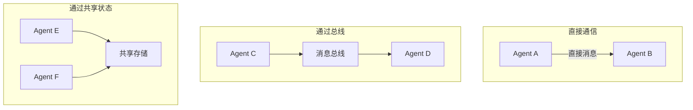

# 通信协议

## 通信模式

### 1. 消息传递（Message Passing）

Agent 通过结构化消息交换信息。

```python
@dataclass
class AgentMessage:
    sender: str
    receiver: str
    message_type: str  # request, response, broadcast, event
    content: dict
    timestamp: datetime
    correlation_id: str  # 关联请求-响应
```

### 2. 共享状态（Shared State）

Agent 读写共享状态存储。

```python
class SharedState:
    def __init__(self):
        self._state = {}
        self._lock = asyncio.Lock()
    
    async def read(self, key: str) -> any:
        async with self._lock:
            return self._state.get(key)
    
    async def write(self, key: str, value: any):
        async with self._lock:
            self._state[key] = value
```

### 3. 发布-订阅（Pub/Sub）

Agent 订阅感兴趣的主题，接收相关事件。

```python
class MessageBus:
    def __init__(self):
        self.subscribers = defaultdict(list)
    
    def subscribe(self, topic: str, handler):
        self.subscribers[topic].append(handler)
    
    async def publish(self, topic: str, message: dict):
        for handler in self.subscribers[topic]:
            await handler(message)
```

## 通信拓扑



## 消息类型

| 类型 | 用途 | 示例 |
|------|------|------|
| **Request/Response** | 同步请求 | "请提供分析报告" |
| **Broadcast** | 群发通知 | "任务已完成" |
| **Event** | 异步事件 | "检测到异常" |
| **Directive** | 指令 | "请执行步骤3" |

## 最佳实践

1. **消息格式标准化**：统一消息 Schema，便于解析和验证
2. **异步优先**：避免同步阻塞，提高系统吞吐量
3. **超时与重试**：设置消息超时和重试策略
4. **消息追踪**：correlation_id 关联请求链路
5. **背压控制**：防止消息堆积导致系统过载

## 延伸阅读

- [[00-协作总览]] — 多 Agent 系统概述
- [[01-协作模式]] — 协作拓扑结构
- [[03-冲突解决]] — 冲突处理策略
