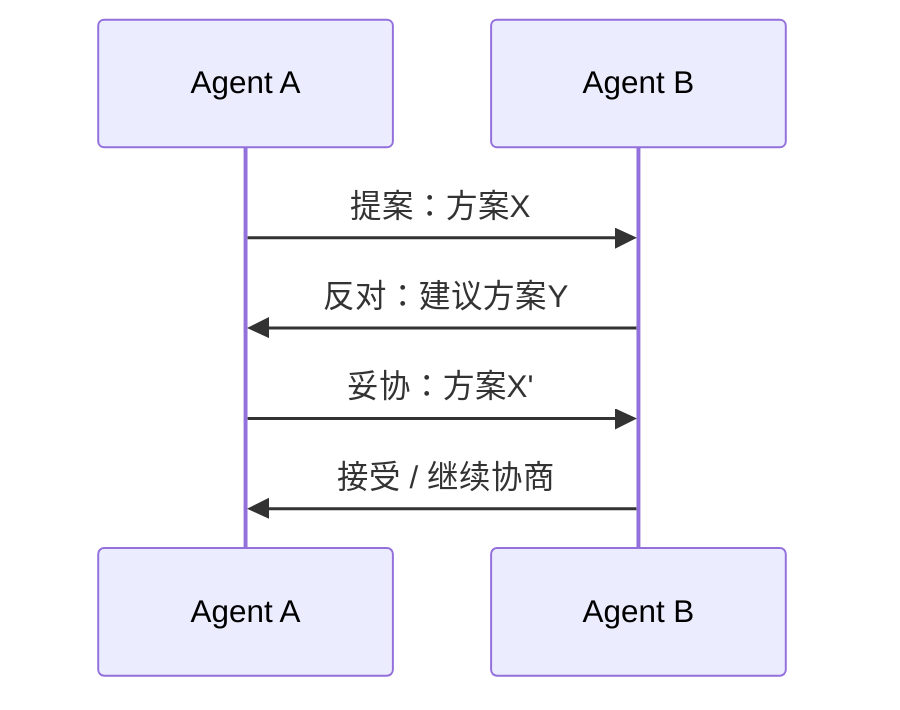

# 冲突解决

## 冲突类型

| 类型 | 说明 | 示例 |
|------|------|------|
| **资源冲突** | 多个 Agent 争夺同一资源 | 同时修改同一文件 |
| **意见冲突** | Agent 对问题的判断不一致 | 不同 Agent 给出矛盾的分析结果 |
| **目标冲突** | Agent 的子目标相互矛盾 | 成本优化 vs 质量优化 |
| **优先级冲突** | 任务优先级判断不同 | 紧急任务 vs 重要任务 |

## 解决策略

### 1. 投票机制（Voting）

```python
def resolve_by_voting(agent_opinions: list, threshold: float = 0.6) -> str:
    """多数投票决策"""
    from collections import Counter
    votes = Counter(opinions)
    winner, count = votes.most_common(1)[0]
    
    if count / len(opinions) >= threshold:
        return winner
    
    # 未达阈值，请求人类仲裁
    return request_human_arbitration(agent_opinions)
```

### 2. 加权投票

```python
def resolve_weighted(agent_opinions: list, weights: dict) -> str:
    """按 Agent 专业领域加权"""
    scores = defaultdict(float)
    for agent_id, opinion in agent_opinions:
        scores[opinion] += weights.get(agent_id, 1.0)
    return max(scores, key=scores.get)
```

### 3. 仲裁者（Arbiter）

引入专门的仲裁 Agent 处理冲突。

```python
class ArbiterAgent:
    def resolve(self, conflict: Conflict) -> Resolution:
        prompt = f"""作为仲裁者，请解决以下冲突：

冲突类型：{conflict.type}
各方意见：{conflict.opinions}
背景信息：{conflict.context}

请给出公正的裁决和理由。"""
        
        decision = self.llm.invoke(prompt)
        return Resolution(decision=decision, reasoning=...)
```

### 4. 协商机制（Negotiation）

Agent 通过多轮协商达成共识。



## 最佳实践

1. **预防优于解决**：设计阶段减少冲突可能性
2. **明确优先级**：预设冲突时的优先级规则
3. **人类兜底**：复杂冲突保留人类仲裁通道
4. **记录冲突**：分析冲突模式，优化系统设计

## 延伸阅读

- [[00-协作总览]] — 多 Agent 系统概述
- [[01-协作模式]] — 协作拓扑结构
- [[02-通信协议]] — 通信机制设计
