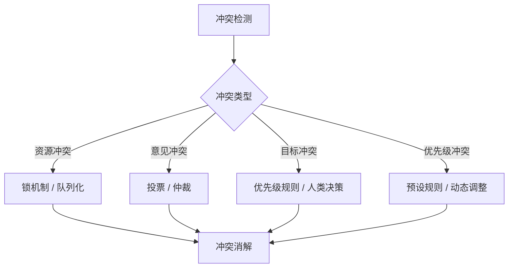
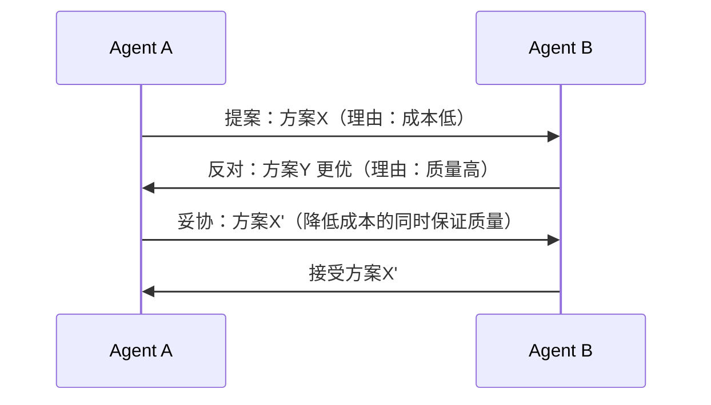

# 冲突解决

## 冲突类型

多 Agent 系统中的冲突可分为四类，每类需要不同的解决策略：

| 类型 | 说明 | 示例 | 发生频率 |
|------|------|------|---------|
| **资源冲突** | 多个 Agent 争夺同一资源 | 同时修改同一文件、争用数据库连接 | 高 |
| **意见冲突** | Agent 对问题的判断不一致 | 不同 Agent 给出矛盾的分析结果 | 中 |
| **目标冲突** | Agent 的子目标相互矛盾 | 成本优化 vs 质量优化 | 低 |
| **优先级冲突** | 任务优先级判断不同 | 紧急任务 vs 重要任务 | 中 |



## 解决策略

### 1. 投票机制（Voting）

适用于意见冲突，多个 Agent 对同一问题给出判断，通过多数投票选择最终答案。

```python
from collections import Counter
from dataclasses import dataclass

@dataclass
class VoteResult:
    winner: str
    vote_count: int
    total_votes: int
    confidence: float
    needs_human: bool

def resolve_by_voting(
    agent_opinions: dict[str, str],
    threshold: float = 0.6,
) -> VoteResult:
    """多数投票决策。"""
    opinions = list(agent_opinions.values())
    votes = Counter(opinions)
    winner, count = votes.most_common(1)[0]
    confidence = count / len(opinions)

    return VoteResult(
        winner=winner,
        vote_count=count,
        total_votes=len(opinions),
        confidence=confidence,
        needs_human=confidence < threshold,
    )
```

**适用场景**：Agent 能力相近，问题有客观正确答案。
**局限**：当 Agent 专业领域不同时，简单投票会忽略专业权重。

### 2. 加权投票

按 Agent 的专业领域和历史准确率分配投票权重。

```python
from collections import defaultdict

def resolve_weighted(
    agent_opinions: dict[str, str],
    weights: dict[str, float],
) -> VoteResult:
    """按 Agent 专业领域加权。"""
    scores: dict[str, float] = defaultdict(float)

    for agent_id, opinion in agent_opinions.items():
        weight = weights.get(agent_id, 1.0)
        scores[opinion] += weight

    winner = max(scores, key=scores.get)
    total_weight = sum(weights.get(a, 1.0) for a in agent_opinions)
    confidence = scores[winner] / total_weight if total_weight > 0 else 0

    return VoteResult(
        winner=winner,
        vote_count=sum(1 for o in agent_opinions.values() if o == winner),
        total_votes=len(agent_opinions),
        confidence=confidence,
        needs_human=confidence < 0.6,
    )
```

**适用场景**：Agent 有明确的专业分工，不同领域的判断可信度不同。

### 3. 仲裁者（Arbiter）

引入专门的仲裁 Agent 处理冲突，综合各方意见做出裁决。

```python
@dataclass
class Conflict:
    conflict_type: str
    opinions: dict[str, str]
    context: str
    metadata: dict

@dataclass
class Resolution:
    decision: str
    reasoning: str
    confidence: float
    dissenting_agents: list[str]

class ArbiterAgent:
    """仲裁 Agent——专门处理其他 Agent 间的冲突。"""

    def __init__(self, llm: LLMClient):
        self.llm = llm

    def resolve(self, conflict: Conflict) -> Resolution:
        opinions_text = "\n".join(
            f"- {agent_id}: {opinion}"
            for agent_id, opinion in conflict.opinions.items()
        )

        prompt = f"""作为中立仲裁者，请解决以下 Agent 间的冲突。

冲突类型：{conflict.type}
背景信息：{conflict.context}

各方意见：
{opinions_text}

请给出：
1. 最终裁决
2. 裁决理由
3. 置信度（0-1）
4. 是否有 Agent 的意见被否决"""

        response = self.llm.invoke(prompt)
        return self._parse_resolution(response, conflict)

    def _parse_resolution(self, response: str, conflict: Conflict) -> Resolution:
        """解析 LLM 的仲裁结果。"""
        return Resolution(
            decision=response,
            reasoning="",
            confidence=0.8,
            dissenting_agents=[],
        )
```

**适用场景**：冲突复杂，需要综合分析和推理。
**局限**：仲裁 Agent 本身可能成为瓶颈和单点故障。

### 4. 协商机制（Negotiation）

Agent 通过多轮协商达成共识。



```python
class NegotiationProtocol:
    """多轮协商协议。"""

    def __init__(self, max_rounds: int = 3):
        self.max_rounds = max_rounds

    async def negotiate(
        self,
        agent_a: Agent,
        agent_b: Agent,
        topic: str,
    ) -> Resolution:
        proposal = await agent_a.propose(topic)

        for round_num in range(self.max_rounds):
            response = await agent_b.respond(proposal)

            if response.accepted:
                return Resolution(
                    decision=proposal.content,
                    reasoning=f"经过 {round_num + 1} 轮协商达成共识",
                    confidence=0.9,
                    dissenting_agents=[],
                )

            proposal = await agent_a.counter_propose(response)

            if self._is_stalemate(proposal, response):
                break

        return self._escalate_to_human(topic, agent_a, agent_b)

    def _is_stalemate(self, proposal, response) -> bool:
        """检测是否陷入僵局。"""
        return False

    def _escalate_to_human(self, topic, agent_a, agent_b) -> Resolution:
        """升级为人类仲裁。"""
        return Resolution(
            decision="PENDING_HUMAN",
            reasoning="协商陷入僵局，需要人类决策",
            confidence=0.0,
            dissenting_agents=[agent_a.name, agent_b.name],
        )
```

## 策略选择指南

| 冲突类型 | 推荐策略 | 理由 |
|---------|---------|------|
| 资源冲突 | 锁机制 + 队列化 | 资源冲突需要互斥访问 |
| 意见冲突（简单） | 投票 / 加权投票 | 效率高，结果可解释 |
| 意见冲突（复杂） | 仲裁者 | 需要深度推理和综合分析 |
| 目标冲突 | 预设优先级 + 人类兜底 | 目标冲突涉及业务决策 |
| 优先级冲突 | 动态优先级调整 | 根据上下文实时调整 |

## 反模式与修复

| 反模式 | 问题 | 影响 | 修复方案 |
|--------|------|------|---------|
| **无限协商** | 协商轮次不设上限 | Token 消耗失控，延迟不可控 | 设置最大轮次 + 超时机制 |
| **无冲突检测** | 不主动检测冲突，只在出错时处理 | 问题扩大后才发现 | 在 Agent 交互层主动检测冲突 |
| **仲裁偏见** | 仲裁 Agent 有系统性偏好 | 裁决结果不公正 | 多仲裁者轮换 + 结果审计 |
| **全局锁** | 所有资源冲突都用全局锁 | 并发性能极差 | 细粒度锁 + 乐观并发控制 |
| **无回退机制** | 冲突解决失败后无回退方案 | 系统卡死 | 超时回退 + 人类兜底通道 |
| **忽略历史** | 每次冲突独立解决，不参考历史 | 重复冲突，无法优化 | 冲突日志 + 模式分析 |

## 权衡分析

| 维度 | 投票机制 | 仲裁者 | 协商机制 | 建议 |
|------|---------|--------|---------|------|
| **延迟** | 低 | 中 | 高 | 延迟敏感场景选投票 |
| **准确性** | 中 | 高 | 高 | 高风险场景选仲裁 |
| **Token 消耗** | 低 | 中 | 高 | 预算有限时选投票 |
| **可扩展性** | 高 | 低 | 中 | Agent 数量多时选投票 |
| **公平性** | 高 | 中 | 高 | 仲裁需要审计机制 |

**生产建议**：采用分层冲突解决策略。简单意见冲突用加权投票快速决策；复杂冲突升级为仲裁者；涉及业务目标的冲突保留人类兜底通道。所有冲突及其解决过程应记录在案，用于系统优化。

## 延伸阅读

- [[00-协作总览]] — 多 Agent 系统概述
- [[01-协作模式]] — 协作拓扑结构
- [[02-通信协议]] — 通信机制设计
- [[03-人类介入设计]] — 人类仲裁通道设计
