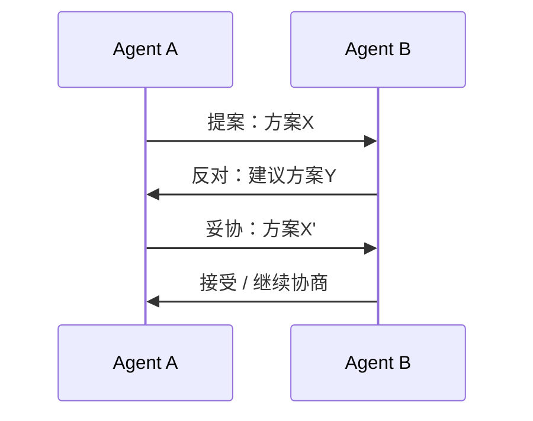

# 冲突解决

## 冲突类型

| 类型 | 说明 | 示例 |
|------|------|------|
| **资源冲突** | 多个 Agent 争夺同一资源 | 同时修改同一文件 |
| **意见冲突** | Agent 对问题的判断不一致 | 不同 Agent 给出矛盾的分析结果 |
| **目标冲突** | Agent 的子目标相互矛盾 | 成本优化 vs 质量优化 |
| **优先级冲突** | 任务优先级判断不同 | 紧急任务 vs 重要任务 |

## 解决策略

### 1. 投票机制（Voting）

```python
def resolve_by_voting(agent_opinions: list, threshold: float = 0.6) -> str:
    """多数投票决策"""
    from collections import Counter
    votes = Counter(opinions)
    winner, count = votes.most_common(1)[0]
    
    if count / len(opinions) >= threshold:
        return winner
    
    # 未达阈值，请求人类仲裁
    return request_human_arbitration(agent_opinions)
```

### 2. 加权投票

```python
def resolve_weighted(agent_opinions: list, weights: dict) -> str:
    """按 Agent 专业领域加权"""
    scores = defaultdict(float)
    for agent_id, opinion in agent_opinions:
        scores[opinion] += weights.get(agent_id, 1.0)
    return max(scores, key=scores.get)
```

### 3. 仲裁者（Arbiter）

引入专门的仲裁 Agent 处理冲突。

```python
class ArbiterAgent:
    def resolve(self, conflict: Conflict) -> Resolution:
        prompt = f"""作为仲裁者，请解决以下冲突：

冲突类型：{conflict.type}
各方意见：{conflict.opinions}
背景信息：{conflict.context}

请给出公正的裁决和理由。"""
        
        decision = self.llm.invoke(prompt)
        return Resolution(decision=decision, reasoning=...)
```

### 4. 协商机制（Negotiation）

Agent 通过多轮协商达成共识。



## 反模式与修复

| 反模式 | 问题描述 | 影响 | 修复方案 |
|--------|----------|------|----------|
| 无限协商循环 | 两个 Agent 通过协商机制反复提出和反驳方案，无收敛终止条件 | Token 消耗失控（每轮协商都消耗 LLM 推理成本），延迟不可预期，可能永远无法达成共识 | 设置最大协商轮次（如 3 轮），超限后自动升级至仲裁者 Agent 或人类兜底 |
| 投票平局无仲裁 | 偶数个 Agent 投票出现 50/50 平局，无预设的打破僵局机制 | 冲突悬而未决，任务停滞等待人工介入，系统吞吐量骤降 | 预设平局处理规则：引入优先级加权、随机选择、或自动升级至人类仲裁者 |
| 仲裁者无超时 | 仲裁 Agent 处理冲突时未设置超时，复杂冲突可能导致长时间推理 | 仲裁者阻塞导致所有等待裁决的 Agent 挂起，冲突队列积压，系统响应能力下降 | 为仲裁者设置推理超时（如 60 秒），超时后返回默认优先级方案或触发人类介入 |
| 权重分配不透明 | 加权投票中 Agent 权重由硬编码设定，未随能力变化动态调整 | 初始权重不合理的 Agent 持续主导决策，即使其判断准确率已下降，系统决策质量退化 | 根据历史决策准确率动态调整权重，定期评估并更新 Agent 能力评分 |
| 冲突检测滞后 | 冲突在结果产出后才被发现，而非在执行前预防 | 已消耗的计算资源和时间被浪费，需要回滚或重做，修复成本远高于预防成本 | 在任务分配阶段引入冲突预检：检查资源竞争、目标一致性、优先级冲突，维护资源锁定表提前规避 |

**关于无限协商循环**：这是冲突解决中最危险的反模式，因为它不仅消耗资源，还可能完全阻塞系统。典型场景是两个 Agent 对代码实现方案有根本性分歧——Agent A 主张使用缓存优化性能，Agent B 认为缓存会引入数据一致性风险。每轮协商中，双方都基于自己的专业视角反驳对方，LLM 生成的论证越来越长但始终无法说服对方。3 轮协商可能消耗超过 50,000 Token 且毫无进展。必须在系统层面强制设置协商轮次上限，而非依赖 Agent 自行判断何时停止。

**关于冲突检测滞后**：许多多 Agent 系统只在冲突发生后才处理，而非主动预防。例如，两个 Agent 同时被分配修改同一个配置文件，直到各自提交结果时才发现冲突。此时已执行的 LLM 推理和工具调用全部作废。更高效的做法是在任务分配阶段就进行资源冲突检查——维护一个"资源锁定表"，Agent 领取任务时自动检查其所需资源是否已被占用，从源头避免冲突发生。预防冲突的成本仅为一次内存查询，而事后解决冲突的成本可能是一整轮重试。

## 最佳实践

1. **预防优于解决**：设计阶段减少冲突可能性
2. **明确优先级**：预设冲突时的优先级规则
3. **人类兜底**：复杂冲突保留人类仲裁通道
4. **记录冲突**：分析冲突模式，优化系统设计

## 延伸阅读

- [[00-协作总览]] — 多 Agent 系统概述
- [[01-协作模式]] — 协作拓扑结构
- [[02-通信协议]] — 通信机制设计
