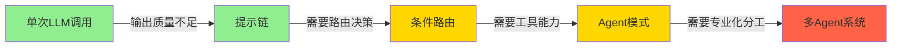

# 简单性原则

> "简单是可靠的先决条件。" — Edsger Dijkstra

## 为什么简单性至关重要

Agent 系统的复杂度每增加一层，调试难度、维护成本和故障概率都呈指数增长：

| 复杂度层级 | 调试难度 | Token 消耗 | 故障面 |
|-----------|---------|-----------|--------|
| 单次 LLM 调用 | 低 | 低 | 单一 |
| 提示链 | 中 | 中 | 链路 |
| 路由 + 多 Agent | 高 | 高 | 分布式 |
| 自主编排系统 | 极高 | 极高 | 全局 |

核心原则：**用最简单的方案解决问题，仅在简单方案无法满足需求时才升级复杂度。**

## 复杂度递进模型



每一级跃迁都应该有明确的驱动力——不是"可能需要"，而是"当前方案已无法满足具体需求"。

## 实践指南

### 1. 从提示链开始

不要过早引入复杂模式。大多数任务可以用简单的提示链完成：

```python
from dataclasses import dataclass

@dataclass
class PromptChain:
    """简单的提示链——串联多个 LLM 调用。"""
    llm: LLMClient

    def generate_article(self, topic: str) -> str:
        # Step 1: 生成大纲
        outline = self.llm.invoke(
            f"为以下主题生成结构化大纲，包含 3-5 个主要章节：\n{topic}"
        )

        # Step 2: 撰写正文
        content = self.llm.invoke(
            f"根据以下大纲撰写详细内容，每个章节 200-300 字：\n{outline}"
        )

        # Step 3: 编辑润色
        final = self.llm.invoke(
            f"编辑以下文章，提升可读性和专业性：\n{content}"
        )

        return final
```

仅当提示链无法满足需求（如需要动态决策、工具调用）时，才升级到 Agent 模式。

### 2. 显式路由优于隐式编排

```python
# ✅ 推荐：显式路由——简单、可预测、易调试
def route_query(query: str, agents: dict[str, Agent]) -> str:
    category = classify_query(query)  # 简单分类器
    agent_map = {
        "technical": agents["tech_agent"],
        "billing": agents["billing_agent"],
        "general": agents["general_agent"],
    }
    agent = agent_map.get(category, agents["general_agent"])
    return agent.handle(query)

# ❌ 避免：让 LLM 自行决定路由——不可预测、难以调试
# result = llm(f"判断以下查询应该由哪个 Agent 处理: {query}")
```

### 3. 最小化工具数量

每个新增工具都增加了模型的选择负担和出错概率：

```python
# ✅ 推荐：合并相似工具
def search_database(query: str, source: str = "all") -> list[dict]:
    """统一搜索接口，支持多种数据源。"""
    if source == "users":
        return search_users(query)
    elif source == "products":
        return search_products(query)
    else:
        return search_users(query) + search_products(query)

# ❌ 避免：拆分为过多细粒度工具
# search_users(query)
# search_products(query)
# search_orders(query)
# search_reviews(query)
# ... 模型难以选择正确的工具
```

### 4. 错误处理要简单直接

```python
class SimpleAgent:
    def run(self, task: str, max_retries: int = 2) -> str:
        """简单的重试逻辑——不要过度设计。"""
        for attempt in range(max_retries + 1):
            try:
                result = self.llm.invoke(task)
                if self._is_valid(result):
                    return result
            except Exception as e:
                if attempt == max_retries:
                    return f"任务执行失败: {e}"
        return "重试次数已用尽，请简化任务或人工介入。"

    def _is_valid(self, result: str) -> bool:
        """基本的有效性检查。"""
        return len(result.strip()) > 0 and "error" not in result.lower()[:50]
```

## 何时升级复杂度

在以下情况下，可以考虑从简单方案升级：

| 信号 | 说明 | 升级方向 |
|------|------|---------|
| 需要工具调用 | LLM 无法直接完成任务（如数据库查询） | 引入 Agent 模式 |
| 需要动态决策 | 工作流分支无法用 if/else 预定义 | 引入 ReAct 模式 |
| 需要专业化 | 通用 Agent 在特定领域输出质量不足 | 引入多 Agent |
| 需要并行 | 串行执行无法满足延迟要求 | 引入并行编排 |
| 需要容错 | 单点故障不可接受 | 引入冗余 Agent |

## 反模式与修复

| 反模式 | 症状 | 影响 | 修复方案 |
|--------|------|------|---------|
| **过早抽象** | 3 个步骤就引入编排器 | 调试困难，维护成本高 | 先用 if/else，按需升级 |
| **工具膨胀** | >10 个工具，模型频繁选错 | 准确率下降，Token 浪费 | 合并相似工具，保留 5-8 个核心工具 |
| **隐式状态** | 全局变量传递上下文 | 竞态条件，结果不可复现 | 显式参数传递 + 不可变状态 |
| **过度错误处理** | 每个调用都有 try/catch + fallback + retry | 代码膨胀，掩盖真正的问题 | 只在系统边界处理错误 |
| **框架恋物癖** | 简单任务也要引入 LangChain/AutoGen | 依赖膨胀，启动慢 | 简单任务直接用 SDK |
| **无限重试** | Agent 失败后无限重试 | Token 消耗失控 | 设置最大重试次数 + 人类兜底 |

## 权衡分析

| 维度 | 简单方案 | 复杂方案 | 建议 |
|------|---------|---------|------|
| **开发速度** | 快 | 慢 | MVP 阶段选简单方案 |
| **可维护性** | 高 | 低 | 团队规模小时选简单方案 |
| **灵活性** | 低 | 高 | 需求频繁变化时考虑复杂方案 |
| **调试难度** | 低 | 高 | 生产环境优先可调试性 |
| **性能上限** | 中 | 高 | 性能成为瓶颈时再优化 |
| **成本** | 低 | 高 | 预算有限时选简单方案 |

**实践建议**：遵循"爬行-行走-奔跑"策略。先用最简单的方案验证想法（单次 LLM 调用），确认方向正确后再逐步增加复杂度。每次升级都应有明确的驱动力和可衡量的收益。

## 延伸阅读

- [[00-模式总览]] — 从简单到复杂的模式递进
- [[00-组件总览]] — 核心组件设计
- [[01-工具设计]] — 工具设计的简单性原则
- [[00-协作总览]] — 何时引入多 Agent
