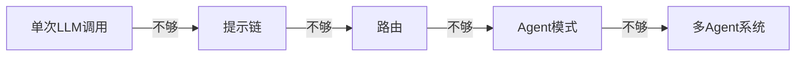

# 简单性原则

> "简单是可靠的先决条件。" — Edsger Dijkstra

## 为什么简单性至关重要

1. **可预测性**：简单系统更容易推理其行为
2. **可调试性**：问题定位更快
3. **可维护性**：团队交接成本更低
4. **成本控制**：LLM 调用次数与 token 消耗更少

## 实践指南

### 1. 从提示链开始

不要过早引入复杂模式：

```python
# 优先：简单的提示链
def chain(input):
    outline = llm(f"为以下主题生成大纲: {input}")
    content = llm(f"根据大纲撰写内容: {outline}")
    return edit(llm, content)

# 避免：过早使用 ReAct
# agent = create_react_agent(llm, tools)  # 仅在需要工具时引入
```

### 2. 最小化工具数量

每个新增工具都增加了：
- 模型选择负担
- 错误处理复杂度
- 测试覆盖需求

### 3. 显式优于隐式

```python
# 推荐：显式路由
if is_technical(query):
    return tech_agent.handle(query)
else:
    return general_agent.handle(query)

# 避免：让模型自己决定路由
# result = llm(f"判断以下查询类型: {query}")
```

## 复杂度递进



## 反模式

| 反模式 | 症状 | 修复 |
|--------|------|------|
| 过早抽象 | 3 个步骤就引入编排器 | 先用 if/else |
| 工具膨胀 | >10 个工具 | 合并相似工具 |
| 隐式状态 | 全局变量传递上下文 | 显式参数传递 |

## 延伸阅读

- [[Agent-vs-工作流]] — 何时用工作流，何时用 Agent
- [[00-模式总览]] — 从简单到复杂的模式递进
