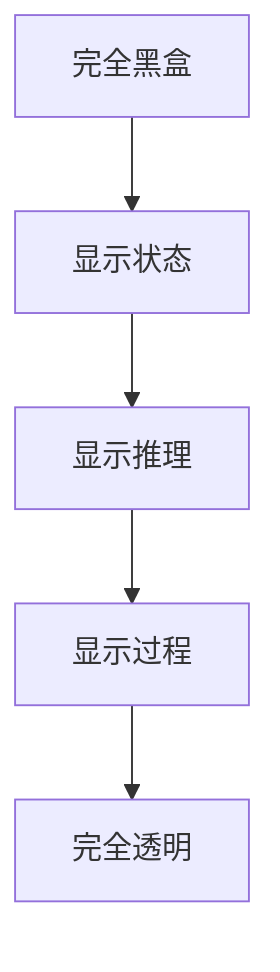

# 透明度设计

## 为什么透明度重要

用户需要理解 Agent 的行为，才能：
- **建立信任**：知道 Agent 为什么给出这个答案
- **发现问题**：识别 Agent 的错误或偏差
- **有效协作**：在合适时机介入或纠正

## 透明度层次



### 1. 状态显示

显示 Agent 当前在做什么：

```
Agent 正在搜索相关资料...
Agent 正在分析数据...
Agent 正在生成回复...
```

### 2. 推理展示

展示 Agent 的思考过程：

```
我的分析：
1. 用户询问的是技术问题
2. 涉及 Python 和数据库
3. 需要查看官方文档确认
```

### 3. 过程追溯

展示完整的执行轨迹：


## 实现策略

### 思维链展示

```python
def generate_with_thinking(prompt: str) -> dict:
    """生成带思考过程的回复"""
    thinking = llm.invoke(f"先分析问题：{prompt}")
    answer = llm.invoke(f"基于分析'{thinking}'，回答问题：{prompt}")
    
    return {
        "thinking": thinking,
        "answer": answer,
    }
```

### 执行日志

```python
class TransparentAgent:
    def __init__(self):
        self.execution_log = []
    
    def log_action(self, action: str, details: dict):
        self.execution_log.append({
            "timestamp": now(),
            "action": action,
            "details": details,
        })
    
    def get_execution_trace(self) -> list:
        return self.execution_log
```

## 平衡透明度与简洁

不是所有信息都需要展示给用户：

| 信息类型 | 展示方式 | 受众 |
|---------|---------|------|
| 高层状态 | 实时显示 | 终端用户 |
| 推理过程 | 可展开查看 | 高级用户 |
| 完整日志 | 调试模式 | 开发者 |
| 原始 Prompt | 不展示 | — |

## 反模式与修复

| 反模式 | 问题描述 | 影响 | 修复方案 |
|--------|----------|------|----------|
| 黑盒输出 | Agent 直接返回最终答案，不展示任何推理过程或调用链路 | 用户无法判断答案可靠性，错误难以被发现，信任度持续下降 | 实现 `TransparentAgent` 执行日志模式，默认记录每步推理和工具调用，提供可展开的推理面板 |
| 信息过载 | 将完整的 Prompt、中间 token、原始 API 响应全部展示给终端用户 | 用户被无关信息淹没，关键信息反而被稀释，认知负担急剧增加 | 按受众分层展示：终端用户只看高层状态，高级用户可展开推理，开发者可查看完整日志（参见"平衡透明度与简洁"章节） |
| 无进度反馈 | 长时间任务（如多轮搜索、批量处理）期间界面无任何状态更新 | 用户以为系统卡死而反复刷新或重复提交，导致资源浪费和并发冲突 | 实现流式状态推送，展示当前阶段（搜索中 → 分析中 → 生成中）和预估剩余时间 |
| 静默失败 | Agent 遇到错误时静默降级或返回模糊回答，不告知用户发生了什么 | 用户基于错误前提做决策，问题被掩盖后在下游放大 | 遵循"错误透明"原则，失败时明确说明原因、当前状态和用户可采取的操作 |
| 推理伪造 | 为了展示"思考过程"，事后编造一段看似合理的推理链来解释已生成的答案 | 推理与实际生成逻辑不一致，用户基于虚假推理做判断，比黑盒更危险 | 采用真正的思维链（Chain-of-Thought）生成，在生成阶段就产生推理过程，而非事后补充 |

"信息过载"和"推理伪造"是透明度设计中最容易踩的两个坑。前者源于"越多越好"的误解——开发者倾向于展示所有可用信息，但实际效果适得其反。正确的做法是建立信息分层体系，让不同角色的用户看到不同粒度的内容。后者则更具危害性：当推理展示成为"装饰品"时，它不再传递真实信息，反而成为误导用户的工具。实现透明度时，务必确保推理内容与实际决策路径一致，宁可不展示也不要展示虚假推理。

## 最佳实践

1. **默认展示状态**：用户应该知道 Agent 是否在处理
2. **推理可查看**：关键决策的思考过程可被查看
3. **进度可视化**：长时间任务展示进度
4. **错误透明**：失败时解释原因，不要隐藏

## 延伸阅读

- [[04-ACI设计]] — 人机交互接口设计
- [[03-人类介入设计]] — Human-in-the-Loop 模式
