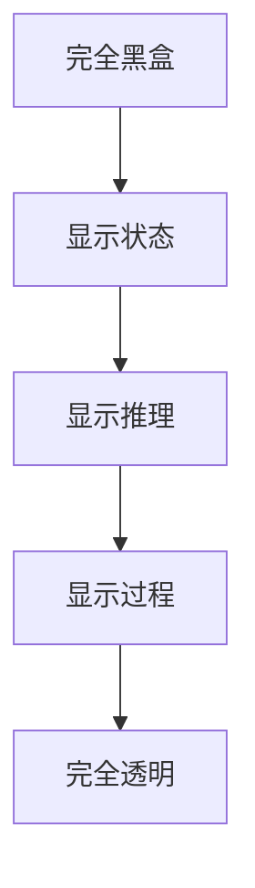
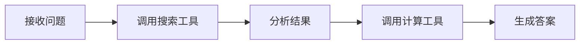

# 透明度设计

## 为什么透明度重要

用户需要理解 Agent 的行为，才能：
- **建立信任**：知道 Agent 为什么给出这个答案
- **发现问题**：识别 Agent 的错误或偏差
- **有效协作**：在合适时机介入或纠正

## 透明度层次



### 1. 状态显示

显示 Agent 当前在做什么：

```
Agent 正在搜索相关资料...
Agent 正在分析数据...
Agent 正在生成回复...
```

### 2. 推理展示

展示 Agent 的思考过程：

```
我的分析：
1. 用户询问的是技术问题
2. 涉及 Python 和数据库
3. 需要查看官方文档确认
```

### 3. 过程追溯

展示完整的执行轨迹：



## 实现策略

### 思维链展示

```python
def generate_with_thinking(prompt: str) -> dict:
    """生成带思考过程的回复"""
    thinking = llm.invoke(f"先分析问题：{prompt}")
    answer = llm.invoke(f"基于分析'{thinking}'，回答问题：{prompt}")
    
    return {
        "thinking": thinking,
        "answer": answer,
    }
```

### 执行日志

```python
class TransparentAgent:
    def __init__(self):
        self.execution_log = []
    
    def log_action(self, action: str, details: dict):
        self.execution_log.append({
            "timestamp": now(),
            "action": action,
            "details": details,
        })
    
    def get_execution_trace(self) -> list:
        return self.execution_log
```

## 平衡透明度与简洁

不是所有信息都需要展示给用户：

| 信息类型 | 展示方式 | 受众 |
|---------|---------|------|
| 高层状态 | 实时显示 | 终端用户 |
| 推理过程 | 可展开查看 | 高级用户 |
| 完整日志 | 调试模式 | 开发者 |
| 原始 Prompt | 不展示 | — |

## 最佳实践

1. **默认展示状态**：用户应该知道 Agent 是否在处理
2. **推理可查看**：关键决策的思考过程可被查看
3. **进度可视化**：长时间任务展示进度
4. **错误透明**：失败时解释原因，不要隐藏

## 延伸阅读

- [[04-ACI设计]] — 人机交互接口设计
- [[03-人类介入设计]] — Human-in-the-Loop 模式
