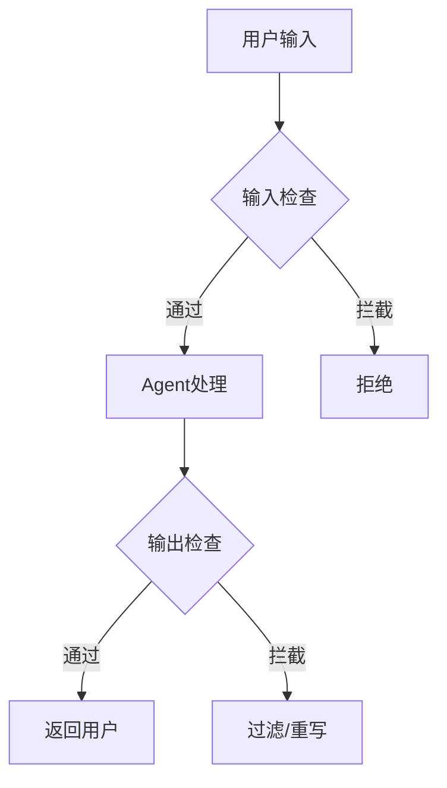
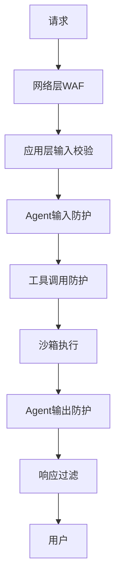

# 防护栏与沙箱

## 为什么需要防护栏

Agent 具有自主性，可能：
- 调用不合适的工具
- 泄露敏感信息
- 执行有害操作
- 产生不当内容



## 防护栏类型

### 1. 输入防护

```python
class InputGuardrail:
    def check(self, input_text: str) -> tuple[bool, str]:
        # 检查注入攻击
        if contains_injection_pattern(input_text):
            return False, "检测到潜在的提示注入"
        
        # 检查敏感信息
        if contains_pii(input_text):
            return False, "输入包含敏感个人信息"
        
        return True, "通过"
```

### 2. 输出防护

```python
class OutputGuardrail:
    def check(self, output_text: str) -> tuple[bool, str]:
        # 检查有害内容
        if contains_harmful_content(output_text):
            return False, "输出包含有害内容"
        
        # 检查事实性错误（可选）
        if contains_clear_factual_error(output_text):
            return False, "输出包含明显事实错误"
        
        return True, "通过"
```

### 3. 工具调用防护

```python
class ToolGuardrail:
    ALLOWED_TOOLS = {"search", "calculator", "weather"}
    BLOCKED_PARAMETERS = {"password", "token", "secret"}
    
    def check_tool_call(self, tool_name: str, params: dict) -> bool:
        if tool_name not in self.ALLOWED_TOOLS:
            return False
        
        for key in params:
            if key in self.BLOCKED_PARAMETERS:
                return False
        
        return True
```

## 沙箱设计

隔离 Agent 的执行环境：

```python
class Sandbox:
    def __init__(self):
        self.allowed_operations = set()
        self.resource_limits = {
            "max_cpu_time": 30,
            "max_memory_mb": 512,
            "max_file_size_mb": 10,
        }
    
    def execute(self, code: str) -> dict:
        """在沙箱中执行代码"""
        with isolated_environment() as env:
            env.set_limits(self.resource_limits)
            env.block_network()
            env.restrict_file_access()
            
            result = env.run(code, timeout=30)
            return result
```

## 多层防护架构



## 反模式与修复

| 反模式 | 问题描述 | 影响 | 修复方案 |
|--------|----------|------|----------|
| 单层防护 | 仅依赖输入防护或输出防护中的一层，认为单一检查即可拦截所有攻击 | 攻击者通过编码变换、多轮对话拆分等方式绕过单层检查，安全形同虚设 | 实施多层防护架构：网络层 WAF → 应用层校验 → Agent 输入防护 → 工具调用防护 → 沙箱执行 → 输出过滤，任一层被绕过仍有后续拦截 |
| 白名单过宽 | 工具白名单包含大量工具，或使用通配符规则（如 `allow: *`）扩大范围 | Agent 可调用非必要工具执行危险操作（如文件删除、数据库写入），攻击面大幅增加 | 严格遵循最小权限原则，按任务类型定义细粒度白名单，每次任务只开放完成该任务所需的最少工具集 |
| 沙箱逃逸 | 沙箱未正确隔离网络、文件系统或进程空间，Agent 代码可访问宿主环境资源 | 恶意 Prompt 注入后 Agent 可读取敏感文件、发起内网请求、甚至控制系统 | 沙箱必须同时启用网络隔离（`block_network`）、文件系统限制（`restrict_file_access`）和资源配额（CPU/内存/超时），并定期进行逃逸测试 |
| 输出审查缺失 | 只做输入防护不做输出防护，认为安全问题只来自用户输入 | Agent 生成的回复可能包含 PII 泄露、有害内容或事实错误，直接暴露给用户造成合规风险 | 在 Agent 输出返回用户前增加输出防护层，检查有害内容、PII 泄露和明显事实错误 |
| 静态规则固化 | 防护规则硬编码且从不更新，无法应对新型攻击手段 | 随着攻击技术演进，防护规则逐渐失效，系统在不知情中暴露风险 | 建立规则热更新机制，结合定期安全演练和红队测试发现新攻击模式，动态更新防护规则并记录审计日志 |

"单层防护"是最常见也最危险的反模式。许多团队在初期快速实现一个输入过滤器就认为安全问题已解决，但实际上 Prompt 注入攻击的手法极其多样——Unicode 变体、多语言混编、上下文窗口操控等都可能绕过单一检查。参考[[01-安全防护栏]]中的纵深防御思想，每一层防护都假设其他层可能被突破，这样才能构建真正可靠的安全边界。另一个需要警惕的是"沙箱逃逸"：沙箱的价值在于即使 Agent 被完全控制，其影响范围仍被限制在隔离环境中。如果沙箱本身存在漏洞，整个安全架构的根基就会动摇。

## 最佳实践

1. **默认拒绝**：不在白名单的操作默认不允许
2. **最小权限**：Agent 只拥有完成任务所需的最小权限
3. **多层防护**：任何单层都可能被绕过，多层互补
4. **审计日志**：记录所有安全相关事件
5. **定期演练**：模拟攻击测试防护有效性

## 权衡分析

| 维度 | 方案A | 方案B | 建议 |
|------|-------|-------|------|
| **严格程度** | 严格防护（默认拒绝，白名单放行） | 宽松防护（默认放行，黑名单拦截） | 安全敏感场景（金融、医疗、多租户）必须严格防护；内部工具和原型阶段可用宽松防护加快迭代 |
| **违规响应** | 直接阻断（拒绝执行并返回错误） | 记录日志（允许执行但标记告警） | 不可逆操作（删除、支付、权限变更）必须阻断；低风险违规可记录日志后放行，定期审计优化规则 |
| **规则更新** | 静态规则（启动时加载，运行时不变） | 自适应规则（根据攻击模式动态调整） | 基础安全规则用静态配置保证确定性；高级防护层引入自适应机制应对不断演进的攻击手法 |
| **沙箱粒度** | 进程级隔离（独立容器/VM） | 函数级隔离（权限白名单） | 执行不可信代码（用户上传脚本）必须进程级隔离；可信 Agent 的工具调用可用函数级隔离降低开销 |
| **防护层级** | 单层防护（输入或输出过滤） | 多层纵深防御（输入+工具+输出+沙箱） | 任何单层都可能被绕过，生产环境必须多层纵深防御；原型验证阶段可从单层开始逐步加固 |
| **审计粒度** | 全量审计（记录所有操作和决策） | 抽样审计（按比例记录） | 合规要求高的场景必须全量审计；高吞吐系统可抽样审计降低存储成本，但安全事件必须全量记录 |

## 延伸阅读

- [[01-安全防护栏]] — 更全面的安全设计
- [[04-错误恢复]] — 防护触发后的恢复策略
